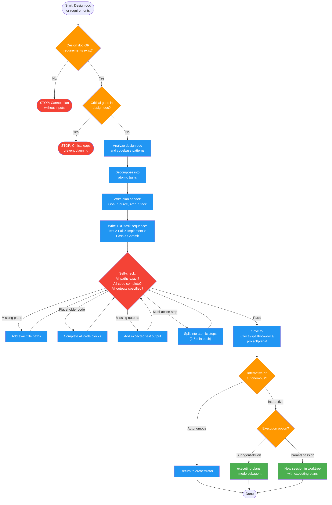

<!-- diagram-meta: {"source": "skills/writing-plans/SKILL.md", "source_hash": "sha256:225c21e8b4583f0f2df049553d062ed4dcba0d9cf22d44c7f12fb817ff650c4a", "generated_at": "2026-02-19T00:00:00Z", "generator": "generate_diagrams.py"} -->
# Diagram: writing-plans

Implementation plan creation from design docs or requirements. Produces TDD-structured task sequences with exact file paths, complete code, and verification steps. Hands off to executing-plans.

## Legend

| Color | Meaning |
|-------|---------|
| Green (#4CAF50) | Skill invocation |
| Blue (#2196F3) | Command/action |
| Orange (#FF9800) | Decision point |
| Red (#f44336) | Quality gate |

## Cross-Reference

| Node | Source Reference |
|------|----------------|
| Input check (design doc/requirements) | Inputs table (lines 22-28) |
| Circuit breaker: no inputs | Circuit Breakers (lines 120-122) |
| Circuit breaker: critical gaps | Circuit Breakers (line 122) |
| Analyze design doc and codebase | Reasoning Schema analysis block (lines 39-44) |
| Atomic task decomposition | Invariant Principle 2: Atomic Tasks (line 17) |
| Plan header (Goal, Source, Arch, Stack) | Plan Header section (lines 70-83) |
| TDD task sequence | Task Structure section (lines 85-111) |
| Self-check: exact paths | Self-Check item 1 (line 137) |
| Self-check: complete code | Self-Check item 2 (line 138) |
| Self-check: expected output | Self-Check item 3 (line 139) |
| Self-check: atomic steps | Self-Check item 4 (line 140) |
| Save to plans directory | Save Location section (lines 63-68) |
| Mode behavior (interactive/autonomous) | Mode Behavior table (lines 113-119) |
| executing-plans handoff | Execution Options section (lines 124-133) |
