<!-- diagram-meta: {"source": "skills/writing-skills/SKILL.md", "source_hash": "sha256:e233ce0cdc6c1d2e0a0ec7c74f71c437c9f9c8d45cc60d8c62888c3e58e751e3", "generated_at": "2026-02-19T00:00:00Z", "generator": "generate_diagrams.py"} -->
# Diagram: writing-skills

TDD-driven skill creation workflow using RED-GREEN-REFACTOR cycle. Enforces baseline failure documentation before writing, verification after writing, and loophole closure through rationalization tables.

```mermaid
flowchart TD
    Start([Start: Skill purpose\n+ failing scenario]) --> ClassifyType{"Classify skill type:\nDiscipline / Technique /\nPattern / Reference"}:::decision

    ClassifyType --> PhaseCheck{"Multi-phase?\n(3+ phases)"}:::decision

    PhaseCheck -->|"3+ phases"| ArchDecision["Plan orchestrator +\nphase commands split"]:::command
    PhaseCheck -->|"1-2 phases"| ArchDecision2["Self-contained\nSKILL.md"]:::command

    ArchDecision --> RED
    ArchDecision2 --> RED

    subgraph RED_Phase [RED Phase: Baseline Failure]
        RED["Run pressure scenarios\nWITHOUT skill"]:::command --> Capture["Document baseline\nfailures verbatim"]:::command
        Capture --> RED_Gate{"Failures documented?\nRationalizations captured?"}:::gate
        RED_Gate -->|No| RED
    end

    RED_Gate -->|Yes| GREEN

    subgraph GREEN_Phase [GREEN Phase: Write Skill]
        GREEN["Write minimal SKILL.md\naddressing failures"]:::command --> Schema{"Schema compliant?\nFrontmatter + sections?"}:::decision
        Schema -->|No| FixSchema["Add missing sections:\nOverview, When to Use,\nQuick Ref, Mistakes"]:::command --> Schema
        Schema -->|Yes| CSO{"CSO check:\nDescription = triggers only?\nNo workflow summary?"}:::gate
        CSO -->|Fail| FixDesc["Rewrite description:\ntriggers only"]:::command --> CSO
        CSO -->|Pass| TokenCheck{"Token budget met?\n<500 words core?"}:::decision
        TokenCheck -->|Over| Trim["Reduce tokens:\nremove duplication,\ncross-reference skills"]:::command --> TokenCheck
        TokenCheck -->|Under| Verify
        Verify["Re-run pressure\nscenarios WITH skill"]:::command --> GREEN_Gate{"Behavior changed?"}:::gate
    end

    GREEN_Gate -->|No| GREEN
    GREEN_Gate -->|Yes| REFACTOR

    subgraph REFACTOR_Phase [REFACTOR Phase: Close Loopholes]
        REFACTOR["Identify new\nrationalizations"]:::command --> RatTable["Build rationalization\ntable"]:::command
        RatTable --> CloseFix["Add explicit counters\nto SKILL.md"]:::command
        CloseFix --> ReTest["Re-test with\npressure scenarios"]:::command
        ReTest --> REFACTOR_Gate{"All loopholes closed?\nRationalization table\ncomplete?"}:::gate
        REFACTOR_Gate -->|New loopholes| REFACTOR
    end

    REFACTOR_Gate -->|Pass| SelfCheck

    subgraph FinalCheck [Self-Check]
        SelfCheck{"RED documented?\nGREEN verified?\nDescription triggers-only?\nYAML frontmatter valid?\nSchema complete?\nToken budget met?"}:::gate
        SelfCheck -->|Any unchecked| FixIssues["Fix failing checks"]:::command --> SelfCheck
    end

    SelfCheck -->|All pass| Eval{"Evaluative output?\n(verdicts/scores)"}:::decision

    Eval -->|Yes| Assessment["/design-assessment\nfor evaluation framework"]:::command --> Done([Done: Skill deployed])
    Eval -->|No| Done

    %% Iron Law enforcement
    Start -.->|"Wrote skill\nwithout RED?"| IronLaw([DELETE skill.\nStart over.]):::gate

    classDef skill fill:#4CAF50,color:#fff
    classDef command fill:#2196F3,color:#fff
    classDef decision fill:#FF9800,color:#fff
    classDef gate fill:#f44336,color:#fff
```

## Legend

| Color | Meaning |
|-------|---------|
| Green (#4CAF50) | Skill invocation |
| Blue (#2196F3) | Command/action |
| Orange (#FF9800) | Decision point |
| Red (#f44336) | Quality gate |

## Cross-Reference

| Node | Source Reference |
|------|----------------|
| Classify skill type | Skill Types table (lines 42-48) |
| Multi-phase architecture check | Multi-Phase Skill Architecture section (lines 338-379) |
| RED: Run pressure scenarios | Iron Law (lines 214-231) and RED-GREEN-REFACTOR (lines 233-258) |
| Document baseline failures | Invariant Principle 1 (line 18) |
| GREEN: Write minimal SKILL.md | RED-GREEN-REFACTOR Phase 2 (line 241) |
| Schema compliance check | SKILL.md Schema section (lines 49-89) |
| CSO description check | Claude Search Optimization section (lines 104-117) |
| Token budget check | Token Efficiency section (lines 262-273) |
| Verify behavior changed | RED-GREEN-REFACTOR Phase 2 verification (line 241) |
| REFACTOR: Rationalization table | RED-GREEN-REFACTOR Phase 3 (line 242) |
| Iron Law: delete if untested | Iron Law section (lines 214-231) |
| /design-assessment | Assessment Framework Integration (lines 383-398) |
| Self-check items | Self-Check section (lines 400-413) |
| write-skill-test command dispatch | Dispatch template (lines 244-258) |
