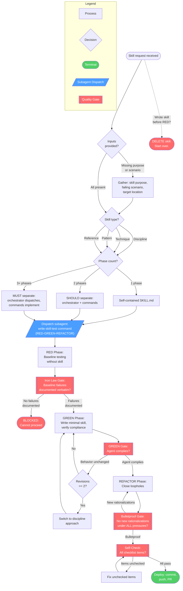
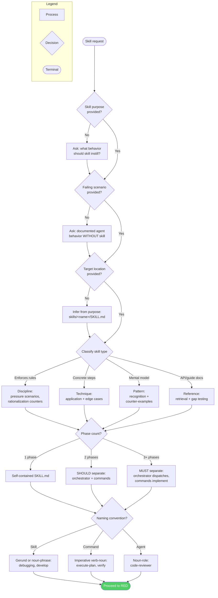
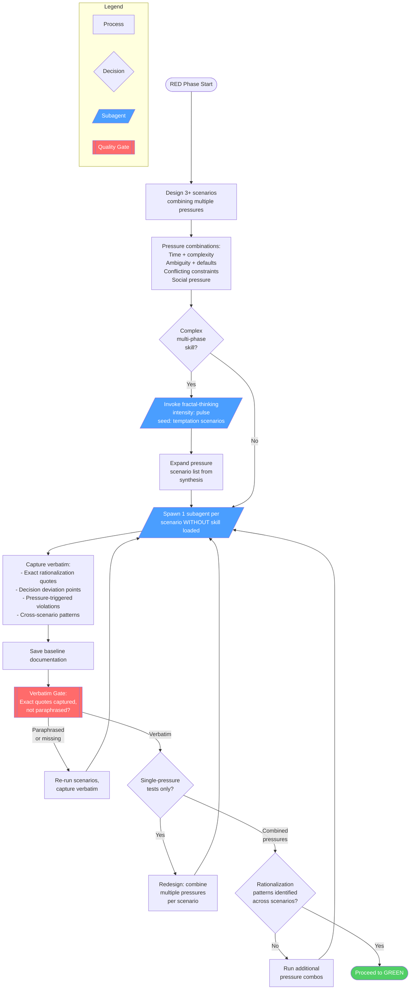
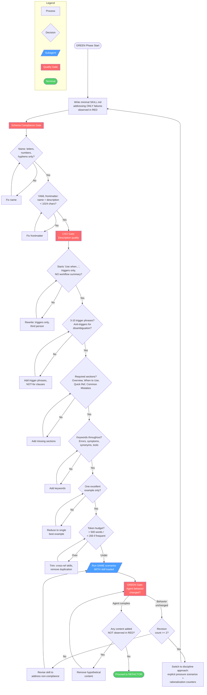
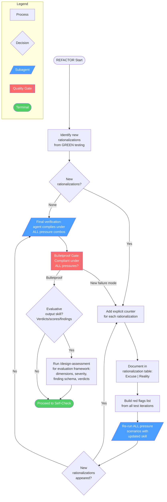
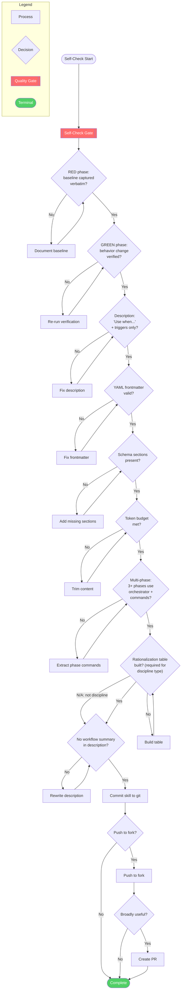

<!-- diagram-meta: {"source": "skills/writing-skills/SKILL.md","source_hash": "sha256:78ef0df1b31874eaaf254f957669c120dab554337410d2632e7a17b9a942b371","generated_at": "2026-03-19T00:00:00Z","generator": "claude-manual","stamped_at": "2026-03-19T06:31:44Z"} -->
# Diagram: writing-skills

TDD-driven skill creation workflow using RED-GREEN-REFACTOR cycle. Enforces baseline failure documentation before writing, verification after writing, and loophole closure through rationalization tables. The `write-skill-test` command implements the RED-GREEN-REFACTOR phases via subagent dispatch.

## Cross-Reference Table

| Overview Node | Detail Diagram |
|---------------|----------------|
| ENTRY | [Entry and Classification](#1-entry-and-classification) |
| RED | [RED Phase: Baseline Testing](#2-red-phase-baseline-testing) |
| GREEN | [GREEN Phase: Write Minimal Skill](#3-green-phase-write-minimal-skill) |
| REFACTOR | [REFACTOR Phase: Close Loopholes](#4-refactor-phase-close-loopholes) |
| SELFCHECK | [Self-Check and Deploy](#5-self-check-and-deploy) |

---

## Overview: Writing Skills Workflow

```mermaid
flowchart TD
    subgraph legend [Legend]
        direction LR
        l1[Process]
        l2{Decision}
        l3([Terminal])
        l4[/"Subagent Dispatch"/]
        l5[[Quality Gate]]
    end

    style l4 fill:#4a9eff,color:#fff
    style l5 fill:#ff6b6b,color:#fff
    style l3 fill:#51cf66,color:#fff

    START([Skill request received]) --> INPUTS{Inputs<br>provided?}
    INPUTS -->|"Missing purpose<br>or scenario"| GATHER[Gather: skill purpose,<br>failing scenario,<br>target location]
    GATHER --> CLASSIFY
    INPUTS -->|All present| CLASSIFY

    CLASSIFY{Skill type?}
    CLASSIFY -->|Discipline| ARCH
    CLASSIFY -->|Technique| ARCH
    CLASSIFY -->|Pattern| ARCH
    CLASSIFY -->|Reference| ARCH

    ARCH{Phase count?}
    ARCH -->|"1 phase"| SELF_CONT[Self-contained SKILL.md]
    ARCH -->|"2 phases"| SHOULD_SPLIT[SHOULD separate:<br>orchestrator + commands]
    ARCH -->|"3+ phases"| MUST_SPLIT[MUST separate:<br>orchestrator dispatches,<br>commands implement]
    SELF_CONT --> DISPATCH_RGR
    SHOULD_SPLIT --> DISPATCH_RGR
    MUST_SPLIT --> DISPATCH_RGR

    DISPATCH_RGR[/"Dispatch subagent:<br>write-skill-test command<br>(RED-GREEN-REFACTOR)"/]
    style DISPATCH_RGR fill:#4a9eff,color:#fff

    DISPATCH_RGR --> RED

    RED["RED Phase:<br>Baseline testing<br>without skill"]
    RED --> IRON_LAW[[Iron Law Gate:<br>Baseline failures<br>documented verbatim?]]
    style IRON_LAW fill:#ff6b6b,color:#fff

    IRON_LAW -->|"No failures<br>documented"| BLOCK([BLOCKED:<br>Cannot proceed])
    style BLOCK fill:#ff6b6b,color:#fff
    IRON_LAW -->|"Failures<br>documented"| GREEN

    GREEN["GREEN Phase:<br>Write minimal skill,<br>verify compliance"]
    GREEN --> GREEN_GATE[[GREEN Gate:<br>Agent complies?]]
    style GREEN_GATE fill:#ff6b6b,color:#fff

    GREEN_GATE -->|"Behavior unchanged"| RETRY{Revisions<br>>= 2?}
    RETRY -->|No| GREEN
    RETRY -->|Yes| SWITCH[Switch to discipline<br>approach] --> GREEN
    GREEN_GATE -->|"Agent complies"| REFACTOR

    REFACTOR["REFACTOR Phase:<br>Close loopholes"]
    REFACTOR --> BULLET_GATE[[Bulletproof Gate:<br>No new rationalizations<br>under ALL pressures?]]
    style BULLET_GATE fill:#ff6b6b,color:#fff

    BULLET_GATE -->|"New rationalizations"| REFACTOR
    BULLET_GATE -->|Bulletproof| SELFCHECK

    SELFCHECK[[Self-Check:<br>All checklist items?]]
    style SELFCHECK fill:#ff6b6b,color:#fff

    SELFCHECK -->|"Items unchecked"| FIX[Fix unchecked items] --> SELFCHECK
    SELFCHECK -->|All pass| DEPLOY([Deploy: commit,<br>push, PR])
    style DEPLOY fill:#51cf66,color:#fff

    %% Iron Law enforcement
    START -.->|"Wrote skill<br>before RED?"| DELETE([DELETE skill.<br>Start over.])
    style DELETE fill:#ff6b6b,color:#fff
```

---

## 1. Entry and Classification

Determines inputs, skill type, and multi-phase architecture before dispatching to RED-GREEN-REFACTOR.

```mermaid
flowchart TD
    subgraph legend [Legend]
        direction LR
        l1[Process]
        l2{Decision}
        l3([Terminal])
    end

    START([Skill request]) --> HAS_PURPOSE{Skill purpose<br>provided?}
    HAS_PURPOSE -->|No| ASK_PURPOSE[Ask: what behavior<br>should skill instill?]
    ASK_PURPOSE --> HAS_SCENARIO
    HAS_PURPOSE -->|Yes| HAS_SCENARIO

    HAS_SCENARIO{Failing scenario<br>provided?}
    HAS_SCENARIO -->|No| ASK_SCENARIO[Ask: documented agent<br>behavior WITHOUT skill]
    ASK_SCENARIO --> HAS_LOCATION
    HAS_SCENARIO -->|Yes| HAS_LOCATION

    HAS_LOCATION{Target location<br>provided?}
    HAS_LOCATION -->|No| INFER["Infer from purpose:<br>skills/&lt;name&gt;/SKILL.md"]
    INFER --> CLASSIFY
    HAS_LOCATION -->|Yes| CLASSIFY

    CLASSIFY{Classify skill type}
    CLASSIFY -->|Enforces rules| DISCIPLINE["Discipline:<br>pressure scenarios,<br>rationalization counters"]
    CLASSIFY -->|Concrete steps| TECHNIQUE["Technique:<br>application + edge cases"]
    CLASSIFY -->|Mental model| PATTERN["Pattern:<br>recognition +<br>counter-examples"]
    CLASSIFY -->|API/guide docs| REFERENCE["Reference:<br>retrieval + gap testing"]

    DISCIPLINE --> MULTI
    TECHNIQUE --> MULTI
    PATTERN --> MULTI
    REFERENCE --> MULTI

    MULTI{Phase count?}
    MULTI -->|"1 phase"| SELF["Self-contained SKILL.md"]
    MULTI -->|"2 phases"| SHOULD["SHOULD separate:<br>orchestrator + commands"]
    MULTI -->|"3+ phases"| MUST["MUST separate:<br>orchestrator dispatches,<br>commands implement"]

    SELF --> NAME_CHECK
    SHOULD --> NAME_CHECK
    MUST --> NAME_CHECK

    NAME_CHECK{Naming convention?}
    NAME_CHECK -->|Skill| GERUND["Gerund or noun-phrase:<br>debugging, develop"]
    NAME_CHECK -->|Command| IMPERATIVE["Imperative verb-noun:<br>execute-plan, verify"]
    NAME_CHECK -->|Agent| NOUN_ROLE["Noun-role:<br>code-reviewer"]

    GERUND --> TO_RED([Proceed to RED])
    IMPERATIVE --> TO_RED
    NOUN_ROLE --> TO_RED
    style TO_RED fill:#51cf66,color:#fff
```

---

## 2. RED Phase: Baseline Testing

Runs pressure scenarios WITHOUT the skill to document baseline agent failures verbatim.

```mermaid
flowchart TD
    subgraph legend [Legend]
        direction LR
        l1[Process]
        l2{Decision}
        l3[/"Subagent"/]
        l4[[Quality Gate]]
    end
    style l3 fill:#4a9eff,color:#fff
    style l4 fill:#ff6b6b,color:#fff

    START([RED Phase Start]) --> DESIGN["Design 3+ scenarios<br>combining multiple pressures"]

    DESIGN --> COMBOS["Pressure combinations:<br>Time + complexity<br>Ambiguity + defaults<br>Conflicting constraints<br>Social pressure"]

    COMBOS --> FRACTAL{Complex<br>multi-phase<br>skill?}
    FRACTAL -->|Yes| FRACTAL_THINK[/"Invoke fractal-thinking<br>intensity: pulse<br>seed: temptation scenarios"/]
    style FRACTAL_THINK fill:#4a9eff,color:#fff
    FRACTAL_THINK --> EXPAND["Expand pressure<br>scenario list from<br>synthesis"]
    EXPAND --> SPAWN
    FRACTAL -->|No| SPAWN

    SPAWN[/"Spawn 1 subagent per<br>scenario WITHOUT skill loaded"/]
    style SPAWN fill:#4a9eff,color:#fff

    SPAWN --> CAPTURE["Capture verbatim:<br>- Exact rationalization quotes<br>- Decision deviation points<br>- Pressure-triggered violations<br>- Cross-scenario patterns"]

    CAPTURE --> SAVE[Save baseline documentation]

    SAVE --> VERBATIM_CHECK[[Verbatim Gate:<br>Exact quotes captured,<br>not paraphrased?]]
    style VERBATIM_CHECK fill:#ff6b6b,color:#fff

    VERBATIM_CHECK -->|"Paraphrased<br>or missing"| REDO[Re-run scenarios,<br>capture verbatim]
    REDO --> SPAWN

    VERBATIM_CHECK -->|Verbatim| PRESSURE_CHECK{Single-pressure<br>tests only?}
    PRESSURE_CHECK -->|Yes| REDESIGN["Redesign: combine<br>multiple pressures<br>per scenario"]
    REDESIGN --> SPAWN

    PRESSURE_CHECK -->|"Combined<br>pressures"| PATTERN_CHECK{Rationalization<br>patterns identified<br>across scenarios?}
    PATTERN_CHECK -->|No| MORE["Run additional<br>pressure combos"]
    MORE --> SPAWN
    PATTERN_CHECK -->|Yes| TO_GREEN([Proceed to GREEN])
    style TO_GREEN fill:#51cf66,color:#fff
```

---

## 3. GREEN Phase: Write Minimal Skill

Creates schema-compliant SKILL.md addressing ONLY failures observed in RED, then verifies compliance.

```mermaid
flowchart TD
    subgraph legend [Legend]
        direction LR
        l1[Process]
        l2{Decision}
        l3[/"Subagent"/]
        l4[[Quality Gate]]
        l5([Terminal])
    end
    style l3 fill:#4a9eff,color:#fff
    style l4 fill:#ff6b6b,color:#fff
    style l5 fill:#51cf66,color:#fff

    START([GREEN Phase Start]) --> WRITE["Write minimal SKILL.md<br>addressing ONLY failures<br>observed in RED"]

    WRITE --> SCHEMA[[Schema Compliance Gate]]
    style SCHEMA fill:#ff6b6b,color:#fff

    SCHEMA --> S1{Name: letters,<br>numbers,<br>hyphens only?}
    S1 -->|No| FIX1[Fix name] --> S1
    S1 -->|Yes| S2{YAML frontmatter:<br>name + description<br>&lt; 1024 chars?}
    S2 -->|No| FIX2[Fix frontmatter] --> S2

    S2 -->|Yes| CSO[[CSO Gate:<br>Description quality]]
    style CSO fill:#ff6b6b,color:#fff

    CSO --> S3{"Starts 'Use when...',<br>triggers only,<br>NO workflow summary?"}
    S3 -->|No| FIX3[Rewrite: triggers only,<br>third person] --> S3

    S3 -->|Yes| S3b{"3-10 trigger phrases?<br>Anti-triggers for<br>disambiguation?"}
    S3b -->|No| FIX3b["Add trigger phrases,<br>NOT-for clauses"] --> S3b

    S3b -->|Yes| S4{Required sections?<br>Overview, When to Use,<br>Quick Ref, Common Mistakes}
    S4 -->|No| FIX4[Add missing sections] --> S4

    S4 -->|Yes| S5{Keywords throughout?<br>Errors, symptoms,<br>synonyms, tools}
    S5 -->|No| FIX5[Add keywords] --> S5

    S5 -->|Yes| S6{One excellent<br>example only?}
    S6 -->|No| FIX6["Reduce to single<br>best example"] --> S6

    S6 -->|Yes| S7{"Token budget?<br>&lt; 500 words /<br>&lt; 200 if frequent"}
    S7 -->|Over| FIX7["Trim: cross-ref skills,<br>remove duplication"] --> S7

    S7 -->|Under| VERIFY[/"Run SAME scenarios<br>WITH skill loaded"/]
    style VERIFY fill:#4a9eff,color:#fff

    VERIFY --> GREEN_GATE[[GREEN Gate:<br>Agent behavior<br>changed?]]
    style GREEN_GATE fill:#ff6b6b,color:#fff

    GREEN_GATE -->|"Behavior<br>unchanged"| REV_COUNT{Revision<br>count >= 2?}
    REV_COUNT -->|No| REVISE["Revise skill to<br>address non-compliance"] --> VERIFY

    REV_COUNT -->|Yes| SWITCH["Switch to discipline approach:<br>explicit pressure scenarios +<br>rationalization counters"]
    SWITCH --> WRITE

    GREEN_GATE -->|"Agent complies"| HYPOTHETICAL{Any content added<br>NOT observed in RED?}
    HYPOTHETICAL -->|Yes| REMOVE["Remove hypothetical<br>content"] --> GREEN_GATE
    HYPOTHETICAL -->|No| TO_REFACTOR([Proceed to REFACTOR])
    style TO_REFACTOR fill:#51cf66,color:#fff
```

---

## 4. REFACTOR Phase: Close Loopholes

Iteratively identifies new rationalizations, adds explicit counters, and re-tests until bulletproof.

```mermaid
flowchart TD
    subgraph legend [Legend]
        direction LR
        l1[Process]
        l2{Decision}
        l3[/"Subagent"/]
        l4[[Quality Gate]]
        l5([Terminal])
    end
    style l3 fill:#4a9eff,color:#fff
    style l4 fill:#ff6b6b,color:#fff
    style l5 fill:#51cf66,color:#fff

    START([REFACTOR Start]) --> IDENTIFY["Identify new<br>rationalizations<br>from GREEN testing"]

    IDENTIFY --> FOUND{New<br>rationalizations?}
    FOUND -->|None| FINAL_VERIFY

    FOUND -->|Yes| COUNTER["Add explicit counter<br>for each rationalization"]
    COUNTER --> TABLE["Document in<br>rationalization table:<br>Excuse | Reality"]
    TABLE --> FLAGS["Build red flags list<br>from all test iterations"]

    FLAGS --> RETEST[/"Re-run ALL pressure<br>scenarios with<br>updated skill"/]
    style RETEST fill:#4a9eff,color:#fff

    RETEST --> LOOP_CHECK{New<br>rationalizations<br>appeared?}
    LOOP_CHECK -->|Yes| COUNTER
    LOOP_CHECK -->|No| FINAL_VERIFY

    FINAL_VERIFY[/"Final verification:<br>agent complies under<br>ALL pressure combos"/]
    style FINAL_VERIFY fill:#4a9eff,color:#fff

    FINAL_VERIFY --> BULLET_GATE[[Bulletproof Gate:<br>Compliant under<br>ALL pressures?]]
    style BULLET_GATE fill:#ff6b6b,color:#fff

    BULLET_GATE -->|"New failure mode"| COUNTER
    BULLET_GATE -->|Bulletproof| EVAL{Evaluative<br>output skill?<br>Verdicts/scores/findings}
    EVAL -->|Yes| ASSESSMENT["Run /design-assessment<br>for evaluation framework:<br>dimensions, severity,<br>finding schema, verdicts"]
    ASSESSMENT --> TO_CHECK
    EVAL -->|No| TO_CHECK([Proceed to Self-Check])
    style TO_CHECK fill:#51cf66,color:#fff
```

---

## 5. Self-Check and Deploy

Final quality gate verifying all checklist items before committing and optionally pushing/creating a PR.

```mermaid
flowchart TD
    subgraph legend [Legend]
        direction LR
        l1[Process]
        l2{Decision}
        l3[[Quality Gate]]
        l4([Terminal])
    end
    style l3 fill:#ff6b6b,color:#fff
    style l4 fill:#51cf66,color:#fff

    START([Self-Check Start]) --> CHECKLIST[[Self-Check Gate]]
    style CHECKLIST fill:#ff6b6b,color:#fff

    CHECKLIST --> C1{RED phase:<br>baseline captured<br>verbatim?}
    C1 -->|No| FIX1["Document baseline"] --> C1
    C1 -->|Yes| C2{GREEN phase:<br>behavior change<br>verified?}
    C2 -->|No| FIX2["Re-run verification"] --> C2

    C2 -->|Yes| C3{"Description:<br>'Use when...'<br>+ triggers only?"}
    C3 -->|No| FIX3["Fix description"] --> C3
    C3 -->|Yes| C4{YAML frontmatter<br>valid?}
    C4 -->|No| FIX4["Fix frontmatter"] --> C4

    C4 -->|Yes| C5{Schema sections<br>present?}
    C5 -->|No| FIX5["Add missing sections"] --> C5
    C5 -->|Yes| C6{Token budget<br>met?}
    C6 -->|No| FIX6["Trim content"] --> C6

    C6 -->|Yes| C7{"Multi-phase:<br>3+ phases use<br>orchestrator +<br>commands?"}
    C7 -->|No| FIX7["Extract phase commands"] --> C7
    C7 -->|Yes| C8{"Rationalization table<br>built? (required for<br>discipline type)"}
    C8 -->|"N/A: not discipline"| C9
    C8 -->|No| FIX8["Build table"] --> C8
    C8 -->|Yes| C9{"No workflow summary<br>in description?"}
    C9 -->|No| FIX9["Rewrite description"] --> C9

    C9 -->|Yes| DEPLOY["Commit skill to git"]
    DEPLOY --> PUSH{Push to fork?}
    PUSH -->|No| DONE
    PUSH -->|Yes| DO_PUSH["Push to fork"]
    DO_PUSH --> PR{Broadly useful?}
    PR -->|No| DONE
    PR -->|Yes| CREATE_PR["Create PR"]
    CREATE_PR --> DONE([Complete])
    style DONE fill:#51cf66,color:#fff
```

---

## Source Cross-Reference

| Diagram Node | Source Location |
|---|---|
| Skill type classification | `SKILL.md` Skill Types table (lines 42-48) |
| Multi-phase architecture | `SKILL.md` Multi-Phase Skill Architecture (lines 320-358) |
| Naming conventions | `SKILL.md` Naming Conventions (lines 92-99) |
| Iron Law enforcement | `SKILL.md` Iron Law (lines 204-225), `write-skill-test.md` Iron Law (lines 19-23) |
| RED: pressure scenarios | `write-skill-test.md` RED phase (lines 27-43) |
| RED: fractal exploration | `write-skill-test.md` line 43 |
| RED: spawn subagents | `write-skill-test.md` lines 40-41 |
| RED: verbatim capture | `write-skill-test.md` Invariant Principle 3 (line 11) |
| GREEN: schema compliance | `SKILL.md` SKILL.md Schema (lines 49-89) |
| GREEN: CSO description | `SKILL.md` CSO section (lines 101-119), Description Anatomy (lines 125-131) |
| GREEN: trigger phrases | `SKILL.md` Description Checklist (lines 143-151) |
| GREEN: token budget | `SKILL.md` Token Efficiency (lines 253-261) |
| GREEN: verification run | `write-skill-test.md` GREEN phase (line 59) |
| GREEN: revision limit + switch | `SKILL.md` Iron Law reflection (line 224) |
| GREEN: no hypothetical content | `write-skill-test.md` GREEN phase (line 47) |
| REFACTOR: rationalization table | `write-skill-test.md` REFACTOR phase (lines 63-69) |
| REFACTOR: bulletproofing | `write-skill-test.md` Bulletproofing table (lines 73-80) |
| REFACTOR: red flags list | `write-skill-test.md` Red flags (lines 83-90) |
| Assessment framework | `SKILL.md` Assessment Framework Integration (lines 359-366) |
| Self-check items | `SKILL.md` Self-Check (lines 369-381) |
| Deploy steps | `write-skill-test.md` Skill Creation Checklist Deploy (lines 133-136) |
| Overlap disambiguation | `SKILL.md` The Overlap Problem (lines 196-203) |
| System vs user triggers | `SKILL.md` System-Triggered vs User-Triggered (lines 189-193) |
