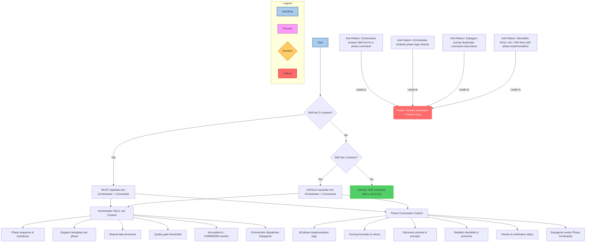

<!-- diagram-meta: {"source": "skills/writing-skills/SKILL.md", "source_hash": "sha256:603c35edf3e84d69968ac7927fcf74a91d9e37acf3e446fab960f9b137b39bb4", "generated_at": "2026-03-24T21:46:42Z", "generator": "generate_diagrams.py", "stamped_at": "2026-03-25T09:11:15Z"} -->
# Diagram: writing-skills

```mermaid
graph TD
    %% Node Definitions
    A[User wants to create/edit a Skill] --> B(Activate writing-skills)
    B --> C{Invariant Principles}
    C --> D[Document Baseline Failure (RED phase)]
    D --> E[Draft Skill (SKILL.md)]
    E --> F[Apply SKILL.md Schema]
    F --> G[Apply Naming Conventions]
    G --> H[Optimize for CSO & Triggers]
    H --> I[Consider Multi-Phase Architecture]
    I --> J[Verify Skill Changes Behavior (GREEN phase)]
    J --> K{Verification Successful?}
    K -- No --> E
    K -- Yes --> L[Self-Check Checklist]
    L --> M[Schema-compliant SKILL.md]
    M --> N(Skill Deployed)

    O[FORBIDDEN Actions Detected]

    %% Explicitly show FORBIDDEN leading to failure from any point in the process.
    style O fill:#ff6b6b,stroke:#ff6b6b,stroke-width:2px,color:#fff
    style K fill:#ff6b6b,stroke:#ff6b6b,stroke-width:2px,color:#fff
    style J fill:#51cf66,stroke:#51cf66,stroke-width:2px,color:#fff
    style D fill:#ff6b6b,stroke:#ff6b6b,stroke-width:2px,color:#fff
    style M fill:#51cf66,stroke:#51cf66,stroke-width:2px,color:#fff
    style N fill:#51cf66,stroke:#51cf66,stroke-width:2px,color:#fff

    %% Subgraphs for better organization
    subgraph Skill Creation Workflow
        direction LR
        D --- E --- F --- G --- H --- I
    end

    subgraph Verification & Refinement Loop
        direction LR
        J --- K
    end

    %% Legend
    subgraph Legend
        direction LR
        S1[Start/End]:::startEndNode
        S2[Process]:::processNode
        S3{Decision/Quality Gate}:::decisionNode
        S4[Success Output]:::successNode
        S5[Failure/Red Phase]:::failureNode
        S6[Verification Phase]:::verificationNode
    end

    classDef startEndNode fill:#ace,stroke:#369,stroke-width:2px,color:#333;
    classDef processNode fill:#f9f,stroke:#333,stroke-width:1px,color:#333;
    classDef decisionNode fill:#fc6,stroke:#f60,stroke-width:2px,color:#333;
    classDef successNode fill:#51cf66,stroke:#3c3,stroke-width:2px,color:#333;
    classDef failureNode fill:#ff6b6b,stroke:#f00,stroke-width:2px,color:#333;
    classDef verificationNode fill:#4a9eff,stroke:#007bff,stroke-width:2px,color:#fff;

    style A fill:#ace,stroke:#369,stroke-width:2px,color:#333
    style B fill:#f9f,stroke:#333,stroke-width:1px,color:#333
    style C fill:#f9f,stroke:#333,stroke-width:1px,color:#333
    style L fill:#f9f,stroke:#333,stroke-width:1px,color:#333

    style S1 fill:#ace,stroke:#369,stroke-width:2px,color:#333
    style S2 fill:#f9f,stroke:#333,stroke-width:1px,color:#333
    style S3 fill:#fc6,stroke:#f60,stroke-width:2px,color:#333
    style S4 fill:#51cf66,stroke:#3c3,stroke-width:2px,color:#333
    style S5 fill:#ff6b6b,stroke:#f00,stroke-width:2px,color:#333
    style S6 fill:#4a9eff,stroke:#007bff,stroke-width:2px,color:#fff
```

### Overview of Writing Skills Workflow

This diagram illustrates the high-level process for creating and refining skills, emphasizing the Test-Driven Development (TDD) approach outlined in the `writing-skills` skill. It includes key phases from documenting baseline failures to final verification and self-checks. The "FORBIDDEN Actions Detected" node represents any violation of the explicit anti-patterns, leading to immediate failure of the process.

### Multi-Phase Skill Architecture Detail

```mermaid
graph TD
    A[Start] --> B{Skill has 3+ phases?}
    B -- Yes --> C[MUST separate into Orchestrator + Commands]
    B -- No --> D{Skill has 2 phases?}
    D -- Yes --> E[SHOULD separate into Orchestrator + Commands]
    D -- No --> F[Exempt: Self-contained SKILL.md is fine]

    C --> G[Orchestrator SKILL.md Content]
    E --> G
    G --> G1[Phase sequence & transitions]
    G --> G2[Dispatch templates per phase]
    G --> G3[Shared data structures]
    G --> G4[Quality gate thresholds]
    G --> G5[Anti-patterns / FORBIDDEN section]

    C --> H[Phase Commands Content]
    E --> H
    H --> H1[All phase implementation logic]
    H --> H2[Scoring formulas & rubrics]
    H --> H3[Discovery wizards & prompts]
    H --> H4[Detailed checklists & protocols]
    H --> H5[Review & verification steps]

    G --> I(Orchestrator dispatches Subagents)
    H --> J(Subagents invoke Phase Commands)

    K[Anti-Pattern: Orchestrator invokes Skill tool for a phase command]
    L[Anti-Pattern: Orchestrator embeds phase logic directly]
    M[Anti-Pattern: Subagent prompt duplicates command instructions]
    N[Anti-Pattern: Monolithic SKILL.md > 500 lines with phase implementation]

    K -- Leads to --> Z(Failure: Defeats separation / Context bloat)
    L -- Leads to --> Z
    M -- Leads to --> Z
    N -- Leads to --> Z

    style Z fill:#ff6b6b,stroke:#ff6b6b,stroke-width:2px,color:#fff

    subgraph Legend
        direction LR
        S1[Start/End]:::startEndNode
        S2[Process]:::processNode
        S3{Decision}:::decisionNode
        S4[Failure]:::failureNode
    end

    classDef startEndNode fill:#ace,stroke:#369,stroke-width:2px,color:#333;
    classDef processNode fill:#f9f,stroke:#333,stroke-width:1px,color:#333;
    classDef decisionNode fill:#fc6,stroke:#f60,stroke-width:2px,color:#333;
    classDef failureNode fill:#ff6b6b,stroke:#f00,stroke-width:2px,color:#333;

    style A fill:#ace,stroke:#369,stroke-width:2px,color:#333
    style F fill:#51cf66,stroke:#3c3,stroke-width:2px,color:#333
```

### Writing Effective Skill Descriptions Detail

```mermaid
graph TD
    A[Start] --> B[Skill Description]
    B --> C[Description Anatomy]
    C --> C1[Situation (1 sentence)]
    C --> C2[Trigger phrases (3-10)]
    C --> C3[Anti-triggers (optional)]
    C --> C4[Invocation note (optional)]

    C --> D[The Golden Rule: User Phrasings, Not Abstract Situations]

    D --> E{Checklist for Every Description Met?}
    E -- No --> F[Refine Description]
    F --> C
    E -- Yes --> G[Effective Skill Description]

    H[Anti-Pattern: Abstract-only]
    I[Anti-Pattern: Jargon-first]
    J[Anti-Pattern: Too broad]
    K[Anti-Pattern: Too narrow]
    L[Anti-Pattern: Implementation detail]
    M[Anti-Pattern: Missing disambiguation]

    H -- Avoids --> G
    I -- Avoids --> G
    J -- Avoids --> G
    K -- Avoids --> G
    L -- Avoids --> G
    M -- Avoids --> G

    subgraph Legend
        direction LR
        S1[Start/End]:::startEndNode
        S2[Process]:::processNode
        S3{Decision}:::decisionNode
    end

    classDef startEndNode fill:#ace,stroke:#369,stroke-width:2px,color:#333;
    classDef processNode fill:#f9f,stroke:#333,stroke-width:1px,color:#333;
    classDef decisionNode fill:#fc6,stroke:#f60,stroke-width:2px,color:#333;

    style A fill:#ace,stroke:#369,stroke-width:2px,color:#333
    style G fill:#51cf66,stroke:#3c3,stroke-width:2px,color:#333
```
