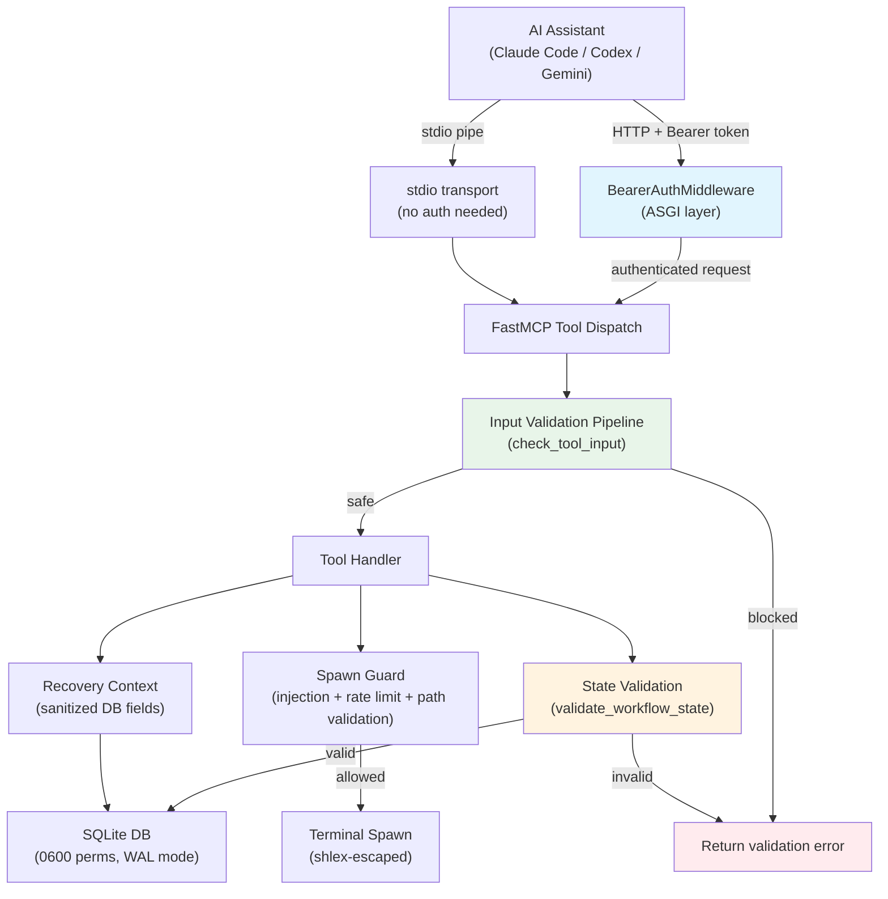

# Security Architecture

Technical documentation for spellbook's MCP server security hardening. For a high-level overview, see [SECURITY.md](../SECURITY.md) in the project root.

## Architecture Diagram



## Auth Flow Detail

### Token Lifecycle

1. **Generation**: On server startup in HTTP mode, `generate_and_store_token()` calls `secrets.token_urlsafe(32)` to produce a 43-character cryptographic token.
2. **Storage**: The token is written atomically using `os.open()` with flags `O_WRONLY | O_CREAT | O_TRUNC` and mode `0o600`. This avoids the TOCTOU race inherent in `Path.write_text()` followed by `os.chmod()`.
3. **Distribution**: The token file lives at `~/.local/spellbook/.mcp-token`. Clients read this file to obtain the token.
4. **Validation**: `BearerAuthMiddleware` extracts the `Authorization` header, strips the `Bearer` prefix, and compares using `secrets.compare_digest()` (constant-time, prevents timing side-channels).
5. **Expiry**: Tokens are per-server-instance. Restarting the server generates a new token, invalidating all prior tokens.

### Multi-Session Behavior

Multiple AI assistant sessions can share a single HTTP server instance. Each session reads the same token file. When the server restarts:

- A new token is generated and written to the token file
- Existing sessions with the old token will receive 401 Unauthorized
- Sessions must re-read the token file to reconnect

### stdio vs HTTP

| Property | stdio | HTTP (streamable-http) |
|---|---|---|
| Auth required | No (direct pipe, no network) | Yes (bearer token) |
| DNS rebinding risk | None | Mitigated by auth |
| Multi-session | No (one client per pipe) | Yes (shared server) |
| Default | Yes | No (opt-in via env var) |

Source: `spellbook/auth.py`, `spellbook/server.py:build_http_run_kwargs()`

## RCE Kill Chain Analysis

The most critical findings (#1 and #2) described a remote code execution kill chain through workflow state persistence. An attacker who can write to the SQLite database (or poison it through a compromised MCP tool) could inject arbitrary commands into the `boot_prompt` field, which gets executed by the AI assistant on session resume.

### Three-Barrier Defense

**Barrier 1: workflow_state_save/update validation** (`spellbook/server.py`)

Both `workflow_state_save` and `workflow_state_update` call `validate_workflow_state()` before writing to the database. The update path validates BOTH the incoming updates AND the merged result, preventing payloads that become dangerous only after merge.

**Barrier 2: workflow_state_load rejection** (`spellbook/resume.py:load_workflow_state()`)

When loading persisted state, `load_workflow_state()` re-validates the state. This catches state that was written before validation was added, or state that was tampered with directly in the database.

**Barrier 3: boot_prompt content restrictions** (`spellbook/resume.py:_validate_boot_prompt()`)

The boot_prompt validator uses context-aware line tracking with two phases:

1. **Full-string scan**: Checks dangerous patterns (`Bash(`, `Write(`, `Edit(`, `WebFetch(`, `curl`, `wget`, `rm -`) against the entire boot_prompt. This catches patterns split across lines.
2. **Per-line validation**: Each line must match a safe pattern (Skill invocations, Read operations, TodoWrite, markdown formatting) or be inside a tracked multi-line structure (JSON array/object). Lines that match neither are rejected.

Any validation failure raises an error and the write is rejected.

Source: `spellbook/resume.py:validate_workflow_state()`, `spellbook/resume.py:_validate_boot_prompt()`

Test: `tests/test_workflow_state_security.py`

## Per-Finding Detail

| # | Finding | Severity | File(s) Changed | Fix Approach | Test File |
|---|---|---|---|---|---|
| 1 | RCE via workflow_state_save: arbitrary boot_prompt | CRITICAL | `spellbook/resume.py`, `spellbook/server.py` | Schema validation with allowlisted keys, size caps, boot_prompt content restrictions, dangerous operation blocklist | `tests/test_workflow_state_security.py` |
| 2 | RCE via workflow_state_update: merge-based injection | CRITICAL | `spellbook/server.py` | Pre-merge AND post-merge validation; validates both updates dict and merged result | `tests/test_workflow_state_security.py` |
| 3 | No authentication on HTTP transport | HIGH | `spellbook/auth.py`, `spellbook/server.py`, `pyproject.toml` | Bearer token ASGI middleware with atomic token file creation (0600), constant-time comparison, /health exemption | `tests/test_auth.py` |
| 4 | No rate limiting on spawn_claude_session | HIGH | `spellbook/server.py` | DB-backed rate limiter: max 1 spawn per 5 minutes, fail-closed on DB error | `tests/test_terminal_security.py` |
| 5 | Path traversal via working_directory | HIGH | `spellbook/server.py` | `_validate_working_directory()`: symlink resolution, existence check, scope restriction to $HOME or project dir | `tests/test_terminal_security.py` |
| 6 | Prompt injection in spawn prompt | HIGH | `spellbook/server.py` | MCP-level security guard: `check_tool_input()` scan before spawn, audit log on block | `tests/test_terminal_security.py` |
| 7 | boot_prompt validation bypass via multi-line evasion | HIGH | `spellbook/resume.py` | Context-aware validation with brace/bracket depth tracking; dangerous patterns checked on full string AND per-line | `tests/test_workflow_state_security.py`, `tests/test_resume.py` |
| 8 | Shell injection via terminal command inputs | HIGH | `spellbook/terminal_utils.py` | `shlex.quote()` on all user inputs (prompt, working_directory, cli_command) before shell interpolation; AppleScript-specific escaping | `tests/test_terminal_security.py` |
| 9 | Recovery context injection via poisoned DB fields | MEDIUM | `spellbook/injection.py` | Per-field sanitization with injection pattern detection via `do_detect_injection()`; fields with injection patterns omitted from context | `tests/test_injection_security.py` |
| 10 | Insufficient injection pattern coverage | MEDIUM | `spellbook/gates/rules.py` | Added AppleScript injection pattern (APPLESCRIPT-001) and base64-encoded command pipeline pattern (BASE64-001) | `tests/test_security/test_pattern_expansion.py` |
| 11 | TERMINAL env var used without validation | MEDIUM | `spellbook/terminal_utils.py` | Validate via `shutil.which()` before use; fall back to detection if not found | `tests/test_terminal_security.py` |
| 12 | Recovery context field length unbounded | MEDIUM | `spellbook/injection.py` | `_FIELD_LENGTH_LIMITS` dict with per-field caps (100-500 chars); truncation before injection scan | `tests/test_injection_security.py` |
| 13 | SPELLBOOK_CLI_COMMAND not validated | MEDIUM | `spellbook/terminal_utils.py` | `_ALLOWED_CLI_COMMANDS` frozenset allowlist; basename extraction prevents path injection; defaults to 'claude' | `tests/test_terminal_security.py` |
| 14 | DB file permissions too permissive | LOW | `spellbook/db.py` | `os.chmod(db_path, 0o600)` on connection, `os.chmod(db_dir, 0o700)` on directory; TTL-based connection cache (1 hour) with health checks | `tests/test_db_security.py` |

## Configuration Options

| Variable | Default | Description |
|---|---|---|
| `SPELLBOOK_AUTH` | (enabled) | Set to `disabled` to skip bearer token authentication on HTTP transport. The server logs a warning when auth is disabled. (`SPELLBOOK_MCP_AUTH` is accepted as a deprecated alias.) |
| `SPELLBOOK_MCP_HOST` | `127.0.0.1` | Bind address for HTTP transport. Binding to `0.0.0.0` exposes the server to the network and is strongly discouraged. |
| `SPELLBOOK_MCP_PORT` | `8765` | Port number for HTTP transport. |
| `SPELLBOOK_MCP_TRANSPORT` | `stdio` | Transport mode. `stdio` for direct pipe (default, used by Claude Code). `streamable-http` for HTTP with auth. |
| `SPELLBOOK_CLI_COMMAND` | `claude` | CLI command invoked in spawned terminal sessions. Validated against allowlist: `claude`, `codex`, `gemini`, `opencode`. |

## Rollback Instructions

### Disable Authentication

Set the environment variable before starting the server:

```bash
SPELLBOOK_MCP_AUTH=disabled
```

The server will log a warning: `MCP auth disabled via SPELLBOOK_MCP_AUTH=disabled`.

### Revert Security Changes

All security hardening was implemented in discrete, well-scoped commits. To revert a specific finding's fix:

```bash
# Example: revert only the auth middleware integration
git revert bd6ed35
```

To revert all security hardening:

```bash
git revert --no-commit ab83dc2..HEAD
```

## Sandboxing with cco (macOS)

Running Claude Code with `--dangerously-skip-permissions` removes per-tool approval prompts but leaves the assistant with full access to your machine. [nikvdp/cco](https://github.com/nikvdp/cco) is a thin wrapper that re-adds containment automatically: on macOS it uses `sandbox-exec` (Seatbelt) natively, on Linux it uses `bubblewrap`, and Docker is a fallback on both.

cco works with spellbook because the sandbox only needs read access to the spellbook source tree (`$SPELLBOOK_DIR`) and the config directory (`$SPELLBOOK_CONFIG_DIR`, for the `.mcp-token` auth file). The spellbook daemon runs as a launchd service outside the sandbox and is unaffected. Hook subprocesses (PreToolUse/PostToolUse) run inside the sandboxed process tree but route all filesystem writes (error logs, messaging inbox drains) through the daemon's HTTP API, so no write access to any spellbook directory is required.

Spellbook ships a launcher at `scripts/spellbook-sandbox` that handles this for you.

### Quick start

Install cco:

```bash
curl -fsSL https://raw.githubusercontent.com/nikvdp/cco/master/install.sh | bash
```

Launch Claude Code (or OpenCode) through the wrapper:

```bash
scripts/spellbook-sandbox                  # sandboxed Claude Code
scripts/spellbook-sandbox opencode         # sandboxed OpenCode
scripts/spellbook-sandbox codex            # sandboxed Codex
```

Add the script directory to your PATH, or alias for convenience:

```bash
alias claude='/path/to/spellbook/scripts/spellbook-sandbox'
alias opencode='/path/to/spellbook/scripts/spellbook-sandbox opencode'
```

### What the wrapper does

The wrapper uses cco's `--safe` mode by default, which hides `$HOME` reads so only the current project directory and explicitly allowlisted paths are visible inside the sandbox. It resolves `$SPELLBOOK_DIR` (auto-detected from the script's location, or set via env var) and `$SPELLBOOK_CONFIG_DIR` (env, `~/.local/spellbook`, or `~/.config/spellbook`), then execs:

```bash
cco --safe --add-dir "$SPELLBOOK_DIR":ro --add-dir "$SPELLBOOK_CONFIG_DIR":ro "$@"
```

- `--safe` hides `$HOME` reads except for the working directory and explicitly allowed paths
- `--add-dir $SPELLBOOK_DIR:ro` grants read access to spellbook's resource files (skills, commands, hooks)
- `--add-dir $SPELLBOOK_CONFIG_DIR:ro` grants read access to the config directory (needed for `.mcp-token` which hooks use for daemon HTTP auth)
- All hook writes go through the daemon's HTTP API (`/api/hook-log`, `/api/messaging/poll`), so no write access to any spellbook directory is granted

The daemon runs independently via launchd and is not sandboxed.

### Threat model

| Threat                                       | Default |
| -------------------------------------------- | ------- |
| Trashing files outside project               | Blocked |
| Modifying shell rc or SSH config             | Blocked |
| Writing to spellbook config dir              | Blocked |
| Reading other projects under `$HOME`         | Blocked |
| Reading SSH / cloud / browser credentials    | Blocked |
| Reading spellbook source and config          | Allowed (read-only) |
| Network access (localhost + outbound)        | Allowed |
| Kernel escape from sandbox-exec              | Out of scope (use a VM) |

### OpenCode desktop and web app

The OpenCode Electron desktop app supports connecting to an externally-launched server. This lets you sandbox the server process (where all agent execution happens) while the desktop UI runs unsandboxed.

Launch the sandboxed server:

```bash
OPENCODE_SERVER_PASSWORD=mypass spellbook-sandbox opencode serve --port 8080
```

Then in the Electron desktop app, open the server selection dialog and add:
- URL: `http://127.0.0.1:8080`
- Password: `mypass`

The server runs inside cco's sandbox with the same protections as the CLI. The desktop UI connects over HTTP and is unaffected by sandbox restrictions.

Notes:
- The Tauri desktop app does not support external servers; use the Electron version.
- `opencode serve` supports `--hostname`, `--cors`, and `--mdns` (Bonjour auto-discovery) flags.
- Set `OPENCODE_SERVER_PASSWORD` to a strong value in production; without it the server is unauthenticated.

## Source Citations

The security audit and hardening drew from 45 sources. The top references:

| # | Source | URL |
|---|---|---|
| 1 | Anthropic MCP Specification | https://modelcontextprotocol.io/specification |
| 2 | Invariant Labs: MCP Security | https://invariantlabs.ai/ |
| 3 | CVE-2025-53967: Command Injection in Framelink Figma MCP Server | https://nvd.nist.gov/vuln/detail/CVE-2025-53967 |
| 4 | CVE-2025-66414: DNS Rebinding in MCP TypeScript SDK | https://nvd.nist.gov/vuln/detail/CVE-2025-66414 |
| 5 | CVE-2025-66416: DNS Rebinding in MCP Python SDK | https://nvd.nist.gov/vuln/detail/CVE-2025-66416 |
| 6 | CVE-2025-59536: Code Injection in Claude Code Startup Trust Dialog | https://nvd.nist.gov/vuln/detail/CVE-2025-59536 |
| 7 | OWASP: Prompt Injection | https://owasp.org/www-project-top-10-for-large-language-model-applications/ |
| 8 | Python secrets module documentation | https://docs.python.org/3/library/secrets.html |
| 9 | Python shlex module documentation | https://docs.python.org/3/library/shlex.html |
| 10 | Starlette ASGI Middleware | https://www.starlette.io/middleware/ |
| 11 | FastMCP Documentation | https://gofastmcp.com/ |
| 12 | SQLite WAL Mode | https://www.sqlite.org/wal.html |
| 13 | TOCTOU Race Conditions | https://cwe.mitre.org/data/definitions/367.html |
| 14 | CWE-78: OS Command Injection | https://cwe.mitre.org/data/definitions/78.html |
| 15 | CWE-22: Path Traversal | https://cwe.mitre.org/data/definitions/22.html |
| 16 | CWE-798: Hard-coded Credentials | https://cwe.mitre.org/data/definitions/798.html |
| 17 | Simon Willison: Prompt Injection Attacks | https://simonwillison.net/2025/Apr/9/mcp-prompt-injection/ |
| 18 | NIST SP 800-63B: Digital Identity Guidelines | https://pages.nist.gov/800-63-3/sp800-63b.html |
