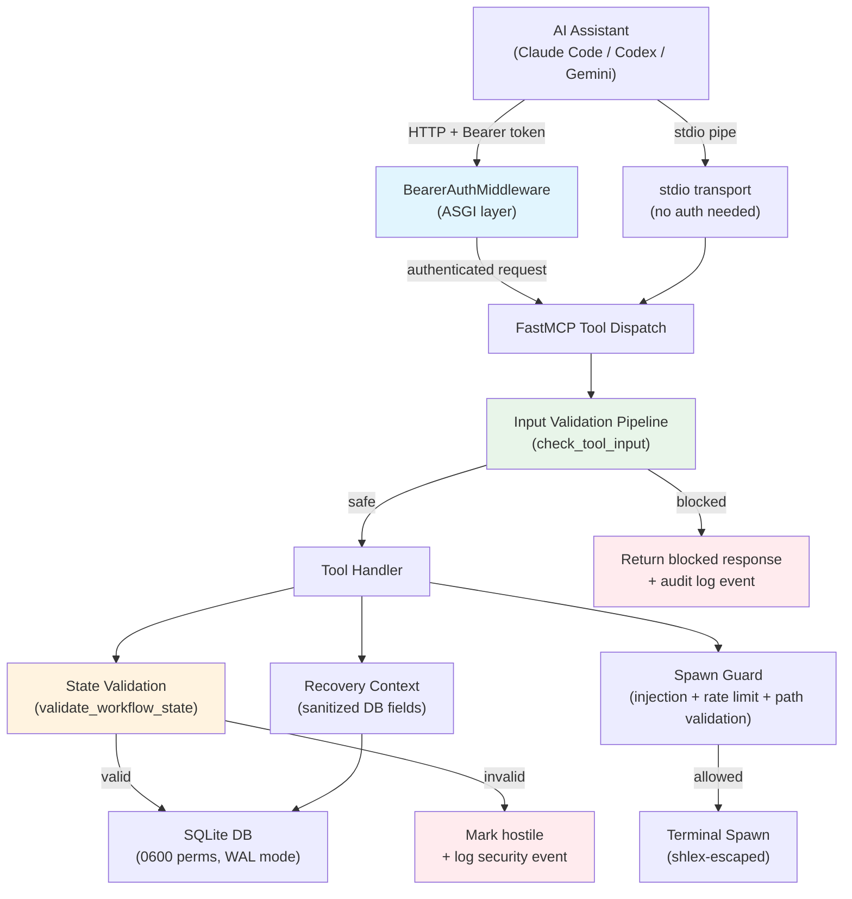
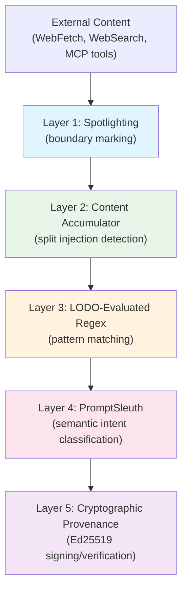

# Security Architecture

Technical documentation for spellbook's MCP server security hardening. For a high-level overview, see [SECURITY.md](../SECURITY.md) in the project root.

## Architecture Diagram



## Auth Flow Detail

### Token Lifecycle

1. **Generation**: On server startup in HTTP mode, `generate_and_store_token()` calls `secrets.token_urlsafe(32)` to produce a 43-character cryptographic token.
2. **Storage**: The token is written atomically using `os.open()` with flags `O_WRONLY | O_CREAT | O_TRUNC` and mode `0o600`. This avoids the TOCTOU race inherent in `Path.write_text()` followed by `os.chmod()`.
3. **Distribution**: The token file lives at `~/.local/spellbook/.mcp-token`. Clients read this file to obtain the token.
4. **Validation**: `BearerAuthMiddleware` extracts the `Authorization` header, strips the `Bearer` prefix, and compares using `secrets.compare_digest()` (constant-time, prevents timing side-channels).
5. **Expiry**: Tokens are per-server-instance. Restarting the server generates a new token, invalidating all prior tokens.

### Multi-Session Behavior

Multiple AI assistant sessions can share a single HTTP server instance. Each session reads the same token file. When the server restarts:

- A new token is generated and written to the token file
- Existing sessions with the old token will receive 401 Unauthorized
- Sessions must re-read the token file to reconnect

### stdio vs HTTP

| Property | stdio | HTTP (streamable-http) |
|---|---|---|
| Auth required | No (direct pipe, no network) | Yes (bearer token) |
| DNS rebinding risk | None | Mitigated by auth |
| Multi-session | No (one client per pipe) | Yes (shared server) |
| Default | Yes | No (opt-in via env var) |

Source: `spellbook/auth.py`, `spellbook/server.py:build_http_run_kwargs()`

## RCE Kill Chain Analysis

The most critical findings (#1 and #2) described a remote code execution kill chain through workflow state persistence. An attacker who can write to the SQLite database (or poison it through a compromised MCP tool) could inject arbitrary commands into the `boot_prompt` field, which gets executed by the AI assistant on session resume.

### Three-Barrier Defense

**Barrier 1: workflow_state_save/update validation** (`spellbook/server.py`)

Both `workflow_state_save` and `workflow_state_update` call `validate_workflow_state()` before writing to the database. The update path validates BOTH the incoming updates AND the merged result, preventing payloads that become dangerous only after merge.

**Barrier 2: workflow_state_load rejection** (`spellbook/resume.py:load_workflow_state()`)

When loading persisted state, `load_workflow_state()` re-validates the state. This catches state that was written before validation was added, or state that was tampered with directly in the database.

**Barrier 3: boot_prompt content restrictions** (`spellbook/resume.py:_validate_boot_prompt()`)

The boot_prompt validator uses context-aware line tracking with two phases:

1. **Full-string scan**: Checks dangerous patterns (`Bash(`, `Write(`, `Edit(`, `WebFetch(`, `curl`, `wget`, `rm -`) against the entire boot_prompt. This catches patterns split across lines.
2. **Per-line validation**: Each line must match a safe pattern (Skill invocations, Read operations, TodoWrite, markdown formatting) or be inside a tracked multi-line structure (JSON array/object). Lines that match neither are rejected.

Any validation failure marks the state as hostile in the trust registry and logs a CRITICAL security event.

Source: `spellbook/resume.py:validate_workflow_state()`, `spellbook/resume.py:_validate_boot_prompt()`

Test: `tests/test_workflow_state_security.py`

## Per-Finding Detail

| # | Finding | Severity | File(s) Changed | Fix Approach | Test File |
|---|---|---|---|---|---|
| 1 | RCE via workflow_state_save: arbitrary boot_prompt | CRITICAL | `spellbook/resume.py`, `spellbook/server.py` | Schema validation with allowlisted keys, size caps, boot_prompt content restrictions, dangerous operation blocklist | `tests/test_workflow_state_security.py` |
| 2 | RCE via workflow_state_update: merge-based injection | CRITICAL | `spellbook/server.py` | Pre-merge AND post-merge validation; validates both updates dict and merged result | `tests/test_workflow_state_security.py` |
| 3 | No authentication on HTTP transport | HIGH | `spellbook/auth.py`, `spellbook/server.py`, `pyproject.toml` | Bearer token ASGI middleware with atomic token file creation (0600), constant-time comparison, /health exemption | `tests/test_auth.py` |
| 4 | No rate limiting on spawn_claude_session | HIGH | `spellbook/server.py` | DB-backed rate limiter: max 1 spawn per 5 minutes, fail-closed on DB error | `tests/test_terminal_security.py` |
| 5 | Path traversal via working_directory | HIGH | `spellbook/server.py` | `_validate_working_directory()`: symlink resolution, existence check, scope restriction to $HOME or project dir | `tests/test_terminal_security.py` |
| 6 | Prompt injection in spawn prompt | HIGH | `spellbook/server.py` | MCP-level security guard: `check_tool_input()` scan before spawn, audit log on block | `tests/test_terminal_security.py` |
| 7 | boot_prompt validation bypass via multi-line evasion | HIGH | `spellbook/resume.py` | Context-aware validation with brace/bracket depth tracking; dangerous patterns checked on full string AND per-line | `tests/test_workflow_state_security.py`, `tests/test_resume.py` |
| 8 | Shell injection via terminal command inputs | HIGH | `spellbook/terminal_utils.py` | `shlex.quote()` on all user inputs (prompt, working_directory, cli_command) before shell interpolation; AppleScript-specific escaping | `tests/test_terminal_security.py` |
| 9 | Recovery context injection via poisoned DB fields | MEDIUM | `spellbook/injection.py` | Per-field sanitization with injection pattern detection via `do_detect_injection()`; fields with injection patterns omitted from context | `tests/test_injection_security.py` |
| 10 | Insufficient injection pattern coverage | MEDIUM | `spellbook/security/rules.py` | Added AppleScript injection pattern (APPLESCRIPT-001) and base64-encoded command pipeline pattern (BASE64-001) | `tests/test_security/test_pattern_expansion.py` |
| 11 | TERMINAL env var used without validation | MEDIUM | `spellbook/terminal_utils.py` | Validate via `shutil.which()` before use; fall back to detection if not found | `tests/test_terminal_security.py` |
| 12 | Recovery context field length unbounded | MEDIUM | `spellbook/injection.py` | `_FIELD_LENGTH_LIMITS` dict with per-field caps (100-500 chars); truncation before injection scan | `tests/test_injection_security.py` |
| 13 | SPELLBOOK_CLI_COMMAND not validated | MEDIUM | `spellbook/terminal_utils.py` | `_ALLOWED_CLI_COMMANDS` frozenset allowlist; basename extraction prevents path injection; defaults to 'claude' | `tests/test_terminal_security.py` |
| 14 | DB file permissions too permissive | LOW | `spellbook/db.py` | `os.chmod(db_path, 0o600)` on connection, `os.chmod(db_dir, 0o700)` on directory; TTL-based connection cache (1 hour) with health checks | `tests/test_db_security.py` |

## Configuration Options

| Variable | Default | Description |
|---|---|---|
| `SPELLBOOK_AUTH` | (enabled) | Set to `disabled` to skip bearer token authentication on HTTP transport. The server logs a warning when auth is disabled. (`SPELLBOOK_MCP_AUTH` is accepted as a deprecated alias.) |
| `SPELLBOOK_MCP_HOST` | `127.0.0.1` | Bind address for HTTP transport. Binding to `0.0.0.0` exposes the server to the network and is strongly discouraged. |
| `SPELLBOOK_MCP_PORT` | `8765` | Port number for HTTP transport. |
| `SPELLBOOK_MCP_TRANSPORT` | `stdio` | Transport mode. `stdio` for direct pipe (default, used by Claude Code). `streamable-http` for HTTP with auth. |
| `SPELLBOOK_CLI_COMMAND` | `claude` | CLI command invoked in spawned terminal sessions. Validated against allowlist: `claude`, `codex`, `gemini`, `opencode`. |

## Rollback Instructions

### Disable Authentication

Set the environment variable before starting the server:

```bash
SPELLBOOK_MCP_AUTH=disabled
```

The server will log a warning: `MCP auth disabled via SPELLBOOK_MCP_AUTH=disabled`.

### Revert to Standard Security Mode

The security mode can be changed at runtime via the `security_set_mode` MCP tool:

```
security_set_mode(mode="standard")
```

Available modes: `standard` (default, HIGH+ threshold), `paranoid` (MEDIUM+ threshold).

### Revert Security Changes

All security hardening was implemented in discrete, well-scoped commits. To revert a specific finding's fix:

```bash
# Example: revert only the auth middleware integration
git revert bd6ed35
```

To revert all security hardening:

```bash
git revert --no-commit ab83dc2..HEAD
```

## Runtime Injection Defense

Spellbook 0.36.0 introduces a defense-in-depth injection defense system with 5 concentric layers. Each layer operates independently; an attacker must defeat all of them to succeed.



### Layer 1: Spotlighting

Spotlighting wraps external content in distinctive delimiters that help the LLM distinguish data from directives. Three tiers are available:

| Tier | Delimiter | Use Case |
|---|---|---|
| `standard` | `[EXTERNAL_DATA_BEGIN source=...]` | Default for WebFetch, WebSearch, MCP tool output |
| `elevated` | `[UNTRUSTED_CONTENT_BEGIN source=...]` | Content from unknown or low-trust sources |
| `critical` | `[HOSTILE_CONTENT source=... confidence=N]` | Content flagged by PromptSleuth as containing directive intent |

Content containing spotlight delimiter prefixes is escaped (bracket doubling) to prevent delimiter injection. Spotlighting is integrated into the PostToolUse hook for automatic wrapping of external content and into `pr_fetch` for PR diff content.

Configuration:

| Key | Default | Description |
|---|---|---|
| `security.spotlighting.enabled` | `true` | Master switch for spotlight wrapping |
| `security.spotlighting.tier` | `"standard"` | Default tier for external content |

Source: `spellbook/security/spotlight.py`

### Layer 2: Content Accumulator

The session content accumulator tracks content fragments from external sources across tool calls within a session. This detects split injection attacks where malicious payloads are distributed across multiple tool outputs.

Each content entry records the SHA-256 hash, source tool, a 500-character summary, and size in bytes. Entries auto-expire and are capped at 500 per session.

Alerts are generated when:

- A single source tool contributes 3+ entries (repeated source)
- A single source contributes 3+ entries within a 5-minute window (burst source)

The accumulator is written to automatically by the PostToolUse hook whenever external content is received.

Source: `spellbook/security/accumulator.py`

### Layer 3: LODO Evaluation

The LODO (Leave-One-Dataset-Out) evaluation framework provides rigorous coverage testing for the regex-based injection detectors in `rules.py`. Four curated attack datasets are used:

| Dataset | Source | Attack Type |
|---|---|---|
| AdvBench | Zou et al. 2023 | Direct injection attacks |
| BIPIA | Yi et al. 2023 | Indirect/embedded injection attacks |
| HarmBench | Mazeika et al. 2024 | Jailbreak and override attacks |
| InjecAgent | Zhan et al. 2024 | Agent-targeted injection attacks |

A benign corpus provides false positive measurement. The LODO methodology tests each rule set with one dataset held out to verify that detection generalizes across attack distributions rather than overfitting to known samples.

The evaluation runner generates a markdown coverage report:

```bash
python scripts/run_lodo_eval.py [--output docs/security/lodo-report.md]
```

Source: `scripts/run_lodo_eval.py`, `tests/test_security/test_lodo.py`

### Layer 4: PromptSleuth

PromptSleuth is a semantic intent classifier that uses the Anthropic SDK (claude-3-haiku) to determine whether content contains directive intent (injection) vs. pure data. It serves as a deeper analysis layer for content that passes regex detection.

Key properties:

- **Budget-controlled**: Each session gets a configurable number of API calls (default 50). When the budget is exhausted, the system falls back to regex-only detection or warns depending on configuration.
- **DB-backed cache**: Classification results are cached by content hash with configurable TTL, avoiding redundant API calls for duplicate content.
- **Claude Code gating**: PromptSleuth is designed for use with Claude Code sessions. The Anthropic API key must be configured.
- **Content truncation**: Large content is truncated to 50KB (preserving UTF-8 boundaries) before classification.

Configuration:

| Key | Default | Description |
|---|---|---|
| `security.sleuth.enabled` | `false` | Master switch for PromptSleuth |
| `security.sleuth.api_key` | (none) | Anthropic API key for haiku calls |
| `security.sleuth.calls_per_session` | `50` | Budget: max API calls per session |
| `security.sleuth.fallback_on_budget_exceeded` | `"warn"` | Behavior when budget is exhausted: `"warn"` or `"block"` |
| `security.sleuth.timeout_seconds` | `5` | API call timeout |
| `security.sleuth.max_tokens_per_check` | `1024` | Max tokens for classification response |
| `security.sleuth.max_content_bytes` | `50000` | Content truncation threshold |

Source: `spellbook/security/sleuth.py`, `spellbook/mcp/tools/security.py`

### Layer 5: Cryptographic Content Provenance

Ed25519 signing and verification provides tamper detection for trusted content. The installer generates a keypair on first run and stores it at `~/.local/spellbook/keys/`.

**Signing**: Content is hashed (SHA-256) and signed with the private key. Trusted files (AGENTS.md, skills, commands) are auto-signed during installation.

**Verification**: A PreToolUse gate checks signatures before allowing privileged operations (`spawn_claude_session`, `workflow_state_save`). Content without a valid signature is flagged.

**Key rotation**: `rotate_keypair()` archives the current public key and generates a new pair. Archived keys are retained for verifying previously-signed content.

Crypto provenance defaults to **opt-in** (disabled). The TUI installer enables it after successful key generation.

Configuration:

| Key | Default | Description |
|---|---|---|
| `security.crypto.enabled` | `false` | Master switch (enabled by installer after key generation) |
| `security.crypto.keys_dir` | `~/.local/spellbook/keys` | Directory for Ed25519 keypair storage |
| `security.crypto.gate_spawn_session` | `true` | Require signature verification for spawn_claude_session |
| `security.crypto.gate_workflow_save` | `true` | Require signature verification for workflow_state_save |

Source: `spellbook/security/crypto.py`, `spellbook/security/crypto_config.py`

### TUI Installer

The Rich-based terminal UI (`installer/tui.py`) provides interactive security feature configuration during installation. It handles:

- Platform selection with checkboxes
- Security feature opt-in (spotlighting, PromptSleuth, crypto provenance)
- Ed25519 key generation progress display
- Graceful fallback when Rich is not installed or the terminal is non-interactive

### New MCP Tools

| Tool | Description |
|---|---|
| `security_check_intent` | Classify content as DIRECTIVE or DATA using PromptSleuth |
| `security_sign_content` | Sign content with the Ed25519 private key |
| `security_verify_signature` | Verify an Ed25519 signature against content |
| `security_accumulator_write` | Write a content entry to the session accumulator |
| `security_accumulator_status` | Check session accumulator state and alerts |
| `security_sleuth_reset_budget` | Reset the PromptSleuth budget for a session |

### New Database Tables

| Table | Purpose |
|---|---|
| `intent_checks` | PromptSleuth classification results (audit trail) |
| `session_content_accumulator` | Content fragment tracking per session |
| `sleuth_budget` | Per-session API call budget tracking |
| `sleuth_cache` | Content hash to classification result cache |

## Source Citations

The security audit and hardening drew from 45 sources. The top references:

| # | Source | URL |
|---|---|---|
| 1 | Anthropic MCP Specification | https://modelcontextprotocol.io/specification |
| 2 | Invariant Labs: MCP Security | https://invariantlabs.ai/ |
| 3 | CVE-2025-53967: Command Injection in Framelink Figma MCP Server | https://nvd.nist.gov/vuln/detail/CVE-2025-53967 |
| 4 | CVE-2025-66414: DNS Rebinding in MCP TypeScript SDK | https://nvd.nist.gov/vuln/detail/CVE-2025-66414 |
| 5 | CVE-2025-66416: DNS Rebinding in MCP Python SDK | https://nvd.nist.gov/vuln/detail/CVE-2025-66416 |
| 6 | CVE-2025-59536: Code Injection in Claude Code Startup Trust Dialog | https://nvd.nist.gov/vuln/detail/CVE-2025-59536 |
| 7 | OWASP: Prompt Injection | https://owasp.org/www-project-top-10-for-large-language-model-applications/ |
| 8 | Python secrets module documentation | https://docs.python.org/3/library/secrets.html |
| 9 | Python shlex module documentation | https://docs.python.org/3/library/shlex.html |
| 10 | Starlette ASGI Middleware | https://www.starlette.io/middleware/ |
| 11 | FastMCP Documentation | https://gofastmcp.com/ |
| 12 | SQLite WAL Mode | https://www.sqlite.org/wal.html |
| 13 | TOCTOU Race Conditions | https://cwe.mitre.org/data/definitions/367.html |
| 14 | CWE-78: OS Command Injection | https://cwe.mitre.org/data/definitions/78.html |
| 15 | CWE-22: Path Traversal | https://cwe.mitre.org/data/definitions/22.html |
| 16 | CWE-798: Hard-coded Credentials | https://cwe.mitre.org/data/definitions/798.html |
| 17 | Simon Willison: Prompt Injection Attacks | https://simonwillison.net/2025/Apr/9/mcp-prompt-injection/ |
| 18 | NIST SP 800-63B: Digital Identity Guidelines | https://pages.nist.gov/800-63-3/sp800-63b.html |
