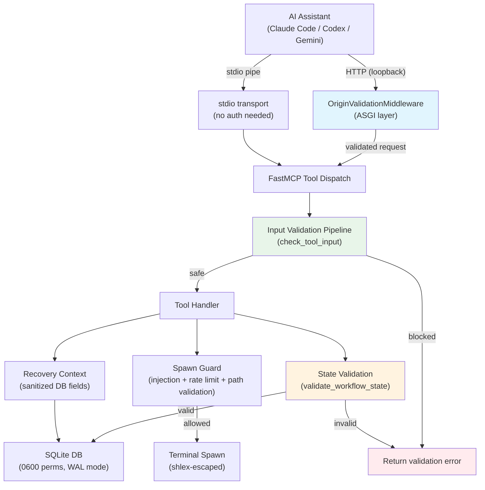

# Security Architecture

Technical documentation for spellbook's MCP server security hardening. For a high-level overview, see [SECURITY.md](../SECURITY.md) in the project root.

## Architecture Diagram


```mermaid
graph TD
    Client["AI Assistant<br>(Claude Code / Codex / Gemini)"] -->|"HTTP (loopback)"| Auth["OriginValidationMiddleware<br>(ASGI layer)"]
    Client -->|"stdio pipe"| Stdio["stdio transport<br>(no auth needed)"]

    Auth -->|"validated request"| Dispatch["FastMCP Tool Dispatch"]
    Stdio --> Dispatch

    Dispatch --> Validation["Input Validation Pipeline<br>(check_tool_input)"]
    Validation -->|"safe"| Handler["Tool Handler"]
    Validation -->|"blocked"| Block["Return blocked response<br>+ audit log event"]

    Handler --> StateVal["State Validation<br>(validate_workflow_state)"]
    Handler --> SpawnGuard["Spawn Guard<br>(injection + rate limit + path validation)"]
    Handler --> Recovery["Recovery Context<br>(sanitized DB fields)"]

    StateVal -->|"valid"| DB["SQLite DB<br>(0600 perms, WAL mode)"]
    StateVal -->|"invalid"| Block["Return validation error"]
    SpawnGuard -->|"allowed"| Terminal["Terminal Spawn<br>(shlex-escaped)"]
    Recovery --> DB

    style Auth fill:#e1f5fe
    style Validation fill:#e8f5e9
    style StateVal fill:#fff3e0
    style Block fill:#ffebee
```

## Request Validation Detail

### Why Origin and not a token

The daemon binds loopback, so no remote host can route a packet to it. One remote actor can reach it anyway: the browser. Any page the user visits can issue requests to `127.0.0.1`, which is why Jupyter added token auth and why Docker's API socket is a recurring CVE source.

A bearer token stored at mode `0o600` does not address that threat well and carries its own cost. It defends only against *other local users*, and any process running as the user -- including the attacker's, if one is running -- can read the token file. Meanwhile the token had to be copied into a per-platform config file for every platform spellbook installs to, multiplying the number of on-disk copies whose permissions had to be right.

Origin validation addresses the actual threat directly and stores no secret anywhere.

### The rules

1. **No `Origin` header: allowed.** Every legitimate MCP client (Claude Code, curl, pi's adapter) sends none. This is the standard localhost-service pattern.

    Note what this does *not* rest on. A browser does not attach `Origin` to every cross-origin request: it omits it on cross-origin GET navigations and on ``, `<script>`, `<link>`, and `<iframe src>` subresource loads, and attaches it to `fetch`/`XHR` and cross-origin form submissions. Allowing an absent `Origin` is correct because **every cross-origin request a page can make without one is a GET or HEAD, and no GET or HEAD route on this daemon has a side effect.**

    !!! warning "Constraint on new routes"

        Adding a GET or HEAD route that mutates state, or whose response body is sensitive enough to matter when an attacker page loads it as a subresource, breaks this invariant. Such a route must carry its own check; `Origin` will not cover it.
2. **`Origin` present: rejected unless it matches exactly.** Matching is exact on scheme, host, *and* port. Only two things pass:

    - **the daemon's own origin** -- `http://` on the configured bind host or a loopback alias (`localhost`, `127.0.0.1`, `::1`), at the configured port. `http://localhost:8765` passes; `https://localhost:8765` and `http://localhost:3000` do not.
    - **an origin listed in `SPELLBOOK_ALLOWED_ORIGINS`**, compared the same way.

    Being local buys nothing on its own. A page served from another port on the user's own machine is a different origin, and untrusted local web content is exactly the case that a blanket loopback allowance would hand the daemon to.

    !!! note "Running a browser-based MCP client locally"

        Name its origin explicitly. For a client served from `http://localhost:3000`:

        ```bash
        export SPELLBOOK_ALLOWED_ORIGINS=http://localhost:3000
        ```

        Several are comma-separated. Each must carry the scheme and, unless it is the default for that scheme, the port.

3. **A repeated `Origin` or `Host` is rejected.** More than one copy of either header is refused outright. Header collections disagree on which copy wins -- `dict()` keeps the last, Starlette's `Headers.get()` keeps the first -- so choosing either one only decides which smuggling direction succeeds. The count is taken over the raw ASGI header list, and header names are matched case-insensitively rather than trusting the server to have lowercased them.
4. **`Host` is validated independently.** A value naming neither loopback nor the configured bind address is rejected. Under DNS rebinding the attacker's own hostname is what resolves to `127.0.0.1`, so it shows up here even when `Origin` does not help.

Hostnames are extracted with `urllib.parse.urlsplit`, not string matching, so `localhost.evil.com` and `http://evil.com/localhost` do not read as loopback.

### Status code

Rejections are `403 Forbidden`. The server holds no credentials, so no header the caller adds would change the result. `401 Unauthorized` would advertise a retry path that does not exist.

### Multi-Session Behavior

Multiple AI assistant sessions share a single HTTP server instance. There is no per-session credential, so a server restart does not invalidate anything and sessions reconnect without re-reading any file.

### stdio vs HTTP

| Property | stdio | HTTP (streamable-http) |
|---|---|---|
| Auth required | No (direct pipe, no network) | No credentials; Origin/Host validated |
| DNS rebinding risk | None | Mitigated by Host validation |
| Multi-session | No (one client per pipe) | Yes (shared server) |
| Default | Yes | No (opt-in via env var) |

Source: `spellbook/auth.py`, `spellbook/server.py:build_http_run_kwargs()`

## RCE Kill Chain Analysis

The most critical findings (#1 and #2) described a remote code execution kill chain through workflow state persistence. An attacker who can write to the SQLite database (or poison it through a compromised MCP tool) could inject arbitrary commands into the `boot_prompt` field, which gets executed by the AI assistant on session resume.

### Three-Barrier Defense

**Barrier 1: workflow_state_save/update validation** (`spellbook/server.py`)

Both `workflow_state_save` and `workflow_state_update` call `validate_workflow_state()` before writing to the database. The update path validates BOTH the incoming updates AND the merged result, preventing payloads that become dangerous only after merge.

**Barrier 2: workflow_state_load rejection** (`spellbook/resume.py:load_workflow_state()`)

When loading persisted state, `load_workflow_state()` re-validates the state. This catches state that was written before validation was added, or state that was tampered with directly in the database.

**Barrier 3: boot_prompt content restrictions** (`spellbook/resume.py:_validate_boot_prompt()`)

The boot_prompt validator uses context-aware line tracking with two phases:

1. **Full-string scan**: Checks dangerous patterns (`Bash(`, `Write(`, `Edit(`, `WebFetch(`, `curl`, `wget`, `rm -`) against the entire boot_prompt. This catches patterns split across lines.
2. **Per-line validation**: Each line must match a safe pattern (Skill invocations, Read operations, TodoWrite, markdown formatting) or be inside a tracked multi-line structure (JSON array/object). Lines that match neither are rejected.

Any validation failure raises an error and the write is rejected.

Source: `spellbook/resume.py:validate_workflow_state()`, `spellbook/resume.py:_validate_boot_prompt()`

Test: `tests/test_workflow_state_security.py`

## Per-Finding Detail

| # | Finding | Severity | File(s) Changed | Fix Approach | Test File |
|---|---|---|---|---|---|
| 1 | RCE via workflow_state_save: arbitrary boot_prompt | CRITICAL | `spellbook/resume.py`, `spellbook/server.py` | Schema validation with allowlisted keys, size caps, boot_prompt content restrictions, dangerous operation blocklist | `tests/test_workflow_state_security.py` |
| 2 | RCE via workflow_state_update: merge-based injection | CRITICAL | `spellbook/server.py` | Pre-merge AND post-merge validation; validates both updates dict and merged result | `tests/test_workflow_state_security.py` |
| 3 | Browser-reachable HTTP transport | HIGH | `spellbook/core/auth.py`, `spellbook/mcp/server.py` | `OriginValidationMiddleware`: rejects any `Origin` that is not exactly the daemon's own or allowlisted, rejects a repeated `Origin`/`Host`, validates `Host` against loopback and the bind address. Supersedes the original bearer-token middleware, which defended against local users rather than the browser. | `tests/test_reorg/test_core_auth.py` |
| 4 | No rate limiting on spawn_claude_session | HIGH | `spellbook/server.py` | DB-backed rate limiter: max 1 spawn per 5 minutes, fail-closed on DB error | `tests/test_terminal_security.py` |
| 5 | Path traversal via working_directory | HIGH | `spellbook/server.py` | `_validate_working_directory()`: symlink resolution, existence check, scope restriction to $HOME or project dir | `tests/test_terminal_security.py` |
| 6 | Prompt injection in spawn prompt | HIGH | `spellbook/server.py` | MCP-level security guard: `check_tool_input()` scan before spawn, audit log on block | `tests/test_terminal_security.py` |
| 7 | boot_prompt validation bypass via multi-line evasion | HIGH | `spellbook/resume.py` | Context-aware validation with brace/bracket depth tracking; dangerous patterns checked on full string AND per-line | `tests/test_workflow_state_security.py`, `tests/test_resume.py` |
| 8 | Shell injection via terminal command inputs | HIGH | `spellbook/terminal_utils.py` | `shlex.quote()` on all user inputs (prompt, working_directory, cli_command) before shell interpolation; AppleScript-specific escaping | `tests/test_terminal_security.py` |
| 9 | Recovery context injection via poisoned DB fields | MEDIUM | `spellbook/injection.py` | Per-field sanitization with injection pattern detection via `do_detect_injection()`; fields with injection patterns omitted from context | `tests/test_injection_security.py` |
| 10 | Insufficient injection pattern coverage | MEDIUM | `spellbook/gates/rules.py` | Added AppleScript injection pattern (APPLESCRIPT-001) and base64-encoded command pipeline pattern (BASE64-001) | `tests/test_security/test_pattern_expansion.py` |
| 11 | TERMINAL env var used without validation | MEDIUM | `spellbook/terminal_utils.py` | Validate via `shutil.which()` before use; fall back to detection if not found | `tests/test_terminal_security.py` |
| 12 | Recovery context field length unbounded | MEDIUM | `spellbook/injection.py` | `_FIELD_LENGTH_LIMITS` dict with per-field caps (100-500 chars); truncation before injection scan | `tests/test_injection_security.py` |
| 13 | SPELLBOOK_CLI_COMMAND not validated | MEDIUM | `spellbook/terminal_utils.py` | `_ALLOWED_CLI_COMMANDS` frozenset allowlist; basename extraction prevents path injection; defaults to 'claude' | `tests/test_terminal_security.py` |
| 14 | DB file permissions too permissive | LOW | `spellbook/db.py` | `os.chmod(db_path, 0o600)` on connection, `os.chmod(db_dir, 0o700)` on directory; TTL-based connection cache (1 hour) with health checks | `tests/test_db_security.py` |

## Configuration Options

| Variable | Default | Description |
|---|---|---|
| `SPELLBOOK_AUTH` | (enabled) | Set to `disabled` to skip Origin/Host validation on HTTP transport. The server logs a warning and prints `request validation DISABLED` in its startup banner whenever this is in effect. (`SPELLBOOK_MCP_AUTH` is accepted as a deprecated alias.) |
| `SPELLBOOK_ALLOWED_ORIGINS` | (empty) | Comma-separated origins permitted to call the daemon from a browser, matched exactly on scheme, host, and port. Required for a browser client on any origin other than the daemon's own -- including one on another port of this machine. |
| `SPELLBOOK_MCP_HOST` | `127.0.0.1` | Bind address for HTTP transport. Binding to `0.0.0.0` exposes the server to the network and is strongly discouraged. |
| `SPELLBOOK_MCP_PORT` | `8765` | Port number for HTTP transport. |
| `SPELLBOOK_MCP_TRANSPORT` | `stdio` | Transport mode. `stdio` for direct pipe (default, used by Claude Code). `streamable-http` for HTTP with Origin/Host validation. |
| `SPELLBOOK_CLI_COMMAND` | `claude` | CLI command invoked in spawned terminal sessions. Validated against allowlist: `claude`, `codex`, `gemini`, `opencode`. |

## Rollback Instructions

### Disable Request Validation

Set the environment variable before starting the server:

```bash
SPELLBOOK_AUTH=disabled
```

This turns off Origin and Host validation, leaving the daemon reachable by any page the user visits. Use only for debugging.

When validation is disabled the server announces it rather than failing quietly: the startup banner reads `request validation DISABLED`, and the server logs the warning `MCP request validation disabled via SPELLBOOK_AUTH=disabled; any web page you visit can reach this daemon`. If you set this variable and do not see both, the daemon is not running the configuration you think it is.

### Revert Security Changes

All security hardening was implemented in discrete, well-scoped commits. To revert a specific finding's fix:

```bash
# Example: revert only the auth middleware integration
git revert bd6ed35
```

To revert all security hardening:

```bash
git revert --no-commit ab83dc2..HEAD
```

## Source Citations

The security audit and hardening drew from 45 sources. The top references:

| # | Source | URL |
|---|---|---|
| 1 | Anthropic MCP Specification | https://modelcontextprotocol.io/specification |
| 2 | Invariant Labs: MCP Security | https://invariantlabs.ai/ |
| 3 | CVE-2025-53967: Command Injection in Framelink Figma MCP Server | https://nvd.nist.gov/vuln/detail/CVE-2025-53967 |
| 4 | CVE-2025-66414: DNS Rebinding in MCP TypeScript SDK | https://nvd.nist.gov/vuln/detail/CVE-2025-66414 |
| 5 | CVE-2025-66416: DNS Rebinding in MCP Python SDK | https://nvd.nist.gov/vuln/detail/CVE-2025-66416 |
| 6 | CVE-2025-59536: Code Injection in Claude Code Startup Trust Dialog | https://nvd.nist.gov/vuln/detail/CVE-2025-59536 |
| 7 | OWASP: Prompt Injection | https://owasp.org/www-project-top-10-for-large-language-model-applications/ |
| 8 | Python secrets module documentation | https://docs.python.org/3/library/secrets.html |
| 9 | Python shlex module documentation | https://docs.python.org/3/library/shlex.html |
| 10 | Starlette ASGI Middleware | https://www.starlette.io/middleware/ |
| 11 | FastMCP Documentation | https://gofastmcp.com/ |
| 12 | SQLite WAL Mode | https://www.sqlite.org/wal.html |
| 13 | TOCTOU Race Conditions | https://cwe.mitre.org/data/definitions/367.html |
| 14 | CWE-78: OS Command Injection | https://cwe.mitre.org/data/definitions/78.html |
| 15 | CWE-22: Path Traversal | https://cwe.mitre.org/data/definitions/22.html |
| 16 | CWE-798: Hard-coded Credentials | https://cwe.mitre.org/data/definitions/798.html |
| 17 | Simon Willison: Prompt Injection Attacks | https://simonwillison.net/2025/Apr/9/mcp-prompt-injection/ |
| 18 | NIST SP 800-63B: Digital Identity Guidelines | https://pages.nist.gov/800-63-3/sp800-63b.html |
