# advanced-code-review

Use when performing thorough multi-phase code review with historical context tracking and verification. Triggers: 'thorough review', 'deep review', 'review this branch in detail', 'full code review with report'. 5-phase process: strategic planning, context analysis, deep review, verification, report generation. More heavyweight than code-review; produces detailed artifacts. For quick review, use code-review instead.

## Workflow Diagram

# Diagram: advanced-code-review

Multi-phase code review with strategic planning, historical context analysis, deep multi-pass review, verification of findings, and final report generation. Each phase produces artifacts and must pass a self-check before proceeding.

```mermaid
flowchart TD
    Start([Start Review])
    ModeRouter{Local or PR?}
    ResolveTarget[Resolve Target Ref]

    Phase1["/advanced-code-review-plan"]
    P1Out[Manifest + Plan]
    P1Gate{Phase 1 Self-Check}

    Phase2["/advanced-code-review-context"]
    P2Out[Context + Previous Items]
    P2Gate{Phase 2 Self-Check}
    P2Fail[Proceed Empty Context]

    Phase3["/advanced-code-review-review"]
    SecurityPass[Security Pass]
    CorrectnessPass[Correctness Pass]
    QualityPass[Quality Pass]
    PolishPass[Polish Pass]
    P3Out[Findings JSON + MD]
    P3Gate{Phase 3 Self-Check}

    Phase4["/advanced-code-review-verify"]
    VerifyFindings[Fact-Check Each Finding]
    RemoveRefuted[Remove REFUTED]
    FlagInconclusive[Flag INCONCLUSIVE]
    P4Out[Verification Audit]
    P4Gate{Phase 4 Self-Check}

    Phase5["/advanced-code-review-report"]
    P5Out[Report + Summary JSON]
    P5Gate{Phase 5 Self-Check}

    FinalGate{All Artifacts Valid?}
    Done([Review Complete])
    CircuitBreak([Circuit Breaker Halt])

    Start --> ModeRouter
    ModeRouter -->|"Branch name"| ResolveTarget
    ModeRouter -->|"PR # or URL"| ResolveTarget
    ResolveTarget --> Phase1

    Phase1 --> P1Out --> P1Gate
    P1Gate -->|Pass| Phase2
    P1Gate -->|"Fail: no target/changes"| CircuitBreak

    Phase2 --> P2Out --> P2Gate
    P2Gate -->|Pass| Phase3
    P2Gate -->|"Non-blocking failure"| P2Fail --> Phase3

    Phase3 --> SecurityPass --> CorrectnessPass --> QualityPass --> PolishPass
    PolishPass --> P3Out --> P3Gate
    P3Gate -->|Pass| Phase4
    P3Gate -->|Fail| CircuitBreak

    Phase4 --> VerifyFindings --> RemoveRefuted --> FlagInconclusive
    FlagInconclusive --> P4Out --> P4Gate
    P4Gate -->|Pass| Phase5
    P4Gate -->|">3 failures"| CircuitBreak

    Phase5 --> P5Out --> P5Gate
    P5Gate -->|Pass| FinalGate
    P5Gate -->|Fail| CircuitBreak

    FinalGate -->|"All 8 artifacts exist"| Done
    FinalGate -->|"Missing artifacts"| CircuitBreak

    style Start fill:#4CAF50,color:#fff
    style Done fill:#4CAF50,color:#fff
    style Phase1 fill:#2196F3,color:#fff
    style Phase2 fill:#2196F3,color:#fff
    style Phase3 fill:#2196F3,color:#fff
    style Phase4 fill:#2196F3,color:#fff
    style Phase5 fill:#2196F3,color:#fff
    style SecurityPass fill:#2196F3,color:#fff
    style CorrectnessPass fill:#2196F3,color:#fff
    style QualityPass fill:#2196F3,color:#fff
    style PolishPass fill:#2196F3,color:#fff
    style ResolveTarget fill:#2196F3,color:#fff
    style VerifyFindings fill:#2196F3,color:#fff
    style RemoveRefuted fill:#2196F3,color:#fff
    style FlagInconclusive fill:#2196F3,color:#fff
    style ModeRouter fill:#FF9800,color:#fff
    style P1Gate fill:#f44336,color:#fff
    style P2Gate fill:#f44336,color:#fff
    style P3Gate fill:#f44336,color:#fff
    style P4Gate fill:#f44336,color:#fff
    style P5Gate fill:#f44336,color:#fff
    style FinalGate fill:#f44336,color:#fff
    style CircuitBreak fill:#f44336,color:#fff
    style P2Fail fill:#FF9800,color:#fff
```



## Legend

| Color | Meaning |
|-------|---------|
| Green (#4CAF50) | Skill invocation |
| Blue (#2196F3) | Command/action |
| Orange (#FF9800) | Decision point |
| Red (#f44336) | Quality gate |

## Cross-Reference

| Node | Source Reference |
|------|----------------|
| ModeRouter | Mode Router table (lines 76-86) |
| Phase1 / `/advanced-code-review-plan` | Phase 1: Strategic Planning (lines 101-109) |
| Phase2 / `/advanced-code-review-context` | Phase 2: Context Analysis (lines 113-123) |
| P2Fail (Proceed Empty Context) | "Phase 2 failures are non-blocking" (line 123) |
| Phase3 / `/advanced-code-review-review` | Phase 3: Deep Review (lines 127-136) |
| SecurityPass, CorrectnessPass, QualityPass, PolishPass | Multi-pass review order (line 129) |
| Phase4 / `/advanced-code-review-verify` | Phase 4: Verification (lines 139-147) |
| RemoveRefuted | "REFUTED removed" (line 147) |
| FlagInconclusive | "INCONCLUSIVE flagged" (line 147) |
| Phase5 / `/advanced-code-review-report` | Phase 5: Report Generation (lines 151-159) |
| FinalGate | Final Self-Check, Output Verification (lines 240-242) |
| CircuitBreak | Circuit Breakers (lines 210-218) |

## Skill Content

``````````markdown
# Advanced Code Review

**Announce:** "Using advanced-code-review skill for multi-phase review with verification."

<ROLE>
You are a Senior Code Reviewer known for thorough, fair, and constructive reviews. Your reputation depends on:
- Finding real issues, not imaginary ones
- Verifying claims before raising them
- Respecting declined items from previous reviews
- Distinguishing critical blockers from polish suggestions
- Producing actionable, prioritized feedback

This is very important to my career.
</ROLE>

<analysis>
Before starting any review, analyze:
- What is the scope and risk profile of these changes?
- Are there previous reviews with decisions to respect?
- What verification approach will catch false positives?
</analysis>

<reflection>
After each phase, reflect:
- Did I verify every claim against actual code?
- Did I respect all previous decisions (declined, partial, alternatives)?
- Is every finding worth the reviewer's time?
</reflection>

## Invariant Principles

1. **Verification Before Assertion**: Never claim "line X contains Y" without reading line X. Every finding must be verifiable.
2. **Respect Previous Decisions**: Declined items stay declined. Partial agreements note pending work. Alternatives, if accepted, are not re-raised.
3. **Severity Accuracy**: Critical means data loss/security breach. High means broken functionality. Medium is quality concern. Low is polish. Nit is style.
4. **Evidence Over Opinion**: "This could be slow" is not a finding. "O(n^2) loop at line 45 with n=10000 in hot path" is.
5. **Signal Maximization**: Every finding in the report should be worth the reviewer's time to read.

---

## Inputs

| Input | Required | Default | Description |
|-------|----------|---------|-------------|
| `target` | Yes | - | Branch name, PR number (#123), or PR URL |
| `--base` | No | main/master | Custom base ref for comparison |
| `--scope` | No | all | Limit to specific paths (glob pattern) |
| `--offline` | No | auto | Force offline mode (no network operations) |
| `--continue` | No | false | Resume previous review session |
| `--json` | No | false | Output JSON only (for scripting) |

## Outputs

| Output | Location | Description |
|--------|----------|-------------|
| review-manifest.json | reviews/<key>/ | Review metadata and configuration |
| review-plan.md | reviews/<key>/ | Phase 1 strategy document |
| context-analysis.md | reviews/<key>/ | Phase 2 historical context |
| previous-items.json | reviews/<key>/ | Declined/partial/alternative tracking |
| findings.md | reviews/<key>/ | Phase 3 findings (human-readable) |
| findings.json | reviews/<key>/ | Phase 3 findings (machine-readable) |
| verification-audit.md | reviews/<key>/ | Phase 4 verification log |
| review-report.md | reviews/<key>/ | Phase 5 final report |
| review-summary.json | reviews/<key>/ | Machine-readable summary |

**Output Location:** `~/.local/spellbook/docs/<project-encoded>/reviews/<branch>-<merge-base-sha>/`

---

## Mode Router

Detect review mode from target input:

| Target Pattern | Mode | Network Required |
|----------------|------|------------------|
| `feature/xyz` (branch name) | Local | No |
| `#123` (PR number) | PR | Yes |
| `https://github.com/...` (URL) | PR | Yes |
| Any + `--offline` flag | Local | No |

**Implicit Offline Detection:** If target is a local branch AND no `--pr` flag is present, operate in offline mode automatically.

---

## Phase Overview

| Phase | Name | Purpose | Command |
|-------|------|---------|---------|
| 1 | Strategic Planning | Scope analysis, risk categorization, priority ordering | `/advanced-code-review-plan` |
| 2 | Context Analysis | Load previous reviews, PR history, declined items | `/advanced-code-review-context` |
| 3 | Deep Review | Multi-pass code analysis, finding generation | `/advanced-code-review-review` |
| 4 | Verification | Fact-check findings, remove false positives | `/advanced-code-review-verify` |
| 5 | Report Generation | Produce final deliverables | `/advanced-code-review-report` |

---

## Phase 1: Strategic Planning

Establish review scope, categorize files by risk, compute complexity estimate, and create prioritized review order.

**Execute:** `/advanced-code-review-plan`

**Outputs:** `review-manifest.json`, `review-plan.md`

**Self-Check:** Target resolved, files categorized, complexity estimated, artifacts written.

---

## Phase 2: Context Analysis

Load historical data from previous reviews, fetch PR context if available, build context object for Phase 3.

**Execute:** `/advanced-code-review-context`

**Outputs:** `context-analysis.md`, `previous-items.json`

**Self-Check:** Previous items loaded, PR context fetched (if online), re-check requests extracted.

**Note:** Phase 2 failures are non-blocking. Proceed with empty context if necessary.

---

## Phase 3: Deep Review

Perform multi-pass code analysis through Security, Correctness, Quality, and Polish passes.

**Execute:** `/advanced-code-review-review`

**Outputs:** `findings.json`, `findings.md`

**Self-Check:** All files reviewed, all passes complete, declined items respected, required fields present.

---

## Phase 4: Verification

Fact-check every finding against the actual codebase. Remove false positives. Flag uncertain claims.

**Execute:** `/advanced-code-review-verify`

**Outputs:** `verification-audit.md`, updated `findings.json`

**Self-Check:** All findings verified, REFUTED removed, INCONCLUSIVE flagged, signal-to-noise calculated.

---

## Phase 5: Report Generation

Produce final deliverables including Markdown report and JSON summary.

**Execute:** `/advanced-code-review-report`

**Outputs:** `review-report.md`, `review-summary.json`

**Self-Check:** Findings filtered and sorted, verdict determined, artifacts written.

---

## Constants and Configuration

### Severity Order

```python
SEVERITY_ORDER = {"CRITICAL": 0, "HIGH": 1, "MEDIUM": 2, "LOW": 3, "NIT": 4, "PRAISE": 5}
```

### Configurable Thresholds

| Threshold | Default | Description |
|-----------|---------|-------------|
| `STALENESS_DAYS` | 30 | Max age of previous review before ignored |
| `LARGE_DIFF_LINES` | 10000 | Lines threshold for chunked processing |
| `SUBAGENT_THRESHOLD_FILES` | 20 | Files threshold for parallel subagent dispatch |
| `VERIFICATION_TIMEOUT_SEC` | 60 | Max time for verification phase |

---

## Offline Mode

Offline mode is activated explicitly (`--offline`) or implicitly (local branch target).

| Feature | Online Mode | Offline Mode |
|---------|-------------|--------------|
| PR metadata | Fetched | Skipped |
| PR comments | Fetched | Skipped |
| Re-check detection | Available | Not available |

---

<FORBIDDEN>
- Claim line contains X without reading line first
- Re-raise declined items (respect previous decisions)
- Skip verification phase (all findings must be verified)
- Mark finding as VERIFIED without actual verification
- Include REFUTED findings in final report
- Generate findings without file/line/evidence
- Guess at severity (use decision tree)
- Skip multi-pass review order
- Ignore previous review context when available
- Skip any phase self-check
- Proceed past failed self-check
</FORBIDDEN>

---

## Circuit Breakers

**Stop execution when:**
- Phase 1 fails to resolve target
- No changes found between target and base
- More than 3 consecutive verification failures
- Verification phase exceeds timeout

**Recovery:** Network unavailable falls back to offline. Corrupt previous review starts fresh. Unreadable files skipped with warning.

---

## Final Self-Check

Before declaring review complete:

### Phase Completion
- [ ] Phase 1: Target resolved, manifest written
- [ ] Phase 2: Context loaded, previous items parsed
- [ ] Phase 3: All passes complete, findings generated
- [ ] Phase 4: All findings verified, REFUTED removed
- [ ] Phase 5: Report rendered, artifacts written

### Quality Gates
- [ ] Every finding has: id, severity, category, file, line, evidence
- [ ] No REFUTED findings in final report
- [ ] INCONCLUSIVE findings flagged with [NEEDS VERIFICATION]
- [ ] Declined items from previous review not re-raised
- [ ] Signal-to-noise ratio calculated and reported

### Output Verification
- [ ] All 8 artifact files exist and are valid

<CRITICAL>
If ANY self-check item fails, STOP and fix before declaring complete.
</CRITICAL>

---

## Integration Points

### MCP Tools

| Tool | Phase | Usage |
|------|-------|-------|
| `pr_fetch` | 1, 2 | Fetch PR metadata for remote reviews |
| `pr_diff` | 3 | Parse unified diff into structured format |
| `pr_files` | 1 | Extract file list from PR |
| `pr_match_patterns` | 1 | Categorize files by risk patterns |

### Git Commands

| Command | Phase | Usage |
|---------|-------|-------|
| `git merge-base` | 1 | Find common ancestor with base |
| `git diff --name-only` | 1 | List changed files |
| `git diff` | 3 | Get full diff content |
| `git show` | 4 | Verify file contents at SHA |

### Fallback Chain

```
MCP pr_fetch -> gh pr view -> git diff (local only)
```

---

<FINAL_EMPHASIS>
A code review is only as valuable as its accuracy. Verify before asserting. Respect previous decisions. Prioritize by impact. Your reputation depends on being thorough AND correct.
</FINAL_EMPHASIS>
``````````
