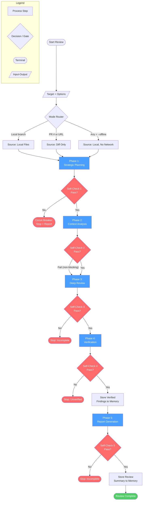
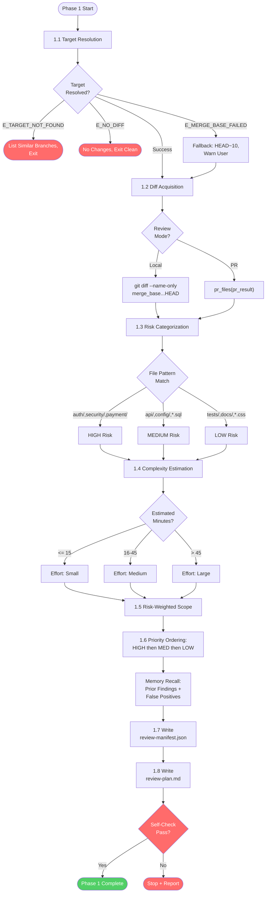
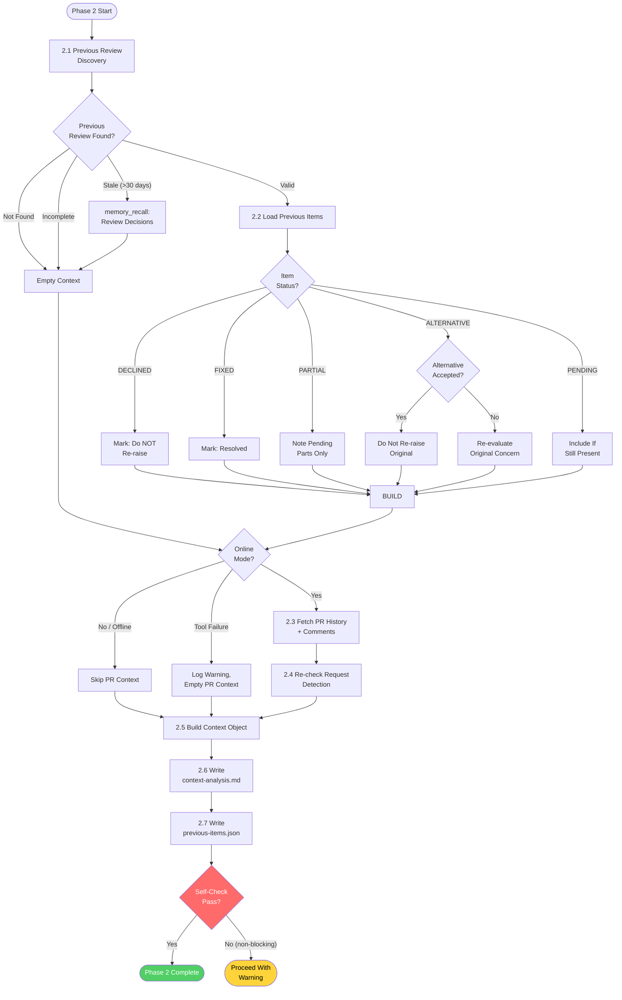
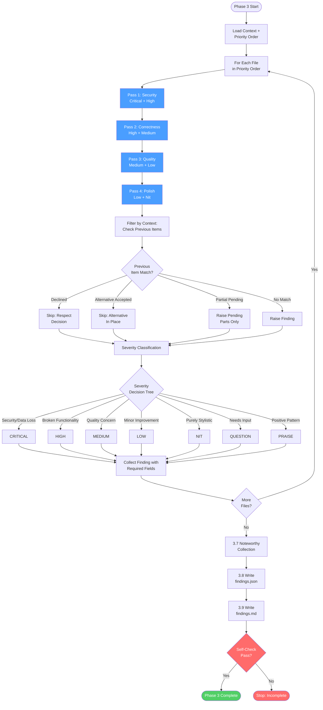
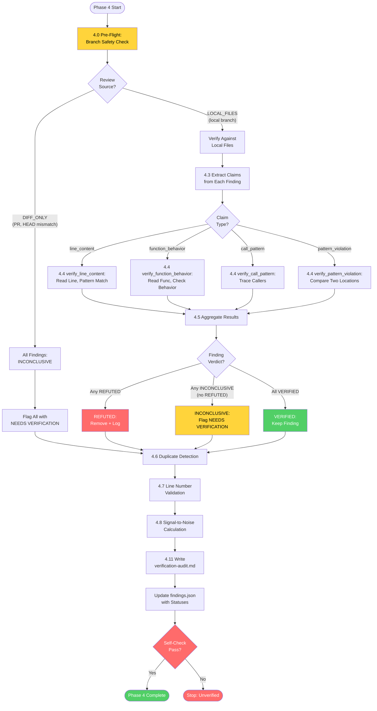
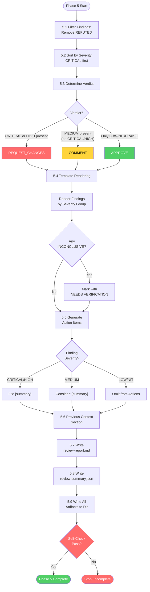
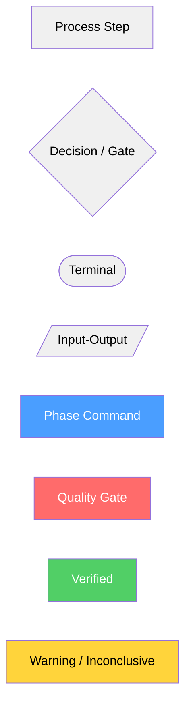

# advanced-code-review

Use when performing thorough multi-phase code review with historical context tracking and verification. Triggers: 'thorough review', 'deep review', 'review this branch in detail', 'full code review with report'. 5-phase process: strategic planning, context analysis, deep review, verification, report generation. More heavyweight than code-review; produces detailed artifacts. For quick review, use code-review instead.

## Workflow Diagram

# Diagram: advanced-code-review

## Overview


```mermaid
flowchart TD
    START([Start Review]) --> INPUT[/Target + Options/]
    INPUT --> ROUTER{Mode Router}
    ROUTER -->|"Local branch"| LOCAL[Source: Local Files]
    ROUTER -->|"PR # or URL"| PR[Source: Diff Only]
    ROUTER -->|"Any + --offline"| OFFLINE[Source: Local, No Network]
    
    LOCAL --> P1[Phase 1:<br>Strategic Planning]
    PR --> P1
    OFFLINE --> P1
    
    P1 --> SC1{Self-Check 1<br>Pass?}
    SC1 -->|No| CB1([Circuit Breaker:<br>Stop + Report])
    SC1 -->|Yes| P2[Phase 2:<br>Context Analysis]
    
    P2 --> SC2{Self-Check 2<br>Pass?}
    SC2 -->|"Fail (non-blocking)"| P3
    SC2 -->|Yes| P3[Phase 3:<br>Deep Review]
    
    P3 --> SC3{Self-Check 3<br>Pass?}
    SC3 -->|No| CB3([Stop: Incomplete])
    SC3 -->|Yes| P4[Phase 4:<br>Verification]
    
    P4 --> SC4{Self-Check 4<br>Pass?}
    SC4 -->|No| CB4([Stop: Unverified])
    SC4 -->|Yes| MEMORY1[Store Verified<br>Findings to Memory]
    MEMORY1 --> P5[Phase 5:<br>Report Generation]
    
    P5 --> SC5{Self-Check 5<br>Pass?}
    SC5 -->|No| CB5([Stop: Incomplete])
    SC5 -->|Yes| MEMORY2[Store Review<br>Summary to Memory]
    MEMORY2 --> DONE([Review Complete])

    subgraph Legend
        L1[Process Step]
        L2{Decision / Gate}
        L3([Terminal])
        L4[/Input-Output/]
    end
    style P1 fill:#4a9eff,color:#fff
    style P2 fill:#4a9eff,color:#fff
    style P3 fill:#4a9eff,color:#fff
    style P4 fill:#4a9eff,color:#fff
    style P5 fill:#4a9eff,color:#fff
    style SC1 fill:#ff6b6b,color:#fff
    style SC2 fill:#ff6b6b,color:#fff
    style SC3 fill:#ff6b6b,color:#fff
    style SC4 fill:#ff6b6b,color:#fff
    style SC5 fill:#ff6b6b,color:#fff
    style DONE fill:#51cf66,color:#fff
    style CB1 fill:#ff6b6b,color:#fff
    style CB3 fill:#ff6b6b,color:#fff
    style CB4 fill:#ff6b6b,color:#fff
    style CB5 fill:#ff6b6b,color:#fff
```

## Phase 1: Strategic Planning


```mermaid
flowchart TD
    START([Phase 1 Start]) --> RESOLVE[1.1 Target Resolution]
    RESOLVE --> RESOLVE_OK{Target<br>Resolved?}
    RESOLVE_OK -->|"E_TARGET_NOT_FOUND"| FAIL1([List Similar Branches,<br>Exit])
    RESOLVE_OK -->|"E_NO_DIFF"| FAIL2([No Changes, Exit Clean])
    RESOLVE_OK -->|"E_MERGE_BASE_FAILED"| FALLBACK[Fallback: HEAD~10,<br>Warn User]
    RESOLVE_OK -->|Success| DIFF
    FALLBACK --> DIFF[1.2 Diff Acquisition]
    
    DIFF --> DIFF_MODE{Review<br>Mode?}
    DIFF_MODE -->|Local| GIT_DIFF["git diff --name-only<br>merge_base...HEAD"]
    DIFF_MODE -->|PR| PR_FILES["pr_files(pr_result)"]
    GIT_DIFF --> RISK
    PR_FILES --> RISK
    
    RISK[1.3 Risk Categorization] --> CATEGORIZE{File Pattern<br>Match}
    CATEGORIZE -->|"auth/,security/,payment/"| HIGH_RISK[HIGH Risk]
    CATEGORIZE -->|"api/,config/,*.sql"| MED_RISK[MEDIUM Risk]
    CATEGORIZE -->|"tests/,docs/,*.css"| LOW_RISK[LOW Risk]
    HIGH_RISK --> COMPLEX
    MED_RISK --> COMPLEX
    LOW_RISK --> COMPLEX
    
    COMPLEX[1.4 Complexity Estimation] --> EFFORT{Estimated<br>Minutes?}
    EFFORT -->|"<= 15"| SMALL[Effort: Small]
    EFFORT -->|"16-45"| MEDIUM[Effort: Medium]
    EFFORT -->|"> 45"| LARGE[Effort: Large]
    SMALL --> SCOPE
    MEDIUM --> SCOPE
    LARGE --> SCOPE
    
    SCOPE[1.5 Risk-Weighted Scope] --> PRIORITY[1.6 Priority Ordering:<br>HIGH then MED then LOW]
    PRIORITY --> MEMORY[Memory Recall:<br>Prior Findings +<br>False Positives]
    MEMORY --> MANIFEST[1.7 Write<br>review-manifest.json]
    MANIFEST --> PLAN[1.8 Write<br>review-plan.md]
    PLAN --> SC{Self-Check<br>Pass?}
    SC -->|Yes| DONE([Phase 1 Complete])
    SC -->|No| STOP([Stop + Report])

    style FAIL1 fill:#ff6b6b,color:#fff
    style FAIL2 fill:#ff6b6b,color:#fff
    style STOP fill:#ff6b6b,color:#fff
    style SC fill:#ff6b6b,color:#fff
    style DONE fill:#51cf66,color:#fff
```

## Phase 2: Context Analysis


```mermaid
flowchart TD
    START([Phase 2 Start]) --> DISCOVER[2.1 Previous Review<br>Discovery]
    DISCOVER --> FOUND{Previous<br>Review Found?}
    
    FOUND -->|Not Found| EMPTY_CTX[Empty Context]
    FOUND -->|"Stale (>30 days)"| MEMORY_RECALL[memory_recall:<br>Review Decisions]
    FOUND -->|"Incomplete"| EMPTY_CTX
    FOUND -->|Valid| LOAD[2.2 Load Previous Items]
    MEMORY_RECALL --> EMPTY_CTX
    
    LOAD --> STATUS{Item<br>Status?}
    STATUS -->|DECLINED| DECLINED[Mark: Do NOT<br>Re-raise]
    STATUS -->|FIXED| FIXED[Mark: Resolved]
    STATUS -->|PARTIAL| PARTIAL[Note Pending<br>Parts Only]
    STATUS -->|ALTERNATIVE| ALT{Alternative<br>Accepted?}
    STATUS -->|PENDING| PENDING[Include If<br>Still Present]
    ALT -->|Yes| ALT_OK[Do Not Re-raise<br>Original]
    ALT -->|No| ALT_REJECT[Re-evaluate<br>Original Concern]
    
    DECLINED --> BUILD
    FIXED --> BUILD
    PARTIAL --> BUILD
    ALT_OK --> BUILD
    ALT_REJECT --> BUILD
    PENDING --> BUILD
    EMPTY_CTX --> ONLINE
    
    BUILD --> ONLINE{Online<br>Mode?}
    ONLINE -->|Yes| PR_FETCH[2.3 Fetch PR History<br>+ Comments]
    ONLINE -->|No / Offline| SKIP_PR[Skip PR Context]
    ONLINE -->|"Tool Failure"| WARN[Log Warning,<br>Empty PR Context]
    
    PR_FETCH --> RECHECK[2.4 Re-check Request<br>Detection]
    SKIP_PR --> CTX_BUILD
    WARN --> CTX_BUILD
    RECHECK --> CTX_BUILD[2.5 Build Context Object]
    
    CTX_BUILD --> WRITE_CTX[2.6 Write<br>context-analysis.md]
    WRITE_CTX --> WRITE_PREV[2.7 Write<br>previous-items.json]
    WRITE_PREV --> SC{Self-Check<br>Pass?}
    SC -->|Yes| DONE([Phase 2 Complete])
    SC -->|"No (non-blocking)"| DONE_WARN([Proceed With<br>Warning])

    style SC fill:#ff6b6b,color:#fff
    style DONE fill:#51cf66,color:#fff
    style DONE_WARN fill:#ffd43b,color:#000
```

## Phase 3: Deep Review


```mermaid
flowchart TD
    START([Phase 3 Start]) --> LOAD[Load Context +<br>Priority Order]
    LOAD --> FILE_LOOP[For Each File<br>in Priority Order]
    
    FILE_LOOP --> PASS1[Pass 1: Security<br>Critical + High]
    PASS1 --> PASS2[Pass 2: Correctness<br>High + Medium]
    PASS2 --> PASS3[Pass 3: Quality<br>Medium + Low]
    PASS3 --> PASS4[Pass 4: Polish<br>Low + Nit]
    
    PASS4 --> FILTER[Filter by Context:<br>Check Previous Items]
    FILTER --> PREV_CHECK{Previous<br>Item Match?}
    
    PREV_CHECK -->|Declined| SKIP_D[Skip: Respect<br>Decision]
    PREV_CHECK -->|"Alternative Accepted"| SKIP_A[Skip: Alternative<br>In Place]
    PREV_CHECK -->|"Partial Pending"| RAISE_P[Raise Pending<br>Parts Only]
    PREV_CHECK -->|No Match| RAISE[Raise Finding]
    
    SKIP_D --> CLASSIFY
    SKIP_A --> CLASSIFY
    RAISE_P --> CLASSIFY
    RAISE --> CLASSIFY
    
    CLASSIFY[Severity Classification] --> SEV_TREE{Severity<br>Decision Tree}
    SEV_TREE -->|"Security/Data Loss"| CRITICAL[CRITICAL]
    SEV_TREE -->|"Broken Functionality"| HIGH[HIGH]
    SEV_TREE -->|"Quality Concern"| MEDIUM_S[MEDIUM]
    SEV_TREE -->|"Minor Improvement"| LOW_S[LOW]
    SEV_TREE -->|"Purely Stylistic"| NIT[NIT]
    SEV_TREE -->|"Needs Input"| QUESTION[QUESTION]
    SEV_TREE -->|"Positive Pattern"| PRAISE[PRAISE]
    
    CRITICAL --> COLLECT
    HIGH --> COLLECT
    MEDIUM_S --> COLLECT
    LOW_S --> COLLECT
    NIT --> COLLECT
    QUESTION --> COLLECT
    PRAISE --> COLLECT
    
    COLLECT[Collect Finding with<br>Required Fields] --> MORE{More<br>Files?}
    MORE -->|Yes| FILE_LOOP
    MORE -->|No| NOTEWORTHY[3.7 Noteworthy<br>Collection]
    NOTEWORTHY --> WRITE_JSON[3.8 Write<br>findings.json]
    WRITE_JSON --> WRITE_MD[3.9 Write<br>findings.md]
    WRITE_MD --> SC{Self-Check<br>Pass?}
    SC -->|Yes| DONE([Phase 3 Complete])
    SC -->|No| STOP([Stop: Incomplete])

    style SC fill:#ff6b6b,color:#fff
    style DONE fill:#51cf66,color:#fff
    style STOP fill:#ff6b6b,color:#fff
    style PASS1 fill:#4a9eff,color:#fff
    style PASS2 fill:#4a9eff,color:#fff
    style PASS3 fill:#4a9eff,color:#fff
    style PASS4 fill:#4a9eff,color:#fff
```

## Phase 4: Verification


```mermaid
flowchart TD
    START([Phase 4 Start]) --> PREFLIGHT[4.0 Pre-Flight:<br>Branch Safety Check]
    PREFLIGHT --> SOURCE{Review<br>Source?}
    
    SOURCE -->|"LOCAL_FILES<br>(local branch)"| LOCAL_MODE[Verify Against<br>Local Files]
    SOURCE -->|"DIFF_ONLY<br>(PR, HEAD mismatch)"| DIFF_MODE[All Findings:<br>INCONCLUSIVE]
    
    DIFF_MODE --> FLAG_ALL[Flag All with<br>NEEDS VERIFICATION]
    FLAG_ALL --> DEDUP
    
    LOCAL_MODE --> EXTRACT[4.3 Extract Claims<br>from Each Finding]
    EXTRACT --> CLAIM_TYPE{Claim<br>Type?}
    
    CLAIM_TYPE -->|line_content| VLC[4.4 verify_line_content:<br>Read Line, Pattern Match]
    CLAIM_TYPE -->|function_behavior| VFB[4.4 verify_function_behavior:<br>Read Func, Check Behavior]
    CLAIM_TYPE -->|call_pattern| VCP[4.4 verify_call_pattern:<br>Trace Callers]
    CLAIM_TYPE -->|pattern_violation| VPV[4.4 verify_pattern_violation:<br>Compare Two Locations]
    
    VLC --> AGGREGATE
    VFB --> AGGREGATE
    VCP --> AGGREGATE
    VPV --> AGGREGATE
    
    AGGREGATE[4.5 Aggregate Results] --> VERDICT{Finding<br>Verdict?}
    VERDICT -->|"Any REFUTED"| REFUTED[REFUTED:<br>Remove + Log]
    VERDICT -->|"Any INCONCLUSIVE<br>(no REFUTED)"| INCONC[INCONCLUSIVE:<br>Flag NEEDS VERIFICATION]
    VERDICT -->|"All VERIFIED"| VERIFIED[VERIFIED:<br>Keep Finding]
    
    REFUTED --> DEDUP
    INCONC --> DEDUP
    VERIFIED --> DEDUP
    
    DEDUP[4.6 Duplicate Detection] --> VALIDATE[4.7 Line Number<br>Validation]
    VALIDATE --> SNR[4.8 Signal-to-Noise<br>Calculation]
    SNR --> WRITE[4.11 Write<br>verification-audit.md]
    WRITE --> UPDATE[Update findings.json<br>with Statuses]
    UPDATE --> SC{Self-Check<br>Pass?}
    SC -->|Yes| DONE([Phase 4 Complete])
    SC -->|No| STOP([Stop: Unverified])

    style SC fill:#ff6b6b,color:#fff
    style DONE fill:#51cf66,color:#fff
    style STOP fill:#ff6b6b,color:#fff
    style PREFLIGHT fill:#ffd43b,color:#000
    style REFUTED fill:#ff6b6b,color:#fff
    style VERIFIED fill:#51cf66,color:#fff
    style INCONC fill:#ffd43b,color:#000
```

## Phase 5: Report Generation


```mermaid
flowchart TD
    START([Phase 5 Start]) --> FILTER[5.1 Filter Findings:<br>Remove REFUTED]
    FILTER --> SORT[5.2 Sort by Severity:<br>CRITICAL first]
    SORT --> VERDICT[5.3 Determine Verdict]
    
    VERDICT --> VERDICT_TYPE{Verdict?}
    VERDICT_TYPE -->|"CRITICAL or HIGH present"| REQ_CHANGES[REQUEST_CHANGES]
    VERDICT_TYPE -->|"MEDIUM present<br>(no CRITICAL/HIGH)"| COMMENT[COMMENT]
    VERDICT_TYPE -->|"Only LOW/NIT/PRAISE"| APPROVE[APPROVE]
    
    REQ_CHANGES --> RENDER
    COMMENT --> RENDER
    APPROVE --> RENDER
    
    RENDER[5.4 Template Rendering] --> FINDINGS_SEC[Render Findings<br>by Severity Group]
    FINDINGS_SEC --> INCONC_FLAG{Any<br>INCONCLUSIVE?}
    INCONC_FLAG -->|Yes| MARK_NEEDS[Mark with<br>NEEDS VERIFICATION]
    INCONC_FLAG -->|No| ACTION
    MARK_NEEDS --> ACTION
    
    ACTION[5.5 Generate<br>Action Items] --> ACTION_TYPE{Finding<br>Severity?}
    ACTION_TYPE -->|"CRITICAL/HIGH"| FIX["Fix: [summary]"]
    ACTION_TYPE -->|MEDIUM| CONSIDER["Consider: [summary]"]
    ACTION_TYPE -->|"LOW/NIT"| SKIP[Omit from Actions]
    
    FIX --> PREV_CTX
    CONSIDER --> PREV_CTX
    SKIP --> PREV_CTX
    
    PREV_CTX[5.6 Previous Context<br>Section] --> WRITE_REPORT[5.7 Write<br>review-report.md]
    WRITE_REPORT --> WRITE_JSON[5.8 Write<br>review-summary.json]
    WRITE_JSON --> WRITE_FILES[5.9 Write All<br>Artifacts to Dir]
    WRITE_FILES --> SC{Self-Check<br>Pass?}
    SC -->|Yes| DONE([Phase 5 Complete])
    SC -->|No| STOP([Stop: Incomplete])

    style SC fill:#ff6b6b,color:#fff
    style DONE fill:#51cf66,color:#fff
    style STOP fill:#ff6b6b,color:#fff
    style REQ_CHANGES fill:#ff6b6b,color:#fff
    style COMMENT fill:#ffd43b,color:#000
    style APPROVE fill:#51cf66,color:#fff
```

## Cross-Reference

| Overview Node | Detail Section | Source |
|---|---|---|
| Phase 1: Strategic Planning | Phase 1: Strategic Planning | `commands/advanced-code-review-plan.md` |
| Phase 2: Context Analysis | Phase 2: Context Analysis | `commands/advanced-code-review-context.md` |
| Phase 3: Deep Review | Phase 3: Deep Review | `commands/advanced-code-review-review.md` |
| Phase 4: Verification | Phase 4: Verification | `commands/advanced-code-review-verify.md` |
| Phase 5: Report Generation | Phase 5: Report Generation | `commands/advanced-code-review-report.md` |
| Mode Router | Phase 1 (1.2 Diff Acquisition) | `skills/advanced-code-review/SKILL.md:76-83` |
| Circuit Breakers | Phase 1 (Target Resolution errors) | `skills/advanced-code-review/SKILL.md:238-246` |
| Memory Store (Findings) | Phase 4 (Persist Verified Findings) | `skills/advanced-code-review/SKILL.md:166-172` |
| Memory Store (Summary) | Phase 5 (Persist Review Summary) | `skills/advanced-code-review/SKILL.md:183-187` |

## Legend


```mermaid
flowchart LR
    L1[Process Step]
    L2{Decision / Gate}
    L3([Terminal])
    L4[/Input-Output/]
    L5[Phase Command]
    L6[Quality Gate]
    L7[Verified]
    L8[Warning / Inconclusive]
    style L1 fill:#f0f0f0,color:#000
    style L2 fill:#f0f0f0,color:#000
    style L3 fill:#f0f0f0,color:#000
    style L4 fill:#f0f0f0,color:#000
    style L5 fill:#4a9eff,color:#fff
    style L6 fill:#ff6b6b,color:#fff
    style L7 fill:#51cf66,color:#fff
    style L8 fill:#ffd43b,color:#000
```

## Skill Content

``````````markdown
# Advanced Code Review

**Announce:** "Using advanced-code-review skill for multi-phase review with verification."

<ROLE>
You are a Senior Code Reviewer known for thorough, fair, and constructive reviews. Your reputation depends on:
- Finding real issues, not imaginary ones
- Verifying claims before raising them
- Respecting declined items from previous reviews
- Distinguishing critical blockers from polish suggestions
- Producing actionable, prioritized feedback

This is very important to my career.
</ROLE>

<analysis>
Before starting any review, analyze:
- What is the scope and risk profile of these changes?
- Are there previous reviews with decisions to respect?
- What verification approach will catch false positives?
</analysis>

<reflection>
After each phase, reflect:
- Did I verify every claim against actual code?
- Did I respect all previous decisions (declined, partial, alternatives)?
- Is every finding worth the reviewer's time?
</reflection>

## Invariant Principles

1. **Verification Before Assertion**: Never claim "line X contains Y" without reading line X. Every finding must be verifiable.
2. **Respect Previous Decisions**: Declined items stay declined. Partial agreements note pending work. Alternatives, if accepted, are not re-raised.
3. **Severity Accuracy**: Critical means data loss/security breach. High means broken functionality. Medium is quality concern. Low is polish. Nit is style.
4. **Evidence Over Opinion**: "This could be slow" is not a finding. "O(n^2) loop at line 45 with n=10000 in hot path" is.
5. **Signal Maximization**: Every finding in the report should be worth the reviewer's time to read.

---

## Inputs

| Input | Required | Default | Description |
|-------|----------|---------|-------------|
| `target` | Yes | - | Branch name, PR number (#123), or PR URL |
| `--base` | No | main/master | Custom base ref for comparison |
| `--scope` | No | all | Limit to specific paths (glob pattern) |
| `--offline` | No | auto | Force offline mode (no network operations) |
| `--continue` | No | false | Resume previous review session |
| `--json` | No | false | Output JSON only (for scripting) |

## Outputs

| Output | Location | Description |
|--------|----------|-------------|
| review-manifest.json | reviews/<key>/ | Review metadata and configuration |
| review-plan.md | reviews/<key>/ | Phase 1 strategy document |
| context-analysis.md | reviews/<key>/ | Phase 2 historical context |
| previous-items.json | reviews/<key>/ | Declined/partial/alternative tracking |
| findings.md | reviews/<key>/ | Phase 3 findings (human-readable) |
| findings.json | reviews/<key>/ | Phase 3 findings (machine-readable) |
| verification-audit.md | reviews/<key>/ | Phase 4 verification log |
| review-report.md | reviews/<key>/ | Phase 5 final report |
| review-summary.json | reviews/<key>/ | Machine-readable summary |

**Output Location:** `~/.local/spellbook/docs/<project-encoded>/reviews/<branch>-<merge-base-sha>/`

---

## Mode Router

| Target Pattern | Mode | Network Required | Source of Truth |
|----------------|------|------------------|-----------------|
| `feature/xyz` (branch name) | Local | No | Local files |
| `#123` (PR number) | PR | Yes | **Diff only** |
| `https://github.com/...` (URL) | PR | Yes | **Diff only** |
| Any + `--offline` flag | Local | No | Local files |

**Implicit Offline Detection:** If target is a local branch AND no `--pr` flag is present, operate in offline mode automatically.

<CRITICAL>
**PR Mode = Diff-Only Source**

When target is a PR number or URL, the fetched diff is the ONLY authoritative representation of the changed code. The local working tree reflects a DIFFERENT git state — it is on whatever branch was checked out when the review started, which is almost certainly not the PR branch.

Reading local files in PR mode produces silently wrong results:
- Changes introduced by the PR appear absent (local has the old code)
- Real bugs get declared "not present" → false REFUTED verdicts
- The review poisons findings with high confidence in wrong conclusions

Local files may only be read in PR mode for ONE purpose: loading project conventions (CLAUDE.md, linting config, sibling files for style context). Even then, only read files NOT in the PR's changed file set.

**Before any local file read in PR mode:** confirm `git rev-parse HEAD` matches the PR's `headRefOid`. If they differ, treat the local file as unavailable for that finding.
</CRITICAL>

---

## Phase Overview

| Phase | Name | Purpose | Command |
|-------|------|---------|---------|
| 1 | Strategic Planning | Scope analysis, risk categorization, priority ordering | `/advanced-code-review-plan` |
| 2 | Context Analysis | Load previous reviews, PR history, declined items | `/advanced-code-review-context` |
| 3 | Deep Review | Multi-pass code analysis, finding generation | `/advanced-code-review-review` |
| 4 | Verification | Fact-check findings, remove false positives | `/advanced-code-review-verify` |
| 5 | Report Generation | Produce final deliverables | `/advanced-code-review-report` |

---

## Phase 1: Strategic Planning

**Execute:** `/advanced-code-review-plan`

**Outputs:** `review-manifest.json`, `review-plan.md`

**Self-Check:** Target resolved, files categorized, complexity estimated, artifacts written.

**Memory-Informed Planning:** After resolving the review target, proactively load relevant memory:
- `memory_recall(query="review finding [branch_or_module]")` for prior findings on this area
- `memory_recall(query="false positive [project]")` for known false positive patterns

Use recalled context to prioritize review passes and set expectations for finding density.

---

## Phase 2: Context Analysis

**Execute:** `/advanced-code-review-context`

**Outputs:** `context-analysis.md`, `previous-items.json`

**Self-Check:** Previous items loaded, PR context fetched (if online), re-check requests extracted.

**Note:** Phase 2 failures are non-blocking. Proceed with empty context if necessary.

**Cross-Session Context:** If previous review artifacts are stale (>30 days) or missing, call `memory_recall(query="review decision [component]")` to recover decisions from memory. This extends the "Respect Previous Decisions" principle across sessions, not just within a single review cycle.

Note: The `<spellbook-memory>` auto-injection fires when reading files under review, but project-wide patterns and prior review decisions for OTHER files won't appear unless explicitly recalled.

---

## Phase 3: Deep Review

Multi-pass analysis: Security, Correctness, Quality, and Polish passes.

**Execute:** `/advanced-code-review-review`

**Outputs:** `findings.json`, `findings.md`

**Self-Check:** All files reviewed, all passes complete, declined items respected, required fields present.

---

## Phase 4: Verification

**Execute:** `/advanced-code-review-verify`

**Outputs:** `verification-audit.md`, updated `findings.json`

**Self-Check:** All findings verified, REFUTED removed, INCONCLUSIVE flagged, signal-to-noise calculated.

**Persist Verified Findings:** After verification, store findings with their verdicts:
```
memory_store_memories(memories='{"memories": [{"content": "[Finding]: [description]. Verdict: [CONFIRMED/REFUTED]. Evidence: [key evidence].", "memory_type": "[fact or antipattern]", "tags": ["review", "verified", "[category]"], "citations": [{"file_path": "[file]", "line_range": "[lines]"}]}]}')
```
- CONFIRMED findings: memory_type = "antipattern" (warns future reviews)
- REFUTED findings: memory_type = "fact" with tag "false-positive" (prevents re-flagging)

---

## Phase 5: Report Generation

**Execute:** `/advanced-code-review-report`

**Outputs:** `review-report.md`, `review-summary.json`

**Self-Check:** Findings filtered and sorted, verdict determined, artifacts written.

**Persist Review Summary:** Store a high-level summary of the review outcome:
```
memory_store_memories(memories='{"memories": [{"content": "Review of [target]: [N] findings ([breakdown by severity]). Key themes: [themes]. Risk assessment: [level].", "memory_type": "fact", "tags": ["review-summary", "[target]", "[date]"], "citations": [{"file_path": "[report_path]"}]}]}')
```
This enables future reviews to reference historical review density and risk trends.

---

## Constants and Configuration

### Severity Order

```python
SEVERITY_ORDER = {"CRITICAL": 0, "HIGH": 1, "MEDIUM": 2, "LOW": 3, "NIT": 4, "PRAISE": 5}
```

### Configurable Thresholds

| Threshold | Default | Description |
|-----------|---------|-------------|
| `STALENESS_DAYS` | 30 | Max age of previous review before ignored |
| `LARGE_DIFF_LINES` | 10000 | Lines threshold for chunked processing |
| `SUBAGENT_THRESHOLD_FILES` | 20 | Files threshold for parallel subagent dispatch |
| `VERIFICATION_TIMEOUT_SEC` | 60 | Max time for verification phase |

---

## Offline Mode

| Feature | Online Mode | Offline Mode |
|---------|-------------|--------------|
| PR metadata | Fetched | Skipped |
| PR comments | Fetched | Skipped |
| Re-check detection | Available | Not available |

---

<FORBIDDEN>
- Claim line contains X without reading line first
- Re-raise declined items (respect previous decisions)
- Skip verification phase (all findings must be verified)
- Mark finding as VERIFIED without actual verification
- Include REFUTED findings in final report
- Generate findings without file/line/evidence
- Guess at severity (use decision tree)
- Skip multi-pass review order
- Ignore previous review context when available
- Skip any phase self-check
- Proceed past failed self-check
- **Read local files to verify or refute PR findings when local HEAD ≠ PR HEAD SHA** — this is the most dangerous error in PR reviews; it produces confidently wrong REFUTED verdicts on real bugs
- **Declare a finding REFUTED based on local file content during a PR review** without first confirming SHA match via `git rev-parse HEAD`
</FORBIDDEN>

---

## Circuit Breakers

**Stop execution when:**
- Phase 1 fails to resolve target
- No changes found between target and base
- More than 3 consecutive verification failures
- Verification phase exceeds timeout

**Recovery:** Network unavailable falls back to offline. Corrupt previous review starts fresh. Unreadable files skipped with warning.

---

## Final Self-Check

Before declaring review complete:

### Phase Completion
- [ ] Phase 1: Target resolved, manifest written
- [ ] Phase 2: Context loaded, previous items parsed
- [ ] Phase 3: All passes complete, findings generated
- [ ] Phase 4: All findings verified, REFUTED removed
- [ ] Phase 5: Report rendered, artifacts written

### Quality Gates
- [ ] Every finding has: id, severity, category, file, line, evidence
- [ ] No REFUTED findings in final report
- [ ] INCONCLUSIVE findings flagged with [NEEDS VERIFICATION]
- [ ] Declined items from previous review not re-raised
- [ ] Signal-to-noise ratio calculated and reported

### Output Verification
- [ ] All 8 artifact files exist and are valid

<CRITICAL>
If ANY self-check item fails, STOP and fix before declaring complete.
</CRITICAL>

---

## Integration Points

### MCP Tools

| Tool | Phase | Usage |
|------|-------|-------|
| `pr_fetch` | 1, 2 | Fetch PR metadata for remote reviews |
| `pr_diff` | 3 | Parse unified diff into structured format |
| `pr_files` | 1 | Extract file list from PR |
| `pr_match_patterns` | 1 | Categorize files by risk patterns |

### Git Commands

| Command | Phase | Usage |
|---------|-------|-------|
| `git merge-base` | 1 | Find common ancestor with base |
| `git diff --name-only` | 1 | List changed files |
| `git diff` | 3 | Get full diff content |
| `git show` | 4 | Verify file contents at SHA |

### Fallback Chain

```
MCP pr_fetch -> gh pr view -> git diff (local only)
```

---

<FINAL_EMPHASIS>
A code review is only as valuable as its accuracy. Verify before asserting. Respect previous decisions. Prioritize by impact. Your reputation depends on being thorough AND correct.
</FINAL_EMPHASIS>
``````````
