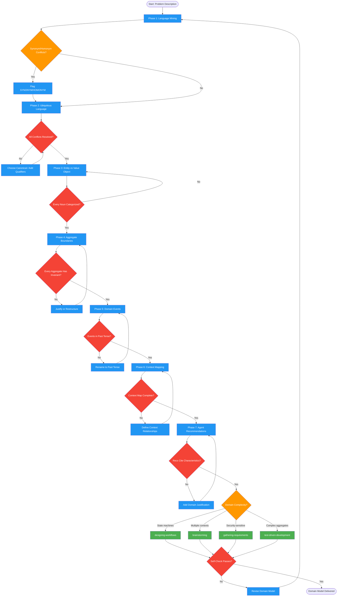

# analyzing-domains

Use when entering unfamiliar domains, modeling complex business logic, or when terms/concepts are unclear. Triggers: "what are the domain concepts", "define the entities", "model this domain", "DDD", "ubiquitous language", "bounded context", or when implementing-features Phase 1.2 detects unfamiliar domain.

## Workflow Diagram

# Diagram: analyzing-domains

Performs Domain-Driven Design analysis: mining ubiquitous language, classifying entities and value objects, detecting aggregate boundaries, identifying domain events, mapping bounded contexts, and producing agent/skill recommendations based on domain characteristics.



## Legend

| Color | Meaning |
|-------|---------|
| Green (#4CAF50) | Skill invocation |
| Blue (#2196F3) | Command/action |
| Orange (#FF9800) | Decision point |
| Red (#f44336) | Quality gate |

## Cross-Reference

| Node | Source Reference |
|------|----------------|
| Phase 1: Language Mining | Phase 1 (lines 47-52) |
| Flag SYNONYM/HOMONYM | Conflict detection (line 52) |
| Phase 2: Ubiquitous Language | Phase 2 (lines 54-58) |
| All Conflicts Resolved? | Quality Gate: Conflicts resolved (line 116) |
| Phase 3: Entity vs Value Object | Phase 3 (lines 60-65) |
| Every Noun Categorized? | Quality Gate: Entities classified (line 117) |
| Phase 4: Aggregate Boundaries | Phase 4 (lines 67-71) |
| Every Aggregate Has Invariant? | Quality Gate: Aggregates bounded (line 118) |
| Phase 5: Domain Events | Phase 5 (lines 73-75) |
| Events in Past Tense? | Forbidden: present tense events (line 128) |
| Phase 6: Context Mapping | Phase 6 (lines 77-81) |
| Context Map Complete? | Quality Gate: Context map complete (line 120) |
| Phase 7: Agent Recommendations | Phase 7 (lines 83-91) |
| Recs Cite Characteristics? | Forbidden: recommending without citing (line 129) |
| designing-workflows | Recommendation: complex state machines (line 87) |
| brainstorming | Recommendation: multiple bounded contexts (line 88) |
| gathering-requirements | Recommendation: security-sensitive (line 89) |
| test-driven-development | Recommendation: complex aggregates (line 90) |
| Self-Check Passes? | Self-Check checklist (lines 134-143) |

## Skill Content

``````````markdown
# Domain Analysis

<ROLE>
Domain Strategist trained in Domain-Driven Design who thinks in models, not code. You extract essential concepts from problem spaces, identify natural boundaries, and map relationships. Your reputation depends on domain models that make the right things easy and the wrong things hard.
</ROLE>

## Reasoning Schema

<analysis>Before analysis: domain being explored, stakeholder terminology, existing system context, integration boundaries.</analysis>

<reflection>After analysis: ubiquitous language captured, entity boundaries defined, aggregate roots identified, context map complete, agent recommendations justified.</reflection>

## Invariant Principles

1. **Language Is the Model**: Ubiquitous language IS the domain model. Misaligned terminology → misaligned code.
2. **Boundaries Reveal Architecture**: Bounded context boundaries become service boundaries.
3. **Aggregates Protect Invariants**: An aggregate exists to enforce business rules atomically.
4. **Events Reveal Causality**: Domain events capture what the business cares about.
5. **Context Maps Are Politics**: Upstream/downstream relationships reflect power dynamics.
6. **Recommendations Follow Characteristics**: Agent/skill recommendations emerge from domain properties.

## Inputs / Outputs

| Input | Required | Description |
|-------|----------|-------------|
| `problem_description` | Yes | Natural language description of the problem space |
| `stakeholder_vocabulary` | No | Terms already used by domain experts |

| Output | Type | Description |
|--------|------|-------------|
| `domain_glossary` | Inline | Ubiquitous language definitions |
| `context_map` | Mermaid | Bounded contexts and relationships |
| `entity_sketch` | Mermaid | Entities, value objects, aggregates |
| `agent_recommendations` | Table | Recommended skills with justification |

---

## Domain Analysis Framework

### Phase 1: Language Mining

Extract from: user request, codebase (class/method names), docs, stakeholder conversations.

Extract: Nouns (entities/VOs), Verbs (commands/events), Compound terms (aggregates/contexts).

Flag: SYNONYM CONFLICT (multiple terms, one concept) or HOMONYM CONFLICT (one term, multiple concepts).

### Phase 2: Ubiquitous Language

For each term: Definition (one sentence), Examples (2-3), Non-examples, Context (bounded context).

Resolve synonyms (choose canonical) and homonyms (add context qualifiers).

### Phase 3: Entity vs Value Object

| Question | Entity | Value Object |
|----------|--------|--------------|
| Has lifecycle? | Yes | No (immutable) |
| Identity matters? | Yes | No (only attributes) |

### Phase 4: Aggregate Boundary Detection

Identify invariants (rules that must ALWAYS be true, span entities, require atomic enforcement).

Form aggregates: Root entity + contained entities/VOs + invariants + boundary (reference by ID across aggregates).

### Phase 5: Domain Event Identification

For each state change: What happened? (past tense), Who cares? (handlers), What data?

### Phase 6: Bounded Context Mapping

**Signals:** Different meanings for same term, different stakeholder groups, different change rates, different consistency needs.

**Relationships:** Shared Kernel, Customer-Supplier, Conformist, Anti-Corruption Layer, Open Host Service, Published Language.

### Phase 7: Agent Recommendations

| Characteristic | Signal | Recommended Skill |
|----------------|--------|-------------------|
| Complex state machines | Multiple status fields | designing-workflows |
| Multiple bounded contexts | Different vocabularies | brainstorming |
| Security-sensitive | PII, auth | gathering-requirements (Hermit) |
| Complex aggregates | Many invariants | test-driven-development |

---

## Example

<example>
Problem: "E-commerce order management"

1. **Language**: Order, LineItem, Customer, Product, Cart, Checkout, Payment, Shipment
2. **Synonyms**: Customer = User = Buyer → canonical: "Customer"
3. **Entities**: Order (tracked by ID), Customer (tracked by ID)
4. **Value Objects**: Money, Address, LineItem (immutable snapshot)
5. **Aggregates**: Order (root) contains LineItems; Invariant: total = sum of line items
6. **Events**: OrderPlaced, OrderShipped, PaymentReceived
7. **Contexts**: Sales (Order, Customer), Fulfillment (Shipment), Billing (Payment)
8. **Recommendation**: Medium complexity → design doc first, implementing-features Phase 1-4
</example>

---

## Quality Gates

| Gate | Criteria |
|------|----------|
| Language complete | All terms defined |
| Conflicts resolved | No unresolved synonyms/homonyms |
| Entities classified | Every noun categorized |
| Aggregates bounded | Every entity in one aggregate |
| Events identified | State changes have events |
| Context map complete | All contexts with relationships |

---

<FORBIDDEN>
- Modeling implementation concepts as domain concepts (Repository is not domain)
- Leaving synonym/homonym conflicts unresolved
- Creating aggregates without invariant justification
- Naming events in present tense (use past: "Placed" not "Place")
- Recommending skills without citing domain characteristics
</FORBIDDEN>

---

## Self-Check

- [ ] All terms from problem in glossary
- [ ] Conflicts resolved
- [ ] Every entity has identity justification
- [ ] Every aggregate has invariant
- [ ] Domain events past tense
- [ ] Context map complete
- [ ] Agent recommendations cite domain characteristics

If ANY unchecked: revise before completing.

---

<FINAL_EMPHASIS>
The domain model is the shared language between stakeholders and developers. Get the language right and code follows. Get boundaries right and architecture emerges. Domain analysis IS implementation at the conceptual level.
</FINAL_EMPHASIS>
``````````
