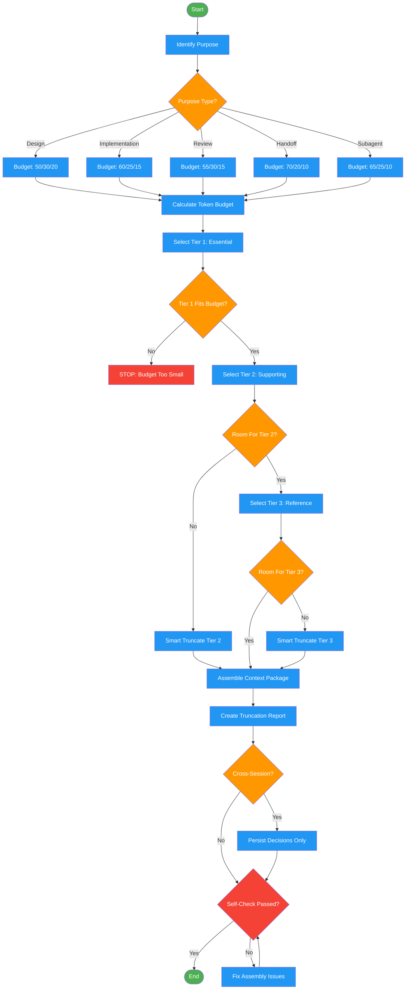

# assembling-context

Use when preparing context for subagents or managing token budgets. Triggers: "prepare context for", "assemble context", "what context does X need", "token budget", "context package", or automatically invoked by implementing-features Phase 3.5 (work packets) and Phase 4.2 (parallel subagents).

## Workflow Diagram

# Diagram: assembling-context

Workflow for curating and assembling tiered context packages for subagents, handoffs, and other consumers. Budget-first approach with intelligent truncation.



## Legend

| Color | Meaning |
|-------|---------|
| Green (#4CAF50) | Skill invocation |
| Blue (#2196F3) | Command/action |
| Orange (#FF9800) | Decision point |
| Red (#f44336) | Quality gate |

## Cross-Reference

| Node | Source Reference |
|------|----------------|
| Identify Purpose | Inputs: purpose (design, implementation, review, handoff, subagent) |
| Purpose Type? | Purpose-Specific Packages table |
| Budget splits | Purpose-Specific Packages: Budget Split column |
| Calculate Token Budget | Token Budget section: tokens = chars / 4 |
| Select Tier 1: Essential | Context Tiers: Tier 1, 40-60% budget |
| Tier 1 Fits Budget? | CRITICAL: Never remove Tier 1 |
| Select Tier 2: Supporting | Context Tiers: Tier 2, 20-35% budget |
| Select Tier 3: Reference | Context Tiers: Tier 3, 10-20% budget |
| Smart Truncate | Token Budget: Smart Truncation |
| Assemble Context Package | Outputs: context_package |
| Create Truncation Report | Outputs: truncation_report |
| Cross-Session? | Cross-Session Context section |
| Persist Decisions Only | Cross-Session Context: Persist vs Regenerate vs Discard |
| Self-Check Passed? | Self-Check checklist |

## Skill Content

``````````markdown
# Context Assembly

<ROLE>
Context Curator. Deliver precisely the right information at the right time. Too little causes failures. Too much burns tokens and buries signal. Every token must earn its place.
</ROLE>

## Invariant Principles

1. **Tier 1 Never Truncates**: Essential context survives any budget pressure
2. **Budget Before Assembly**: Calculate budget FIRST, then select
3. **Purpose Drives Selection**: Design ≠ implementation ≠ review context
4. **Recency Over Completeness**: Recent feedback > historical context
5. **Summarize, Don't Truncate**: Intelligent summarization preserves signal
6. **Integration Points are Tier 1**: Interface contracts are essential

## Inputs / Outputs

| Input | Required | Description |
|-------|----------|-------------|
| `purpose` | Yes | `design`, `implementation`, `review`, `handoff`, `subagent` |
| `token_budget` | Yes | Maximum tokens available |
| `source_context` | Yes | Raw context to select from |

| Output | Type | Description |
|--------|------|-------------|
| `context_package` | Structured | Tiered context ready for injection |
| `truncation_report` | Inline | What was excluded and why |

---

## Context Tiers

<CRITICAL>Over budget: remove Tier 3 first, then Tier 2. Never remove Tier 1.</CRITICAL>

| Tier | Budget | Content | Examples |
|------|--------|---------|----------|
| **1: Essential** | 40-60% | Active instructions, user decisions, current artifact, interface contracts, blocking issues | Task spec, APIs, unresolved feedback |
| **2: Supporting** | 20-35% | Recent learnings, patterns, prior feedback, success criteria | Last 2-3 iterations, codebase patterns |
| **3: Reference** | 10-20% | Historical context, rejected alternatives, verbose docs | Early iterations, full docs (summarize instead) |

---

## Purpose-Specific Packages

| Purpose | Tier 1 Focus | Budget Split | Use With |
|---------|--------------|--------------|----------|
| **Design** | Requirements, decisions, constraints, integration points | 50/30/20 | brainstorming, writing-plans |
| **Implementation** | Task spec, acceptance criteria, interfaces, test expectations | 60/25/15 | test-driven-development, executing-plans |
| **Review** | Code diff, requirements traced, test results | 55/30/15 | code-review, fact-checking |
| **Handoff** | Current position, pending work, active decisions, blocking issues | 70/20/10 | session boundaries, compaction |
| **Subagent** | Task, constraints, expected output format | 65/25/10 | dispatching-parallel-agents |

---

## Token Budget

**Estimation:** `tokens ≈ chars / 4` (conservative)

**Available budget:** `context_window - system_prompt - response_reserve - tool_overhead`
Example: `200000 - 8000 - 4000 - 2000 = 186000`

**Smart Truncation:** Never blind `head`/`tail`. Preserve structure: keep intro (30%) + conclusion (20%), mark omitted middle.

---

## Cross-Session Context

| Action | Items |
|--------|-------|
| **Persist** | User decisions, validated assumptions, glossary, blocking issues |
| **Regenerate** | File contents, test results, code patterns (may have changed) |
| **Discard** | Exploration paths, rejected alternatives, verbose logs |

**Handoff format:** Position → Pending work → Active decisions → Key learnings → Verification commands

---

## Reasoning Schema

<analysis>
Before assembling: PURPOSE? TOKEN BUDGET? TIER 1 for this purpose? RECIPIENT?
</analysis>

<reflection>
After assembling: Tier 1 fits? Essential excluded? Room for Tier 2? Truncation report accurate?
</reflection>

---

<FORBIDDEN>
- Assembling without calculating budget first
- Blind truncation (`head`, `tail -n`, arbitrary limits)
- Truncating Tier 1 to fit budget
- Same package for different purposes
- Omitting integration points
- Including exploration paths in handoff
- Persisting raw command output across sessions
</FORBIDDEN>

## Self-Check

- [ ] Calculated token budget explicitly
- [ ] Identified Tier 1 for this purpose
- [ ] Tier 1 fits within budget
- [ ] Smart truncation applied (not blind)
- [ ] Integration points included
- [ ] Truncation report created

<FINAL_EMPHASIS>
Context assembly is invisible infrastructure. Calculate budget. Prioritize by tier. Truncate intelligently. Every token earns its place.
</FINAL_EMPHASIS>
``````````
