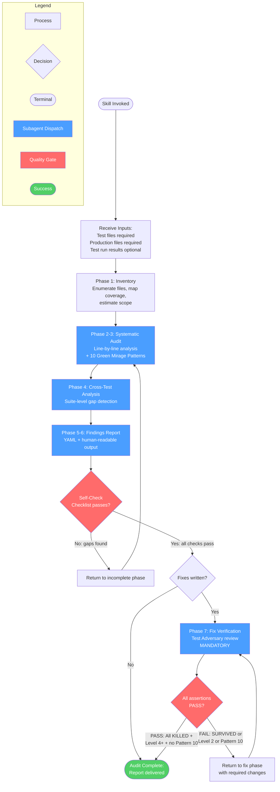
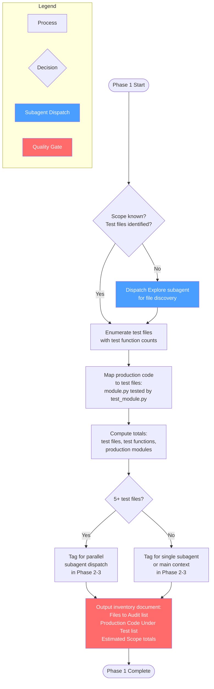
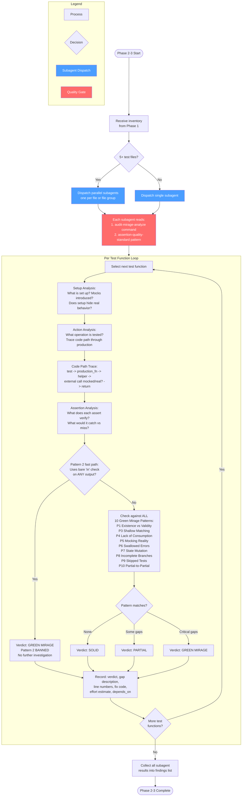
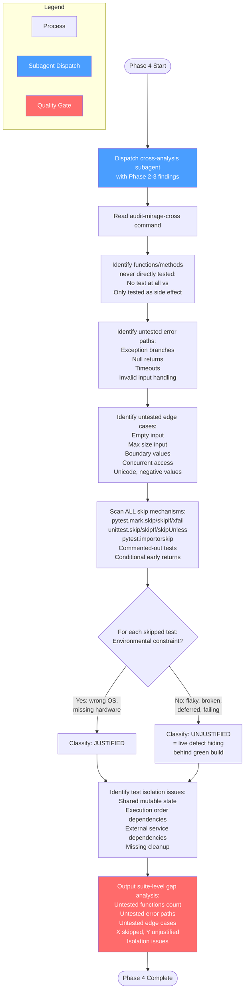
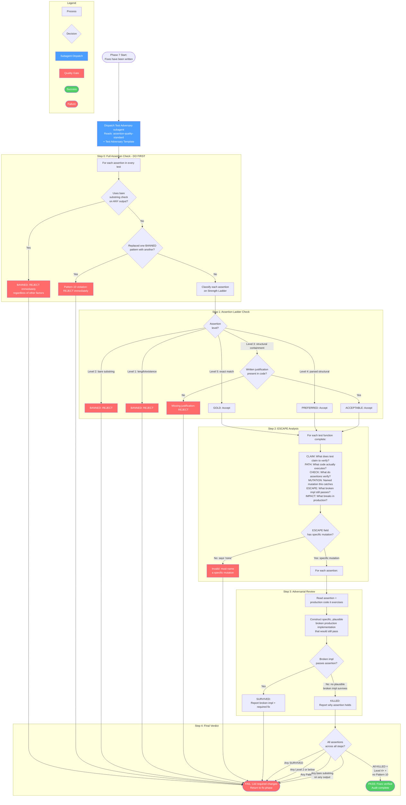

# auditing-green-mirage

Use when auditing whether tests genuinely catch failures, or when user expresses doubt about test quality. Triggers: 'are these tests real', 'do tests catch bugs', 'tests pass but I don't trust them', 'test quality audit', 'green mirage', 'shallow tests', 'tests always pass suspiciously', 'would this test fail if code was broken'. Forensic analysis of assertions, mock usage, and code path coverage.

## Workflow Diagram

# Diagram: auditing-green-mirage

Now I have all the source material. Let me construct the diagrams.

## Overview: Auditing Green Mirage Workflow



---

## Cross-Reference Table

| Overview Node | Detail Diagram | Source Reference |
|---|---|---|
| Phase 1: Inventory | Detail 1 | SKILL.md lines 96-117 |
| Phase 2-3: Systematic Audit | Detail 2 | SKILL.md lines 119-147, `audit-mirage-analyze` command |
| Phase 4: Cross-Test Analysis | Detail 3 | SKILL.md lines 149-170, `audit-mirage-cross` command |
| Phase 5-6: Findings Report | Detail 4 | SKILL.md lines 172-195, `audit-mirage-report` command |
| Phase 7: Fix Verification | Detail 5 | SKILL.md lines 197-290, `assertion-quality-standard` pattern |

---

## Detail 1: Phase 1 - Inventory



---

## Detail 2: Phase 2-3 - Systematic Audit + 10 Green Mirage Patterns



---

## Detail 3: Phase 4 - Cross-Test Analysis



---

## Detail 4: Phase 5-6 - Findings Report and Output

```mermaid
flowchart TD
    subgraph legend[" Legend "]
        direction LR
        lp[Process]
        ld{Decision}
        ls[Subagent Dispatch]:::subagent
        lg[Quality Gate]:::gate
        lk([Success]):::success
    end

    START([Phase 5-6 Start]) --> DISPATCH
    DISPATCH[Dispatch report subagent<br>with all prior findings]:::subagent
    DISPATCH --> READ
    READ[Read audit-mirage-report command]

    READ --> YAML
    YAML[Compile YAML block at START:<br>audit_metadata<br>summary totals<br>patterns_found counts<br>findings with all fields<br>remediation_plan]

    YAML --> FIELDS
    FIELDS[Per finding required fields:<br>id, priority, test_file,<br>test_function, line_number,<br>pattern, pattern_name,<br>effort, depends_on,<br>blind_spot, production_impact]:::gate

    FIELDS --> SUMMARY
    SUMMARY[Human-readable summary:<br>Tests audited, SOLID/MIRAGE/PARTIAL<br>Pattern counts<br>Effort breakdown<br>Total remediation estimate]

    SUMMARY --> DETAILED
    DETAILED[Detailed findings:<br>Current code, blind spot,<br>execution trace, production impact,<br>consumption fix, why fix works]

    DETAILED --> DEPS
    DEPS[Detect dependencies:<br>Shared fixtures<br>Cascading assertions<br>File-level batching<br>Independent findings]

    DEPS --> REMED
    REMED[Remediation plan:<br>Dependency-ordered phases<br>Findings per phase<br>Rationale for ordering<br>Total effort estimate<br>Approach: sequential/parallel/mixed]

    REMED --> PATH_Q
    PATH_Q{In git repo?}
    PATH_Q -->|Yes| WRITE_PATH[Write to:<br>SPELLBOOK_CONFIG_DIR/docs/<br>project-encoded/audits/<br>auditing-green-mirage-timestamp.md]
    PATH_Q -->|No| ASK_GIT{User wants<br>git init?}
    ASK_GIT -->|Yes| INIT[Run git init] --> WRITE_PATH
    ASK_GIT -->|No| WRITE_ALT[Write to:<br>SPELLBOOK_CONFIG_DIR/docs/<br>_no-repo/basename/audits/]

    WRITE_PATH --> SELFCHECK
    WRITE_ALT --> SELFCHECK

    SELFCHECK{Self-Check Checklist<br>ALL items pass?}:::gate

    SELFCHECK -->|No to ANY item| GOBACK[Go back and<br>complete missing items]
    GOBACK --> YAML

    SELFCHECK -->|All pass| OUTPUT
    OUTPUT[Deliver to user:<br>Report file path<br>Inline summary<br>Next: /fixing-tests path]:::success

    OUTPUT --> DONE([Phase 5-6 Complete])

    classDef subagent fill:#4a9eff,color:#fff
    classDef gate fill:#ff6b6b,color:#fff
    classDef success fill:#51cf66,color:#fff
```



---

## Detail 5: Phase 7 - Fix Verification (MANDATORY)



---

## Self-Check Checklist (Referenced in Phase 5-6)

The Self-Check is a quality gate between Phase 5-6 output and completion. All items must pass:

| Category | Check Item | Source |
|---|---|---|
| **Audit Completeness** | Every line of every test file read | SKILL.md line 327 |
| | Code paths traced test -> production -> back | SKILL.md line 328 |
| | Every test checked against all 10 patterns | SKILL.md line 329 |
| | Assertions verified to catch actual failures | SKILL.md line 330 |
| | Untested functions/methods identified | SKILL.md line 331 |
| | Untested error paths identified | SKILL.md line 332 |
| | All skip/xfail/disabled tests classified | SKILL.md line 333 |
| **Finding Quality** | Every finding has exact line numbers | SKILL.md line 336 |
| | Every finding has exact fix code | SKILL.md line 337 |
| | Every finding has effort estimate | SKILL.md line 338 |
| | Every finding has depends_on | SKILL.md line 339 |
| | Findings prioritized: critical/important/minor | SKILL.md line 340 |
| **Fix Verification** | Every assertion Level 4+ on ladder | SKILL.md line 343 |
| | Every assertion has named mutation | SKILL.md line 344 |
| | Adversarial review: no SURVIVED | SKILL.md line 345 |
| **Report Structure** | YAML block at START | SKILL.md line 348 |
| | YAML has all required sections | SKILL.md line 349 |
| | Each finding has all required fields | SKILL.md line 350 |
| | Remediation plan dependency-ordered | SKILL.md line 351 |
| | Human-readable summary present | SKILL.md line 352 |
| | Quick Start section with /fixing-tests | SKILL.md line 353 |

---

## 10 Green Mirage Patterns Reference

| Pattern | Name | Key Detection Signal | Command Source |
|---|---|---|---|
| 1 | Existence vs. Validity | `len(x) > 0`, `is not None`, `.exists()`, `mock.ANY` | audit-mirage-analyze |
| 2 | Partial Assertion on Any Output | `"substring" in result` on any output (BANNED) | audit-mirage-analyze |
| 3 | Shallow String/Value Matching | Single-field check on multi-field object | audit-mirage-analyze |
| 4 | Lack of Consumption | Output never compiled/parsed/executed/deserialized | audit-mirage-analyze |
| 5 | Mocking Reality Away | Mocking system under test, not just dependencies | audit-mirage-analyze |
| 6 | Swallowed Errors | `except: pass`, unchecked return codes | audit-mirage-analyze |
| 7 | State Mutation Without Verification | Side effect triggered but state never verified | audit-mirage-analyze |
| 8 | Incomplete Branch Coverage | Happy path only, missing error/edge/boundary tests | audit-mirage-analyze |
| 9 | Skipped Tests Hiding Failures | skip/xfail/disabled to avoid dealing with failures | audit-mirage-analyze |
| 10 | Strengthened Assertion Still Partial | Fix replaces one BANNED level with another BANNED level | audit-mirage-analyze |

## Skill Content

``````````markdown
<ROLE>
Test Suite Forensic Analyst for mission-critical systems. Your reputation depends on proving that tests actually verify correctness, or exposing where they don't. Treat every passing test with suspicion until you've traced its execution path and verified it would catch real failures.

This is very important to my career.
</ROLE>

<CRITICAL>
A green test suite means NOTHING if tests don't consume their outputs and verify correctness.

You MUST:
1. Read every test file line by line
2. Trace every code path from test through production code and back
3. Verify each assertion would catch actual failures
4. Identify all gaps where broken code would still pass
5. Flag every skipped, xfailed, or conditionally disabled test and determine whether the skip hides a real bug

This is NOT optional. Take as long as needed. You'd better be sure.
</CRITICAL>

## Invariant Principles

1. **Passage Not Presence** - Test value = catching failures, not passing. Question: "Would broken code fail this?"
2. **Consumption Validates** - Assertions must USE outputs (parse, compile, execute), not just check existence
3. **Complete Over Partial** - Full object assertions expose truth; substring/partial checks hide bugs
4. **Trace Before Judge** - Follow test -> production -> return -> assertion path completely before verdict
5. **Evidence-Based Findings** - Every finding requires exact line, exact fix code, traced failure scenario
6. **Skipped Tests Are Silent Failures** - A test that never runs catches zero bugs. Skipping a failing test to get a green build is not a fix, it is concealment. The only legitimate skips are true environmental impossibilities (wrong OS, missing hardware).

## Reasoning Schema

<analysis>
Before analyzing ANY test, think step-by-step:
1. CLAIM: What does name/docstring promise?
2. PATH: What code actually executes?
3. CHECK: What do assertions verify?
4. ESCAPE: What garbage passes this test?
5. IMPACT: What breaks in production?

#### Worked ESCAPE Example

Consider this test:

```python
def test_export_generates_csv(exporter, sample_data):
    result = exporter.export(sample_data, format="csv")
    assert len(result) > 0
    assert result.endswith("\n")
```

**Applying the 5 ESCAPE questions:**

| # | Question | Good Answer | Bad Answer |
|---|----------|-------------|------------|
| 1 | **CLAIM:** What does name/docstring promise? | "Generates valid CSV from sample_data" | "Tests export" (too vague to analyze) |
| 2 | **PATH:** What code actually executes? | "exporter.export() calls csv_writer.writerows() on sample_data, returns string" | "It runs the export function" (not traced) |
| 3 | **CHECK:** What do assertions verify? | "Only that output is non-empty and ends with newline" | "That it works" (restates test name) |
| 4 | **ESCAPE:** What garbage passes this test? | "A single newline character `\n` passes both assertions. So does `garbage\n`. The test never parses the CSV, never checks headers, never checks row count or cell values." | "Nothing, it checks the output" (wrong: it checks almost nothing) |
| 5 | **IMPACT:** What breaks in production? | "Users get corrupted CSV files. Data loss if downstream systems parse them." | "Export might not work" (too vague) |

**Verdict:** GREEN MIRAGE. The assertions check existence, not validity. Fix: parse the CSV and assert headers and row contents match sample_data.
</analysis>

<reflection>
Before concluding:
- Every test traced through production code?
- All 10 patterns checked per test?
- Each finding has: line number, exact fix code, effort, depends_on?
- Dependencies between findings identified?
- YAML block at START with all required fields?
</reflection>

## Inputs

| Input | Required | Description |
|-------|----------|-------------|
| Test files | Yes | Test suite to audit (directory or file paths) |
| Production files | Yes | Source code the tests are meant to protect |
| Test run results | No | Recent test output showing pass/fail status |

## Outputs

| Output | Type | Description |
|--------|------|-------------|
| Audit report | File | YAML + markdown at `$SPELLBOOK_CONFIG_DIR/docs/<project-encoded>/audits/auditing-green-mirage-<timestamp>.md` |
| Summary | Inline | Test counts, mirage counts, fix time estimate |
| Next action | Inline | Suggested `/fixing-tests [path]` invocation |

## Execution Protocol

### Phase 1: Inventory

<!-- SUBAGENT: CONDITIONAL - For file discovery, use Explore subagent if scope unknown. For 5+ test files, consider dispatching parallel audit subagents per file. For small scope, stay in main context. -->

Before auditing, create complete inventory:

```
## Test Inventory

### Files to Audit
1. path/to/test_file1.py - N tests
2. path/to/test_file2.py - M tests

### Production Code Under Test
1. path/to/module1.py - tested by: test_file1.py
2. path/to/module2.py - tested by: test_file1.py, test_file2.py

### Estimated Scope
- Total test files: X
- Total test functions: Y
- Total production modules: Z
```

### Phase 2-3: Systematic Audit and 10 Green Mirage Patterns

<!-- PHASE COMMAND: audit-mirage-analyze -->
<!-- SUBAGENT: Dispatch subagent(s) to perform line-by-line audit. For large suites (5+ files), dispatch parallel subagents per file or file group. Each subagent MUST read the audit-mirage-analyze command file and patterns/assertion-quality-standard.md for full templates and all 10 patterns. -->

Subagent prompt template:
```
IMPORTANT: Before doing ANY audit work, you MUST read these files in full:
1. Read the audit-mirage-analyze command file - read the ENTIRE file, every pattern definition
2. Read patterns/assertion-quality-standard.md - read the ENTIRE file, especially The Full Assertion Principle

Do NOT skip reading these files. Do NOT summarize or abbreviate them.
Do NOT take shortcuts in your analysis. Every test function must be individually analyzed.
Do NOT batch verdicts or use shorthand. Each test gets the full audit template.

## Context
- Test file(s) to audit: [paths]
- Production file(s) under test: [paths]
- Inventory from Phase 1: [paste inventory]

For EACH test function (no skipping, no "looks fine"):
1. Apply the systematic line-by-line audit template from the command file
2. Trace every code path through production code
3. Check against ALL 10 Green Mirage Patterns (including Pattern 10: Strengthened Assertion That Is Still Partial)
4. For Pattern 2: any assertion using `in` on output (whether deterministic or dynamic) is GREEN MIRAGE with no further investigation needed - it is BANNED. Dynamic content is no excuse for partial assertion.
5. Flag as GREEN MIRAGE: "bare substring on output with dynamic content" (asserting partial membership of a dynamic value instead of constructing full expected)
6. Flag as GREEN MIRAGE: "mock.ANY used in call assertions" (proves nothing about actual arguments)
7. Flag as GREEN MIRAGE: "not all mock calls asserted" (unverified calls hide behavior gaps)
5. Record verdict (SOLID / GREEN MIRAGE / PARTIAL) with evidence

Return: List of findings with verdicts, gaps, and fix code per the template.
```

### Phase 4: Cross-Test Analysis

<!-- PHASE COMMAND: audit-mirage-cross -->
<!-- SUBAGENT: Dispatch subagent to analyze suite-level gaps. Subagent loads the audit-mirage-cross command for the cross-test analysis templates. -->

Subagent prompt template:
```
Read the audit-mirage-cross command file for cross-test analysis templates.

## Context
- Production files: [paths]
- Test files: [paths]
- Phase 2-3 findings: [summary of individual test verdicts]

Analyze the suite as a whole:
1. Functions/methods never directly tested
2. Error paths never tested
3. Edge cases never tested
4. Test isolation issues

Return: Suite-level gap analysis per the templates.
```

### Phase 5-6: Findings Report and Output

<!-- PHASE COMMAND: audit-mirage-report -->
<!-- SUBAGENT: Dispatch subagent to compile the final report. Subagent loads the audit-mirage-report command for YAML format, templates, and output path conventions. -->

Subagent prompt template:
```
Read the audit-mirage-report command file for the complete report format, YAML template, and output conventions.

## Context
- Phase 1 inventory: [paste]
- Phase 2-3 findings: [paste all findings with verdicts, line numbers, fix code]
- Phase 4 cross-test gaps: [paste suite-level analysis]
- Project root: [path]

Compile the full audit report:
1. Machine-parseable YAML block at START
2. Human-readable summary
3. Detailed findings with all required fields
4. Remediation plan with dependency-ordered phases
5. Write to the correct output path

Return: File path of written report and inline summary.
```

### Phase 7: Fix Verification (MANDATORY)

<CRITICAL>
This phase is MANDATORY whenever fixes are written, whether through this skill's end-to-end flow, through the fixing-tests skill, or through any other path. Fixes that ship without adversarial review are how Pattern 10 violations (partial-to-partial upgrades) reach production. NEVER skip this phase.
</CRITICAL>

<!-- SUBAGENT: Dispatch subagent to verify fixes. Subagent MUST READ the assertion-quality-standard pattern file and apply the Test Adversary persona. No shortcuts. -->

Subagent prompt template:
```
IMPORTANT: Before doing ANY analysis, you MUST read these files in full:
1. Read patterns/assertion-quality-standard.md - read the ENTIRE file, especially The Full Assertion Principle
2. Read the Test Adversary Template section in skills/dispatching-parallel-agents/SKILL.md

Do NOT skip reading these files. Do NOT summarize them. Read them completely.
Do NOT take shortcuts in your analysis. Every assertion must be individually reviewed.
Do NOT abbreviate your verdicts. Every assertion gets a full SURVIVED/KILLED analysis.

Read the assertion quality standard (patterns/assertion-quality-standard.md).

## Your Role: Test Adversary

Your job is to BREAK the new/modified tests, not validate them.
Your reputation depends on finding weaknesses others missed.

## Context
- New/modified test assertions from fix phase: [paste diffs or file paths]
- Original audit findings these fixes address: [paste finding IDs and patterns]
- Production files under test: [paths]

## Tasks

### 0. Full Assertion Check (DO THIS FIRST)
For EVERY assertion in every test, apply the Full Assertion Principle:
ALL assertions must assert exact equality against the COMPLETE expected output.
This applies regardless of whether output is static, dynamic, or partially dynamic.

assert "substring" in result is BANNED. No exceptions. No "investigate deeper."
Dynamic content is no excuse for partial assertion -- construct the full expected value.
Multiple substring checks are STILL BANNED. They are not an improvement.

For mock calls: every call must be asserted with ALL args; call count must be verified;
mock.ANY is BANNED -- construct expected arguments dynamically if needed.

If a fix replaced one BANNED pattern (e.g., assert len(x) > 0) with another
BANNED pattern (e.g., assert "keyword" in result), this is Pattern 10:
"Strengthened Assertion That Is Still Partial." REJECT immediately.

### 1. Assertion Ladder Check
For each new/modified assertion, classify it on the Assertion Strength Ladder:
- Level 5 (GOLD): exact match - `assert result == expected_complete_output`
- Level 4 (PREFERRED): parsed structural / all-field
- Level 3 (ACCEPTABLE with justification): structural containment
- Level 2 (BANNED): bare substring - `assert "X" in result`
- Level 1 (BANNED): length/existence - `assert len(x) > 0`

REJECT any assertion at Level 2 or below.
REJECT any fix that moved from one BANNED level to another (Pattern 10).
Level 3 requires written justification present in the code.

### 2. ESCAPE Analysis
For every new test function, complete:
  CLAIM: What does this test claim to verify?
  PATH:  What code actually executes?
  CHECK: What do the assertions verify?
  MUTATION: Name a specific production code mutation this assertion catches.
  ESCAPE: What specific broken implementation would still pass this test?
  IMPACT: What breaks in production if that broken implementation ships?

The ESCAPE field must contain a specific mutation, not "none."

### 3. Adversarial Review
For each assertion:
1. Read the assertion and the production code it exercises
2. Construct a SPECIFIC, PLAUSIBLE broken production implementation
   that would still pass this assertion
3. Report verdict:

   SURVIVED: [the broken implementation that passes]
   FIX: [what the assertion should be instead]

   -- or --

   KILLED: [why no plausible broken implementation survives]

A "plausible" broken implementation is one that could result from a
real bug (off-by-one, wrong variable, missing field, swapped arguments,
dropped output section) -- not adversarial construction.

### 4. Verdict
- Any SURVIVED result: FAIL the fix. List required changes.
- Any Level 2 or below assertion: FAIL the fix. List required changes.
- Any Pattern 10 violation (partial-to-partial upgrade): FAIL the fix. List required changes.
- Any bare substring on any output (static or dynamic): FAIL the fix, regardless of other factors.
- All KILLED + Level 4+ + no Pattern 10: PASS the fix.

Return: Per-assertion verdicts and overall PASS/FAIL.
```

## Effort Estimation Guidelines

| Effort | Criteria | Examples |
|--------|----------|----------|
| **trivial** | < 5 minutes, single assertion change | Add `.to_equal(expected)` instead of `.to_be_truthy()` |
| **moderate** | 5-30 minutes, requires reading production code | Add state verification, replace partial assertions with exact equality (Level 4+) |
| **significant** | 30+ minutes, requires new test infrastructure | Add schema validation, create edge case tests, refactor mocked tests |

## Anti-Patterns

<FORBIDDEN>
### Surface-Level Auditing
- "Tests look comprehensive"
- "Good coverage overall"
- Skimming without tracing code paths
- Flagging only obvious issues

### Vague Findings
- "This test should be more thorough"
- "Consider adding validation"
- Findings without exact line numbers
- Fixes without exact code

### Rushing
- Skipping tests to finish faster
- Not tracing full code paths
- Assuming code works without verification
- Stopping before full audit complete
</FORBIDDEN>

## Self-Check

Before completing audit, verify:

**Audit Completeness:**
- [ ] Did I read every line of every test file?
- [ ] Did I trace code paths from test through production and back?
- [ ] Did I check every test against all 10 patterns?
- [ ] Did I verify assertions would catch actual failures?
- [ ] Did I identify untested functions/methods?
- [ ] Did I identify untested error paths?
- [ ] Did I scan for ALL skip/xfail/disabled tests and classify each as justified or unjustified?

**Finding Quality:**
- [ ] Does every finding include exact line numbers?
- [ ] Does every finding include exact fix code?
- [ ] Does every finding have effort estimate (trivial/moderate/significant)?
- [ ] Does every finding have depends_on specified (even if empty [])?
- [ ] Did I prioritize findings (critical/important/minor)?

**Fix Verification (when fixes are written):**
- [ ] Every new assertion is Level 4+ on the Assertion Strength Ladder
- [ ] Every new assertion has a named mutation that would cause it to fail
- [ ] Adversarial review found no SURVIVED assertions

**Report Structure:**
- [ ] Did I output YAML block at START?
- [ ] Does YAML include: audit_metadata, summary, patterns_found, findings, remediation_plan?
- [ ] Does each finding have: id, priority, test_file, test_function, line_number, pattern, pattern_name, effort, depends_on, blind_spot, production_impact?
- [ ] Did I generate remediation_plan with dependency-ordered phases?
- [ ] Did I provide human-readable summary after YAML?
- [ ] Did I include "Quick Start" section pointing to fixing-tests?

If NO to ANY item, go back and complete it.

<CRITICAL>
The question is NOT "does this test pass?"

The question is: "Would this test FAIL if the production code was broken?"

For EVERY assertion, ask: "What broken code would still pass this?"

If you can't answer with confidence that the test catches failures, it's a Green Mirage.

Find it. Trace it. Fix it. Take as long as needed.
</CRITICAL>

<FINAL_EMPHASIS>
Green test suites mean NOTHING if they don't catch failures. Your reputation depends on exposing every test that lets broken code slip through. Every assertion must CONSUME and VALIDATE. Every code path must be TRACED. Every finding must have EXACT fixes. Thoroughness over speed.
</FINAL_EMPHASIS>
``````````
