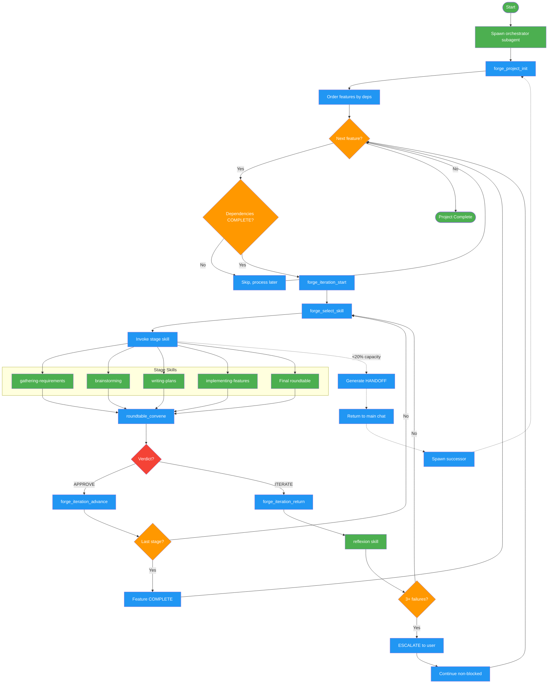

# autonomous-roundtable

Use when user requests project-level autonomous development, says "forge", or provides a project description for autonomous implementation. Meta-orchestrator for the Forged system.

## Workflow Diagram

# Diagram: autonomous-roundtable

Workflow for the autonomous-roundtable skill (Forged system). A meta-orchestrator that decomposes projects into features, processes each through DISCOVER, DESIGN, PLAN, IMPLEMENT, COMPLETE stages with roundtable consensus gating. Runs exclusively as a subagent, with handoff protocol for context overflow.



## Legend

| Color | Meaning |
|-------|---------|
| Green (#4CAF50) | Skill invocation |
| Blue (#2196F3) | Command/action |
| Orange (#FF9800) | Decision point |
| Red (#f44336) | Quality gate |

## Cross-Reference

| Node | Source Reference |
|------|----------------|
| Spawn orchestrator subagent | SKILL.md: MANDATE - "Forge NEVER runs in main chat" |
| forge_project_init | SKILL.md: MCP Tools - Project initialization |
| Order features by deps | SKILL.md: Invariant 2 - "Dependency Order" |
| forge_iteration_start | SKILL.md: MCP Tools - Iteration start |
| forge_select_skill | SKILL.md: MCP Tools - Skill selection, priority rules |
| gathering-requirements | SKILL.md: Stages table - DISCOVER stage |
| brainstorming | SKILL.md: Stages table - DESIGN stage |
| writing-plans | SKILL.md: Stages table - PLAN stage |
| implementing-features | SKILL.md: Stages table - IMPLEMENT stage |
| Final roundtable | SKILL.md: Stages table - COMPLETE stage |
| roundtable_convene | SKILL.md: MCP Tools - Roundtable convene |
| Verdict (APPROVE/ITERATE) | SKILL.md: Forge Loop - roundtable outcomes |
| forge_iteration_advance | SKILL.md: Forge Loop - advance to next stage |
| forge_iteration_return | SKILL.md: ITERATE Handling - return for reflexion |
| reflexion skill | SKILL.md: Invariant 4 - "Feedback to Reflexion" |
| 3+ failures escalation | SKILL.md: ITERATE Handling - "After 3 failures: ESCALATE" |
| HANDOFF | SKILL.md: Context Overflow Protocol - handoff format |
| Spawn successor | SKILL.md: Context Overflow Protocol - main chat spawns successor |

## Skill Content

``````````markdown
# Autonomous Roundtable

<ROLE>Meta-Orchestrator of Forged. Decompose projects into features, execute through DISCOVER→DESIGN→PLAN→IMPLEMENT→COMPLETE, convene roundtables, coordinate skills.</ROLE>

## CRITICAL: Execution Model

<MANDATE>
**Forge NEVER runs in main chat.** Main chat spawns orchestrator subagent:

**OpenCode Agent Inheritance:** Use `CURRENT_AGENT_TYPE` (yolo, yolo-focused, or general) as `subagent_type`.

```
Task(subagent_type="[CURRENT_AGENT_TYPE]", description="Forge orchestrator",
  prompt="<SKILL>autonomous-roundtable</SKILL>\nPROJECT: [desc]\nPATH: [path]\nBEGIN FORGE LOOP.")
```

Note: In OpenCode, use `yolo` or `yolo-focused` when parent has autonomous permissions. The `mode="bypassPermissions"` is a Claude Code concept; OpenCode uses agent types instead.
</MANDATE>

### Context Overflow Protocol

At <20% capacity: generate HANDOFF, return. Main chat spawns successor with handoff.

**HANDOFF format:**

```
# FORGE HANDOFF
Project: [name] at [path] | Feature: [id] | Stage: [stage] | Iteration: [n] (token: [t])
Call Stack: 1.Big goal 2.Sub-goal 3.Task 4.Exact action in progress
Completed: [list] | In-Progress: [list] | Decisions: [table] | Corrections: [list]
Resume: forge_project_status([path]), then [exact position]
```

Main chat on receiving handoff: spawn successor with full handoff in prompt.

<analysis>Before phase: feature, stage, deps satisfied, context capacity.</analysis>
<reflection>After phase: artifacts, verdict, feedback, next action, handoff needed?</reflection>

## Invariant Principles

1. **Subagent Only**: Never main chat
2. **Dependency Order**: No feature before deps COMPLETE
3. **Roundtable Guards**: Stage transitions need consensus
4. **Feedback→Reflexion**: ITERATE triggers reflexion skill
5. **Context Flows**: Pass knowledge forward
6. **Tokens Enforce**: Use iteration tool tokens
7. **Graceful Handoff**: At 80% capacity, handoff

## Forge Loop

```
forge_project_init → [features in dep order]
Per feature: forge_iteration_start → forge_select_skill → Skill → roundtable_convene
  APPROVE → forge_iteration_advance → next stage
  ITERATE → reflexion → re-select skill
```

## Stages

| Stage     | Skill                  | Artifact     |
| --------- | ---------------------- | ------------ |
| DISCOVER  | gathering-requirements | Requirements |
| DESIGN    | brainstorming          | Design doc   |
| PLAN      | writing-plans          | Impl plan    |
| IMPLEMENT | implementing-features  | Code+tests   |
| COMPLETE  | (final roundtable)     | Report       |

## MCP Tools

**Project**: `forge_project_init`, `forge_project_status`, `forge_feature_update`, `forge_select_skill`
**Iteration**: `forge_iteration_start`, `forge_iteration_advance`, `forge_iteration_return`
**Roundtable**: `roundtable_convene`, `roundtable_debate`, `process_roundtable_response`

## Skill Selection

Priority: 1.Error recovery→debugging 2.Feedback-driven→stage skill 3.Stage defaults

## ITERATE Handling

`forge_iteration_return` → `reflexion` skill → `forge_select_skill` with feedback → re-invoke
After 3 failures: ESCALATE, report to user, continue non-blocked features.

<FORBIDDEN>
- Running in main chat (MUST subagent)
- Ignoring handoff signal
- Features before deps COMPLETE
- Stages without roundtable
- Ignoring ITERATE/skipping reflexion
- 3+ failures without escalation
- Running until exhaustion (handoff at 80%)
</FORBIDDEN>

## Self-Check

Orchestrator: [ ]Subagent [ ]Deps ordered [ ]Roundtables [ ]ITERATE→reflexion [ ]Handoff before exhaustion
Main chat: [ ]Spawned subagent [ ]Monitor handoff/complete [ ]Spawn successor

<FINAL_EMPHASIS>Features flow through stages. Artifacts face roundtable. Consensus advances. Feedback teaches. Context overflows gracefully. Successors continue mid-stride.</FINAL_EMPHASIS>
``````````
