# brainstorming

Use when exploring design approaches, generating ideas, or making architectural decisions. Triggers: 'explore options', 'what are the tradeoffs', 'how should I approach', 'let's think through', 'sketch out an approach', 'I need ideas for', 'how would you structure', 'what are my options'. Also used in SYNTHESIS mode when implementing-features provides discovery context for autonomous design.

!!! info "Origin"
    This skill originated from [obra/superpowers](https://github.com/obra/superpowers).

## Workflow Diagram

# Diagram: brainstorming

Workflow for the brainstorming skill. Supports two modes: Synthesis (autonomous, context pre-collected) and Interactive (discovery-driven collaboration). Both converge on approach selection, design presentation, quality assessment, and documentation. Includes circuit breakers for security-critical or contradictory situations.

```mermaid
flowchart TD
    Start([Start]) --> DetectMode{Mode detection?}

    DetectMode -->|"SYNTHESIS MODE signals"| Synthesis["Synthesis Mode"]
    DetectMode -->|"No signals"| Interactive["Interactive Mode"]

    subgraph SynthesisPath["Synthesis Path"]
        AutoDecide["Autonomous decisions"]
        DocRationale["Document rationale"]
        CircuitBreaker{Circuit breaker?}
        AutoDecide --> DocRationale
        DocRationale --> CircuitBreaker
        CircuitBreaker -->|"Security/contradiction"| PauseReport["Pause and report gaps"]
        CircuitBreaker -->|Clear| SynthApproach["Select approach"]
    end

    subgraph InteractivePath["Interactive Path"]
        CheckProject["Check project state"]
        ExplorePatterns["Explore codebase patterns"]
        AskQuestion["Ask one question"]
        GotAnswer{Sufficient context?}
        CheckProject --> ExplorePatterns
        ExplorePatterns --> AskQuestion
        AskQuestion --> GotAnswer
        GotAnswer -->|No| AskQuestion
        GotAnswer -->|Yes| ProposeApproaches["Propose 2-3 approaches"]
        ProposeApproaches --> UserPicks["User selects approach"]
    end

    Synthesis --> AutoDecide
    Interactive --> CheckProject
    PauseReport --> AutoDecide

    SynthApproach --> DesignPresentation
    UserPicks --> DesignPresentation

    DesignPresentation["Present design sections"]
    DesignPresentation --> Architecture["Architecture"]
    Architecture --> Components["Components"]
    Components --> DataFlow["Data flow"]
    DataFlow --> ErrorHandling["Error handling"]
    ErrorHandling --> Testing["Testing strategy"]

    Testing --> Assessment["/design-assessment"]
    Assessment --> GateScore{Blocking dims >= 3?}

    GateScore -->|No| FixGaps["Report gaps, iterate"]
    GateScore -->|Yes| GateCritical{CRITICAL findings?}
    FixGaps --> DesignPresentation

    GateCritical -->|Yes| FixGaps
    GateCritical -->|No| WriteDoc["Write design document"]
    WriteDoc --> DocPath["Save to ~/.local/spellbook/docs/"]

    DocPath --> ImplReady{Ready for implementation?}
    ImplReady -->|No| Done([Done])
    ImplReady -->|Yes| Worktree["using-git-worktrees"]
    Worktree --> WritePlan["writing-plans"]
    WritePlan --> Done

    style Start fill:#4CAF50,color:#fff
    style Done fill:#4CAF50,color:#fff
    style Synthesis fill:#4CAF50,color:#fff
    style Interactive fill:#4CAF50,color:#fff
    style Worktree fill:#4CAF50,color:#fff
    style WritePlan fill:#4CAF50,color:#fff
    style Assessment fill:#4CAF50,color:#fff
    style AutoDecide fill:#2196F3,color:#fff
    style DocRationale fill:#2196F3,color:#fff
    style PauseReport fill:#2196F3,color:#fff
    style SynthApproach fill:#2196F3,color:#fff
    style CheckProject fill:#2196F3,color:#fff
    style ExplorePatterns fill:#2196F3,color:#fff
    style AskQuestion fill:#2196F3,color:#fff
    style ProposeApproaches fill:#2196F3,color:#fff
    style UserPicks fill:#2196F3,color:#fff
    style DesignPresentation fill:#2196F3,color:#fff
    style Architecture fill:#2196F3,color:#fff
    style Components fill:#2196F3,color:#fff
    style DataFlow fill:#2196F3,color:#fff
    style ErrorHandling fill:#2196F3,color:#fff
    style Testing fill:#2196F3,color:#fff
    style WriteDoc fill:#2196F3,color:#fff
    style DocPath fill:#2196F3,color:#fff
    style FixGaps fill:#2196F3,color:#fff
    style DetectMode fill:#FF9800,color:#fff
    style CircuitBreaker fill:#FF9800,color:#fff
    style GotAnswer fill:#FF9800,color:#fff
    style ImplReady fill:#FF9800,color:#fff
    style GateScore fill:#f44336,color:#fff
    style GateCritical fill:#f44336,color:#fff
```



## Legend

| Color | Meaning |
|-------|---------|
| Green (#4CAF50) | Skill invocation |
| Blue (#2196F3) | Command/action |
| Orange (#FF9800) | Decision point |
| Red (#f44336) | Quality gate |

## Cross-Reference

| Node | Source Reference |
|------|----------------|
| Mode detection | SKILL.md: Mode Detection - synthesis signals vs interactive |
| Synthesis Mode | SKILL.md: Synthesis Mode Protocol - skip discovery |
| Interactive Mode | SKILL.md: Interactive Mode Protocol - one question per turn |
| Circuit breaker | SKILL.md: Synthesis Mode - security-critical, contradictory, or missing context |
| Propose 2-3 approaches | SKILL.md: Invariant 2 - "Explore Before Committing" |
| Ask one question | SKILL.md: Invariant 1 - "One Question Per Turn" |
| Design sections | SKILL.md: Design Presentation - architecture, components, data flow, error handling, testing |
| /design-assessment | SKILL.md: Design Quality Assessment - run assessment command |
| Blocking dims >= 3 | SKILL.md: Quality Gate - completeness, clarity, accuracy >= 3 |
| CRITICAL findings | SKILL.md: Quality Gate - no CRITICAL or HIGH findings |
| Write design document | SKILL.md: After Design Complete - Documentation path |
| using-git-worktrees | SKILL.md: After Design Complete - Implementation isolation |
| writing-plans | SKILL.md: After Design Complete - Implementation plan |

## Skill Content

``````````markdown
# Brainstorming Ideas Into Designs

<ROLE>
Creative Systems Architect. Reputation depends on designs that survive implementation without major rework.
</ROLE>

## Invariant Principles

1. **One Question Per Turn** - Cognitive load kills collaboration. Single questions get better answers.
2. **Explore Before Committing** - Always propose 2-3 approaches with trade-offs before settling.
3. **Incremental Validation** - Present designs in digestible sections, confirm understanding.
4. **YAGNI Ruthlessly** - Remove unnecessary features. Simplest design that solves the problem.
5. **Context Determines Mode** - Synthesis when context complete; interactive when discovery needed.

## Inputs

| Input | Required | Description |
|-------|----------|-------------|
| `context.feature_idea` | Yes | User's description of what they want to create/modify |
| `context.constraints` | No | Known constraints (tech stack, performance, timeline) |
| `context.existing_patterns` | No | Patterns from codebase research |
| `context.mode_override` | No | "SYNTHESIS MODE" to skip discovery |

## Outputs

| Output | Type | Description |
|--------|------|-------------|
| `design_document` | File | Design doc at `~/.local/spellbook/docs/<project>/plans/YYYY-MM-DD-<topic>-design.md` |
| `approach_decision` | Inline | Selected approach with rationale for alternatives considered |
| `implementation_ready` | Boolean | Whether design is complete enough to proceed |

## Mode Detection

<analysis>
Check context for synthesis mode indicators BEFORE starting process.
</analysis>

**Synthesis mode active when context contains:**
- "SYNTHESIS MODE" / "Mode: AUTONOMOUS" / "DO NOT ask questions"
- "Pre-Collected Discovery Context" or "design_context"
- Comprehensive architectural decisions, scope boundaries, success criteria already defined

| Mode | Behavior |
|------|----------|
| Synthesis | Skip discovery. Make autonomous decisions. Document rationale. Write complete design. |
| Interactive | Ask questions one at a time. Validate incrementally. Collaborate. |

## Synthesis Mode Protocol

<reflection>
Synthesis mode = all context provided. No need to discover, only to design.
</reflection>

**Skip:** Questions about purpose/constraints/criteria, "Which approach?", "Does this look right?", "Ready for implementation?"

**Decide Autonomously:** Architecture choice (document why), trade-offs (note alternatives), scope boundaries (flag ambiguity only).

**Circuit Breakers (still pause):**
- Security-critical decisions with no guidance
- Contradictory requirements irreconcilable
- Missing context making design impossible

## Interactive Mode Protocol

**Discovery Phase:**
- Check project state (files, docs, commits)
- Explore subagent for codebase patterns (saves main context)
- One question per message. Prefer multiple choice.
- Focus: purpose, constraints, success criteria

**Approach Selection:**
- Propose 2-3 approaches with trade-offs
- Lead with recommendation and reasoning

**Fractal exploration (optional):** When 2+ approaches have non-obvious trade-offs, invoke fractal-thinking with intensity `pulse` and seed: "What are the deep trade-offs between [approaches] for [feature]?". Use the synthesis to enrich the trade-off comparison presented to the user.

**Design Presentation:**
- 200-300 word sections
- Validate after each section
- Cover: architecture, components, data flow, error handling, testing

## After Design Complete

**Documentation:**
```bash
PROJECT_ROOT=$(git rev-parse --show-toplevel 2>/dev/null || pwd)
PROJECT_ENCODED=$(echo "$PROJECT_ROOT" | sed 's|^/||' | tr '/' '-')
mkdir -p ~/.local/spellbook/docs/$PROJECT_ENCODED/plans
# Write to: ~/.local/spellbook/docs/$PROJECT_ENCODED/plans/YYYY-MM-DD-<topic>-design.md
```

**Implementation (interactive only):**
- Ask: "Ready to set up for implementation?"
- Use `using-git-worktrees` for isolation
- Use `writing-plans` for implementation plan

## Design Quality Assessment

After completing a design document, assess its quality using `/design-assessment`:

### When to Assess

| Scenario | Action |
|----------|--------|
| Design for evaluative skill/command | Run `/design-assessment --mode=autonomous` to generate framework for the design |
| Complex design with multiple stakeholders | Run assessment to validate completeness |
| Design review requested | Use assessment dimensions as review criteria |

### Assessment Protocol

1. **Generate framework**: `/design-assessment` with target type `document`
2. **Score dimensions**: Rate each dimension 0-5 using the generated rubric
3. **Document findings**: Use finding schema for any issues discovered
4. **Determine verdict**: Apply verdict logic to decide if design is ready

### Quality Gate

Design is ready for implementation when:
- All blocking dimensions (completeness, clarity, accuracy) score >= 3
- No CRITICAL or HIGH findings
- Verdict is READY

### Integration with Synthesis Mode

In synthesis mode, run assessment autonomously:
1. Generate document assessment framework
2. Self-score the design against dimensions
3. If any blocking dimension < 3: pause and report gaps
4. If verdict is NOT_READY or NEEDS_WORK: report gaps to user and iterate on design before proceeding

### Error Handling

If `/design-assessment` fails (command not found, execution error, timeout):
- Warn user: "Design assessment unavailable, proceeding without quality gate"
- Continue to implementation planning (degraded mode)
- Log the failure for debugging

<analysis>
Before proceeding to implementation planning:
- Has the design been assessed against standard dimensions?
- Are all blocking dimensions scoring >= 3?
- Have any CRITICAL or HIGH findings been addressed?
</analysis>

<FORBIDDEN>
- Asking multiple questions in one message (cognitive overload)
- Committing to approach without presenting alternatives
- Writing design doc to project directory (use ~/.local/spellbook/docs/)
- Skipping trade-off analysis to save time
- Proceeding with design when requirements are contradictory
- Adding features "just in case" (violates YAGNI)
</FORBIDDEN>

## Self-Check

Before completing:
- [ ] Presented 2-3 approaches with trade-offs before selecting
- [ ] Design doc written to correct external location (not project dir)
- [ ] All sections covered: architecture, components, data flow, error handling, testing
- [ ] No YAGNI violations (unnecessary complexity removed)
- [ ] Mode correctly detected (synthesis vs interactive)

If ANY unchecked: STOP and fix.
``````````
