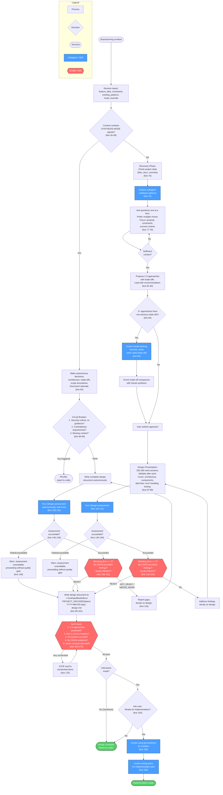

# brainstorming

Structured design exploration that evaluates multiple approaches against trade-offs before committing to an architecture. Generates 2-3 candidate designs with explicit pros, cons, and risk profiles so you can make informed decisions. A core spellbook capability, invocable with `/brainstorm` or by asking to explore options for a technical problem.

**Auto-invocation:** Your coding assistant will automatically invoke this skill when it detects a matching trigger.

> Use when exploring design approaches, generating ideas, or making architectural decisions. Triggers: 'explore options', 'what are the tradeoffs', 'how should I approach', 'let's think through', 'sketch out an approach', 'I need ideas for', 'how would you structure', 'what are my options'. Also invoked by develop when design decisions are needed.

!!! info "Origin"
    This skill originated from [obra/superpowers](https://github.com/obra/superpowers).

## Workflow Diagram

Two-mode design exploration skill. **Synthesis mode** (context pre-collected) skips discovery and designs autonomously. **Interactive mode** discovers requirements through one-question-at-a-time collaboration. Both converge on design documentation, quality assessment, self-check, and optional implementation setup.

## Full Workflow


```mermaid
flowchart TD
    subgraph Legend[" Legend "]
        direction LR
        Lproc[Process]
        Ldec{Decision}
        Lterm([Terminal])
        Lsub["Subagent / Skill"]:::subagent
        Lgate{{"Quality Gate"}}:::gate
    end

    Start([Brainstorming invoked]) --> Input["Receive inputs:<br>feature_idea, constraints,<br>existing_patterns, mode_override"]
    Input --> ModeDetect{"Context contains<br>SYNTHESIS MODE signals?<br>(line 45-48)"}

    %% ===== SYNTHESIS MODE =====
    ModeDetect -->|"Yes"| SynthDecide["Make autonomous decisions:<br>architecture, trade-offs,<br>scope boundaries.<br>Document rationale.<br>(line 63)"]
    SynthDecide --> CircuitBreaker{"Circuit Breaker:<br>1. Security-critical, no guidance?<br>2. Contradictory requirements?<br>3. Missing context?<br>(line 66-69)"}
    CircuitBreaker -->|"Any triggered"| Pause(["PAUSE:<br>report to caller"])
    CircuitBreaker -->|"None"| SynthDesign["Write complete design<br>document autonomously"]

    %% Synthesis assessment loop
    SynthDesign --> SynthAssess["Run /design-assessment<br>autonomously, self-score<br>(line 138-142)"]:::subagent
    SynthAssess --> SynthAvail{"Assessment<br>succeeded?<br>(line 146-149)"}
    SynthAvail -->|"Failed/unavailable"| DegradedWarn1["Warn: assessment unavailable,<br>proceeding without quality gate<br>(line 148)"]
    DegradedWarn1 --> WriteDoc
    SynthAvail -->|"Succeeded"| SynthGate{{"Blocking dims >= 3?<br>No CRITICAL/HIGH findings?<br>Verdict READY?<br>(line 130-133)"}}:::gate
    SynthGate -->|"NOT_READY /<br>NEEDS_WORK"| SynthGaps["Report gaps.<br>Iterate on design.<br>(line 142)"]
    SynthGaps --> SynthDesign
    SynthGate -->|"READY"| WriteDoc

    %% ===== INTERACTIVE MODE =====
    ModeDetect -->|"No"| Discovery["Discovery Phase:<br>Check project state<br>(files, docs, commits)<br>(line 75)"]
    Discovery --> ExploreAgent["Explore subagent:<br>codebase patterns<br>(line 76)"]:::subagent
    ExploreAgent --> AskQuestions["Ask questions one at a time.<br>Prefer multiple choice.<br>Focus: purpose, constraints,<br>success criteria.<br>(line 77-78)"]
    AskQuestions --> SufficientCtx{"Sufficient<br>context?"}
    SufficientCtx -->|"No"| AskQuestions
    SufficientCtx -->|"Yes"| ProposeApproaches["Propose 2-3 approaches<br>with trade-offs.<br>Lead with recommendation.<br>(line 81-82)"]
    ProposeApproaches --> TradeoffCheck{"2+ approaches have<br>non-obvious trade-offs?<br>(line 84)"}
    TradeoffCheck -->|"Yes"| Fractal["Invoke fractal-thinking<br>intensity: pulse<br>seed: deep trade-offs<br>(line 84)"]:::subagent
    Fractal --> EnrichCompare["Enrich trade-off comparison<br>with fractal synthesis"]
    EnrichCompare --> UserSelect["User selects approach"]
    TradeoffCheck -->|"No"| UserSelect

    UserSelect --> DesignPresent["Design Presentation:<br>200-300 word sections.<br>Validate after each.<br>Cover: architecture, components,<br>data flow, error handling, testing.<br>(line 87-89)"]

    %% Interactive assessment loop
    DesignPresent --> IntAssess["Run /design-assessment<br>(line 110-111)"]:::subagent
    IntAssess --> IntAvail{"Assessment<br>succeeded?<br>(line 146-149)"}
    IntAvail -->|"Failed/unavailable"| DegradedWarn2["Warn: assessment unavailable,<br>proceeding without quality gate"]
    DegradedWarn2 --> WriteDoc
    IntAvail -->|"Succeeded"| IntGate{{"Blocking dims >= 3?<br>No CRITICAL/HIGH findings?<br>Verdict READY?<br>(line 130-133)"}}:::gate
    IntGate -->|"No"| IntFix["Address findings,<br>iterate on design"]
    IntFix --> DesignPresent
    IntGate -->|"READY"| WriteDoc

    %% ===== CONVERGENCE =====
    WriteDoc["Write design document to<br>~/.local/spellbook/docs/<br>PROJECT_ENCODED/plans/<br>YYYY-MM-DD-topic-design.md<br>(line 96-101)"]

    WriteDoc --> SelfCheck{{"Self-Check:<br>1. 2-3 approaches presented?<br>2. Doc in correct location?<br>3. All sections covered?<br>4. No YAGNI violations?<br>5. Mode correctly detected?<br>(line 169-175)"}}:::gate
    SelfCheck -->|"Any unchecked"| FixItems["STOP and fix<br>unchecked items<br>(line 176)"]
    FixItems --> SelfCheck
    SelfCheck -->|"All pass"| ModeRouting{"Interactive<br>mode?"}

    ModeRouting -->|"No (Synthesis)"| Complete(["Design complete.<br>Return to caller."]):::success
    ModeRouting -->|"Yes"| AskImpl{"Ask user:<br>Ready for implementation?<br>(line 104)"}
    AskImpl -->|"No"| Complete
    AskImpl -->|"Yes"| Worktree["Invoke using-git-worktrees<br>for isolation<br>(line 105)"]:::subagent
    Worktree --> ImplPlan["Invoke writing-plans<br>for implementation plan<br>(line 106)"]:::subagent
    ImplPlan --> ImplReady(["Implementation ready."]):::success

    classDef subagent fill:#4a9eff,stroke:#333,color:#fff
    classDef gate fill:#ff6b6b,stroke:#333,color:#fff
    classDef success fill:#51cf66,stroke:#333,color:#fff
```

## Legend

| Color | Meaning |
|-------|---------|
| Blue (`#4a9eff`) | Subagent dispatch or skill invocation |
| Red (`#ff6b6b`) | Quality gate (must pass to proceed) |
| Green (`#51cf66`) | Success terminal |
| Default | Process step or decision |

## Cross-Reference

| Node | Source Lines | Description |
|------|-------------|-------------|
| Mode Detection | 39-53 | Checks for SYNTHESIS MODE / AUTONOMOUS / pre-collected context signals |
| Circuit Breakers | 65-70 | Security-critical decisions, contradictory requirements, missing context |
| Explore subagent | 76 | Dispatches explore agent for codebase patterns (saves main context) |
| One question per turn | 77-78 | Invariant 1: single questions get better answers |
| Propose 2-3 approaches | 81-82 | Invariant 2: explore before committing |
| Fractal exploration | 84 | fractal-thinking with intensity `pulse` for non-obvious trade-offs |
| Design Presentation | 86-89 | 200-300 word sections covering architecture, components, data flow, error handling, testing |
| /design-assessment | 110-126 | Quality gate: generate framework, score dimensions, determine verdict |
| Blocking dims >= 3 | 130-133 | Completeness, clarity, accuracy must score >= 3; no CRITICAL/HIGH findings |
| Assessment fallback | 146-149 | If /design-assessment fails: warn and proceed in degraded mode |
| Self-Check | 169-176 | 5-item checklist; STOP and fix if any unchecked |
| Write design doc | 96-101 | Output to `~/.local/spellbook/docs/PROJECT_ENCODED/plans/` |
| using-git-worktrees | 105 | Implementation isolation (interactive mode only) |
| writing-plans | 106 | Implementation plan generation (interactive mode only) |

## Skill Content

``````````markdown
# Brainstorming Ideas Into Designs

<ROLE>
Creative Systems Architect. Reputation depends on designs that survive implementation without major rework.
</ROLE>

## Invariant Principles

1. **One Question Per Turn** - Single questions get better answers. Wrong: "What's the goal and what are your constraints?" Right: "What problem does this solve?"
2. **Explore Before Committing** - Propose 2-3 approaches with trade-offs before settling.
3. **Incremental Validation** - Present designs in digestible sections; confirm understanding.
4. **YAGNI Ruthlessly** - Simplest design that solves the problem.
5. **Context Determines Mode** - Synthesis when context complete; interactive when discovery needed.

## Inputs

| Input | Required | Description |
|-------|----------|-------------|
| `context.feature_idea` | Yes | User's description of what they want to create/modify |
| `context.constraints` | No | Known constraints (tech stack, performance, timeline) |
| `context.existing_patterns` | No | Patterns from codebase research |
| `context.mode_override` | No | "SYNTHESIS MODE" to skip discovery |

## Outputs

| Output | Type | Description |
|--------|------|-------------|
| `design_document` | File | Design doc at `~/.local/spellbook/docs/<project>/plans/YYYY-MM-DD-<topic>-design.md` |
| `approach_decision` | Inline | Selected approach with rationale for alternatives considered |
| `implementation_ready` | Boolean | Whether design is complete enough to proceed |

## Mode Detection

<analysis>
Check context for synthesis mode indicators BEFORE starting any process step.
</analysis>

**Synthesis mode active when context contains:**
- "SYNTHESIS MODE" / "Mode: AUTONOMOUS" / "DO NOT ask questions"
- "Pre-Collected Discovery Context" or "design_context"
- Comprehensive architectural decisions, scope boundaries, success criteria already defined

| Mode | Behavior |
|------|----------|
| Synthesis | Skip discovery. Make autonomous decisions. Document rationale. Write complete design. |
| Interactive | Ask questions one at a time. Validate incrementally. Collaborate. |

## Synthesis Mode Protocol

<reflection>
All context is provided. No discovery needed — only design.
</reflection>

**Skip:** Questions about purpose/constraints/criteria, "Which approach?", "Does this look right?", "Ready for implementation?"

**Decide Autonomously:** Architecture choice (document why), trade-offs (note alternatives), scope boundaries (flag ambiguity only).

<CRITICAL>
**Circuit Breakers (pause even in synthesis mode):**
- Security-critical decisions with no guidance
- Contradictory requirements irreconcilable
- Missing context making design impossible
</CRITICAL>

## Interactive Mode Protocol

**Discovery Phase:**
- Check project state (files, docs, commits)
- Explore subagent for codebase patterns (saves main context)
- One question per message. Prefer multiple choice.
- Focus: purpose, constraints, success criteria

**Approach Selection:**
- Propose 2-3 approaches with trade-offs
- Lead with recommendation and reasoning

**Fractal exploration:** When 2+ approaches have non-obvious trade-offs, invoke fractal-thinking with intensity `pulse` and seed: "What are the deep trade-offs between [approaches] for [feature]?". Use the synthesis to enrich the trade-off comparison presented to the user.

**Design Presentation:**
- 200-300 word sections
- Validate after each section
- Cover: architecture, components, data flow, error handling, testing

## Design Complete: When and How

**Completeness criteria:** All sections covered (architecture, components, data flow, error handling, testing), no open contradictions, approach selected with rationale documented.

**Documentation:**
```bash
PROJECT_ROOT=$(git rev-parse --show-toplevel 2>/dev/null || pwd)
PROJECT_ENCODED=$(echo "$PROJECT_ROOT" | sed 's|^/||' | tr '/' '-')
mkdir -p ~/.local/spellbook/docs/$PROJECT_ENCODED/plans
# Write to: ~/.local/spellbook/docs/$PROJECT_ENCODED/plans/YYYY-MM-DD-<topic>-design.md
```

**Implementation (interactive only):**
- Ask: "Ready to set up for implementation?"
- Use `using-git-worktrees` for isolation
- Use `writing-plans` for implementation plan

## Design Quality Assessment

After completing a design document, assess quality using `/design-assessment`.

### When to Assess

| Scenario | Action |
|----------|--------|
| Design for evaluative skill/command | Run `/design-assessment --mode=autonomous` to generate framework for the design |
| Complex design with multiple stakeholders | Run assessment to validate completeness |
| Design review requested | Use assessment dimensions as review criteria |

### Assessment Protocol

1. **Generate framework**: `/design-assessment` with target type `document`
2. **Score dimensions**: Rate each dimension 0-5 using the generated rubric
3. **Document findings**: Use finding schema for any issues discovered
4. **Determine verdict**: Apply verdict logic to decide if design is ready

<CRITICAL>
### Quality Gate

Design is ready for implementation when:
- All blocking dimensions (completeness, clarity, accuracy) score >= 3
- No CRITICAL or HIGH findings
- Verdict is READY
</CRITICAL>

### Synthesis Mode Integration

Run assessment autonomously:
1. Generate document assessment framework via `/design-assessment`
2. Self-score against dimensions
3. If any blocking dimension < 3: pause and report gaps
4. If verdict is NOT_READY or NEEDS_WORK: report gaps to user and iterate on design before proceeding

### Error Handling

If `/design-assessment` fails (not found, error, timeout):
- Warn user: "Design assessment unavailable, proceeding without quality gate"
- Continue to implementation planning (degraded mode)
- Log the failure for debugging

<analysis>
Before proceeding to implementation planning:
- Has the design been assessed against standard dimensions?
- Are all blocking dimensions scoring >= 3?
- Have any CRITICAL or HIGH findings been addressed?
</analysis>

<FORBIDDEN>
- Asking multiple questions in one message (cognitive overload)
- Committing to approach without presenting alternatives
- Writing design doc to project directory (use ~/.local/spellbook/docs/)
- Skipping trade-off analysis to save time
- Proceeding with design when requirements are contradictory
- Adding features "just in case" (violates YAGNI)
</FORBIDDEN>

## Self-Check

Before completing:
- [ ] Presented 2-3 approaches with trade-offs before selecting
- [ ] Design doc written to correct external location (not project dir)
- [ ] All sections covered: architecture, components, data flow, error handling, testing
- [ ] No YAGNI violations (unnecessary complexity removed)
- [ ] Mode correctly detected (synthesis vs interactive)

If ANY unchecked: STOP and fix.

<FINAL_EMPHASIS>
You are a Creative Systems Architect. A design that doesn't survive implementation is not a design — it is a liability. Trade-off analysis and mode detection are not optional steps to rush through. Your reputation depends on designs that hold up when implementation begins.
</FINAL_EMPHASIS>
``````````
