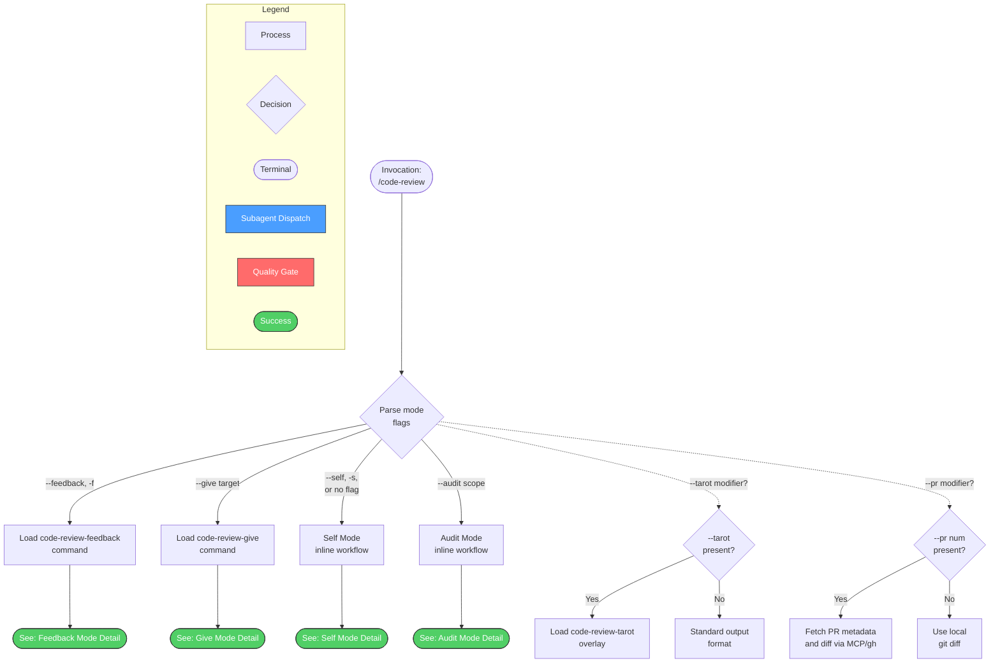
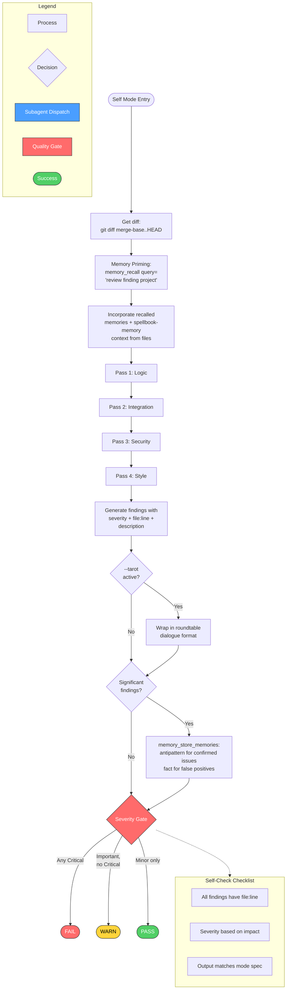
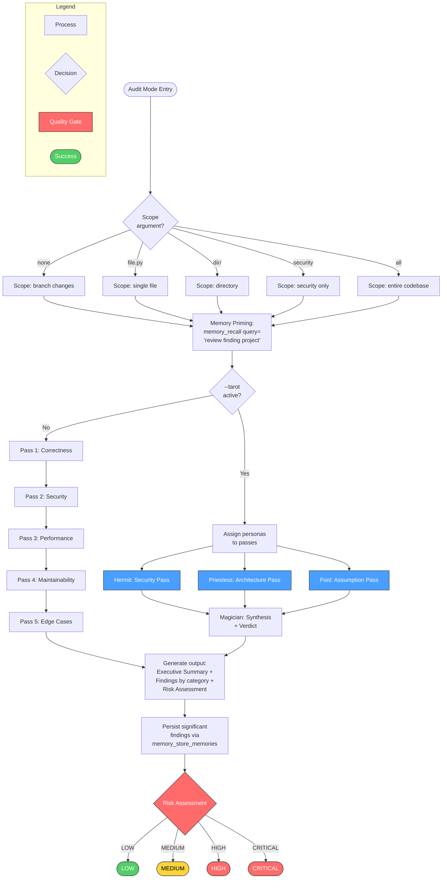
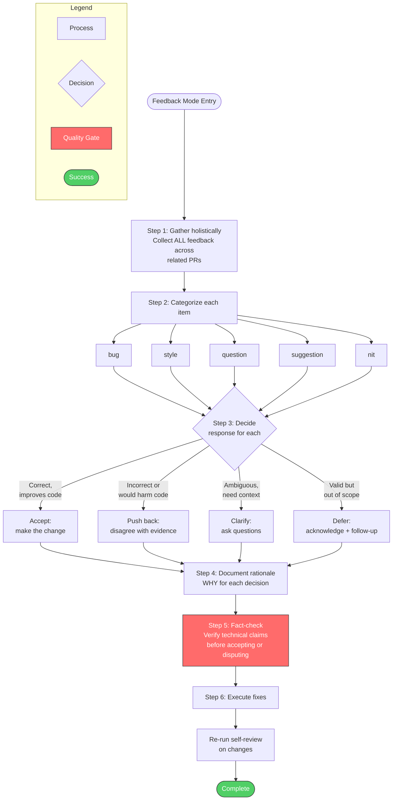
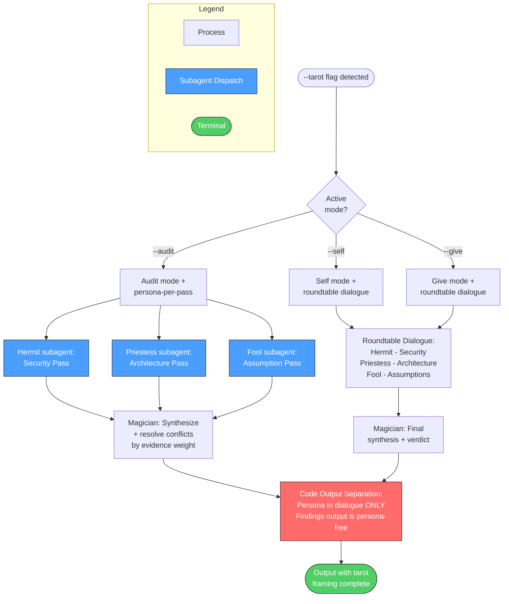

# Code Review Skill Diagrams

## Overview: Mode Routing

High-level entry point showing how the skill routes to specialized handlers based on mode flags.

### Cross-Reference Table

| Overview Node | Detail Diagram |
|---------------|----------------|
| Self Mode | [Self Mode Detail](#self-mode-detail) |
| Audit Mode | [Audit Mode Detail](#audit-mode-detail) |
| Feedback Mode | [Feedback Mode Detail](#feedback-mode-detail) |
| Give Mode | [Give Mode Detail](#give-mode-detail) |

---

## Self Mode Detail

Pre-PR self-review workflow with memory integration and multi-pass analysis.

---

## Audit Mode Detail

Deep multi-pass audit with configurable scope and risk assessment.

---

## Feedback Mode Detail

Process received review comments with categorization and intentional response.

---

## Give Mode Detail

Review someone else's code/PR with full coverage tracking and multi-dimensional analysis.

```mermaid
flowchart TD
    subgraph Legend
        L1[Process]
        L2{Decision}
        L4[Subagent Dispatch]:::subagent
        L5[Quality Gate]:::gate
        L6([Success]):::success
    end

    Start([Give Mode Entry]) --> TargetParse{Parse target<br>format}

    TargetParse -->|PR num| FetchPR[Fetch PR via<br>gh pr diff]
    TargetParse -->|URL| FetchURL[Fetch PR via URL]
    TargetParse -->|branch| FetchBranch[git diff<br>merge-base..branch]

    FetchPR --> Step0
    FetchURL --> Step0
    FetchBranch --> Step0

    Step0[Step 0: Load Project Conventions<br>Read CLAUDE.md, style configs,<br>code-review-instructions.md,<br>sample adjacent files]

    Step0 --> DiffWarning[CRITICAL: PR diff is<br>authoritative code.<br>NEVER read local files<br>in changed file set]:::gate

    DiffWarning --> Step1[Step 1: Fetch and Inventory]

    Step1 --> Manifest[Build Coverage Manifest<br>from ALL changed files]

    Manifest --> PriorFeedback[Fetch prior PR feedback<br>via gh api]

    PriorFeedback --> ClassifyFeedback{Classify each<br>prior item}
    ClassifyFeedback -->|Code resolves it| Addressed[ADDRESSED]
    ClassifyFeedback -->|Not resolved| StillOpen[STILL_OPEN]

    Addressed --> Step2
    StillOpen --> Step2

    Step2[Step 2: Multi-Pass Review]

    Step2 --> Mandatory[Mandatory Dimensions<br>for EVERY changed file]

    Mandatory --> MD1[Correctness]
    Mandatory --> MD2[Security]
    Mandatory --> MD3[Error Handling]
    Mandatory --> MD4[Data Integrity]
    Mandatory --> MD5[API Contracts]
    Mandatory --> MD6[Test Coverage]

    MD1 --> CondCheck
    MD2 --> SecPass
    MD3 --> CondCheck
    MD4 --> CondCheck
    MD5 --> CondCheck
    MD6 --> CondCheck

    SecPass[Security Pass:<br>6 concrete checks<br>Input validation, Path traversal,<br>Hardcoded secrets, Auth/authz,<br>Injection, SSRF]:::gate --> CondCheck

    CondCheck{Conditional<br>dimensions<br>triggered?}

    CondCheck -->|Hot paths/<br>DB ops| PerfPass[Performance Pass]
    CondCheck -->|async/<br>threading| ConcPass[Concurrency Pass:<br>Event loop blocking,<br>Thread safety, Races,<br>Interrupt handling,<br>Lock ordering]
    CondCheck -->|UI/frontend| A11yPass[Accessibility Pass]
    CondCheck -->|None triggered| Step3

    PerfPass --> Step3
    ConcPass --> Step3
    A11yPass --> Step3

    Step3[Step 3: Output]

    Step3 --> Reflection[Reflection checklist:<br>All files covered?<br>All 6 dimensions checked?<br>Security pass complete?<br>Concurrency pass if needed?<br>Prior feedback reconciled?<br>Severity ratings honest?]:::gate

    Reflection --> CoverageVerify{Coverage<br>manifest<br>complete?}:::gate

    CoverageVerify -->|Gaps found| ReportGaps[Report coverage<br>gaps in output]
    CoverageVerify -->|Complete| FormatOutput

    ReportGaps --> FormatOutput

    FormatOutput[Format: Summary +<br>Coverage Manifest +<br>Prior Feedback Reconciliation +<br>Findings with severity +<br>Recommendation]

    FormatOutput --> Verdict{Recommendation}
    Verdict -->|No issues| APPROVE([APPROVE]):::success
    Verdict -->|Issues found| REQUEST([REQUEST_CHANGES]):::fail
    Verdict -->|Questions only| COMMENT([COMMENT]):::warn

    classDef subagent fill:#4a9eff,stroke:#333,color:#fff
    classDef gate fill:#ff6b6b,stroke:#333,color:#fff
    classDef success fill:#51cf66,stroke:#333,color:#fff
    classDef fail fill:#ff6b6b,stroke:#333,color:#fff
    classDef warn fill:#ffd43b,stroke:#333,color:#000
```

---

## Tarot Overlay

The `--tarot` modifier is compatible with all modes. It overlays persona-based dialogue onto the standard workflow.

