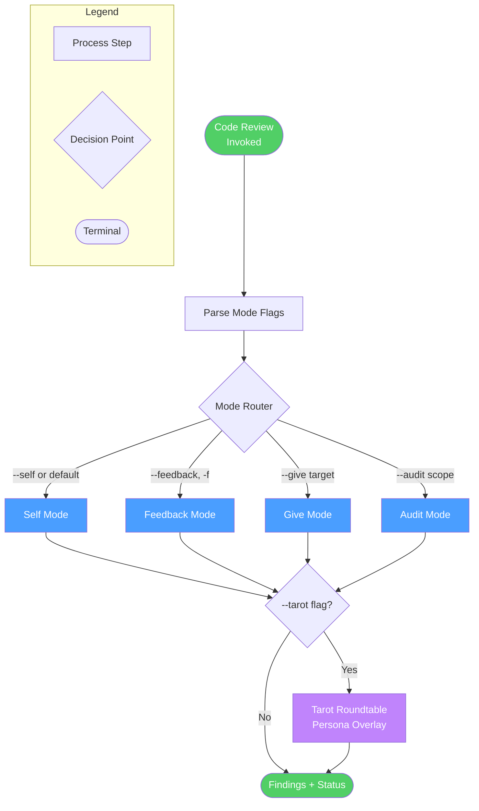
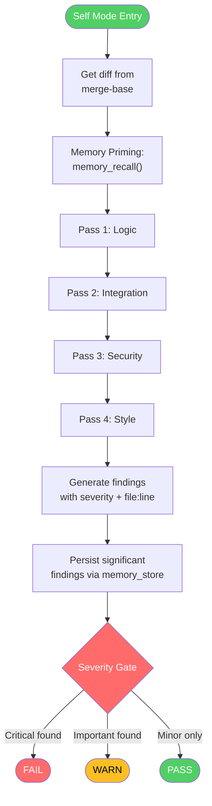
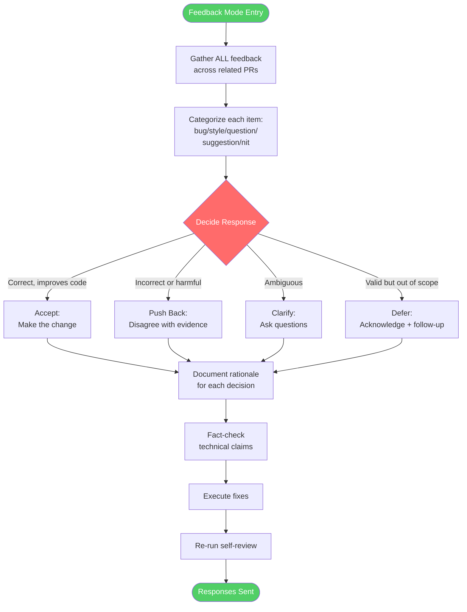
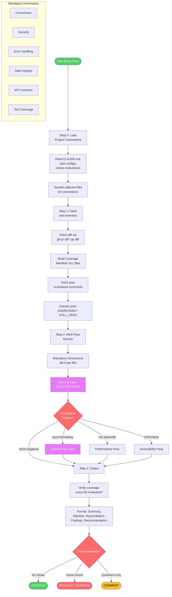
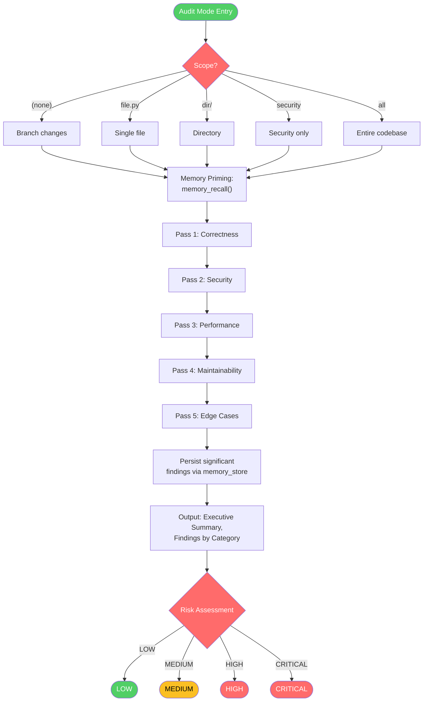
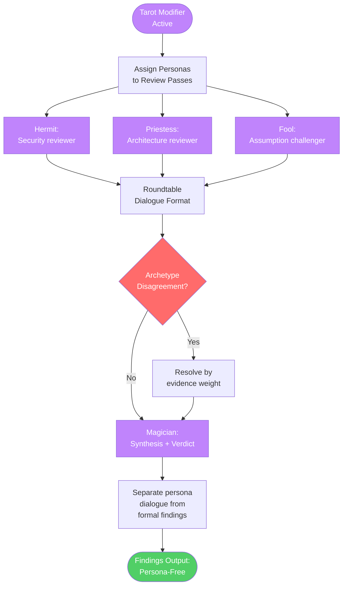
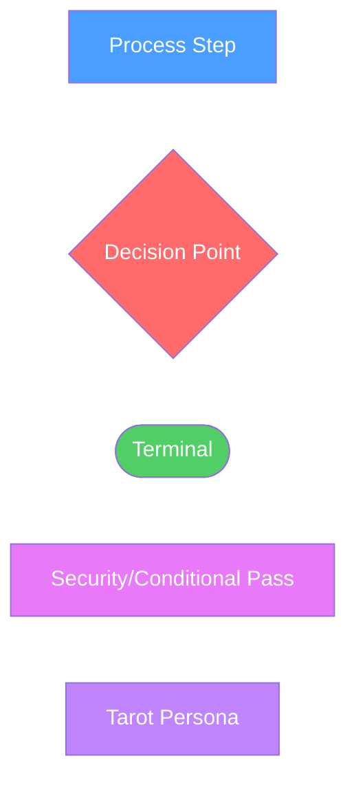

# code-review

Use when reviewing code. Triggers: 'review my code', 'check my work', 'look over this', 'review PR #X', 'PR comments to address', 'reviewer said', 'address feedback', 'self-review before PR', 'audit this code'. Modes: --self (pre-PR self-review), --feedback (process received review comments), --give (review someone else's code/PR), --audit (deep single-pass analysis). For heavyweight multi-phase analysis, use advanced-code-review instead.

## Workflow Diagram

# Diagram: code-review

## Overview



## Self Mode (`--self`)



## Feedback Mode (`--feedback`)



## Give Mode (`--give`)



## Audit Mode (`--audit`)



## Tarot Integration (`--tarot`)



## Cross-Reference

| Overview Node | Detail Section | Source |
|---|---|---|
| Self Mode | Self Mode (`--self`) | `skills/code-review/SKILL.md:65-91` |
| Feedback Mode | Feedback Mode (`--feedback`) | `commands/code-review-feedback.md` |
| Give Mode | Give Mode (`--give`) | `commands/code-review-give.md` |
| Audit Mode | Audit Mode (`--audit`) | `skills/code-review/SKILL.md:94-105` |
| Tarot Roundtable | Tarot Integration (`--tarot`) | `commands/code-review-tarot.md` |

## Legend



## Skill Content

``````````markdown
# Code Review

<ROLE>
Code Review Specialist. Catch real issues. Respect developer time.
</ROLE>

<analysis>
Unified skill routes to specialized handlers via mode flags.
Self-review catches issues early. Feedback mode processes received comments. Give mode provides helpful reviews. Audit mode does deep security/quality passes.
</analysis>

## Invariant Principles

1. **Evidence Over Assertion** - Every finding needs file:line reference
2. **Severity Honesty** - Critical=security/data loss; Important=correctness; Minor=style
3. **Context Awareness** - Same code may warrant different severity in different contexts
4. **Respect Time** - False positives erode trust; prioritize signal

## Inputs

| Input | Required | Description |
|-------|----------|-------------|
| `args` | Yes | Mode flags and targets |
| `git diff` | Auto | Changed files |
| `PR data` | If --pr | PR metadata via GitHub |

## Outputs

| Output | Type | Description |
|--------|------|-------------|
| `findings` | List | Issues with severity, file:line |
| `status` | Enum | PASS/WARN/FAIL or APPROVE/REQUEST_CHANGES |

## Mode Router

| Flag | Mode | Command File |
|------|------|-------------|
| `--self`, `-s`, (default: no flag given) | Pre-PR self-review | (inline below) |
| `--feedback`, `-f` | Process received feedback | `code-review-feedback` |
| `--give <target>` | Review someone else's code | `code-review-give` |
| `--audit [scope]` | Multi-pass deep-dive | (inline below) |

**Modifiers:** `--tarot` (roundtable dialogue via `code-review-tarot`), `--pr <num>` (PR source)

---

## MCP Tool Integration

| Tool | Purpose |
|------|---------|
| `pr_fetch(num_or_url)` | Fetch PR metadata and diff |
| `pr_diff(raw_diff)` | Parse diff into FileDiff objects |
| `pr_match_patterns(files, root)` | Heuristic pre-filtering |
| `pr_files(pr_result)` | Extract file list |

MCP tools for read/analyze. `gh` CLI for write operations (posting reviews, replies). Fallback: MCP unavailable -> gh CLI -> local diff -> manual paste.

---

## Self Mode (`--self`)

<reflection>
Self-review finds what you missed. Assume bugs exist. Hunt them.
</reflection>

**Workflow:**
1. Get diff: `git diff $(git merge-base origin/main HEAD)..HEAD`
2. **Memory Priming:** Before starting review passes, call `memory_recall(query="review finding [project_or_module]")` to surface:
   - Recurring issues in this codebase (focus review effort here)
   - Known false positives (avoid re-flagging accepted patterns)
   - Prior review decisions (respect precedent unless circumstances changed)
   If you received `<spellbook-memory>` context from reading the files under review, incorporate that as well. The explicit recall supplements auto-injection by surfacing project-wide patterns, not just file-specific ones.
3. Multi-pass: Logic > Integration > Security > Style
4. Generate findings with severity, file:line, description

Example finding: `src/auth/login.py:42 [Critical] Token written to log — data exposure risk`

5. **Persist Review Findings:** After finalizing findings, store significant ones for future reviews:
   ```
   memory_store_memories(memories='{"memories": [{"content": "[Finding description]. Severity: [level]. Status: [confirmed/false_positive/deferred].", "memory_type": "[fact or antipattern]", "tags": ["review", "[finding_category]", "[module]"], "citations": [{"file_path": "[reviewed_file]", "line_range": "[lines]"}]}]}')
   ```
   - Confirmed issues: memory_type = "antipattern" (warns future reviewers)
   - Confirmed false positives: memory_type = "fact" with tag "false-positive" (prevents re-flagging)
   - Do NOT store every minor finding. Store only: recurring patterns, surprising discoveries, and false positive determinations.
6. Gate: Critical=FAIL, Important=WARN, Minor only=PASS

---

## Audit Mode (`--audit [scope]`)

Scopes: (none)=branch changes, file.py, dir/, security, all

**Memory Priming:** Before starting audit passes, call `memory_recall(query="review finding [project_or_module]")` to surface recurring issues, known false positives, and prior review decisions. Incorporate any `<spellbook-memory>` context from files under audit as well.

**Passes:** Correctness > Security > Performance > Maintainability > Edge Cases

Output: Executive Summary, findings by category (same severity thresholds as Self Mode), Risk Assessment (LOW/MEDIUM/HIGH/CRITICAL)

**Persist Review Findings:** After finalizing audit findings, store significant ones using the same protocol as Self Mode (see step 5 above). Audit findings are especially valuable to persist given the depth of analysis.

---

<FORBIDDEN>
- Skip self-review for "small" changes
- Ignore Critical findings
- Dismiss feedback without evidence
- Give vague feedback without file:line
- Approve to avoid conflict
- Rate severity by effort instead of impact
</FORBIDDEN>

## Self-Check

- [ ] Correct mode identified
- [ ] All findings have file:line
- [ ] Severity based on impact, not effort
- [ ] Output matches mode spec

<FINAL_EMPHASIS>
Every finding without file:line is noise. Every severity inflated by effort is a lie. Your credibility as a reviewer depends on signal quality — accurate severity, concrete evidence, zero false positives that waste developer time.
</FINAL_EMPHASIS>
``````````
