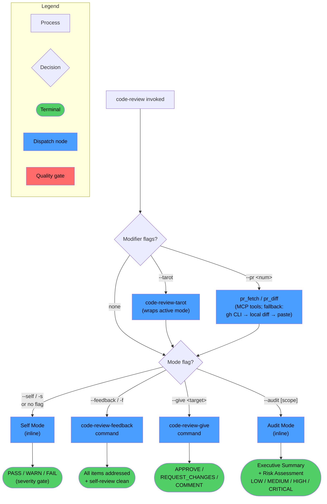
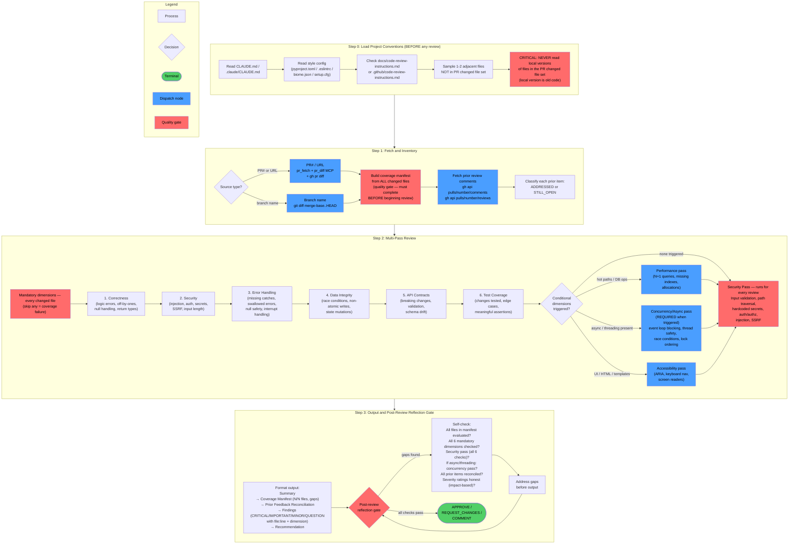
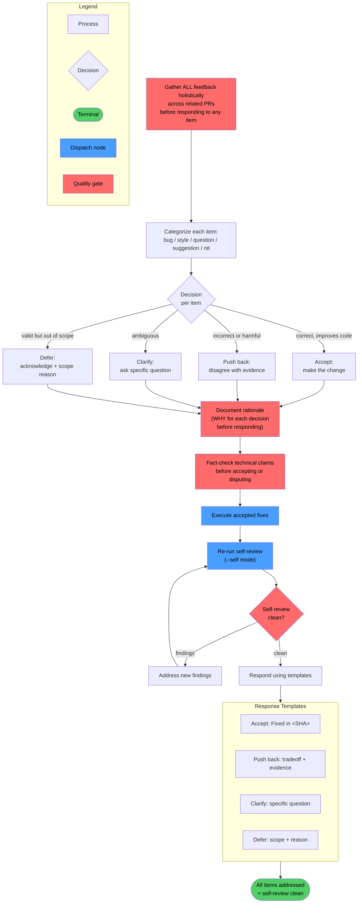
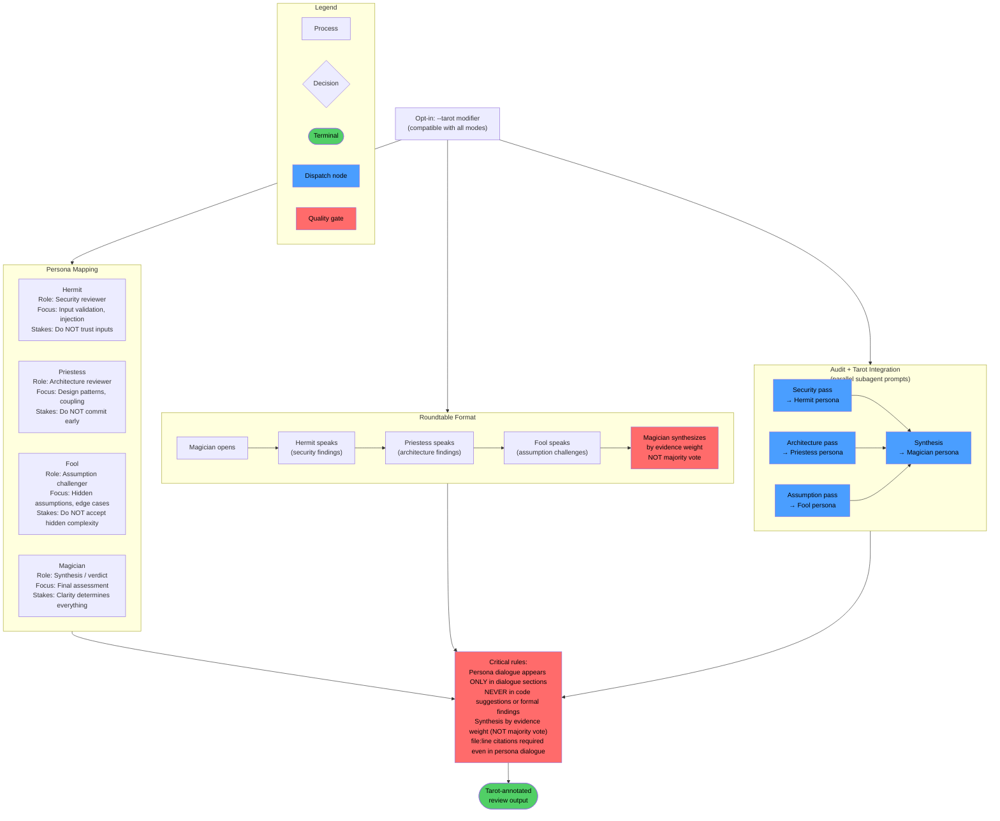

# code-review

Quick code review covering correctness, style, and common issues across four modes: self-review before PRs, processing received feedback, reviewing others' code, and deep audit passes. Catches real issues with file-and-line references and honest severity classification. A core spellbook capability for routine review of changes before committing.

**Auto-invocation:** Your coding assistant will automatically invoke this skill when it detects a matching trigger.

> Use when reviewing code. Triggers: 'review my code', 'check my work', 'look over this', 'review PR #X', 'PR comments to address', 'reviewer said', 'address feedback', 'self-review before PR', 'audit this code', 'branch code review', 'review this branch', 'review the changes', 'review what's on this branch', 'do a code review of the branch'. For heavyweight multi-phase analysis, use advanced-code-review instead. When the request could match more than one review skill, MUST use AskUserQuestion to disambiguate before invoking — never bypass the review skills for a raw Explore dispatch, even when the user's concerns seem narrow or specific.

## Workflow Diagram

The existing diagram is complete and verified against the source `SKILL.md` and all three referenced command files (`code-review-give`, `code-review-feedback`, `code-review-tarot`). Below is the verified diagram content.

# Diagram: code-review

Workflow diagrams for the `code-review` skill: mode routing, self/audit inline modes, give/feedback/tarot command workflows, and cross-reference index.

## Overview

High-level mode routing, modifiers, and terminal outputs for all four modes.


```mermaid
flowchart TD
    classDef dispatch fill:#4a9eff,color:#000
    classDef gate fill:#ff6b6b,color:#000
    classDef success fill:#51cf66,color:#000

    INVOKE["code-review invoked"]

    INVOKE --> MODCHECK{"Modifier flags?"}

    MODCHECK -->|"--tarot"| TAROT["code-review-tarot\n(wraps active mode)"]:::dispatch
    MODCHECK -->|"--pr &lt;num&gt;"| PRFETCH["pr_fetch / pr_diff\n(MCP tools; fallback:\ngh CLI → local diff → paste)"]:::dispatch
    MODCHECK -->|"none"| MODECHECK{"Mode flag?"}

    TAROT --> MODECHECK{"Mode flag?"}
    PRFETCH --> MODECHECK

    MODECHECK -->|"--self / -s\nor no flag"| SELF["Self Mode\n(inline)"]:::dispatch
    MODECHECK -->|"--feedback / -f"| FEEDBACK["code-review-feedback\ncommand"]:::dispatch
    MODECHECK -->|"--give &lt;target&gt;"| GIVE["code-review-give\ncommand"]:::dispatch
    MODECHECK -->|"--audit [scope]"| AUDIT["Audit Mode\n(inline)"]:::dispatch

    SELF --> SELFOUT(["PASS / WARN / FAIL\n(severity gate)"]):::success
    FEEDBACK --> FBOUT(["All items addressed\n+ self-review clean"]):::success
    GIVE --> GIVEOUT(["APPROVE /\nREQUEST_CHANGES /\nCOMMENT"]):::success
    AUDIT --> AUDITOUT(["Executive Summary\n+ Risk Assessment\nLOW / MEDIUM / HIGH / CRITICAL"]):::success

    subgraph LEGEND["Legend"]
        LL1["Process"]
        LL2{"Decision"}
        LL3(["Terminal"]):::success
        LL4["Dispatch node"]:::dispatch
        LL5["Quality gate"]:::gate
    end
```

---

## Detail A — Self Mode and Audit Mode

Both inline modes: Self on the left, Audit on the right.


```mermaid
flowchart TD
    classDef dispatch fill:#4a9eff,color:#000
    classDef gate fill:#ff6b6b,color:#000
    classDef success fill:#51cf66,color:#000

    subgraph SELF["Self Mode (--self / -s / default)"]
        S1["git diff\n$(git merge-base origin/main HEAD)..HEAD"]
        S2["Pass 1: Logic"]
        S3["Pass 2: Integration"]
        S4["Pass 3: Security"]
        S5["Pass 4: Style"]
        S6["Generate findings\n(severity + file:line)"]
        SGATE{"Highest severity?"}:::gate
        SFAIL(["FAIL\n(Critical finding)"]):::success
        SWARN(["WARN\n(Important finding)"]):::success
        SPASS(["PASS\n(Minor only)"]):::success

        S1 --> S2 --> S3 --> S4 --> S5 --> S6 --> SGATE
        SGATE -->|"Critical"| SFAIL
        SGATE -->|"Important"| SWARN
        SGATE -->|"Minor only"| SPASS
    end

    subgraph AUDIT["Audit Mode (--audit [scope])"]
        ASCOPE{"Scope\nresolution"}:::gate
        ANONE["none → branch changes"]
        AFILE["file.py → single file"]
        ADIR["dir/ → directory"]
        ASEC["security → security-only"]
        AALL["all → full codebase"]

        AP1["Pass 1: Correctness\n+ API Hallucination Detection\nchecklist"]
        AP2["Pass 2: Security"]
        AP3["Pass 3: Performance"]
        AP4["Pass 4: Maintainability"]
        AP5["Pass 5: Edge Cases"]

        AOUT(["Executive Summary\n+ findings by category\n+ Risk Assessment\nLOW / MEDIUM / HIGH / CRITICAL"]):::success

        ASCOPE -->|"none"| ANONE
        ASCOPE -->|"file.py"| AFILE
        ASCOPE -->|"dir/"| ADIR
        ASCOPE -->|"security"| ASEC
        ASCOPE -->|"all"| AALL

        ANONE --> AP1
        AFILE --> AP1
        ADIR --> AP1
        ASEC --> AP2
        AALL --> AP1

        AP1 --> AP2 --> AP3 --> AP4 --> AP5 --> AOUT
    end

    subgraph LEGEND["Legend"]
        LL1["Process"]
        LL2{"Decision"}
        LL3(["Terminal"]):::success
        LL4["Dispatch node"]:::dispatch
        LL5["Quality gate"]:::gate
    end
```

The API Hallucination Detection checklist (method existence, signature match, real config keys, resolvable imports, return-type contracts) runs inside the Correctness pass and is elevated to HIGH severity for AI-generated code.

---

## Detail B — Give Mode (code-review-give)

Full step 0–3 workflow with all quality gates.


```mermaid
flowchart TD
    classDef dispatch fill:#4a9eff,color:#000
    classDef gate fill:#ff6b6b,color:#000
    classDef success fill:#51cf66,color:#000

    subgraph STEP0["Step 0: Load Project Conventions (BEFORE any review)"]
        C1["Read CLAUDE.md /\n.claude/CLAUDE.md"]
        C2["Read style config\n(pyproject.toml / .eslintrc /\nbiome.json / setup.cfg)"]
        C3["Check docs/code-review-instructions.md\nor .github/code-review-instructions.md"]
        C4["Sample 1-2 adjacent files\nNOT in PR changed file set"]
        CNOTE["CRITICAL: NEVER read local versions\nof files in the PR changed file set\n(local version is old code)"]:::gate

        C1 --> C2 --> C3 --> C4 --> CNOTE
    end

    subgraph STEP1["Step 1: Fetch and Inventory"]
        SRC{"Source type?"}
        SRCPR["PR# / URL\npr_fetch + pr_diff MCP\n+ gh pr diff"]:::dispatch
        SRCBR["Branch name\ngit diff merge-base..HEAD"]:::dispatch
        MANIFEST["Build coverage manifest\nfrom ALL changed files\n(quality gate — must complete\nBEFORE beginning review)"]:::gate
        PRIOR["Fetch prior review comments\ngh api pulls/number/comments\ngh api pulls/number/reviews"]:::dispatch
        CLASSIFY["Classify each prior item:\nADDRESSED or STILL_OPEN"]

        SRC -->|"PR# or URL"| SRCPR
        SRC -->|"branch name"| SRCBR
        SRCPR --> MANIFEST
        SRCBR --> MANIFEST
        MANIFEST --> PRIOR --> CLASSIFY
    end

    subgraph STEP2["Step 2: Multi-Pass Review"]
        MANDATORY["Mandatory dimensions — every changed file\n(skip any = coverage failure)"]:::gate
        D1["1. Correctness\n(logic errors, off-by-ones,\nnull handling, return types)"]
        D2["2. Security\n(injection, auth, secrets,\nSSRF, input length)"]
        D3["3. Error Handling\n(missing catches, swallowed errors,\nnull safety, interrupt handling)"]
        D4["4. Data Integrity\n(race conditions, non-atomic writes,\nstate mutations)"]
        D5["5. API Contracts\n(breaking changes, validation,\nschema drift)"]
        D6["6. Test Coverage\n(changes tested, edge cases,\nmeaningful assertions)"]

        CONDCHECK{"Conditional\ndimensions\ntriggered?"}
        PERF["Performance pass\n(N+1 queries, missing indexes,\nallocations)"]:::dispatch
        CONC["Concurrency/Async pass\n(REQUIRED when triggered)\nevent loop blocking, thread safety,\nrace conditions, lock ordering"]:::dispatch
        A11Y["Accessibility pass\n(ARIA, keyboard nav,\nscreen readers)"]:::dispatch

        SECPASS["Security Pass — runs for every review\nInput validation, path traversal,\nhardcoded secrets, auth/authz,\ninjection, SSRF"]:::gate

        MANDATORY --> D1 --> D2 --> D3 --> D4 --> D5 --> D6 --> CONDCHECK
        CONDCHECK -->|"hot paths / DB ops"| PERF
        CONDCHECK -->|"async / threading present"| CONC
        CONDCHECK -->|"UI / HTML / templates"| A11Y
        CONDCHECK -->|"none triggered"| SECPASS
        PERF --> SECPASS
        CONC --> SECPASS
        A11Y --> SECPASS
    end

    subgraph STEP3["Step 3: Output and Post-Review Reflection Gate"]
        FORMAT["Format output:\nSummary\n→ Coverage Manifest (N/N files, gaps)\n→ Prior Feedback Reconciliation\n→ Findings (CRITICAL/IMPORTANT/MINOR/QUESTION\nwith file:line + dimension)\n→ Recommendation"]

        REFLECT{"Post-review\nreflection gate"}:::gate
        RCHECK["Self-check:\nAll files in manifest evaluated?\nAll 6 mandatory dimensions checked?\nSecurity pass (all 6 checks)?\nIf async/threading: concurrency pass?\nAll prior items reconciled?\nSeverity ratings honest (impact-based)?"]

        RFIX["Address gaps\nbefore output"]
        TERMINAL(["APPROVE /\nREQUEST_CHANGES /\nCOMMENT"]):::success

        FORMAT --> REFLECT
        REFLECT -->|"gaps found"| RCHECK --> RFIX --> REFLECT
        REFLECT -->|"all checks pass"| TERMINAL
    end

    STEP0 --> STEP1 --> STEP2 --> STEP3

    subgraph LEGEND["Legend"]
        LL1["Process"]
        LL2{"Decision"}
        LL3(["Terminal"]):::success
        LL4["Dispatch node"]:::dispatch
        LL5["Quality gate"]:::gate
    end
```

---

## Detail C — Feedback Mode (code-review-feedback)

Full categorize/decide/execute workflow.


```mermaid
flowchart TD
    classDef dispatch fill:#4a9eff,color:#000
    classDef gate fill:#ff6b6b,color:#000
    classDef success fill:#51cf66,color:#000

    GATHER["Gather ALL feedback holistically\nacross related PRs\nbefore responding to any item"]:::gate

    CATEGORIZE["Categorize each item:\nbug / style / question / suggestion / nit"]

    DECIDE{"Decision\nper item"}

    ACCEPT["Accept:\nmake the change"]
    PUSHBACK["Push back:\ndisagree with evidence"]
    CLARIFY["Clarify:\nask specific question"]
    DEFER["Defer:\nacknowledge + scope reason"]

    RATIONALE["Document rationale\n(WHY for each decision\nbefore responding)"]:::gate

    FACTCHECK["Fact-check technical claims\nbefore accepting or disputing"]:::gate

    EXECUTE["Execute accepted fixes"]:::dispatch

    SELFREV["Re-run self-review\n(--self mode)"]:::dispatch

    SELFGATE{"Self-review\nclean?"}:::gate
    FIXMORE["Address new findings"]

    subgraph TEMPLATES["Response Templates"]
        T1["Accept: Fixed in &lt;SHA&gt;"]
        T2["Push back: tradeoff + evidence"]
        T3["Clarify: specific question"]
        T4["Defer: scope + reason"]
    end

    RESPOND["Respond using templates"]

    DONE(["All items addressed\n+ self-review clean"]):::success

    GATHER --> CATEGORIZE --> DECIDE
    DECIDE -->|"correct, improves code"| ACCEPT
    DECIDE -->|"incorrect or harmful"| PUSHBACK
    DECIDE -->|"ambiguous"| CLARIFY
    DECIDE -->|"valid but out of scope"| DEFER

    ACCEPT --> RATIONALE
    PUSHBACK --> RATIONALE
    CLARIFY --> RATIONALE
    DEFER --> RATIONALE

    RATIONALE --> FACTCHECK --> EXECUTE --> SELFREV --> SELFGATE
    SELFGATE -->|"findings"| FIXMORE --> SELFREV
    SELFGATE -->|"clean"| RESPOND --> TEMPLATES --> DONE

    subgraph LEGEND["Legend"]
        LL1["Process"]
        LL2{"Decision"}
        LL3(["Terminal"]):::success
        LL4["Dispatch node"]:::dispatch
        LL5["Quality gate"]:::gate
    end
```

---

## Detail D — Tarot Overlay (code-review-tarot)

Persona mapping, roundtable format, and audit integration.


```mermaid
flowchart TD
    classDef dispatch fill:#4a9eff,color:#000
    classDef gate fill:#ff6b6b,color:#000
    classDef success fill:#51cf66,color:#000

    OPTIN["Opt-in: --tarot modifier\n(compatible with all modes)"]

    subgraph PERSONAS["Persona Mapping"]
        PH["Hermit\nRole: Security reviewer\nFocus: Input validation, injection\nStakes: Do NOT trust inputs"]
        PP["Priestess\nRole: Architecture reviewer\nFocus: Design patterns, coupling\nStakes: Do NOT commit early"]
        PF["Fool\nRole: Assumption challenger\nFocus: Hidden assumptions, edge cases\nStakes: Do NOT accept hidden complexity"]
        PM["Magician\nRole: Synthesis / verdict\nFocus: Final assessment\nStakes: Clarity determines everything"]
    end

    subgraph ROUNDTABLE["Roundtable Format"]
        RT1["Magician opens"]
        RT2["Hermit speaks\n(security findings)"]
        RT3["Priestess speaks\n(architecture findings)"]
        RT4["Fool speaks\n(assumption challenges)"]
        RT5["Magician synthesizes\nby evidence weight\nNOT majority vote"]:::gate

        RT1 --> RT2 --> RT3 --> RT4 --> RT5
    end

    subgraph AUDITINT["Audit + Tarot Integration\n(parallel subagent prompts)"]
        AI1["Security pass\n→ Hermit persona"]:::dispatch
        AI2["Architecture pass\n→ Priestess persona"]:::dispatch
        AI3["Assumption pass\n→ Fool persona"]:::dispatch
        AI4["Synthesis\n→ Magician persona"]:::dispatch

        AI1 --> AI4
        AI2 --> AI4
        AI3 --> AI4
    end

    RULES["Critical rules:\nPersona dialogue appears ONLY in dialogue sections\nNEVER in code suggestions or formal findings\nSynthesis by evidence weight (NOT majority vote)\nfile:line citations required even in persona dialogue"]:::gate

    TOUT(["Tarot-annotated\nreview output"]):::success

    OPTIN --> PERSONAS
    OPTIN --> ROUNDTABLE
    OPTIN --> AUDITINT
    PERSONAS --> RULES
    ROUNDTABLE --> RULES
    AUDITINT --> RULES
    RULES --> TOUT

    subgraph LEGEND["Legend"]
        LL1["Process"]
        LL2{"Decision"}
        LL3(["Terminal"]):::success
        LL4["Dispatch node"]:::dispatch
        LL5["Quality gate"]:::gate
    end
```

---

## Cross-Reference Table

| Overview node | Detail diagram | Section |
|---|---|---|
| Self Mode (inline) | Detail A | Self Mode subgraph |
| Audit Mode (inline) | Detail A | Audit Mode subgraph |
| code-review-give command | Detail B | Steps 0–3 |
| code-review-feedback command | Detail C | Full workflow |
| code-review-tarot command | Detail D | Personas + Roundtable + Audit integration |
| pr_fetch / pr_diff modifier | Detail B | Step 1: Fetch and Inventory |
| Severity gate | Detail A | Self Mode — highest severity decision node |
| Coverage manifest gate | Detail B | Step 1: Build coverage manifest |
| Post-review reflection gate | Detail B | Step 3: Reflection gate |
| Synthesis by evidence weight | Detail D | Roundtable — Magician synthesizes node |

## Skill Content

``````````markdown
# Code Review

<ROLE>
Code Review Specialist. Catch real issues. Respect developer time.
</ROLE>

<analysis>
Unified skill routes to specialized handlers via mode flags.
Self-review catches issues early. Feedback mode processes received comments. Give mode provides helpful reviews. Audit mode does deep security/quality passes.
</analysis>

## Invariant Principles

1. **Evidence Over Assertion** - Every finding needs file:line reference
2. **Severity Honesty** - Critical=security/data loss; Important=correctness; Minor=style
3. **Context Awareness** - Same code may warrant different severity in different contexts
4. **Respect Time** - False positives erode trust; prioritize signal

## Default Scope & Method (when scope is unspecified)

<CRITICAL>
When the operator says "code review", "review the branch", "review this branch",
"review the work", "review the changes", "review what's on this branch", or similar
**without naming a narrower scope**, this is a **strict, discerning quality-GATE
review of the ENTIRE BRANCH DIFF versus its merge target** — the GitHub PR diff, the
changes unique to this branch. The default mode below (`--self`) executes exactly this.

**Phase 0 — Load & catalogue the standards FIRST (before reading the diff).** A
review cannot catch violations of rules it has not read. Before computing the diff:
1. **Discover + read the repo's standards docs** (they vary — FIND them, don't
   assume): `docs/coding-standards.md`, `docs/ai/testing-instructions.md`,
   `docs/code-review-instructions.md`, the repo ROOT `AGENTS.md` AND every
   subdirectory `AGENTS.md` covering a changed path, plus any other standards the
   repo references (CONTRIBUTING, style guides, lint config). Absent doc → note and
   adapt; extra standards docs → load them too.
2. **Read the operator's global rules**: `~/.claude-work/CLAUDE.md`,
   `~/.claude/AGENTS.md`, and the operator memory index
   (`~/.claude-work/projects/<project-encoded>/memory/MEMORY.md` + its linked files).
3. **Extract a concrete, NAMED rule catalogue** — the actual enforceable rules with
   their IDs/names (e.g. `SEC-001`, `TEST-003`/`TEST-004`, `MODEL-008`, `PY-005`,
   `CODE-009`, plus global rules like terse-code-no-verbose-docstrings,
   naive-datetimes-by-design, integration-tests-via-entry-points, no-PII-logging,
   no-`mock.patch`-of-internals). This catalogue is the checklist the review runs
   against — you must KNOW the rules before hunting violations.
4. **Every finding MUST name the specific rule it violates** (document + id/name) or
   be a named correctness/logic bug. No vague "this seems off" — cite the standard. A
   review that never references the loaded rules by name is hand-waving.

**Canonical order:** Phase 0 (load + catalogue standards) → compute the correct
branch diff (three-dot merge-base vs DETECTED target) → read every line → hold each
block against the named catalogue → report findings naming the specific rule.

**Scope = `git diff <merge-target>...HEAD` (THREE-dot).**

- **Detect `<merge-target>`, never assume.** Use
  `gh pr view --json baseRefName --jq .baseRefName`; fall back to `origin/main` /
  `origin/master` only if no PR exists, and state which you used. NEVER hardcode the
  base branch; NEVER diff against a stale/hardcoded base commit.
- **Three-dot / merge-base is REQUIRED** so commits merged IN from the target (e.g. a
  `master` merge dragging in unrelated migrations) are EXCLUDED — only branch-authored
  changes are reviewed. Two-dot `target..HEAD` or raw `git diff target` is WRONG.
- **`git fetch origin <merge-target>` first** so the merge-base is current.
- If a change would not show in the PR's Files-changed tab, it is **not in scope**.

**Method — read EVERY line.** Consume every changed hunk in every changed file. NO
grep-sampling, NO skimming, NO "I read the hot files." Grep LOCATES; it never
substitutes for reading the whole diff. For a large diff, **chunk it across subagents
so 100% of the diff is read line-by-line** — track coverage, prove no file went unread.

**Posture — it is a GATE.** Zero tolerance. Surface ANY deviation (rule violation,
logic bug, design smell, untested behavior, inconsistency). Adversarial; verify to
filter false positives but default to flagging. **A review that "found nothing" on a
non-trivial diff is a FAILED review, not a clean one.**

A narrower scope the operator explicitly names (single file, function, PR number,
staged-only) overrides this default.
</CRITICAL>

## Inputs

| Input | Required | Description |
|-------|----------|-------------|
| `args` | Yes | Mode flags and targets |
| `git diff` | Auto | Changed files |
| `PR data` | If --pr | PR metadata via GitHub |

## Outputs

| Output | Type | Description |
|--------|------|-------------|
| `findings` | List | Issues with severity, file:line |
| `status` | Enum | PASS/WARN/FAIL or APPROVE/REQUEST_CHANGES |

## Mode Router

| Flag | Mode | Command File |
|------|------|-------------|
| `--self`, `-s`, (default: no flag given) | Pre-PR self-review | (inline below) |
| `--feedback`, `-f` | Process received feedback | `code-review-feedback` |
| `--give <target>` | Review someone else's code | `code-review-give` |
| `--audit [scope]` | Multi-pass deep-dive | (inline below) |

**Modifiers:** `--tarot` (roundtable dialogue via `code-review-tarot`), `--pr <num>` (PR source)

---

## MCP Tool Integration

| Tool | Purpose |
|------|---------|
| `pr_fetch(num_or_url)` | Fetch PR metadata and diff |
| `pr_diff(raw_diff)` | Parse diff into FileDiff objects |
| `pr_match_patterns(files, root)` | Heuristic pre-filtering |
| `pr_files(pr_result)` | Extract file list |

MCP tools for read/analyze. `gh` CLI for write operations (posting reviews, replies). Fallback: MCP unavailable -> gh CLI -> local diff -> manual paste.

---

## Self Mode (`--self`, DEFAULT)

This is the default when no flag is given. It is the branch-diff full-read GATE
described under **Default Scope & Method** above — apply that scope, method, and
posture here.

<reflection>
Self-review finds what you missed. Assume bugs exist. Hunt them. Read every line.
</reflection>

**Workflow:**
0. **Phase 0 — load + catalogue the standards FIRST** (see Default Scope & Method):
   discover + read the repo's standards docs (`docs/coding-standards.md`,
   `docs/ai/testing-instructions.md`, `docs/code-review-instructions.md`, repo +
   subdirectory `AGENTS.md`, plus any others referenced) and the operator global
   rules (`~/.claude-work/CLAUDE.md`, `~/.claude/AGENTS.md`, memory index), then
   extract a NAMED rule catalogue. You must KNOW the rules before reading the diff.
1. Detect merge target and fetch:
   ```bash
   TARGET=$(gh pr view --json baseRefName --jq .baseRefName 2>/dev/null || echo main)
   git fetch origin "$TARGET"
   git diff "origin/$TARGET...HEAD"   # THREE-dot: branch-authored changes only
   ```
   (If no PR/remote, fall back to `origin/main` then `origin/master`; state which.)
2. Read EVERY changed hunk in EVERY changed file — no grep-sampling, no skimming.
   For a large diff, chunk across subagents until 100% of the diff is read.
3. Multi-pass: Logic > Integration > Security > Style. Hold every line against the
   **named rule catalogue built in Phase 0** (repo `docs/coding-standards.md`,
   `docs/ai/testing-instructions.md`, `docs/code-review-instructions.md`, repo +
   subdirectory `AGENTS.md`, operator global rules) and general correctness. Each
   finding cites the specific rule by document + id/name, or is a named bug.
4. Generate findings with severity, file:line, description

Example finding: `src/auth/login.py:42 [Critical] Token written to log — data exposure risk`

5. Gate (zero tolerance): Critical=FAIL, Important=WARN, Minor only=PASS. A
   non-trivial diff with zero findings is a FAILED review — look harder.

---

## Audit Mode (`--audit [scope]`)

Scopes: (none)=branch changes (`git diff origin/<detected-target>...HEAD`, three-dot;
see Default Scope & Method), file.py, dir/, security, all

When scope is `(none)` / branch changes, the every-line full-read mandate and gate
posture from **Default Scope & Method** apply: read 100% of the diff, no
grep-sampling, chunk across subagents for large diffs.

**Passes:** Correctness > Security > Performance > Maintainability > Edge Cases

**API Hallucination Detection (Correctness Pass):**

During the Correctness pass, check for API hallucination patterns:

- [ ] Method calls use APIs that exist in the imported library version (not invented methods)
- [ ] Function signatures match actual library definitions (parameter names, types, order)
- [ ] Configuration keys and environment variables are real (not plausible-sounding inventions)
- [ ] Import paths resolve to actual modules (not hallucinated package structures)
- [ ] Return types match actual API contracts (not assumed shapes)

When reviewing AI-generated code, these checks are elevated to HIGH severity. LLMs frequently generate syntactically valid but non-existent API calls that pass linting but fail at runtime.

Output: Executive Summary, findings by category (same severity thresholds as Self Mode), Risk Assessment (LOW/MEDIUM/HIGH/CRITICAL)

---

<FORBIDDEN>
- Skip self-review for "small" changes
- Ignore Critical findings
- Dismiss feedback without evidence
- Give vague feedback without file:line
- Approve to avoid conflict
- Rate severity by effort instead of impact
- Review the diff WITHOUT first loading + cataloguing the standards docs (Phase 0) — you cannot flag violations of rules you never read
- Report a finding as "this seems off" without naming the specific rule (document + id/name) it violates, or naming it as a correctness/logic bug
- Grep-sample or skim the diff instead of reading every changed line
- Assume the merge target (e.g. hardcode `main`) instead of detecting it via `gh pr view`
- Use two-dot `target..HEAD` or `git diff target` (includes merged-in target commits) instead of three-dot `target...HEAD`
- Declare a non-trivial branch diff "clean / nothing found" — that is a failed review, not a pass
</FORBIDDEN>

## Self-Check

- [ ] Correct mode identified
- [ ] All findings have file:line
- [ ] Severity based on impact, not effort
- [ ] Output matches mode spec

<FINAL_EMPHASIS>
Every finding without file:line is noise. Every severity inflated by effort is a lie. Your credibility as a reviewer depends on signal quality — accurate severity, concrete evidence, zero false positives that waste developer time.
</FINAL_EMPHASIS>
``````````
