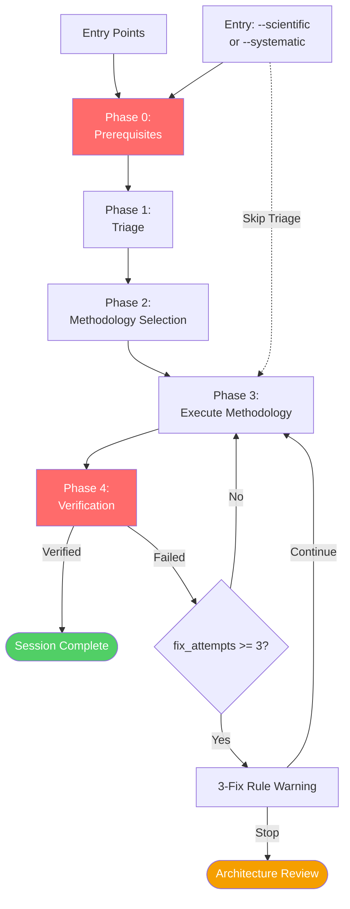
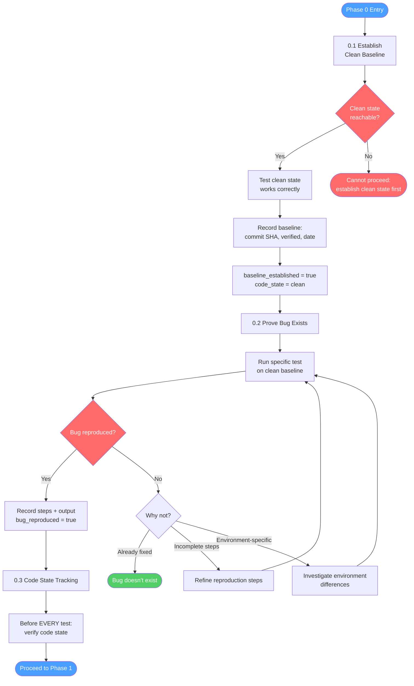
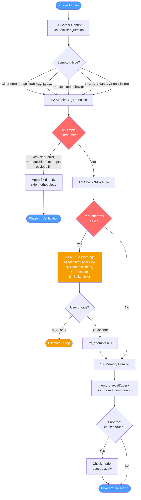
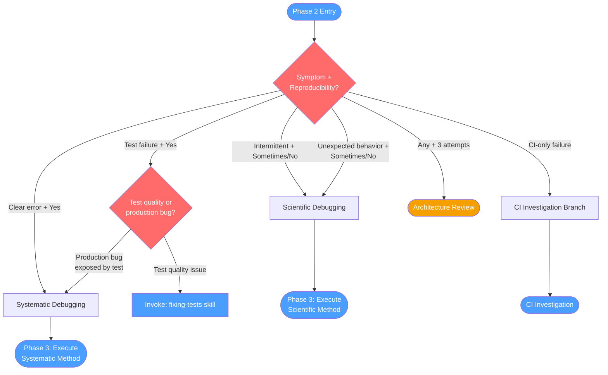
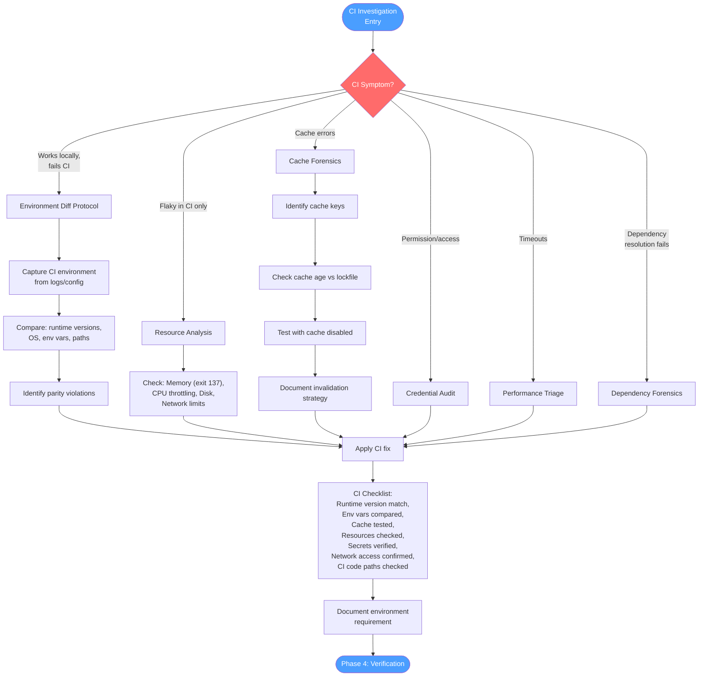
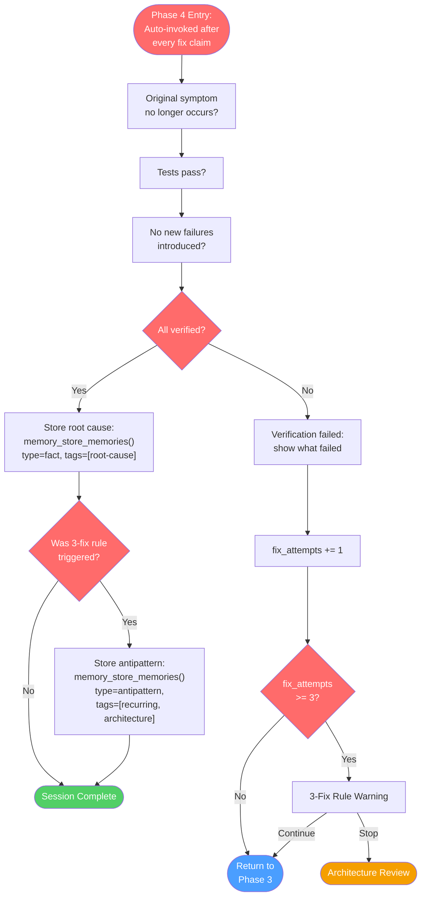
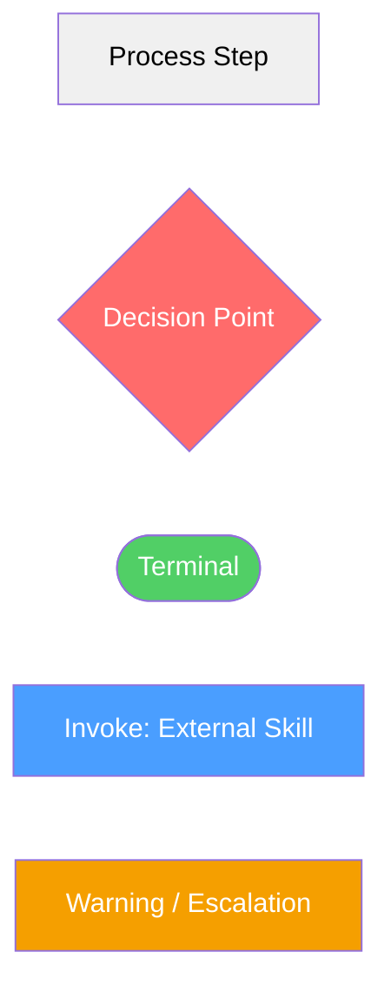

# debugging

Use when debugging bugs, test failures, or unexpected behavior. Triggers: 'why isn't this working', 'this doesn't work', 'X is broken', 'something's wrong', 'getting an error', 'exception in', 'stopped working', 'regression', 'crash', 'hang', 'flaky test', 'intermittent failure', or when user pastes a stack trace/error output. NOT for: test quality issues (use fixing-tests), adding new behavior (use implementing-features).

## Workflow Diagram

# Diagram: debugging

## Overview



## Phase 0: Prerequisites



## Phase 1: Triage



## Phase 2: Methodology Selection



## Phase 3: Execute Methodology

```mermaid
flowchart TD
    START([Phase 3 Entry]) --> METHOD{Methodology?}
    METHOD -->|Scientific| SCI["Invoke:<br/>scientific-debugging skill"]
    METHOD -->|Systematic| SYS["Invoke:<br/>systematic-debugging skill"]
    METHOD -->|Just Fix It<br/>(user request)| WARN["WARNING: Lower success<br/>rate, higher rework risk"]
    WARN --> ATTEMPT[Attempt fix directly]

    SCI --> INVESTIGATE[Investigation Loop]
    SYS --> INVESTIGATE

    INVESTIGATE --> HUNCH{Feeling<br/>'I found it'?}
    HUNCH -->|Yes| VERIFY_HUNCH["Invoke:<br/>verifying-hunches skill"]
    HUNCH -->|No| CONTINUE[Continue investigation]
    CONTINUE --> EXPERIMENT

    VERIFY_HUNCH --> CONFIRMED{Hunch<br/>confirmed?}
    CONFIRMED -->|Yes| APPLY_FIX[Apply fix]
    CONFIRMED -->|No| CONTINUE

    EXPERIMENT{Ready to<br/>test theory?} --> ISO["Invoke:<br/>isolated-testing skill"]
    ISO --> ISO_STEPS["1. Design repro test<br/>2. Get approval<br/>3. Test ONE theory<br/>4. Stop on reproduction"]
    ISO_STEPS --> CHAOS{Chaos<br/>detected?}
    CHAOS -->|"'Let me try...'<br/>'Maybe if I...'<br/>Multiple theories"| STOP_CHAOS[STOP: Return to<br/>isolated testing]
    STOP_CHAOS --> ISO
    CHAOS -->|Clean single test| RESULT{Fix attempt<br/>succeeded?}

    APPLY_FIX --> RESULT
    ATTEMPT --> RESULT

    RESULT -->|Yes| P4([Phase 4: Verification])
    RESULT -->|No| INC["fix_attempts += 1"]
    INC --> THREE{fix_attempts<br/>>= 3?}
    THREE -->|Yes| THREE_WARN[3-Fix Rule Warning]
    THREE -->|No| INVESTIGATE

    THREE_WARN -->|Continue| INVESTIGATE
    THREE_WARN -->|Stop| ARCH([Architecture Review])

    style START fill:#4a9eff,color:#fff
    style HUNCH fill:#ff6b6b,color:#fff
    style EXPERIMENT fill:#ff6b6b,color:#fff
    style CHAOS fill:#ff6b6b,color:#fff
    style RESULT fill:#ff6b6b,color:#fff
    style THREE fill:#ff6b6b,color:#fff
    style P4 fill:#4a9eff,color:#fff
    style ARCH fill:#f59f00,color:#fff
    style SCI fill:#4a9eff,color:#fff
    style SYS fill:#4a9eff,color:#fff
    style VERIFY_HUNCH fill:#4a9eff,color:#fff
    style ISO fill:#4a9eff,color:#fff
```

## CI Investigation Branch



## Phase 4: Verification



## Cross-Reference

| Overview Node | Detail Section | Source |
|---|---|---|
| Phase 0: Prerequisites | Phase 0: Prerequisites | `skills/debugging/SKILL.md:47-148` |
| Phase 1: Triage | Phase 1: Triage | `skills/debugging/SKILL.md:151-266` |
| Phase 2: Methodology Selection | Phase 2: Methodology Selection | `skills/debugging/SKILL.md:268-290` |
| Phase 3: Execute Methodology | Phase 3: Execute Methodology | `skills/debugging/SKILL.md:292-345` |
| CI Investigation | CI Investigation Branch | `skills/debugging/SKILL.md:347-407` |
| Phase 4: Verification | Phase 4: Verification | `skills/debugging/SKILL.md:409-438` |
| scientific-debugging | External skill | `skills/debugging/SKILL.md:296` |
| systematic-debugging | External skill | `skills/debugging/SKILL.md:297` |
| verifying-hunches | External skill | `skills/debugging/SKILL.md:299` |
| isolated-testing | External skill | `skills/debugging/SKILL.md:303` |
| fixing-tests | External skill | `skills/debugging/SKILL.md:279` |
| fractal-thinking | External skill | `skills/debugging/SKILL.md:254` |

## Legend



## Skill Content

``````````markdown
# Debugging

<ROLE>Senior Debugging Specialist. Reputation depends on finding root causes, not applying band-aids.</ROLE>

## Invariant Principles

1. **Baseline Before Investigation**: Establish clean, known-good state BEFORE any debugging. No baseline = no debugging.
2. **Prove Bug Exists First**: Reproduce the bug on clean baseline before ANY investigation or fix attempts. No repro = no bug.
3. **Triage Before Methodology**: Classify symptom. Simple bugs get direct fixes; complex bugs get structured methodology.
4. **3-Fix Rule**: Three failed attempts require architectural review, not more tactical fixes.
5. **Verification Non-Negotiable**: No fix is complete without evidence. Always invoke Phase 4 Verification after claiming resolution.
6. **Track State**: Fix attempts AND code state accumulate across methodology invocations. Always know what state you're testing.
7. **Evidence Over Intuition**: "I think it's fixed" is not verification.
8. **Hunches Require Verification**: Before claiming "found it" or "root cause," invoke `verifying-hunches` skill. Eureka is hypothesis until tested.
9. **Isolated Testing**: One theory, one test, full stop. No mixing theories, no "trying things," no chaos. Invoke `isolated-testing` skill before ANY experiment execution.

## Entry Points

| Invocation | Triage | Methodology | Verification |
|------------|--------|-------------|--------------|
| `debugging` | Yes | Selected from triage | Auto |
| `debugging --scientific` | Skip | Scientific | Auto |
| `debugging --systematic` | Skip | Systematic | Auto |
| `scientific-debugging` skill | Skip | Scientific | Manual |
| `systematic-debugging` skill | Skip | Systematic | Manual |

## Session State

```
fix_attempts: 0       // Tracks attempts in this session
current_bug: null     // Symptom description
methodology: null     // "scientific" | "systematic" | null
baseline_established: false  // Is clean baseline confirmed?
bug_reproduced: false        // Has bug been reproduced on clean baseline?
code_state: "unknown"        // "clean" | "modified" | "unknown"
```

Reset on: new bug, explicit request, verified fix.

---

## Phase 0: Prerequisites

<CRITICAL>
**THIS PHASE IS MANDATORY.** Cannot proceed to triage or investigation without completing Phase 0.

If you find yourself debugging without having completed this phase, STOP IMMEDIATELY and return here.
</CRITICAL>

### 0.1 Establish Clean Baseline

Before ANY investigation, establish a known-good reference state.

```
BASELINE CHECKLIST:
[ ] What is the "clean" state? (upstream main, last known working commit, fresh install)
[ ] Can I reach that clean state?
[ ] What does "working correctly" look like on clean state?
[ ] Have I tested clean state to confirm it works?
```

**If working with external code (upstream repo, dependency):**
```bash
git stash                    # Save local changes
git checkout main            # Or upstream branch
git pull                     # Get latest
# Build/run from clean state and verify expected behavior works
```

**Record the baseline:**
```
BASELINE ESTABLISHED:
- Reference: [commit SHA / version / state description]
- Verified working: [yes/no + what you tested]
- Date: [timestamp]
```

Set `baseline_established = true`, `code_state = "clean"` in session state.

### 0.2 Prove Bug Exists

<CRITICAL>
**HARD GATE: Cannot investigate or fix a bug you haven't reproduced.**

"Someone reported X" is not reproduction.
"I think I saw Y" is not reproduction.
"The code looks wrong" is not reproduction.

**Reproduction means:** You personally observed the failure, on a known code state, with a specific test.
</CRITICAL>

**Reproduction requirements:**
1. Start from CLEAN baseline (from 0.1)
2. Run SPECIFIC test/action that should trigger bug
3. Observe ACTUAL failure (error message, wrong output, crash)
4. Record EXACT steps and output

```
BUG REPRODUCTION:
- Code state: [clean baseline from 0.1]
- Steps to reproduce:
  1. [exact step]
  2. [exact step]
  3. [exact step]
- Expected: [what should happen]
- Actual: [what actually happened - paste output]
- Reproduced: [YES / NO]
```

Set `bug_reproduced = true` in session state on successful reproduction.

**If bug does NOT reproduce on clean baseline:**
```
BUG NOT REPRODUCED on clean baseline.

Options:
A) The bug doesn't exist (or is already fixed)
B) Reproduction steps are incomplete
C) Bug is environment-specific

DO NOT proceed to investigation. Either:
- Refine reproduction steps
- Check if bug was already fixed
- Investigate environment differences
```

### 0.3 Code State Tracking

Before EVERY test, verify:
```
CODE STATE CHECK:
- Am I on clean baseline? [yes/no]
- What modifications exist? [list changes]
- Is this the state I INTEND to test? [yes/no]
```

<FORBIDDEN>
- Testing without knowing code state
- Making changes and forgetting what you changed
- Assuming you're on clean state without verifying
- "Let me try this change" without recording it
</FORBIDDEN>

---

## Phase 1: Triage

<analysis>
Before debugging, assess:
1. What is the exact symptom?
2. Is it reproducible?
3. What methodology fits this symptom type?
</analysis>

### 1.1 Gather Context

Ask via AskUserQuestion:

```javascript
AskUserQuestion({
  questions: [
    {
      question: "What's the symptom?",
      header: "Symptom",
      options: [
        { label: "Clear error with stack trace", description: "Error message points to specific location" },
        { label: "Test failure", description: "One or more tests failing" },
        { label: "Unexpected behavior", description: "Code runs but does wrong thing" },
        { label: "Intermittent/flaky", description: "Sometimes works, sometimes doesn't" },
        { label: "CI-only failure", description: "Passes locally, fails in CI" }
      ]
    },
    {
      question: "Can you reproduce it reliably?",
      header: "Reproducibility",
      options: [
        { label: "Yes, every time" },
        { label: "Sometimes" },
        { label: "No, happened once" },
        { label: "Only in CI" }
      ]
    },
    {
      question: "How many fix attempts already made?",
      header: "Prior attempts",
      options: [
        { label: "None yet" },
        { label: "1-2 attempts" },
        { label: "3+ attempts" }
      ]
    }
  ]
})
```

### 1.2 Simple Bug Detection

**ALL must be true:**
- Clear error with specific location
- Reproducible every time
- Zero prior attempts
- Error directly indicates fix (typo, undefined variable, missing import)

**If SIMPLE:**
```
This appears to be a straightforward bug:

[Error]: [specific error message]
[Location]: [file:line]
[Fix]: [obvious fix]

Applying fix directly without methodology.

[Apply fix]
[Proceed to Phase 4 Verification]
```

**Otherwise:** Proceed to 1.3

### 1.3 Check 3-Fix Rule

If prior attempts = "3+ attempts":

```
<THREE_FIX_RULE_WARNING>

You've attempted 3+ fixes without resolving this issue.
Tactical fixes cannot solve architectural problems.

Options:
A) Stop - conduct architecture review with human
B) Continue (type "I understand the risk, continue")
C) Escalate to human architect
D) Create spike ticket

</THREE_FIX_RULE_WARNING>
```

Wait for explicit choice. If B chosen: reset fix_attempts = 0, proceed.

**Signs of architectural problem (stop and reassess when present):**
- Each fix reveals issues elsewhere
- "Massive refactoring" required
- New symptoms appear with each fix
- Pattern feels fundamentally unsound

**Actions when 3-fix rule triggered:**
1. **Memory check:** Call `memory_recall(query="architecture issue [component]")` to check for documented systemic problems in this area.
2. **Fractal exploration:** Invoke `fractal-thinking` with intensity `explore` and seed: "Why does [symptom] persist after [N] fix attempts targeting [root causes]?" Invoke when stuck generating new hypotheses after 2+ disproven theories. Use synthesis to produce new hypothesis families.
3. Question architecture (not just implementation)
4. Discuss with human before more fixes
5. Consider refactoring vs. tactical fixes
6. Document the pattern issue

### 1.4 Memory Priming

Before selecting a debugging methodology, check for relevant stored memories:

1. If you received `<spellbook-memory>` context from recent file reads, incorporate it.
2. Otherwise, call `memory_recall(query="[symptom_type] [component_or_module]")` to surface prior root causes, antipatterns, and debugging outcomes for this area.
3. If prior root causes are found, check whether they apply to the current symptom before pursuing new hypotheses.

## Phase 2: Methodology Selection

| Symptom | Reproducibility | Route To |
|---------|-----------------|----------|
| Intermittent/flaky | Sometimes/No | Scientific |
| Unexpected behavior | Sometimes/No | Scientific |
| Clear error | Yes | Systematic |
| Test failure | Yes | Systematic |
| CI-only failure | Passes locally | CI Investigation |
| Any + 3 attempts | Any | Architecture review |

**Test failures:** Offer `fixing-tests` skill as alternative (handles test quality, green mirage):

```
Test failure detected. Options:

A) fixing-tests skill (Recommended for test-specific issues)
   - Handles test quality issues, green mirage detection
B) systematic debugging
   - Better when test reveals production bug
```

Present recommendation with rationale. Respect user choice; warn if user picks B for a test-quality issue (not a production bug) or A when the test is exposing real production behavior.

## Phase 3: Execute Methodology

Invoke selected methodology:
- `/scientific-debugging` for hypothesis-driven investigation
- `/systematic-debugging` for root cause tracing

<CRITICAL>
**Hunch Interception:** When you feel like saying "I found it," "this is the issue," or "I think I see what's happening" - STOP. Invoke `verifying-hunches` skill before claiming discovery. Every eureka is a hypothesis until tested.
</CRITICAL>

<CRITICAL>
**Isolated Testing Mandate:** Before running ANY experiment or test:
1. Invoke `isolated-testing` skill
2. Design the complete repro test BEFORE execution
3. Get approval (unless autonomous mode)
4. Test ONE theory at a time
5. STOP on reproduction - do not continue investigating

Chaos indicators (STOP if you catch yourself):
- "Let me try..." / "Maybe if I..." / "What about..."
- Making changes without a designed test
- Testing multiple theories simultaneously
- Continuing after bug reproduces
</CRITICAL>

### After Each Fix Attempt

```python
def after_fix_attempt(succeeded: bool):
    fix_attempts += 1

    if succeeded:
        invoke_phase4_verification()
    else:
        if fix_attempts >= 3:
            show_three_fix_warning()
        else:
            print(f"Fix attempt {fix_attempts} failed.")
            print("Returning to investigation with new information...")
```

### If "Just Fix It" Chosen

When user explicitly requests skipping methodology:

```
Proceeding with direct fix (methodology skipped).

WARNING: Lower success rate and higher rework risk.

[Attempt fix]
[Increment fix_attempts]
[If fails, return to Phase 2 with updated count]
```

## CI Investigation Branch

<RULE>Use when: passes locally, fails in CI; or CI-specific symptoms (cache, env vars, runner limits).</RULE>

### CI Symptom Classification

| Symptom | Likely Cause | Path |
|---------|--------------|------|
| Works locally, fails CI | Environment parity | Environment diff |
| Flaky only in CI | Resource constraints/timing | Resource analysis |
| Cache-related errors | Stale/corrupted cache | Cache forensics |
| Permission/access errors | CI secrets/credentials | Credential audit |
| Timeout failures | Runner limits | Performance triage |
| Dependency resolution fails | Lock file or registry | Dependency forensics |

### Environment Diff Protocol

1. **Capture CI environment** (from logs or CI config):
   - Runtime versions (Node/Python/etc)
   - OS and architecture
   - Environment variables (redact secrets)
   - Working directory structure

2. **Compare to local**:
   ```
   | Variable | Local | CI | Impact |
   |----------|-------|----|--------|
   ```

3. **Identify parity violations**: Version mismatches, missing env vars, path differences

### Cache Forensics

1. **Identify cache keys**: How is cache keyed? (lockfile hash, branch, manual)
2. **Check cache age**: When created? Has lockfile changed since?
3. **Test cache bypass**: Run with cache disabled to isolate
4. **Invalidation strategy**: Document proper invalidation

### Resource Analysis

| Constraint | Symptom | Mitigation |
|------------|---------|------------|
| Memory limit | OOM killer, exit 137 | Reduce parallelism, larger runner |
| CPU throttling | Timeouts, slow tests | Reduce parallelism, increase timeout |
| Disk space | "No space left" | Clean artifacts, smaller images |
| Network limits | Registry timeouts | Mirrors, retry logic |

### CI-Specific Checklist

```
[ ] Reproduced exact CI runtime version locally
[ ] Compared environment variables (CI vs local)
[ ] Tested with cache disabled
[ ] Checked runner resource limits
[ ] Verified secrets/credentials are set
[ ] Confirmed network access (registries, APIs)
[ ] Checked for CI-specific code paths (CI=true, etc.)
[ ] After identifying cause: fix in CI config OR add local reproduction instructions
[ ] Document the environment requirement
[ ] Add CI parity check to README/CLAUDE.md
```

## Phase 4: Verification

<CRITICAL>Auto-invoke Phase 4 Verification after EVERY fix claim. Not optional.</CRITICAL>

Verification confirms:
- Original symptom no longer occurs
- Tests pass (if applicable)
- No new failures introduced

**If verification succeeds:**

**Memory Persistence:** After confirming a fix, store the root cause for future sessions:
```
memory_store_memories(memories='{"memories": [{"content": "Root cause: [description]. Fix: [what was changed]. Symptom: [what was observed].", "memory_type": "fact", "tags": ["root-cause", "[component]", "[symptom_type]"], "citations": [{"file_path": "[fixed_file]", "line_range": "[lines]"}]}]}')
```
For recurring issues (3-fix-rule triggers), also store an antipattern:
```
memory_store_memories(memories='{"memories": [{"content": "Recurring issue in [component]: [pattern description]. Consider architectural review.", "memory_type": "antipattern", "tags": ["recurring", "[component]", "architecture"], "citations": [{"file_path": "[file]"}]}]}')
```

**If verification fails:**
```
Verification failed. Bug not resolved.

[Show what failed]

Returning to debugging...

[Increment fix_attempts, check 3-fix rule, continue]
```

## Anti-Patterns

<FORBIDDEN>
**Phase 0 violations:**
- Skip baseline establishment (no clean reference state)
- Investigate without reproducing bug first (prove it exists!)
- Test on unknown code state (always know what you're testing)
- Forget what modifications you've made
- Assume you're on clean state without verifying

**Investigation violations:**
- Skip verification after fix claim
- Ignore 3-fix warning
- "Just fix it" for complex bugs without warning
- Exceed 3 attempts without architectural discussion
- Apply fix without understanding root cause
- Claim "it works now" without evidence

**Methodology violations:**
- Say "I found it" or "root cause is X" without invoking verifying-hunches
- Rediscover same theory after it was disproven (check hypothesis registry)
- "Let me try" / "maybe if I" / "what about" (chaos debugging)
- Test multiple theories simultaneously (no isolation)
- Run experiments without designed repro test (action without design)
- Continue investigating after bug reproduces (stop on reproduction)

**Winging it:**
- Debugging without loading this skill
- Skipping phases because "it's obvious"
- Making elaborate fixes before proving bug exists
</FORBIDDEN>

## Self-Check

**Before starting investigation:**
```
[ ] Phase 0 completed (baseline + reproduction)
[ ] Clean baseline established and recorded
[ ] Bug reproduced on clean baseline with specific steps
[ ] Code state is known and tracked
```

**Before completing debug session:**
```
[ ] Fix attempts tracked throughout session
[ ] 3-fix rule checked if attempts >= 3
[ ] Phase 4 Verification invoked after fix
[ ] User informed of session outcome
[ ] If methodology skipped, warning was shown
[ ] Code returned to clean state (or changes documented)
```

If NO to any item, go back and complete it.

<reflection>
After each debugging session, verify:
- Root cause was identified (not just symptom addressed)
- Fix was verified with evidence
- 3-fix rule was respected
</reflection>

<FINAL_EMPHASIS>
Evidence or it didn't happen. Three strikes and you're questioning architecture, not code. Verification is not optional - it's how professionals work.
</FINAL_EMPHASIS>
``````````
