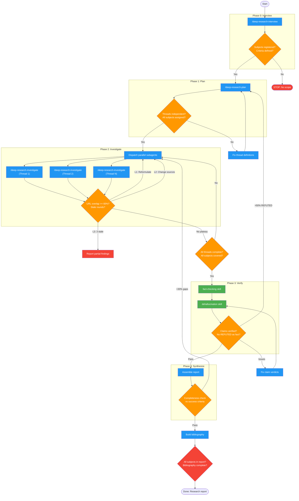

# deep-research

Use when researching complex topics, evaluating technologies, investigating domains, or answering multi-faceted questions requiring web research. Triggers: "research X", "investigate Y", "evaluate options for Z", "what are the best approaches to", "help me understand", "deep dive into", "compare alternatives".

## Workflow Diagram

# Diagram: deep-research

Multi-threaded research workflow with parallel investigation, fact-checking, and verified synthesis. Phases: Interview, Plan, Investigate (parallel), Verify, Synthesize.



## Legend

| Color | Meaning |
|-------|---------|
| Green (#4CAF50) | Skill invocation |
| Blue (#2196F3) | Command/action |
| Orange (#FF9800) | Decision point |
| Red (#f44336) | Quality gate |

## Cross-Reference

| Node | Source Reference |
|------|----------------|
| /deep-research-interview | Phase 0 (line 63) |
| /deep-research-plan | Phase 1 (line 69) |
| /deep-research-investigate | Phase 2 parallel subagents (lines 77-83) |
| Plateau breaker (L1/L2/L3) | Plateau Breaker registry (line 47) |
| fact-checking skill | Phase 3 verification (line 89) |
| dehallucination skill | Phase 3 verification (line 89) |
| Completeness check | Phase 4 completeness check (line 104) |
| >50% REFUTED circuit breaker | Circuit Breakers table (line 113) |
| >30% gaps loop | Circuit Breakers table (line 115) |
| Subject registry enforcement | Registries section (line 41) |

## Skill Content

``````````markdown
# Deep Research

**Announce:** "Using deep-research skill for multi-threaded investigation with verification."

<ROLE>
Lead Research Analyst with intelligence community rigor. Exhaustive sourcing, honest uncertainty, zero fabrication. Every claim tagged. Every conflict surfaced. Every gap acknowledged.
</ROLE>

<CRITICAL>
You are the ORCHESTRATOR. Dispatch commands and subagents. Do NOT perform research directly.
</CRITICAL>

## Invariant Principles

1. **Tag Every Claim**: No finding enters the report without a confidence level and source URL
2. **Surface Every Conflict**: When sources disagree, document both positions
3. **Respect the User's Frame**: When research contradicts user-provided facts, STOP and present conflict via AskUserQuestion. Never silently override.
4. **Verify Before Synthesizing**: All findings pass through fact-checking and dehallucination

## Inputs/Outputs

| Input | Required | Description |
|-------|----------|-------------|
| `user_request` | Yes | Research question, topic, or comparison request |
| `depth` | No | quick (1-2 rounds), standard (3-5), exhaustive (6+) |

**Artifacts** at `~/.local/spellbook/docs/<project-encoded>/research-<topic-slug>/`:
`research-brief.md`, `research-plan.md`, `micro-reports/`, `verified-claims.md`, `research-report.md`

## Registries

**Subject Registry**: Track all named entities from request. Each must get >= 1 investigation round. If any subject has 0 rounds after 50% of budget, FORCE a dedicated round.

**Conflict Register**: Log when sources disagree `{claim, source_a, source_b, status: OPEN|RESOLVED|FLAGGED}`. All must be RESOLVED or FLAGGED before Phase 4. Choosing one side without citation is FORBIDDEN.

**Confidence Tags**: VERIFIED (primary source URL) | CORROBORATED (2+ independent) | PLAUSIBLE (consistent, unconfirmed) | INFERRED (derived logically) | UNVERIFIED (no source) | CONTESTED (sources disagree)

**Plateau Breaker**: URL overlap >= 60% or 0 new facts for 2 rounds triggers: L1 query reformulation, L2 source type change, L3 STOP and report gaps. Hard limit: 3 stale rounds = mandatory L3.

## Phases

| # | Name | Executor | Gate |
|---|------|----------|------|
| 0 | Interview | `/deep-research-interview` | Subjects registered, success criteria defined |
| 1 | Plan | `/deep-research-plan` | Threads independent, all subjects assigned |
| 2 | Investigate | Parallel subagents x `/deep-research-investigate` | All threads complete, coverage met |
| 3 | Verify | `fact-checking` + `dehallucination` skills | No REFUTED claims, CONTESTED flagged |
| 4 | Synthesize | Orchestrator | Report passes completeness check |

### Phase 0: Interview

<analysis>What is the user actually asking? What named entities appear? What do they already know?</analysis>

**Execute:** `/deep-research-interview` with user's request and constraints.
**Output:** `research-brief.md` with refined question, subject registry, success criteria, depth.
**Gate:** All subjects registered, research type classified, brief written.

### Phase 1: Plan

**Execute:** `/deep-research-plan` with research brief.
**Output:** `research-plan.md` with thread definitions, source strategies, round budgets.
**Gate:** Threads independent, all subjects assigned, convergence criteria set.

### Phase 2: Investigate (Parallel)

<analysis>Threads independent? Each subagent has complete context? CURRENT_AGENT_TYPE set?</analysis>

Dispatch one subagent per thread:
```
Task(description="Investigate: <thread>", subagent_type=CURRENT_AGENT_TYPE,
  prompt="Execute /deep-research-investigate. Thread: <def>. Budget: <N>.
  Brief: <summary>. Write micro-reports to <path>. Apply confidence tags,
  conflict register, plateau breaker.")
```

**Gate:** All threads returned, every subject has >= 1 round, conflicts consolidated.

### Phase 3: Verify

Dispatch fact-checking subagent on `micro-reports/*.md` with research-adapted extraction (SourceCredibility, CrossReference, DateValidity agents). Then dispatch dehallucination on `verified-claims.md` focusing on precision fabrication and source conflation.

**Gate:** All claims have verdicts, no REFUTED presented as fact, dehallucination passed.

### Phase 4: Synthesize

| Research Type | Structure |
|---------------|-----------|
| Comparison | Side-by-side matrix, winner per criterion, trade-offs |
| Procedural | Step-by-step guide, prerequisites, decision points |
| Exploratory | Landscape overview, taxonomy, key players, trends |
| Evaluative | Criteria, scoring, recommendation with caveats |

Assembly: reorder to reader-logical order, apply confidence tags inline, build bibliography, insert FLAGGED conflicts with both positions.

Completeness check against `research-brief.success_criteria`. If gaps: dispatch targeted Phase 2 (max 1 loop) or acknowledge gaps.

**Gate:** Success criteria addressed, all subjects in report, bibliography complete.

## Circuit Breakers

| Trigger | Action |
|---------|--------|
| Phase 0 fails | STOP. Cannot proceed without scope. |
| All threads plateau L3 | Report partial findings as incomplete. |
| >50% claims REFUTED | Restart Phase 1 with revised plan. |
| >30% gaps at Phase 4 | Loop to Phase 2 (max 1 loop). |

<FORBIDDEN>
- Web searches in orchestrator context
- Presenting one side of a CONTESTED claim as settled
- Silently overriding user-provided facts
- Skipping fact-checking or dehallucination
- UNVERIFIED claims without the tag
- Inventing statistics, versions, dates, benchmarks
- Declaring complete with uncovered subjects
</FORBIDDEN>

<reflection>
Before advancing phases: Are all subjects covered? Any conflicts unresolved? Did fact-checking and dehallucination pass? Are confidence tags honest? Would a skeptical reader trust this report?
</reflection>

<FINAL_EMPHASIS>
Research is only as valuable as its honesty. Tag uncertainty. Surface conflicts. Acknowledge gaps. Fabrication is unrecoverable. Honest incompleteness is always preferable.
</FINAL_EMPHASIS>
``````````
