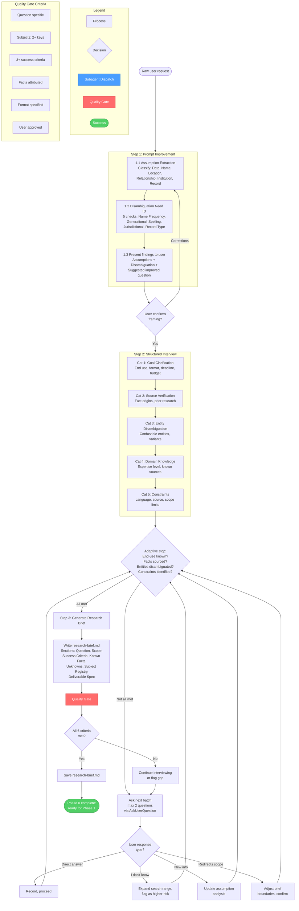
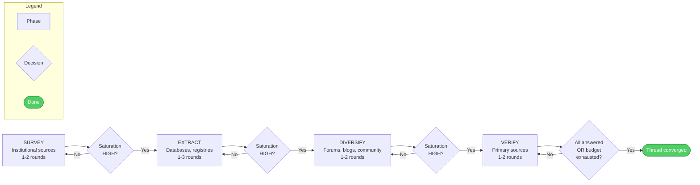
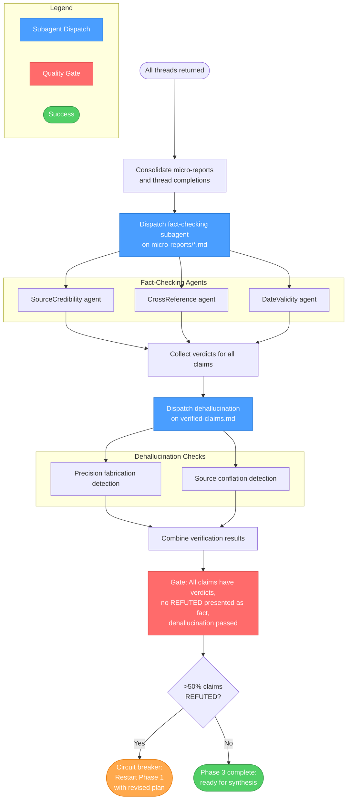
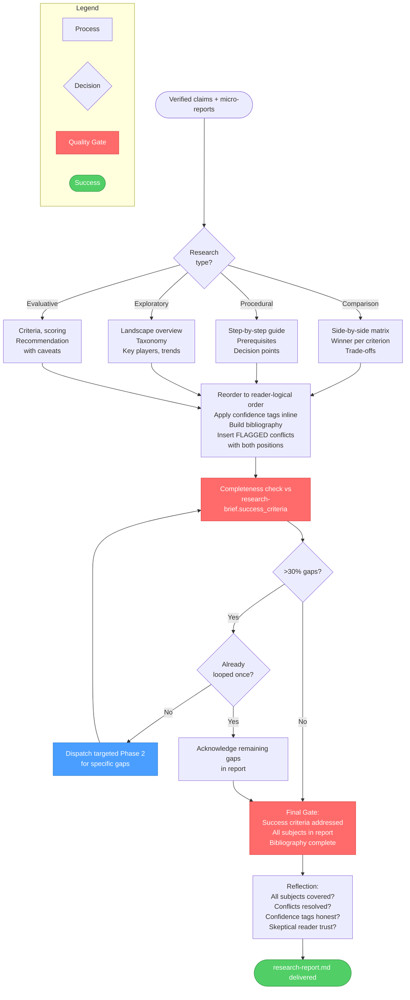
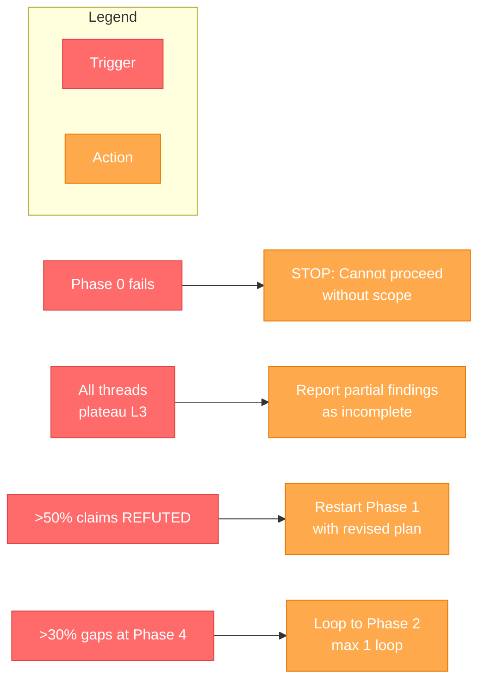
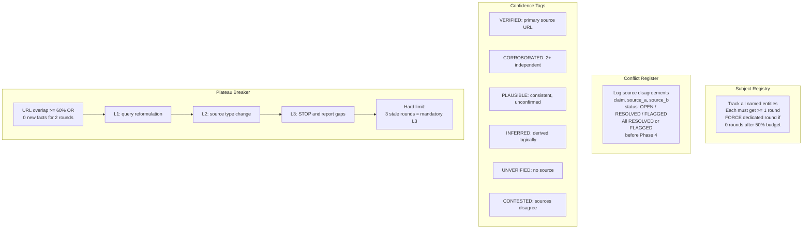

# deep-research

Multi-source research combining web search, codebase exploration, and structured synthesis for complex technical questions. Dispatches parallel research threads with verification, tags every claim with its source, and surfaces conflicts and gaps honestly. A core spellbook capability for when you need thorough, evidence-based answers to hard questions.

**Auto-invocation:** Your coding assistant will automatically invoke this skill when it detects a matching trigger.

> Use when researching complex topics, evaluating technologies, investigating domains, or answering multi-faceted questions requiring web research. Triggers: 'research X', 'investigate Y', 'evaluate options for Z', 'what are the best approaches to', 'help me understand', 'deep dive into', 'compare alternatives', 'look into', 'find out about'. NOT for: exploring design approaches (use brainstorming) or domain modeling (use analyzing-domains).

## Workflow Diagram

# Deep Research Skill - Flow Diagrams

## Overview Diagram

High-level phase flow showing the 5 phases, their executors, quality gates, and circuit breakers.


```mermaid
flowchart TD
    subgraph Legend
        direction LR
        L1[Process]
        L2{Decision}
        L3([Terminal])
        L4[/Command/]
        L5[Subagent Dispatch]:::subagent
        L6[Quality Gate]:::gate
        L7([Success]):::success
    end

    START([User research request]) --> ANNOUNCE["Announce: deep-research skill<br>Set ROLE: Lead Research Analyst"]
    ANNOUNCE --> P0

    subgraph P0 ["Phase 0: Interview"]
        P0_EXEC[/deep-research-interview/] --> P0_GATE[Gate: Subjects registered,<br>success criteria defined,<br>brief written]:::gate
    end

    P0_GATE --> P0_CHECK{Phase 0<br>passed?}
    P0_CHECK -- No --> P0_STOP([STOP: Cannot proceed<br>without scope]):::fail
    P0_CHECK -- Yes --> P1

    subgraph P1 ["Phase 1: Plan"]
        P1_EXEC[/deep-research-plan/] --> P1_GATE[Gate: Threads independent,<br>all subjects assigned,<br>convergence criteria set]:::gate
    end

    P1_GATE --> P1_CHECK{Phase 1<br>passed?}
    P1_CHECK -- No --> P1_FIX["Complete missing items<br>before proceeding"] --> P1_EXEC
    P1_CHECK -- Yes --> P2

    subgraph P2 ["Phase 2: Investigate (Parallel)"]
        P2_DISPATCH["Dispatch 1 subagent per thread<br>/deep-research-investigate"]:::subagent
        P2_DISPATCH --> P2_GATE[Gate: All threads returned,<br>every subject >= 1 round,<br>conflicts consolidated]:::gate
    end

    P2_GATE --> P2_CHECK{All threads<br>plateau L3?}
    P2_CHECK -- Yes --> PARTIAL([Report partial findings<br>as incomplete]):::fail

    P2_CHECK -- No --> P3

    subgraph P3 ["Phase 3: Verify"]
        P3_FACT["Dispatch fact-checking subagent<br>on micro-reports/*.md"]:::subagent
        P3_FACT --> P3_DEHALL["Dispatch dehallucination<br>on verified-claims.md"]:::subagent
        P3_DEHALL --> P3_GATE[Gate: All claims have verdicts,<br>no REFUTED as fact,<br>dehallucination passed]:::gate
    end

    P3_GATE --> P3_CHECK{">50% claims<br>REFUTED?"}
    P3_CHECK -- Yes --> P1_RESTART["Restart Phase 1<br>with revised plan"] --> P1_EXEC

    P3_CHECK -- No --> P4

    subgraph P4 ["Phase 4: Synthesize"]
        P4_STRUCT["Select structure by<br>research type"] --> P4_REORDER["Reorder to reader-logical order<br>Apply confidence tags<br>Build bibliography<br>Insert FLAGGED conflicts"]
        P4_REORDER --> P4_COMPLETE[Completeness check vs<br>research-brief.success_criteria]:::gate
    end

    P4_COMPLETE --> P4_CHECK{">30% gaps?"}
    P4_CHECK -- Yes --> P4_LOOP{Already<br>looped?}
    P4_LOOP -- No --> P2_DISPATCH
    P4_LOOP -- Yes --> P4_ACK["Acknowledge gaps<br>in report"]

    P4_CHECK -- No --> P4_FINAL[Gate: Success criteria addressed,<br>all subjects in report,<br>bibliography complete]:::gate

    P4_ACK --> P4_FINAL
    P4_FINAL --> DONE([Research report delivered]):::success

    classDef subagent fill:#4a9eff,stroke:#2d7cd6,color:#fff
    classDef gate fill:#ff6b6b,stroke:#d44,color:#fff
    classDef success fill:#51cf66,stroke:#3a9a4a,color:#fff
    classDef fail fill:#ffa94d,stroke:#e67700,color:#fff
```

### Cross-Reference Table

| Overview Node | Detail Diagram |
|---|---|
| Phase 0: Interview | [Phase 0 Detail](#phase-0-interview-detail) |
| Phase 1: Plan | [Phase 1 Detail](#phase-1-plan-detail) |
| Phase 2: Investigate | [Phase 2 Detail](#phase-2-investigate-detail) |
| Phase 3: Verify | [Phase 3 Detail](#phase-3-verify-detail) |
| Phase 4: Synthesize | [Phase 4 Detail](#phase-4-synthesize-detail) |

---

## Phase 0: Interview Detail

The `/deep-research-interview` command: structured interview producing a Research Brief.


```mermaid
flowchart TD
    subgraph Legend
        direction LR
        L1[Process]
        L2{Decision}
        L5[Subagent Dispatch]:::subagent
        L6[Quality Gate]:::gate
        L7([Success]):::success
    end

    START([Raw user request]) --> S1

    subgraph S1 ["Step 1: Prompt Improvement"]
        S1A["1.1 Assumption Extraction<br>Classify: Date, Name, Location,<br>Relationship, Institution, Record"] --> S1B["1.2 Disambiguation Need ID<br>5 checks: Name Frequency,<br>Generational, Spelling,<br>Jurisdictional, Record Type"]
        S1B --> S1C["1.3 Present findings to user<br>Assumptions + Disambiguation +<br>Suggested improved question"]
    end

    S1C --> S1_CONFIRM{User confirms<br>framing?}
    S1_CONFIRM -- Corrections --> S1A
    S1_CONFIRM -- Yes --> S2

    subgraph S2 ["Step 2: Structured Interview"]
        S2C1["Cat 1: Goal Clarification<br>End use, format, deadline, budget"]
        S2C1 --> S2C2["Cat 2: Source Verification<br>Fact origins, prior research"]
        S2C2 --> S2C3["Cat 3: Entity Disambiguation<br>Confusable entities, variants"]
        S2C3 --> S2C4["Cat 4: Domain Knowledge<br>Expertise level, known sources"]
        S2C4 --> S2C5["Cat 5: Constraints<br>Language, source, scope limits"]
    end

    S2C5 --> ADAPTIVE{Adaptive stop:<br>End-use known?<br>Facts sourced?<br>Entities disambiguated?<br>Constraints identified?}

    ADAPTIVE -- "Not all met" --> ASK["Ask next batch<br>max 2 questions<br>via AskUserQuestion"]
    ASK --> RESPONSE{User response<br>type?}
    RESPONSE -- "Direct answer" --> RECORD["Record, proceed"] --> ADAPTIVE
    RESPONSE -- "I don't know" --> EXPAND["Expand search range,<br>flag as higher-risk"] --> ADAPTIVE
    RESPONSE -- "New info" --> UPDATE["Update assumption<br>analysis"] --> ADAPTIVE
    RESPONSE -- "Redirects scope" --> ADJUST["Adjust brief<br>boundaries, confirm"] --> ADAPTIVE

    ADAPTIVE -- "All met" --> S3["Step 3: Generate Research Brief"]

    S3 --> BRIEF["Write research-brief.md<br>Sections: Question, Scope,<br>Success Criteria, Known Facts,<br>Unknowns, Subject Registry,<br>Deliverable Spec"]

    BRIEF --> QG[Quality Gate]:::gate

    subgraph QG_DETAIL ["Quality Gate Criteria"]
        direction LR
        QG1["Question specific"]
        QG2["Subjects: 2+ keys"]
        QG3["3+ success criteria"]
        QG4["Facts attributed"]
        QG5["Format specified"]
        QG6["User approved"]
    end

    QG --> QG_CHECK{All 6 criteria<br>met?}
    QG_CHECK -- No --> CONTINUE["Continue interviewing<br>or flag gap"] --> ASK
    QG_CHECK -- Yes --> SAVE["Save research-brief.md"]
    SAVE --> DONE([Phase 0 complete:<br>ready for Phase 1]):::success

    classDef subagent fill:#4a9eff,stroke:#2d7cd6,color:#fff
    classDef gate fill:#ff6b6b,stroke:#d44,color:#fff
    classDef success fill:#51cf66,stroke:#3a9a4a,color:#fff
```

---

## Phase 1: Plan Detail

The `/deep-research-plan` command: thread decomposition, source strategy, convergence criteria.


```mermaid
flowchart TD
    subgraph Legend
        direction LR
        L1[Process]
        L2{Decision}
        L6[Quality Gate]:::gate
        L7([Success]):::success
    end

    START([Research Brief]) --> PREREQ{Prerequisites met?<br>Brief exists?<br>Has required sections?<br>Phase 0 complete?}
    PREREQ -- No --> BACK([Return to Phase 0]):::fail
    PREREQ -- Yes --> S1

    subgraph S1 ["Step 1: Thread Decomposition"]
        S1A["1.1 Decompose into 1-5 threads<br>Each: 1-3 sub-questions<br>Each subject assigned >= 1 thread"]
        S1A --> S1B["1.2 Populate thread templates<br>Sub-questions, subjects,<br>source strategy, budget"]
        S1B --> S1C["1.3 Independence Verification"]
    end

    S1C --> INDEP{All pairs<br>independent?}

    subgraph INDEP_CHECKS ["Independence Checks"]
        direction LR
        IC1["No source collision"]
        IC2["No input dependency"]
        IC3["No shared artifacts"]
    end

    INDEP -- "Overlap found" --> MERGE["Merge dependent threads<br>or reassign source phases"] --> S1A
    INDEP -- Yes --> S2

    subgraph S2 ["Step 2: Source Strategy"]
        S2A["Assign 4-phase search strategy<br>per thread: SURVEY, EXTRACT,<br>DIVERSIFY, VERIFY"]
        S2A --> S2B["Select source types per domain<br>Tech / Regulatory / Engineering<br>Competitive / Domain / Archival"]
        S2B --> S2C["Determine phase applicability<br>per thread sub-questions"]
    end

    S2C --> S3

    subgraph S3 ["Step 3: Round Budget"]
        S3A["Calculate per-thread budget<br>base = assigned phases, min 2<br>+ complexity modifier: 0/2/4"]
        S3A --> S3B["Sum total budget"]
        S3B --> S3C{Total > 30?}
        S3C -- Yes --> OVERFLOW["Reduce DIVERSIFY first<br>Then EXTRACT for low-priority<br>NEVER reduce SURVEY or VERIFY"]
        OVERFLOW --> S3B
        S3C -- No --> S3D["Budget finalized"]
    end

    S3D --> S4["Step 4: Convergence Criteria<br>Per-thread + cross-thread"]

    S4 --> S5["Step 5: Risk Assessment<br>Source unavailability, contradictions,<br>scope creep, diminishing returns,<br>disambiguation failure"]

    S5 --> S6["Step 6: Write research-plan.md"]

    S6 --> QG[Quality Gate: 10 items]:::gate

    QG --> QG_CHECK{All 10 items<br>checked?}
    QG_CHECK -- No --> FIX["Complete missing items"] --> S1A
    QG_CHECK -- Yes --> DONE([Phase 1 complete:<br>ready for Phase 2]):::success

    classDef gate fill:#ff6b6b,stroke:#d44,color:#fff
    classDef success fill:#51cf66,stroke:#3a9a4a,color:#fff
    classDef fail fill:#ffa94d,stroke:#e67700,color:#fff
```

---

## Phase 2: Investigate Detail

The `/deep-research-investigate` command: Triplet Engine loop with plateau detection and drift checks. Each thread runs as an independent subagent.


```mermaid
flowchart TD
    subgraph Legend
        direction LR
        L1[Process]
        L2{Decision}
        L5[Subagent Dispatch]:::subagent
        L6[Quality Gate]:::gate
        L7([Success]):::success
    end

    START([Thread dispatched<br>by orchestrator]):::subagent --> INIT["Initialize Thread State<br>Parse sub-questions, subjects,<br>source strategy, round budget<br>Set strategy_phase = SURVEY"]

    INIT --> SCOPE

    subgraph TRIPLET ["Triplet Engine Loop"]
        SCOPE["Step 1: SCOPE<br>List OPEN sub-questions<br>List uncovered subjects<br>Assess saturation<br>Identify key gap<br>Define search intent"]

        SCOPE --> SUBJ_CHECK{Any subject with<br>0 rounds AND<br>current > budget/2?}
        SUBJ_CHECK -- Yes --> FORCE["FORCE round to target<br>uncovered subject"]
        SUBJ_CHECK -- No --> SEARCH
        FORCE --> SEARCH

        SEARCH["Step 2: SEARCH<br>Formulate query from scope<br>+ disambiguation terms<br>Execute WebSearch<br>WebFetch top 3-5 results<br>Extract facts with citations"]

        SEARCH --> DRIFT{3+ consecutive<br>irrelevant results?}
        DRIFT -- Yes --> REFORMAT["Force query reformulation<br>not a productive round"] --> SCOPE
        DRIFT -- No --> EXTRACT

        EXTRACT["Step 3: EXTRACT<br>Tag facts: VERIFIED /<br>PLAUSIBLE / UNVERIFIED<br>Check vs known_facts<br>Update sub-question statuses<br>Update subject coverage<br>Write micro-report"]
    end

    EXTRACT --> PLATEAU

    subgraph PLATEAU_DETECT ["Plateau Detection"]
        PLATEAU["Check URL overlap +<br>new fact count"]
        PLATEAU --> PL_CHECK{Plateau<br>level?}

        PL_CHECK -- "L1: URL overlap >= 60%" --> ESC1["Escape 1: Query reformulation<br>change >= 50% terms"]
        ESC1 --> ESC1_OK{New info?}
        ESC1_OK -- Yes --> CONVERGE_NODE
        ESC1_OK -- No --> ESC2

        PL_CHECK -- "L2: 0 new facts<br>2 consecutive rounds" --> ESC2["Escape 2: Source type shift<br>Advance strategy phase"]
        ESC2 --> ESC2_OK{New info?}
        ESC2_OK -- Yes --> CONVERGE_NODE
        ESC2_OK -- No --> ESC3

        ESC3["Escape 3-5: Lateral search,<br>Negative search, Community pivot"]
        ESC3 --> ESC3_OK{New info?}
        ESC3_OK -- Yes --> CONVERGE_NODE
        ESC3_OK -- No --> ESC6

        ESC6["Escape 6: fractal-thinking<br>intensity=pulse"]:::subagent
        ESC6 --> ESC6_OK{New angles?}
        ESC6_OK -- Yes --> CONVERGE_NODE
        ESC6_OK -- No --> L3_STOP

        PL_CHECK -- "L3: overlap + 0 facts<br>OR budget exhausted" --> L3_STOP["L3 STOP:<br>Document known + unknown"]

        PL_CHECK -- None --> CONVERGE_NODE
    end

    subgraph CONVERGE_CHECK ["Convergence Check"]
        CONVERGE_NODE["Evaluate convergence:<br>All sub-Qs ANSWERED?<br>All subjects >= 1 round?<br>No OPEN high contradictions?"]
        CONVERGE_NODE --> CONV_RESULT{Converged?}
        CONV_RESULT -- "No, rounds remain" --> SCOPE
        CONV_RESULT -- Yes --> COMPLETE
    end

    L3_STOP --> COMPLETE

    COMPLETE["Completion Report<br>Write thread-completion.md<br>Sub-question status table<br>Subject coverage table<br>All sources consulted<br>Open contradictions<br>Gaps remaining<br>Plateau history"]

    COMPLETE --> DONE([Return to orchestrator]):::success

    classDef subagent fill:#4a9eff,stroke:#2d7cd6,color:#fff
    classDef gate fill:#ff6b6b,stroke:#d44,color:#fff
    classDef success fill:#51cf66,stroke:#3a9a4a,color:#fff
```

### Source Strategy Phase Progression

Saturation-driven progression through the 4 search phases within each thread.


```mermaid
flowchart LR
    subgraph Legend
        direction LR
        L1[Phase]
        L2{Decision}
        L3([Done]):::success
    end

    SURVEY["SURVEY<br>Institutional sources<br>1-2 rounds"] --> SAT1{Saturation<br>HIGH?}
    SAT1 -- No --> SURVEY
    SAT1 -- Yes --> EXTRACT["EXTRACT<br>Databases, registries<br>1-3 rounds"]

    EXTRACT --> SAT2{Saturation<br>HIGH?}
    SAT2 -- No --> EXTRACT
    SAT2 -- Yes --> DIVERSIFY["DIVERSIFY<br>Forums, blogs, community<br>1-2 rounds"]

    DIVERSIFY --> SAT3{Saturation<br>HIGH?}
    SAT3 -- No --> DIVERSIFY
    SAT3 -- Yes --> VERIFY["VERIFY<br>Primary sources<br>1-2 rounds"]

    VERIFY --> SAT4{All answered<br>OR budget<br>exhausted?}
    SAT4 -- No --> VERIFY
    SAT4 -- Yes --> DONE([Thread converged]):::success

    classDef success fill:#51cf66,stroke:#3a9a4a,color:#fff
```

---

## Phase 3: Verify Detail

Fact-checking and dehallucination pass on all investigation outputs.


```mermaid
flowchart TD
    subgraph Legend
        direction LR
        L5[Subagent Dispatch]:::subagent
        L6[Quality Gate]:::gate
        L7([Success]):::success
    end

    START([All threads returned]) --> CONSOLIDATE["Consolidate micro-reports<br>and thread completions"]

    CONSOLIDATE --> FACT["Dispatch fact-checking subagent<br>on micro-reports/*.md"]:::subagent

    subgraph FACT_DETAIL ["Fact-Checking Agents"]
        FC1["SourceCredibility agent"]
        FC2["CrossReference agent"]
        FC3["DateValidity agent"]
    end

    FACT --> FC1 & FC2 & FC3

    FC1 & FC2 & FC3 --> VERDICTS["Collect verdicts for all claims"]

    VERDICTS --> DEHALL["Dispatch dehallucination<br>on verified-claims.md"]:::subagent

    subgraph DEHALL_DETAIL ["Dehallucination Checks"]
        DH1["Precision fabrication detection"]
        DH2["Source conflation detection"]
    end

    DEHALL --> DH1 & DH2

    DH1 & DH2 --> RESULTS["Combine verification results"]

    RESULTS --> GATE[Gate: All claims have verdicts,<br>no REFUTED presented as fact,<br>dehallucination passed]:::gate

    GATE --> CHECK{">50% claims<br>REFUTED?"}
    CHECK -- Yes --> RESTART([Circuit breaker:<br>Restart Phase 1<br>with revised plan]):::fail
    CHECK -- No --> DONE([Phase 3 complete:<br>ready for synthesis]):::success

    classDef subagent fill:#4a9eff,stroke:#2d7cd6,color:#fff
    classDef gate fill:#ff6b6b,stroke:#d44,color:#fff
    classDef success fill:#51cf66,stroke:#3a9a4a,color:#fff
    classDef fail fill:#ffa94d,stroke:#e67700,color:#fff
```

---

## Phase 4: Synthesize Detail

Report generation with structure selection, completeness checking, and gap handling.


```mermaid
flowchart TD
    subgraph Legend
        direction LR
        L1[Process]
        L2{Decision}
        L6[Quality Gate]:::gate
        L7([Success]):::success
    end

    START([Verified claims + micro-reports]) --> TYPE{Research<br>type?}

    TYPE -- Comparison --> COMP["Side-by-side matrix<br>Winner per criterion<br>Trade-offs"]
    TYPE -- Procedural --> PROC["Step-by-step guide<br>Prerequisites<br>Decision points"]
    TYPE -- Exploratory --> EXPL["Landscape overview<br>Taxonomy<br>Key players, trends"]
    TYPE -- Evaluative --> EVAL["Criteria, scoring<br>Recommendation<br>with caveats"]

    COMP & PROC & EXPL & EVAL --> ASSEMBLE

    ASSEMBLE["Reorder to reader-logical order<br>Apply confidence tags inline<br>Build bibliography<br>Insert FLAGGED conflicts<br>with both positions"]

    ASSEMBLE --> COMPLETE_CHECK["Completeness check vs<br>research-brief.success_criteria"]:::gate

    COMPLETE_CHECK --> GAPS{">30% gaps?"}

    GAPS -- No --> FINAL_GATE
    GAPS -- Yes --> LOOPED{Already<br>looped once?}
    LOOPED -- No --> TARGETED["Dispatch targeted Phase 2<br>for specific gaps"]:::subagent
    TARGETED --> COMPLETE_CHECK
    LOOPED -- Yes --> ACK["Acknowledge remaining gaps<br>in report"]
    ACK --> FINAL_GATE

    FINAL_GATE[Final Gate:<br>Success criteria addressed<br>All subjects in report<br>Bibliography complete]:::gate

    FINAL_GATE --> REFLECTION["Reflection:<br>All subjects covered?<br>Conflicts resolved?<br>Confidence tags honest?<br>Skeptical reader trust?"]

    REFLECTION --> DONE([research-report.md delivered]):::success

    classDef subagent fill:#4a9eff,stroke:#2d7cd6,color:#fff
    classDef gate fill:#ff6b6b,stroke:#d44,color:#fff
    classDef success fill:#51cf66,stroke:#3a9a4a,color:#fff
```

---

## Circuit Breakers Summary


```mermaid
flowchart LR
    subgraph Legend
        direction LR
        L1[Trigger]:::trigger
        L2[Action]:::action
    end

    CB1["Phase 0 fails"]:::trigger --> A1["STOP: Cannot proceed<br>without scope"]:::action
    CB2["All threads<br>plateau L3"]:::trigger --> A2["Report partial findings<br>as incomplete"]:::action
    CB3[">50% claims REFUTED"]:::trigger --> A3["Restart Phase 1<br>with revised plan"]:::action
    CB4[">30% gaps at Phase 4"]:::trigger --> A4["Loop to Phase 2<br>max 1 loop"]:::action

    classDef trigger fill:#ff6b6b,stroke:#d44,color:#fff
    classDef action fill:#ffa94d,stroke:#e67700,color:#fff
```

## Registries and Tracking


```mermaid
flowchart TD
    subgraph SR ["Subject Registry"]
        SR1["Track all named entities<br>Each must get >= 1 round<br>FORCE dedicated round if<br>0 rounds after 50% budget"]
    end

    subgraph CR ["Conflict Register"]
        CR1["Log source disagreements<br>claim, source_a, source_b<br>status: OPEN / RESOLVED / FLAGGED<br>All RESOLVED or FLAGGED<br>before Phase 4"]
    end

    subgraph CT ["Confidence Tags"]
        CT1["VERIFIED: primary source URL"]
        CT2["CORROBORATED: 2+ independent"]
        CT3["PLAUSIBLE: consistent, unconfirmed"]
        CT4["INFERRED: derived logically"]
        CT5["UNVERIFIED: no source"]
        CT6["CONTESTED: sources disagree"]
    end

    subgraph PB ["Plateau Breaker"]
        PB1["URL overlap >= 60% OR<br>0 new facts for 2 rounds"]
        PB1 --> PBL1["L1: query reformulation"]
        PBL1 --> PBL2["L2: source type change"]
        PBL2 --> PBL3["L3: STOP and report gaps"]
        PBL3 --> HARD["Hard limit:<br>3 stale rounds = mandatory L3"]
    end
```

## Source Cross-Reference

| Diagram Element | Source Location |
|---|---|
| Phase table (0-4) | `SKILL.md` line 53-59 |
| Subject Registry | `SKILL.md` line 43 |
| Conflict Register | `SKILL.md` line 45 |
| Confidence Tags | `SKILL.md` line 47 |
| Plateau Breaker | `SKILL.md` line 49 |
| Circuit Breakers | `SKILL.md` lines 108-115 |
| Assumption Extraction | `deep-research-interview.md` lines 26-36 |
| Disambiguation Checks (5) | `deep-research-interview.md` lines 39-45 |
| Interview Categories (5) | `deep-research-interview.md` lines 83-125 |
| Adaptive Stop Criteria | `deep-research-interview.md` lines 144-148 |
| Quality Gate (Phase 0, 6 items) | `deep-research-interview.md` lines 226-233 |
| Thread Decomposition Rules | `deep-research-plan.md` lines 39-42 |
| Independence Verification (3 checks) | `deep-research-plan.md` lines 63-67 |
| 4-Phase Search Strategy | `deep-research-plan.md` lines 94-99 |
| Budget Calculation | `deep-research-plan.md` lines 130-139 |
| Budget Overflow Handling | `deep-research-plan.md` lines 154-162 |
| Per-Thread Convergence | `deep-research-plan.md` lines 168-181 |
| Quality Gate (Phase 1, 10 items) | `deep-research-plan.md` lines 302-313 |
| Triplet Engine Loop | `deep-research-investigate.md` lines 32-41 |
| Scope Step | `deep-research-investigate.md` lines 70-101 |
| Source Phase Progression | `deep-research-investigate.md` lines 103-110 |
| Subject Coverage Enforcement | `deep-research-investigate.md` lines 112-119 |
| Search Execution Protocol | `deep-research-investigate.md` lines 138-144 |
| Plateau Trigger Table | `deep-research-investigate.md` lines 264-269 |
| Escape Strategies (6) | `deep-research-investigate.md` lines 273-281 |
| Drift Detection | `deep-research-investigate.md` lines 287-296 |
| Convergence Formula | `deep-research-investigate.md` lines 302-312 |

## Skill Content

``````````markdown
# Deep Research

**Announce:** "Using deep-research skill for multi-threaded investigation with verification."

<ROLE>
Lead Research Analyst with intelligence community rigor. Exhaustive sourcing, honest uncertainty, zero fabrication. Every claim tagged. Every conflict surfaced. Every gap acknowledged. Your reputation depends on honest, thorough synthesis.
</ROLE>

<CRITICAL>
You are the ORCHESTRATOR. Dispatch commands and subagents. Do NOT perform research directly.
</CRITICAL>

## Invariant Principles

1. **Tag Every Claim**: No finding without confidence level + source URL
2. **Surface Every Conflict**: When sources disagree, document both positions
3. **Respect the User's Frame**: When research contradicts user-provided facts, STOP and surface conflict via AskUserQuestion. Never silently override.
4. **Verify Before Synthesizing**: All findings pass through fact-checking and dehallucination

## Inputs/Outputs

| Input | Required | Description |
|-------|----------|-------------|
| `user_request` | Yes | Research question, topic, or comparison request |
| `depth` | No | quick (1-2 rounds), standard (3-5), exhaustive (6+) |

**Artifacts** at `~/.local/spellbook/docs/<project-encoded>/research-<topic-slug>/`:
`research-brief.md`, `research-plan.md`, `micro-reports/`, `verified-claims.md`, `research-report.md`

## Registries

**Subject Registry**: Track all named entities from request. Each must get >= 1 round. If any subject has 0 rounds after 50% of budget, FORCE a dedicated round.

**Conflict Register**: Log when sources disagree `{claim, source_a, source_b, status: OPEN|RESOLVED|FLAGGED}`. All must be RESOLVED or FLAGGED before Phase 4. Choosing one side without citation is FORBIDDEN.

**Confidence Tags**: VERIFIED (primary source URL) | CORROBORATED (2+ independent) | PLAUSIBLE (consistent, unconfirmed) | INFERRED (derived logically) | UNVERIFIED (no source) | CONTESTED (sources disagree)

**Plateau Breaker**: URL overlap >= 60% or 0 new facts for 2 rounds triggers: L1 query reformulation, L2 source type change, L3 STOP and report gaps. Hard limit: 3 stale rounds = mandatory L3.

## Phases

| # | Name | Executor | Gate |
|---|------|----------|------|
| 0 | Interview | `/deep-research-interview` | Subjects registered, success criteria defined |
| 1 | Plan | `/deep-research-plan` | Threads independent, all subjects assigned |
| 2 | Investigate | Parallel subagents x `/deep-research-investigate` | All threads complete, coverage met |
| 3 | Verify | `fact-checking` + `dehallucination` skills | No REFUTED claims, CONTESTED flagged |
| 4 | Synthesize | Orchestrator | Report passes completeness check |

### Phase 0: Interview

<analysis>What is the user actually asking? What named entities appear? What do they already know?</analysis>

**Execute:** `/deep-research-interview` with user's request and constraints.
**Output:** `research-brief.md` — refined question, subject registry, success criteria, depth.
**Gate:** All subjects registered, research type classified, brief written.

### Phase 1: Plan

**Execute:** `/deep-research-plan` with research brief.
**Output:** `research-plan.md` — thread definitions, source strategies, round budgets.
**Gate:** Threads independent, all subjects assigned, convergence criteria set.

### Phase 2: Investigate (Parallel)

<analysis>Threads independent? Each subagent has complete context? CURRENT_AGENT_TYPE set?</analysis>

Dispatch one subagent per thread:
```
Task(description="Investigate: <thread>", subagent_type=CURRENT_AGENT_TYPE,
  prompt="Execute /deep-research-investigate. Thread: <def>. Budget: <N>.
  Brief: <summary>. Write micro-reports to <path>. Apply confidence tags,
  conflict register, plateau breaker.")
```

**Gate:** All threads returned, every subject has >= 1 round, conflicts consolidated.

### Phase 3: Verify

Dispatch fact-checking subagent on `micro-reports/*.md` (SourceCredibility, CrossReference, DateValidity agents). Then dispatch dehallucination on `verified-claims.md` for precision fabrication and source conflation.

**Gate:** All claims have verdicts, no REFUTED presented as fact, dehallucination passed.

### Phase 4: Synthesize

| Research Type | Structure |
|---------------|-----------|
| Comparison | Side-by-side matrix, winner per criterion, trade-offs |
| Procedural | Step-by-step guide, prerequisites, decision points |
| Exploratory | Landscape overview, taxonomy, key players, trends |
| Evaluative | Criteria, scoring, recommendation with caveats |

Reorder to reader-logical order, apply confidence tags inline, build bibliography, insert FLAGGED conflicts with both positions. Run completeness check against `research-brief.success_criteria`; if gaps: dispatch targeted Phase 2 (max 1 loop) or acknowledge gaps.

**Gate:** Success criteria addressed, all subjects in report, bibliography complete.

## Circuit Breakers

| Trigger | Action |
|---------|--------|
| Phase 0 fails | STOP. Cannot proceed without scope. |
| All threads plateau L3 | Report partial findings as incomplete. |
| >50% claims REFUTED | Restart Phase 1 with revised plan. |
| >30% gaps at Phase 4 | Loop to Phase 2 (max 1 loop). |

<FORBIDDEN>
- Web searches in orchestrator context
- Presenting one side of a CONTESTED claim as settled
- Silently overriding user-provided facts
- Skipping fact-checking or dehallucination
- UNVERIFIED claims without the tag
- Inventing statistics, versions, dates, benchmarks
- Declaring complete with uncovered subjects
</FORBIDDEN>

<reflection>
Before advancing phases: Are all subjects covered? Any conflicts unresolved? Did fact-checking and dehallucination pass? Are confidence tags honest? Would a skeptical reader trust this report?
</reflection>

<FINAL_EMPHASIS>
Research is only as valuable as its honesty. Tag uncertainty. Surface conflicts. Acknowledge gaps. Fabrication is unrecoverable. Honest incompleteness is always preferable.
</FINAL_EMPHASIS>
``````````
