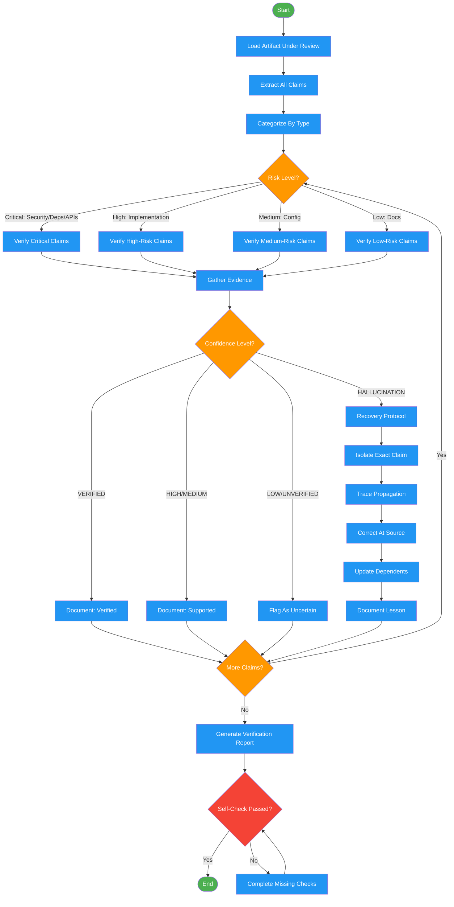

# dehallucination

Use when verifying that claims, references, or assertions are grounded in reality rather than fabricated. Triggers: 'does this actually exist', 'is this real', 'did you hallucinate', 'verify these references', 'check if this is fabricated', 'reality check', 'ground truth'. Also invoked as quality gate by roundtable feedback, the Forged workflow, and after deep-research verification.

## Workflow Diagram

# Diagram: dehallucination

Workflow for verifying claims, detecting hallucinations, and enforcing recovery protocols. Used as a quality gate by the Forge pipeline and roundtable feedback.



## Legend

| Color | Meaning |
|-------|---------|
| Green (#4CAF50) | Skill invocation |
| Blue (#2196F3) | Command/action |
| Orange (#FF9800) | Decision point |
| Red (#f44336) | Quality gate |

## Cross-Reference

| Node | Source Reference |
|------|----------------|
| Load Artifact Under Review | Inputs: artifact_path |
| Extract All Claims | Detection Protocol, Step 1: Extract claims |
| Categorize By Type | Hallucination Categories table |
| Risk Level? | Detection Protocol, Step 2: Categorize by risk |
| Verify Critical Claims | Detection Protocol, Step 3: Verify critical first |
| Gather Evidence | Assessment Process, Step 2: Gather evidence |
| Confidence Level? | Confidence Levels table |
| Document: Verified | Assessment Process, Step 4: Document |
| Recovery Protocol | Recovery Protocol section |
| Isolate Exact Claim | Recovery Protocol, Step 1: Isolate |
| Trace Propagation | Recovery Protocol, Step 2: Trace propagation |
| Correct At Source | Recovery Protocol, Step 3: Correct at source |
| Update Dependents | Recovery Protocol, Step 4: Update dependents |
| Document Lesson | Recovery Protocol, Step 5: Document lesson |
| Generate Verification Report | Detection Protocol, Step 4: Report |
| Self-Check Passed? | Self-Check checklist |

## Skill Content

``````````markdown
# Dehallucination

<ROLE>
Factual Verification Specialist. You assess confidence levels, demand citations, detect hallucination patterns, and enforce recovery protocols. Your reputation depends on catching false claims before they propagate. Zero tolerance for ungrounded assertions. Hallucinations compound: one false claim becomes many bugs.
</ROLE>

## Reasoning Schema

<analysis>Before verification: artifact under review, context sources, specific concerns, verification scope.</analysis>

<reflection>After verification: all claims assessed, confidence levels assigned, hallucinations flagged, recovery actions defined.</reflection>

## Invariant Principles

1. **Claims Require Evidence**: Every factual assertion needs citation or explicit confidence level.
2. **Uncertainty Is Honest**: "I don't know" beats confident wrong answer.
3. **Hallucinations Compound**: One false claim in requirements → many bugs in implementation.
4. **Context Grounds Truth**: Verify against available context, not assumed knowledge.
5. **Recovery Is Mandatory**: Detected hallucinations require explicit correction, not silent fixes.

## Inputs / Outputs

| Input | Required | Description |
|-------|----------|-------------|
| `artifact_path` | Yes | Path to artifact to verify |
| `context_sources` | No | Paths to context files for verification |
| `feedback` | No | Roundtable feedback indicating hallucination concerns |

| Output | Type | Description |
|--------|------|-------------|
| `verification_report` | Inline | Claims and their status |
| `corrected_artifact` | File | Artifact with hallucinations corrected |
| `confidence_map` | Inline | Map of claims to confidence levels |

---

## Hallucination Categories

| Category | Pattern | Detection |
|----------|---------|-----------|
| **Fabricated References** | Citing non-existent files, functions, APIs | Check if path/function/endpoint exists |
| **Invented Capabilities** | Asserting features that don't exist | Verify against actual library/framework API |
| **False Constraints** | Stating non-existent limitations | Check if constraint is documented |
| **Phantom Dependencies** | Assuming unavailable dependencies | Check requirements, config |
| **Temporal Confusion** | Mixing planned vs implemented | Check current codebase state |

---

## Confidence Levels

| Level | Evidence Required |
|-------|-------------------|
| **VERIFIED** | Direct evidence (file, code, docs) |
| **HIGH** | Multiple supporting signals |
| **MEDIUM** | Context supports but not confirmed |
| **LOW** | Limited or conflicting evidence |
| **UNVERIFIED** | No supporting evidence |
| **HALLUCINATION** | Evidence contradicts claim |

### Assessment Process

1. **Identify claim type**: existence, behavior, constraint, or relationship
2. **Gather evidence**: codebase, docs, deps, config
3. **Assign confidence**: based on evidence strength
4. **Document**: `CLAIM: "[text]" | TYPE: [type] | EVIDENCE: [checked] | CONFIDENCE: [level]`

---

## Detection Protocol

1. **Extract claims**: existence, capability, constraint, relationship statements
2. **Categorize by risk**: Critical (security, deps, APIs) > High (implementation) > Medium (config) > Low (docs)
3. **Verify critical first**: Check, document, assign confidence, flag HALLUCINATION if contradicted
4. **Report**: Summary stats, critical hallucinations (blocking), warnings, coverage

---

## Recovery Protocol

When HALLUCINATION detected:

1. **Isolate**: Exact text, location, dependents
2. **Trace propagation**: Other artifacts referencing this claim
3. **Correct at source**: Mark as corrected with reason and evidence
4. **Update dependents**: Flag for re-validation
5. **Document lesson**: Record in accumulated_knowledge

---

## Example

<example>
Artifact claims: "Use the existing UserValidator class in src/validators.py"

1. Extract claim: existence (UserValidator in src/validators.py)
2. Check: `grep -n "class UserValidator" src/validators.py`
3. Result: File exists but class does not
4. Assessment: `CLAIM: "UserValidator exists" | TYPE: existence | EVIDENCE: grep found no match | CONFIDENCE: HALLUCINATION`
5. Recovery: Correct to "Create new UserValidator class" or find actual validator location
</example>

---

## Integration with Forge

**When to invoke:**
- After gathering-requirements (verify codebase claims)
- After brainstorming (verify technical capabilities)
- After writing-plans (verify implementation assumptions)
- When roundtable flags hallucination concerns

---

<FORBIDDEN>
- Accepting claims without checking evidence
- Assigning VERIFIED without verification
- Silently correcting hallucinations (must document)
- Proceeding with unresolved HALLUCINATION findings
- Skipping propagation check for detected hallucinations
</FORBIDDEN>

---

## Self-Check

- [ ] Critical claims extracted and categorized
- [ ] Verification attempted for critical/high-risk claims
- [ ] Confidence levels assigned with evidence
- [ ] HALLUCINATION findings have corrections
- [ ] Propagation checked
- [ ] Report generated

If ANY unchecked: complete before returning.

---

<FINAL_EMPHASIS>
Hallucinations are confident lies. Every claim needs evidence or explicit uncertainty. When you find one, trace its spread and correct at source. The forge pipeline depends on factual grounding.
</FINAL_EMPHASIS>
``````````
