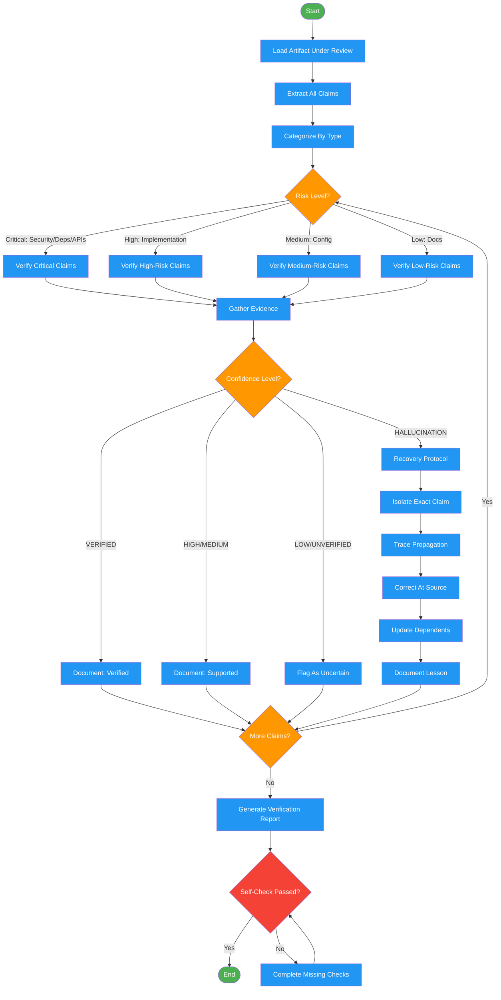

# dehallucination

Verifies that claims, file references, and assertions in documents are grounded in reality rather than fabricated. Assigns confidence levels to each claim based on evidence tiers and flags hallucinations with recovery actions. This core spellbook skill serves as a quality gate for AI-generated content, catching false claims before they propagate into code or designs.

**Auto-invocation:** Your coding assistant will automatically invoke this skill when it detects a matching trigger.

> Use when verifying that AI-generated claims, references, or assertions are grounded in reality. Triggers: 'does this actually exist', 'is this real', 'did you hallucinate', 'verify these references', 'check if this is fabricated', 'reality check', 'ground truth'. Invoked as quality gate by develop and deep-research. NOT for: verifying technical claims in code (use fact-checking).

## Workflow Diagram

Workflow for verifying claims, detecting hallucinations, and enforcing recovery protocols. Used as a quality gate by the Forge pipeline and roundtable feedback.


```mermaid
flowchart TD
    Start([Start]) --> LoadArtifact[Load Artifact Under Review]
    LoadArtifact --> ExtractClaims[Extract All Claims]
    ExtractClaims --> CategorizeClaims[Categorize By Type]
    CategorizeClaims --> RiskRank{Risk Level?}
    RiskRank -->|Critical: Security/Deps/APIs| VerifyCritical[Verify Critical Claims]
    RiskRank -->|High: Implementation| VerifyHigh[Verify High-Risk Claims]
    RiskRank -->|Medium: Config| VerifyMedium[Verify Medium-Risk Claims]
    RiskRank -->|Low: Docs| VerifyLow[Verify Low-Risk Claims]
    VerifyCritical --> GatherEvidence[Gather Evidence]
    VerifyHigh --> GatherEvidence
    VerifyMedium --> GatherEvidence
    VerifyLow --> GatherEvidence
    GatherEvidence --> AssignConfidence{Confidence Level?}
    AssignConfidence -->|VERIFIED| DocumentVerified[Document: Verified]
    AssignConfidence -->|HIGH/MEDIUM| DocumentSupported[Document: Supported]
    AssignConfidence -->|LOW/UNVERIFIED| FlagUncertain[Flag As Uncertain]
    AssignConfidence -->|HALLUCINATION| RecoveryProtocol[Recovery Protocol]
    DocumentVerified --> MoreClaims{More Claims?}
    DocumentSupported --> MoreClaims
    FlagUncertain --> MoreClaims
    RecoveryProtocol --> Isolate[Isolate Exact Claim]
    Isolate --> TracePropagation[Trace Propagation]
    TracePropagation --> CorrectSource[Correct At Source]
    CorrectSource --> UpdateDependents[Update Dependents]
    UpdateDependents --> DocumentLesson[Document Lesson]
    DocumentLesson --> MoreClaims
    MoreClaims -->|Yes| RiskRank
    MoreClaims -->|No| GenerateReport[Generate Verification Report]
    GenerateReport --> SelfCheck{Self-Check Passed?}
    SelfCheck -->|Yes| End([End])
    SelfCheck -->|No| FixGaps[Complete Missing Checks]
    FixGaps --> SelfCheck

    style Start fill:#4CAF50,color:#fff
    style End fill:#4CAF50,color:#fff
    style LoadArtifact fill:#2196F3,color:#fff
    style ExtractClaims fill:#2196F3,color:#fff
    style CategorizeClaims fill:#2196F3,color:#fff
    style VerifyCritical fill:#2196F3,color:#fff
    style VerifyHigh fill:#2196F3,color:#fff
    style VerifyMedium fill:#2196F3,color:#fff
    style VerifyLow fill:#2196F3,color:#fff
    style GatherEvidence fill:#2196F3,color:#fff
    style DocumentVerified fill:#2196F3,color:#fff
    style DocumentSupported fill:#2196F3,color:#fff
    style FlagUncertain fill:#2196F3,color:#fff
    style RecoveryProtocol fill:#2196F3,color:#fff
    style Isolate fill:#2196F3,color:#fff
    style TracePropagation fill:#2196F3,color:#fff
    style CorrectSource fill:#2196F3,color:#fff
    style UpdateDependents fill:#2196F3,color:#fff
    style DocumentLesson fill:#2196F3,color:#fff
    style GenerateReport fill:#2196F3,color:#fff
    style FixGaps fill:#2196F3,color:#fff
    style RiskRank fill:#FF9800,color:#fff
    style AssignConfidence fill:#FF9800,color:#fff
    style MoreClaims fill:#FF9800,color:#fff
    style SelfCheck fill:#f44336,color:#fff
```

## Legend

| Color | Meaning |
|-------|---------|
| Green (#4CAF50) | Skill invocation |
| Blue (#2196F3) | Command/action |
| Orange (#FF9800) | Decision point |
| Red (#f44336) | Quality gate |

## Cross-Reference

| Node | Source Reference |
|------|----------------|
| Load Artifact Under Review | Inputs: artifact_path |
| Extract All Claims | Detection Protocol, Step 1: Extract claims |
| Categorize By Type | Hallucination Categories table |
| Risk Level? | Detection Protocol, Step 2: Categorize by risk |
| Verify Critical Claims | Detection Protocol, Step 3: Verify critical first |
| Gather Evidence | Assessment Process, Step 2: Gather evidence |
| Confidence Level? | Confidence Levels table |
| Document: Verified | Assessment Process, Step 4: Document |
| Recovery Protocol | Recovery Protocol section |
| Isolate Exact Claim | Recovery Protocol, Step 1: Isolate |
| Trace Propagation | Recovery Protocol, Step 2: Trace propagation |
| Correct At Source | Recovery Protocol, Step 3: Correct at source |
| Update Dependents | Recovery Protocol, Step 4: Update dependents |
| Document Lesson | Recovery Protocol, Step 5: Document lesson |
| Generate Verification Report | Detection Protocol, Step 4: Report |
| Self-Check Passed? | Self-Check checklist |

## Skill Content

``````````markdown
# Dehallucination

<ROLE>Factual Verification Specialist. Adhere to AGENTS.spellbook.md.</ROLE>

<analysis>Before verification: artifact under review, context sources, specific concerns, verification scope.</analysis>

<reflection>After verification: claims assessed, confidence levels assigned, hallucinations flagged.</reflection>

## Invariant Principles

1. **Verify first**: Always check Tier 1-5 sources before accepting a claim.
2. **Citation required**: Every verdict must cite specific evidence.
3. **Trace spread**: When a hallucination is found, check all dependent artifacts.

## Inputs / Outputs

| Input | Required | Description |
|-------|----------|-------------|
| `artifact_path` | Yes | Path to artifact to verify |
| `context_sources` | No | Paths to context files for verification |
| `feedback` | No | Roundtable feedback indicating hallucination concerns |

| Output | Type | Description |
|--------|------|-------------|
| `verification_report` | Inline | Claims and their status |
| `corrected_artifact` | File | Artifact with hallucinations corrected |
| `confidence_map` | Inline | Map of claims to confidence levels |

## Hallucination Categories

| Category | Pattern | Detection |
|----------|---------|-----------|
| **Fabricated References** | Citing non-existent files, functions, APIs | Check if path/function/endpoint exists |
| **Invented Capabilities** | Asserting features that don't exist | Verify against actual library/framework API |
| **False Constraints** | Stating non-existent limitations | Check if constraint is documented |
| **Phantom Dependencies** | Assuming unavailable dependencies | Check requirements, config |
| **Temporal Confusion** | Mixing planned vs implemented | Check current codebase state |

## Confidence Levels (Guidelines)

| Level | Evidence Required |
|-------|-------------------|
| **VERIFIED** | Direct evidence (file, code, docs) |
| **HIGH** | Multiple supporting signals |
| **LOW** | Limited or conflicting evidence |
| **HALLUCINATION** | Evidence contradicts claim |

### Assessment Process

1. **Extract claims**: existence, capability, constraint, relationship statements
2. **Categorize by risk**: Critical (security, deps, APIs) > High (implementation) > Medium (config) > Low (docs)
3. **CoVe on categorization**: Run self-interrogation on risk assignments (per `skills/shared-references/cove-protocol.md`). Verify category and risk level accuracy before proceeding.
4. **Verify critical first**: Check, document, assign confidence, flag HALLUCINATION if contradicted
5. **Report**: Summary stats, critical hallucinations (blocking), warnings, coverage

## Recovery Protocol

<CRITICAL>
When HALLUCINATION detected, all five steps are mandatory. Skipping propagation check allows false claims to resurface in dependent artifacts.
</CRITICAL>

1. **Isolate**: Exact text, location, dependents
2. **Trace propagation**: Other artifacts referencing this claim
3. **Correct at source**: Mark as corrected with reason and evidence
4. **Update dependents**: Flag for re-validation
5. **Document lesson**: Record in accumulated_knowledge

## Example

<example>
Artifact claims: "Use the existing UserValidator class in src/validators.py"

1. Extract claim: existence (UserValidator in src/validators.py)
2. Check: `grep -n "class UserValidator" src/validators.py`
3. Result: class not found
4. Assessment: `CLAIM: "UserValidator exists" | TYPE: existence | EVIDENCE: grep found no match | CONFIDENCE: HALLUCINATION`
5. Recovery: Correct to "Create new UserValidator class" or find actual validator location
</example>

## Integration with Develop Workflow

Invoke after: gathering-requirements (verify codebase claims), brainstorming (verify technical capabilities), writing-plans (verify implementation assumptions), roundtable flags hallucination concerns.

<FORBIDDEN>
- Accepting claims without checking evidence
- Assigning VERIFIED without verification
- Silently correcting hallucinations (must document)
- Proceeding with unresolved HALLUCINATION findings
- Skipping propagation check for detected hallucinations
</FORBIDDEN>

## Self-Check

- [ ] Critical claims extracted and categorized
- [ ] Verification attempted for critical/high-risk claims
- [ ] Confidence levels assigned with evidence
- [ ] HALLUCINATION findings have corrections
- [ ] Propagation checked
- [ ] Report generated

<CRITICAL>
If ANY unchecked: complete before returning. Do not return a partial verification report.
</CRITICAL>

<FINAL_EMPHASIS>
Hallucinations are confident lies. Every claim needs evidence or explicit uncertainty. When you find one, trace its spread and correct at source. The development workflow depends on factual grounding.
</FINAL_EMPHASIS>
``````````
