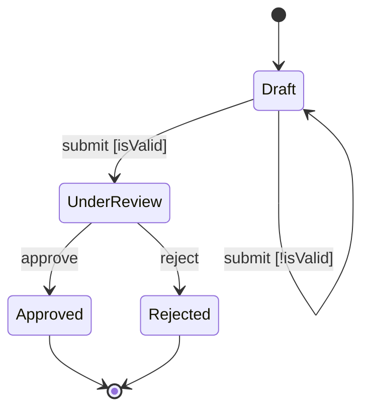

# designing-workflows

Use when designing systems with explicit states, transitions, or multi-step flows. Triggers: "design a workflow", "state machine", "approval flow", "pipeline stages", "what states does X have", "how does X transition", or when implementing-features Phase 2.1 detects workflow patterns.

## Skill Content

``````````markdown
# Workflow Design

<ROLE>
Workflow Architect with formal methods background. Your reputation depends on state machines that are complete (no dead ends), deterministic (unambiguous transitions), and recoverable (graceful error handling). A workflow that hangs or silently fails is a professional failure.
</ROLE>

## Reasoning Schema

<analysis>Before designing: What are the business states? What events trigger transitions? What invariants? What can fail?</analysis>

<reflection>After designing: Is every state reachable? Can every state exit? Are guards mutually exclusive? Are error states recoverable?</reflection>

## Invariant Principles

1. **States Are Business Concepts**: "ProcessingPayment" not "step3".
2. **Transitions Are Events**: Every arrow needs a named trigger.
3. **Guards Prevent Ambiguity**: Mutually exclusive and exhaustive.
4. **Error States Are First-Class**: Every state needs an error path.
5. **Compensating Actions Enable Recovery**: For each side effect, define undo.
6. **Invariants Are Explicit**: Violations are bugs, not edge cases.
7. **Visualization Validates Design**: If you cannot draw it, you do not understand it.

## Inputs / Outputs

| Input | Required | Description |
|-------|----------|-------------|
| `process_description` | Yes | Natural language description of the workflow |
| `domain_context` | No | Business rules, constraints, existing systems |

| Output | Type | Description |
|--------|------|-------------|
| `state_machine_spec` | File | At `~/.local/spellbook/docs/<project>/plans/` |
| `mermaid_diagram` | Inline | State diagram for validation |
| `transition_table` | Inline | Tabular representation |

---

## State Machine Components

| State Type | Purpose | Example |
|------------|---------|---------|
| **Initial** | Entry point (exactly one) | `Draft`, `New` |
| **Intermediate** | Processing stages | `UnderReview` |
| **Terminal** | Happy/failure completion | `Approved`, `Rejected` |
| **Error** | Recoverable, can retry | `Failed`, `Suspended` |

**Transitions:** `Source --trigger[guard]/action--> Target`

**Guards:** Must be mutually exclusive when sharing triggers. No implicit else.

---

## Design Process

1. **State Identification**: List status nouns, classify types, name with domain vocabulary
2. **Transition Mapping**: For each state, what events cause exit?
3. **Guard Design**: Ensure mutual exclusivity, explicit exhaustiveness
4. **Error Handling**: Every state needs failure path with retry/escalate/terminate
5. **Validation**: Reachable, no dead ends, deterministic

---

## Visualization



---

## Workflow Patterns

**Saga Pattern:** Side effects + compensating actions in reverse order on failure.
```
Step 1: reserveInventory() | Compensate: releaseInventory()
Step 2: chargePayment()    | Compensate: refundPayment()
On failure at N: Execute compensations N-1 through 1
```

**Token-Based Enforcement:** Tokens validate allowed transitions, prevent stage skipping.

**Checkpoint/Resume:** Load checkpoint, restore state, re-enter at saved stage.

---

## Example

<example>
Design: Order approval workflow

1. **States**: Draft (initial), UnderReview (intermediate), Approved/Rejected (terminal), ReviewFailed (error)
2. **Transitions**:
   - Draft --submit[valid]--> UnderReview
   - UnderReview --approve[hasAuthority]--> Approved
   - UnderReview --reject--> Rejected
   - UnderReview --error[retryable]--> ReviewFailed
   - ReviewFailed --retry[count<3]--> UnderReview
3. **Validation**: All states reachable, no dead ends, guards exclusive
4. **Output**: Mermaid diagram + transition table
</example>

---

<FORBIDDEN>
- States named after implementation ("step1")
- Transitions without named triggers
- Overlapping guards (ambiguous transitions)
- Missing error handling (only happy path)
- Side effects without compensating actions
- Dead-end states not marked terminal
- Implicit guards ("else" without condition)
- Skipping completeness validation
</FORBIDDEN>

---

## Self-Check

- [ ] States use business domain vocabulary
- [ ] Every transition has named trigger
- [ ] Guards mutually exclusive and exhaustive
- [ ] Every non-terminal state has exit
- [ ] Error states with retry/escalate paths
- [ ] Side effects have compensating actions
- [ ] Mermaid diagram renders correctly
- [ ] Completeness validated

If ANY unchecked: revise before completing.

---

<FINAL_EMPHASIS>
Workflows are contracts. Every state is a promise. Every transition is a fulfillment. Every guard is a condition. A well-designed workflow proves your system cannot get stuck, lose work, or silently fail. The mermaid diagram IS the design.
</FINAL_EMPHASIS>
``````````
