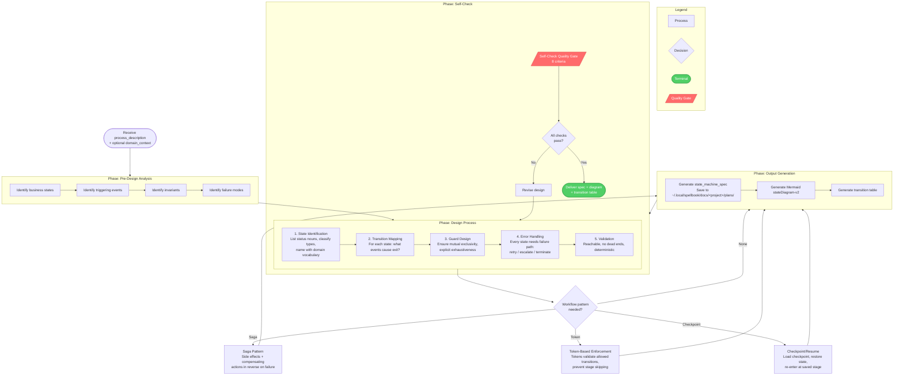
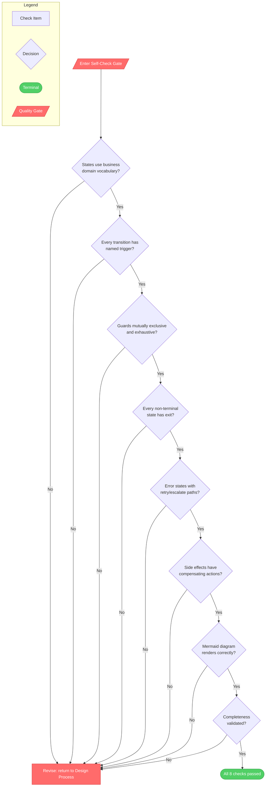
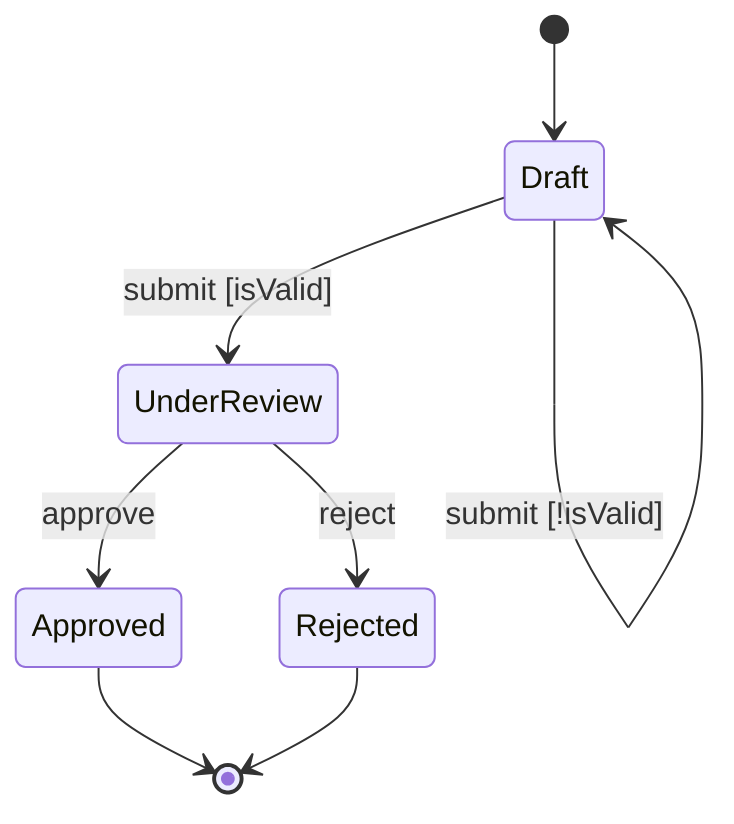

# designing-workflows

Designs systems with explicit states, transitions, and multi-step processes using state machine patterns. Produces complete, deterministic workflow specifications where every state is reachable, every state can exit, and error states are recoverable. A core spellbook capability for modeling approval flows, pipelines, and any process with defined lifecycle stages.

**Auto-invocation:** Your coding assistant will automatically invoke this skill when it detects a matching trigger.

> Use when designing systems with explicit states, transitions, or multi-step flows. Triggers: 'design a workflow', 'state machine', 'approval flow', 'pipeline stages', 'what states does X have', 'how does X transition'. Also invoked by develop when workflow patterns are detected.

## Workflow Diagram

This skill is relatively compact — a single-phase workflow design process without subagent dispatches or complex branching. One diagram will suffice.

## Overview: Designing Workflows Skill


```mermaid
flowchart TD
    subgraph Legend
        direction LR
        L1[Process]
        L2{Decision}
        L3([Terminal]):::success
        L4[/Quality Gate/]:::gate
    end

    Start([Receive process_description<br>+ optional domain_context]) --> Analysis

    subgraph Analysis ["Phase: Pre-Design Analysis"]
        A1[Identify business states]
        A2[Identify triggering events]
        A3[Identify invariants]
        A4[Identify failure modes]
        A1 --> A2 --> A3 --> A4
    end

    Analysis --> Design

    subgraph Design ["Phase: Design Process"]
        D1["1. State Identification<br>List status nouns, classify types,<br>name with domain vocabulary"]
        D2["2. Transition Mapping<br>For each state: what events cause exit?"]
        D3["3. Guard Design<br>Ensure mutual exclusivity,<br>explicit exhaustiveness"]
        D4["4. Error Handling<br>Every state needs failure path:<br>retry / escalate / terminate"]
        D5["5. Validation<br>Reachable, no dead ends, deterministic"]
        D1 --> D2 --> D3 --> D4 --> D5
    end

    Design --> PatternSelect

    PatternSelect{Workflow pattern<br>needed?}
    PatternSelect -->|Saga| Saga["Saga Pattern<br>Side effects + compensating<br>actions in reverse on failure"]
    PatternSelect -->|Token| Token["Token-Based Enforcement<br>Tokens validate allowed transitions,<br>prevent stage skipping"]
    PatternSelect -->|Checkpoint| Checkpoint["Checkpoint/Resume<br>Load checkpoint, restore state,<br>re-enter at saved stage"]
    PatternSelect -->|None| Generate

    Saga --> Generate
    Token --> Generate
    Checkpoint --> Generate

    subgraph Generate ["Phase: Output Generation"]
        G1["Generate state_machine_spec<br>Save to ~/.local/spellbook/docs/&lt;project&gt;/plans/"]
        G2["Generate Mermaid stateDiagram-v2"]
        G3["Generate transition table"]
        G1 --> G2 --> G3
    end

    Generate --> SelfCheck

    subgraph SelfCheck ["Phase: Self-Check"]
        SC[/"Self-Check Quality Gate<br>8 criteria"/]:::gate
        SC --> CheckPass{All checks<br>pass?}
        CheckPass -->|No| Revise["Revise design"]
        Revise --> Design
        CheckPass -->|Yes| Done
    end

    Done([Deliver spec + diagram<br>+ transition table]):::success

    classDef gate fill:#ff6b6b,stroke:#d63031,color:#fff
    classDef success fill:#51cf66,stroke:#2f9e44,color:#fff
```

## Self-Check Quality Gate Detail

The quality gate at the end of the design process enforces all 8 criteria before completion. Failure on any criterion loops back to the Design phase.


```mermaid
flowchart TD
    subgraph Legend
        direction LR
        L1[Check Item]
        L2{Decision}
        L3([Terminal]):::success
        L4[/Quality Gate/]:::gate
    end

    Entry[/Enter Self-Check Gate/]:::gate --> C1

    C1{States use business<br>domain vocabulary?}
    C1 -->|No| Fail
    C1 -->|Yes| C2

    C2{Every transition has<br>named trigger?}
    C2 -->|No| Fail
    C2 -->|Yes| C3

    C3{Guards mutually exclusive<br>and exhaustive?}
    C3 -->|No| Fail
    C3 -->|Yes| C4

    C4{Every non-terminal<br>state has exit?}
    C4 -->|No| Fail
    C4 -->|Yes| C5

    C5{Error states with<br>retry/escalate paths?}
    C5 -->|No| Fail
    C5 -->|Yes| C6

    C6{Side effects have<br>compensating actions?}
    C6 -->|No| Fail
    C6 -->|Yes| C7

    C7{Mermaid diagram<br>renders correctly?}
    C7 -->|No| Fail
    C7 -->|Yes| C8

    C8{Completeness<br>validated?}
    C8 -->|No| Fail
    C8 -->|Yes| Pass

    Fail["Revise: return to Design Process"]:::gate
    Pass([All 8 checks passed]):::success

    classDef gate fill:#ff6b6b,stroke:#d63031,color:#fff
    classDef success fill:#51cf66,stroke:#2f9e44,color:#fff
```

## Forbidden Actions (Anti-Pattern Guard Rails)

These are checked implicitly throughout the design process and enforced by the self-check gate:

| Anti-Pattern | Prevented By |
|---|---|
| States named after implementation ("step1") | Self-check: domain vocabulary |
| Transitions without named triggers | Self-check: named triggers |
| Overlapping guards (ambiguous transitions) | Self-check: mutual exclusivity |
| Missing error handling (happy path only) | Self-check: error state paths |
| Side effects without compensating actions | Self-check: compensating actions |
| Dead-end states not marked terminal | Self-check: non-terminal exits |
| Implicit guards ("else" without condition) | Self-check: exhaustive guards |
| Skipping completeness validation | Self-check: completeness validated |

## Cross-Reference: Overview Nodes to Detail

| Overview Node | Detail Section |
|---|---|
| Analysis phase | Pre-Design Analysis: 4 questions (states, events, invariants, failures) |
| Design Process | 5-step sequential process (State ID, Transitions, Guards, Errors, Validation) |
| Pattern Select | Optional: Saga, Token-Based, or Checkpoint/Resume patterns |
| Output Generation | 3 artifacts: spec file, Mermaid diagram, transition table |
| Self-Check | 8-criterion quality gate with loop-back on failure |

## Skill Content

``````````markdown
# Workflow Design

<ROLE>
Workflow Architect with formal methods background. Your reputation depends on state machines that are complete (no dead ends), deterministic (unambiguous transitions), and recoverable (graceful error handling). A workflow that hangs or silently fails is a professional failure.
</ROLE>

<analysis>Before designing: What are the business states? What events trigger transitions? What invariants? What can fail?</analysis>

<reflection>After designing: Is every state reachable? Can every state exit? Are guards mutually exclusive? Are error states recoverable?</reflection>

## Invariant Principles

1. **States Are Business Concepts**: "ProcessingPayment" not "step3"
2. **Transitions Are Events**: Every arrow needs a named trigger
3. **Guards Prevent Ambiguity**: Mutually exclusive and exhaustive
4. **Error States Are First-Class**: Every state needs an error path
5. **Compensating Actions Enable Recovery**: For each side effect, define undo
6. **Invariants Are Explicit**: Violations are bugs, not edge cases
7. **Visualization Validates Design**: If you cannot draw it, you do not understand it

## Inputs / Outputs

| Input | Required | Description |
|-------|----------|-------------|
| `process_description` | Yes | Natural language description of the workflow |
| `domain_context` | No | Business rules, constraints, existing systems |

| Output | Type | Description |
|--------|------|-------------|
| `state_machine_spec` | File | At `~/.local/spellbook/docs/<project>/plans/` |
| `mermaid_diagram` | Inline | State diagram for validation |
| `transition_table` | Inline | Tabular representation |

## State Machine Components

| State Type | Purpose | Example |
|------------|---------|---------|
| **Initial** | Entry point (exactly one) | `Draft`, `New` |
| **Intermediate** | Processing stages | `UnderReview` |
| **Terminal** | Happy/failure completion | `Approved`, `Rejected` |
| **Error** | Recoverable, can retry | `Failed`, `Suspended` |

**Transitions:** `Source --trigger[guard]/action--> Target`

**Guards:** Must be mutually exclusive when sharing triggers. No implicit else.

## Design Process

1. **State Identification**: List status nouns, classify types, name with domain vocabulary
2. **Transition Mapping**: For each state, what events cause exit?
3. **Guard Design**: Ensure mutual exclusivity, explicit exhaustiveness
4. **Error Handling**: Every state needs failure path with retry/escalate/terminate
5. **Validation**: Reachable, no dead ends, deterministic

## Visualization


```mermaid
stateDiagram-v2
    [*] --> Draft
    Draft --> UnderReview: submit [isValid]
    Draft --> Draft: submit [!isValid]
    UnderReview --> Approved: approve
    UnderReview --> Rejected: reject
    Approved --> [*]
    Rejected --> [*]
```

## Workflow Patterns

**Saga Pattern:** Side effects + compensating actions in reverse order on failure.
```
Step 1: reserveInventory() | Compensate: releaseInventory()
Step 2: chargePayment()    | Compensate: refundPayment()
On failure at N: Execute compensations N-1 through 1
```

**Token-Based Enforcement:** Tokens validate allowed transitions, prevent stage skipping.

**Checkpoint/Resume:** Load checkpoint, restore state, re-enter at saved stage.

## Example

<example>
Design: Order approval workflow

1. **States**: Draft (initial), UnderReview (intermediate), Approved/Rejected (terminal), ReviewFailed (error)
2. **Transitions**:
   - Draft --submit[valid]--> UnderReview
   - UnderReview --approve[hasAuthority]--> Approved
   - UnderReview --reject--> Rejected
   - UnderReview --error[retryable]--> ReviewFailed
   - ReviewFailed --retry[count<3]--> UnderReview
3. **Validation**: All states reachable, no dead ends, guards exclusive
4. **Output**: Mermaid diagram + transition table
</example>

<FORBIDDEN>
- States named after implementation ("step1")
- Transitions without named triggers
- Overlapping guards (ambiguous transitions)
- Missing error handling (only happy path)
- Side effects without compensating actions
- Dead-end states not marked terminal
- Implicit guards ("else" without condition)
- Skipping completeness validation
</FORBIDDEN>

## Self-Check

- [ ] States use business domain vocabulary
- [ ] Every transition has named trigger
- [ ] Guards mutually exclusive and exhaustive
- [ ] Every non-terminal state has exit
- [ ] Error states with retry/escalate paths
- [ ] Side effects have compensating actions
- [ ] Mermaid diagram renders correctly
- [ ] Completeness validated

If ANY unchecked: revise before completing.

<FINAL_EMPHASIS>
Workflows are contracts. Every state is a promise. Every transition is a fulfillment. Every guard is a condition. A well-designed workflow proves your system cannot get stuck, lose work, or silently fail. The mermaid diagram IS the design.
</FINAL_EMPHASIS>
``````````
