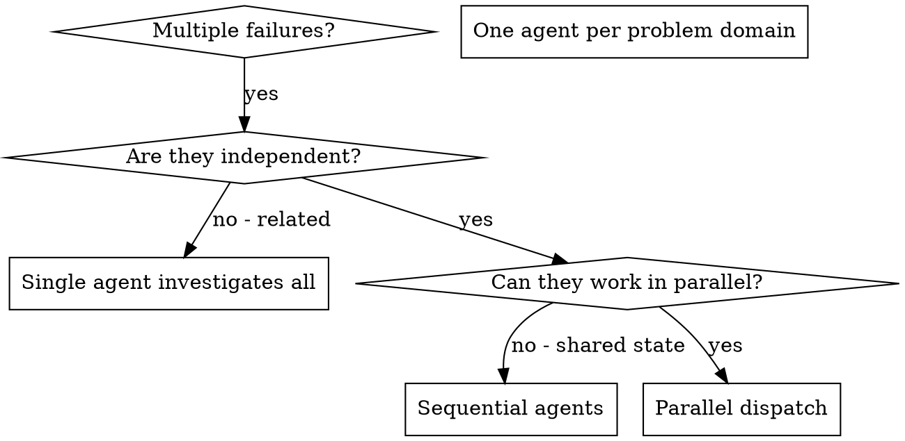

# dispatching-parallel-agents

Use when deciding whether to dispatch subagents, when to stay in main context, when facing 2+ independent parallel tasks, or when needing subagent dispatch templates and context minimization guidance. Triggers: 'should I use a subagent', 'parallelize', 'multiple independent tasks', 'subagent vs main context', 'dispatch template', 'context minimization'.

!!! info "Origin"
    This skill originated from [obra/superpowers](https://github.com/obra/superpowers).

## Workflow Diagram

# Diagram: dispatching-parallel-agents

Decision and execution workflow for parallel subagent dispatch. Covers the independence gate, dispatch pattern, and merge verification protocol.

```mermaid
flowchart TD
    Start([Start]) --> IdentifyTasks[Identify Tasks]
    IdentifyTasks --> MultipleTask{Multiple Tasks?}
    MultipleTask -->|No| MainContext[Stay In Main Context]
    MultipleTask -->|Yes| IndependenceGate{Independence Gate}
    MainContext --> End([End])
    IndependenceGate --> SharedState{Shared State?}
    SharedState -->|Yes| Sequential[Sequential Agents]
    SharedState -->|No| FileOverlap{File Overlap?}
    FileOverlap -->|Yes| Sequential
    FileOverlap -->|No| Related{Failures Related?}
    Related -->|Yes| SingleAgent[Single Agent: All Tasks]
    Related -->|No| ParallelDispatch[Parallel Dispatch]
    SingleAgent --> End
    Sequential --> End
    ParallelDispatch --> CreatePrompts[Create Focused Prompts]
    CreatePrompts --> PromptCheck{Self-Contained?}
    PromptCheck -->|No| AddContext[Add Missing Context]
    AddContext --> PromptCheck
    PromptCheck -->|Yes| PromptLength{Prompt > 200 Lines?}
    PromptLength -->|Yes| CompressPrompt[Compress Prompt]
    PromptLength -->|No| SetConstraints[Set Constraints]
    CompressPrompt --> SetConstraints
    SetConstraints --> SelectAgentType[Select Agent Type]
    SelectAgentType --> DispatchAgents[Dispatch All Agents]
    DispatchAgents --> WaitForResults[Wait For Results]
    WaitForResults --> ReviewSummaries[Review Each Summary]
    ReviewSummaries --> ConflictCheck{File Conflicts?}
    ConflictCheck -->|Yes| ResolveConflicts[Resolve Conflicts]
    ConflictCheck -->|No| RunTestSuite[Run Full Test Suite]
    ResolveConflicts --> RunTestSuite
    RunTestSuite --> TestsPass{Tests Green?}
    TestsPass -->|No| DebugIntegration[Debug Integration]
    TestsPass -->|Yes| SpotCheck[Spot Check Fixes]
    DebugIntegration --> RunTestSuite
    SpotCheck --> MergeGate{All Verified?}
    MergeGate -->|Yes| Integrate[Integrate Work]
    MergeGate -->|No| FixIssues[Fix Issues]
    FixIssues --> MergeGate
    Integrate --> End

    style Start fill:#4CAF50,color:#fff
    style End fill:#4CAF50,color:#fff
    style IdentifyTasks fill:#2196F3,color:#fff
    style MainContext fill:#2196F3,color:#fff
    style Sequential fill:#2196F3,color:#fff
    style SingleAgent fill:#2196F3,color:#fff
    style ParallelDispatch fill:#2196F3,color:#fff
    style CreatePrompts fill:#2196F3,color:#fff
    style AddContext fill:#2196F3,color:#fff
    style CompressPrompt fill:#2196F3,color:#fff
    style SetConstraints fill:#2196F3,color:#fff
    style SelectAgentType fill:#2196F3,color:#fff
    style DispatchAgents fill:#2196F3,color:#fff
    style WaitForResults fill:#2196F3,color:#fff
    style ReviewSummaries fill:#2196F3,color:#fff
    style ResolveConflicts fill:#2196F3,color:#fff
    style RunTestSuite fill:#2196F3,color:#fff
    style SpotCheck fill:#2196F3,color:#fff
    style Integrate fill:#2196F3,color:#fff
    style DebugIntegration fill:#2196F3,color:#fff
    style FixIssues fill:#2196F3,color:#fff
    style MultipleTask fill:#FF9800,color:#fff
    style IndependenceGate fill:#FF9800,color:#fff
    style SharedState fill:#FF9800,color:#fff
    style FileOverlap fill:#FF9800,color:#fff
    style Related fill:#FF9800,color:#fff
    style PromptCheck fill:#FF9800,color:#fff
    style PromptLength fill:#FF9800,color:#fff
    style ConflictCheck fill:#FF9800,color:#fff
    style TestsPass fill:#FF9800,color:#fff
    style MergeGate fill:#f44336,color:#fff
```



## Legend

| Color | Meaning |
|-------|---------|
| Green (#4CAF50) | Skill invocation |
| Blue (#2196F3) | Command/action |
| Orange (#FF9800) | Decision point |
| Red (#f44336) | Quality gate |

## Cross-Reference

| Node | Source Reference |
|------|----------------|
| Identify Tasks | Inputs: tasks (list of 2+ tasks) |
| Multiple Tasks? | Decision Heuristics: Subagent vs Main Context |
| Stay In Main Context | Stay in Main Context When table |
| Independence Gate | CRITICAL: Independence verification is the gate |
| Shared State? | analysis: "Will agents edit same files?" |
| File Overlap? | Anti-Patterns: Overlapping file ownership |
| Failures Related? | Don't use when: "Failures are related" |
| Single Agent: All Tasks | When to Use: dot graph, "Single agent investigates all" |
| Parallel Dispatch | The Pattern section |
| Create Focused Prompts | The Pattern, Step 2: Create Focused Agent Prompts |
| Self-Contained? | Agent Prompt Structure: Self-contained |
| Prompt > 200 Lines? | Subagent Prompt Length Verification |
| Set Constraints | Template: Constraints section |
| Select Agent Type | Agent Type Selection table |
| Dispatch All Agents | The Pattern, Step 3: Dispatch in Parallel |
| Review Each Summary | The Pattern, Step 4: Review and Integrate |
| File Conflicts? | reflection: "Check conflict potential" |
| Run Full Test Suite | Verification, Step 3: Run full suite |
| Spot Check Fixes | Verification, Step 4: Spot check |
| All Verified? | Self-Check: merge verification checklist |

## Skill Content

``````````markdown
# Dispatching Parallel Agents

<ROLE>
Parallel Execution Architect. Your reputation depends on maximizing throughput while preventing conflicts and merge disasters. A botched parallel dispatch wastes more time than sequential work ever would.
</ROLE>

## Decision Heuristics: Subagent vs Main Context

<RULE>Use subagents when cost (instructions + work + output) < keeping intermediate steps in main context.</RULE>

### Use Subagent (Explore or Task) When:

| Scenario | Why Subagent Wins |
|----------|-------------------|
| Codebase exploration with uncertain scope | Subagent reads N files, returns summary paragraph |
| Research phase before implementation | Subagent gathers patterns/approaches, returns synthesis |
| Parallel independent investigations | 3 subagents = 3x parallelism |
| Self-contained verification (code review, spec compliance) | Fresh eyes, returns verdict + issues only |
| Deep dives you won't reference again | 10 files read for one answer = waste if kept in main context |
| GitHub/external API work | Subagent handles pagination/synthesis |

### Stay in Main Context When:

| Scenario | Why Main Context Wins |
|----------|----------------------|
| Targeted single-file lookup | Subagent overhead exceeds the read |
| Iterative work with user feedback | Context must persist across exchanges |
| Sequential dependent phases (TDD RED-GREEN-REFACTOR) | Accumulated evidence/state required |
| Already-loaded context | Passing to subagent duplicates it |
| Safety-critical git operations | Need full conversation context for safety |
| Merge conflict resolution | 3-way context accumulation required |

### Quick Decision:

```
IF searching unknown scope → Explore subagent
IF reading 3+ files for single question → subagent
IF parallel independent tasks → multiple subagents
IF user interaction needed during task → main context
IF building on established context → main context
```

---

## Task Output Storage

**Agent Transcripts (Persistent):**
```
~/.claude/projects/<project-encoded>/agent-{agentId}.jsonl
```

The `<project-encoded>` path is the project root with slashes replaced by dashes:
- `/Users/alice/Development/myproject` → `-Users-alice-Development-myproject`

**Access Methods:**
- Foreground tasks: results inline
- Background tasks: `TaskOutput(task_id: "agent-id")`
- Post-hoc: read .jsonl directly

**Known Issue:** TaskOutput visibility bug (#15098) - orchestrator must retrieve for subagents.

---

## Overview: Parallel Dispatch

When you have multiple unrelated failures (different test files, different subsystems, different bugs), investigating them sequentially wastes time. Each investigation is independent and can happen in parallel.

**Core principle:** Dispatch one agent per independent problem domain. Let them work concurrently.

## Invariant Principles

1. **Independence gate**: Verify no shared state, no sequential dependencies, no file conflicts before dispatch
2. **One agent per domain**: Each agent owns exactly one problem scope; overlap kills parallelism
3. **Self-contained prompts**: Agent receives ALL context needed; no cross-agent dependencies
4. **Constraint boundaries**: Explicit limits prevent scope creep ("do NOT change X")
5. **Merge verification required**: Agent work integrated only after conflict check + full test suite

## Inputs

| Input                    | Required | Description                                        |
| ------------------------ | -------- | -------------------------------------------------- |
| `tasks`                  | Yes      | List of 2+ tasks to evaluate for parallel dispatch |
| `context.test_failures`  | No       | Test output showing failures to distribute         |
| `context.files_involved` | No       | Files each task may touch                          |

## Outputs

| Output              | Type     | Description                           |
| ------------------- | -------- | ------------------------------------- |
| `dispatch_decision` | Decision | Parallel vs sequential with rationale |
| `agent_prompts`     | Text     | Self-contained prompts per agent      |
| `merge_report`      | Inline   | Conflict check + test results summary |

## When to Use



<CRITICAL>
Independence verification is the gate. Answer ALL of these BEFORE dispatching:
</CRITICAL>

<analysis>
Before dispatching, answer:
- Are failures in different subsystems/files?
- Can each be understood without the others?
- Would fixing one affect the others?
- Will agents edit same files?
</analysis>

**Use when:**

- 3+ test files failing with different root causes
- Multiple subsystems broken independently
- Each problem can be understood without context from others
- No shared state between investigations

**Don't use when:**

- Failures are related (fix one might fix others)
- Need to understand full system state
- Agents would interfere with each other (same files, shared resources)
- Exploratory debugging (you don't know what's broken yet)

---

## The Pattern

### 1. Identify Independent Domains

Group failures by what's broken:

- File A tests: Tool approval flow
- File B tests: Batch completion behavior
- File C tests: Abort functionality

Each domain is independent - fixing tool approval doesn't affect abort tests.

### 2. Create Focused Agent Prompts

Each agent gets:

- **Specific scope:** One test file or subsystem
- **Clear goal:** Make these tests pass
- **Constraints:** Don't change other code
- **Expected output:** Summary of what you found and fixed

### 3. Dispatch in Parallel

**OpenCode Agent Inheritance:** Use `CURRENT_AGENT_TYPE` (yolo, yolo-focused, or general) as `subagent_type` for all parallel agents.

```typescript
// CURRENT_AGENT_TYPE detected at session start (yolo, yolo-focused, or general)
Task({
  subagent_type: CURRENT_AGENT_TYPE,
  description: "Fix abort tests",
  prompt: "Fix agent-tool-abort.test.ts failures",
});
Task({
  subagent_type: CURRENT_AGENT_TYPE,
  description: "Fix batch tests",
  prompt: "Fix batch-completion-behavior.test.ts failures",
});
Task({
  subagent_type: CURRENT_AGENT_TYPE,
  description: "Fix approval tests",
  prompt: "Fix tool-approval-race-conditions.test.ts failures",
});
// All three run concurrently with inherited permissions
```

### 4. Review and Integrate

<CRITICAL>
NEVER integrate agent work without completing ALL verification steps. Skipping any step causes merge disasters and silent regressions.
</CRITICAL>

<reflection>
After agents return:
1. Read each summary - understand what changed
2. Check conflict potential - same files edited?
3. Run full test suite - verify integration
4. Spot check fixes - agents make systematic errors

Only integrate when: summaries reviewed, no file conflicts, tests green.
</reflection>

---

## Agent Prompt Structure

Good agent prompts are:

1. **Focused** - One clear problem domain
2. **Self-contained** - All context needed to understand the problem
3. **Specific about output** - What should the agent return?

### Template

```markdown
Fix [SPECIFIC SCOPE]:

Failures:

1. [test name] - [expected vs actual]
2. [test name] - [expected vs actual]

Context: [paste error messages, relevant code pointers]

Constraints:

- Do NOT change [specific boundaries]
- Focus only on [scope]

Return: Summary of root cause + changes made
```

### Full Example

```markdown
Fix the 3 failing tests in src/agents/agent-tool-abort.test.ts:

1. "should abort tool with partial output capture" - expects 'interrupted at' in message
2. "should handle mixed completed and aborted tools" - fast tool aborted instead of completed
3. "should properly track pendingToolCount" - expects 3 results but gets 0

These are timing/race condition issues. Your task:

1. Read the test file and understand what each test verifies
2. Identify root cause - timing issues or actual bugs?
3. Fix by:
   - Replacing arbitrary timeouts with event-based waiting
   - Fixing bugs in abort implementation if found
   - Adjusting test expectations if testing changed behavior

Do NOT just increase timeouts - find the real issue.

Return: Summary of what you found and what you fixed.
```

---

## Specialized Subagent Templates

### Test Writer Template

Mandatory inclusion when dispatching any agent to write test code. Append to the agent's prompt:

```markdown
ASSERTION QUALITY REQUIREMENTS (non-negotiable):

Load the assertion quality standard (patterns/assertion-quality-standard.md).

1. Every assertion must be Level 4+ on the Assertion Strength Ladder:
   - String output: exact match or parsed structural validation
   - Object output: full equality or all-field assertions
   - Collection output: full equality or content verification
   - Bare substring checks (assert "X" in output) are BANNED
   - Length/existence checks (assert len(x) > 0) are BANNED

2. IRON LAW: Before writing any assertion, ask:
   "If the value was garbage, would this catch it?"
   If NO: stop and write a stronger assertion.

3. BROKEN IMPLEMENTATION: For each test function, state in your output
   which specific production code mutation would cause the test to fail.
   If you cannot name one, the test is worthless.

4. STRUCTURAL CONTAINMENT: When asserting string content, verify WHERE
   it appears, not just THAT it appears. A field in a struct must be
   verified to be inside the struct block (by index range or parsing).
```

### Test Adversary Template

For review passes on test code. Dispatch a subagent with this persona to break every assertion:

```markdown
ROLE: Test Adversary. Your job is to BREAK tests, not validate them.
Your reputation depends on finding weaknesses others missed.

Load the assertion quality standard (patterns/assertion-quality-standard.md).

For each assertion in the code under review:
1. Read the assertion and the production code it exercises
2. Classify the assertion on the Assertion Strength Ladder
3. Construct a SPECIFIC, PLAUSIBLE broken production implementation
   that would still pass this assertion
4. Report your verdict:

   SURVIVED: [the broken implementation that passes]
   LADDER: Level [N] - [name] - [BANNED/ACCEPTABLE/PREFERRED/GOLD]
   FIX: [what the assertion should be instead]

   -- or --

   KILLED: [why no plausible broken implementation survives]
   LADDER: Level [N] - [name] - [BANNED/ACCEPTABLE/PREFERRED/GOLD]

A "plausible" broken implementation is one that could result from a
real bug (off-by-one, wrong variable, missing field, swapped arguments,
dropped output section) -- not adversarial construction (return the
exact expected string).

Summary format:
- Total assertions reviewed: N
- KILLED: N (with ladder levels)
- SURVIVED: N (with required fixes)
- BANNED (Level 1-2): N (immediate rejection)
```

---

## Common Mistakes

| Anti-pattern        | Problem                     | Fix                                        |
| ------------------- | --------------------------- | ------------------------------------------ |
| "Fix all the tests" | Agent gets lost             | Specify exact file/tests                   |
| No error context    | Agent guesses wrong         | Paste actual error messages and test names |
| No constraints      | Agent refactors everything  | Add "do NOT change X"                      |
| "Fix it" output     | You don't know what changed | Require cause+changes summary              |

---

## Anti-Patterns

<FORBIDDEN>
- Dispatching tasks that share mutable state
- Overlapping file ownership between agents
- Vague prompts ("fix the tests", "make it work")
- Skipping conflict check before merge
- Integrating without running full test suite
- Dispatching exploratory work (unknown scope)
- Parallel dispatch when failures might be related
</FORBIDDEN>

---

## Real Example

**Scenario:** 6 failures across 3 files post-refactor

**Domain isolation:**

- agent-tool-abort.test.ts (3 failures): timing issues
- batch-completion-behavior.test.ts (2 failures): event structure bug
- tool-approval-race-conditions.test.ts (1 failure): async waiting

**Dispatch:** 3 parallel agents, each scoped to one file

**Results:**

- Agent 1: Replaced timeouts with event-based waiting
- Agent 2: Fixed event structure bug (threadId in wrong place)
- Agent 3: Added wait for async tool execution to complete

**Integration:** All fixes independent, zero conflicts, full suite green

**Gain:** 3 problems solved in time of 1

---

## Context Minimization Protocol

<CRITICAL>
When orchestrating multi-step workflows (especially via skills like implementing-features, executing-plans, etc.), you are an ORCHESTRATOR, not an IMPLEMENTER.

Your job is to COORDINATE subagents, not to DO the work yourself.
Every line of code you read or write in main context is WASTED TOKENS.
</CRITICAL>

### FORBIDDEN in Main Context

| Action               | Why Forbidden                      | Correct Approach             |
| -------------------- | ---------------------------------- | ---------------------------- |
| Reading source files | Wastes main context tokens         | Dispatch explore subagent    |
| Writing/editing code | Implementation belongs in subagent | Dispatch TDD subagent        |
| Running tests        | Test output bloats context         | Subagent runs and summarizes |
| Analyzing errors     | Debugging is subagent work         | Dispatch debugging subagent  |
| Searching codebase   | Research is subagent work          | Dispatch explore subagent    |

### ALLOWED in Main Context

- Dispatching subagents (Task tool)
- Reading subagent result summaries
- Updating todo list (TodoWrite tool)
- Phase transitions and gate checks
- User communication (questions, status updates)
- Reading/writing plan documents (design docs, impl plans)

### Self-Check Before Any Action

Before EVERY action, ask yourself:

```
Am I about to read a source file? → STOP. Dispatch subagent.
Am I about to edit code? → STOP. Dispatch subagent.
Am I about to run a command? → STOP. Dispatch subagent.
Am I about to analyze output? → STOP. Dispatch subagent.
```

If you catch yourself violating this, IMMEDIATELY stop and dispatch a subagent instead.

---

## Subagent Dispatch Template

<CRITICAL>
When dispatching subagents that should invoke skills, use this EXACT pattern. No variations.

**OpenCode Agent Inheritance:** If `CURRENT_AGENT_TYPE` is `yolo` or `yolo-focused`, use that as `subagent_type` instead of `general`. This ensures subagents inherit autonomous permissions.
</CRITICAL>

```
Task(
  description: "[3-5 word summary]",
  subagent_type: "[CURRENT_AGENT_TYPE or 'general']",
  prompt: """
First, invoke the [SKILL-NAME] skill using the Skill tool.
Then follow its complete workflow.

## Context for the Skill

[ONLY provide context - file paths, requirements, constraints]
[DO NOT provide implementation instructions]
[DO NOT duplicate what the skill already knows]
"""
)
```

**Agent Type Selection:**
| Parent Agent | Subagent Type | Notes |
|--------------|---------------|-------|
| `yolo` | `yolo` | Inherit autonomous permissions |
| `yolo-focused` | `yolo-focused` | Inherit focused autonomous permissions |
| `general` or unknown | `general` | Default behavior |
| Any (exploration only) | `explore` | Read-only exploration tasks |

### WRONG vs RIGHT Examples

**WRONG - Doing work in main context:**

```
Let me read the config file to understand the structure...
[reads file]
Now I'll update line 45 to add the new field...
[edits file]
```

**RIGHT - Delegating to subagent:**

```
Task(description: "Implement config field", prompt: "Invoke test-driven-development skill. Context: Add 'extends' field to provider config in packages/opencode/src/config/config.ts")
[waits for subagent result]
Subagent completed successfully. Proceeding to next task.
```

**WRONG - Instructions in subagent prompt:**

```
prompt: "Use TDD skill. First write a test that checks the extends field exists. Then implement by adding a z.string().optional() field after line 865. Make sure to update the description..."
```

**RIGHT - Context only in subagent prompt:**

```
prompt: "Invoke test-driven-development skill. Context: Add 'extends' field to Config.Provider schema. Location: packages/opencode/src/config/config.ts around line 865."
```

### Subagent Prompt Length Verification

Before dispatching ANY subagent:

1. Count lines in subagent prompt
2. Estimate tokens: `lines * 7`
3. If > 200 lines and no valid justification: compress before dispatch
4. Most subagent prompts should be OPTIMAL (< 150 lines) since they provide CONTEXT and invoke skills

---

## Self-Check

Before completing:

- [ ] Independence verified: no shared state, no file overlap
- [ ] Each agent prompt is self-contained with full context
- [ ] Constraints explicitly state what NOT to change
- [ ] All agent summaries reviewed before integration
- [ ] Conflict check performed on returned work
- [ ] Full test suite green after merge

<CRITICAL>
If ANY unchecked: STOP and fix. Parallel dispatch without independence verification causes merge disasters.
</CRITICAL>

---

## Key Benefits

1. **Parallelization** - Multiple investigations happen simultaneously
2. **Focus** - Each agent has narrow scope, less context to track
3. **Independence** - Agents don't interfere with each other
4. **Speed** - 3 problems solved in time of 1

## Verification

After agents return:

1. **Review each summary** - Understand what changed
2. **Check for conflicts** - Did agents edit same code?
3. **Run full suite** - Verify all fixes work together
4. **Spot check** - Agents can make systematic errors

## Real-World Impact

From debugging session (2025-10-03):

- 6 failures across 3 files
- 3 agents dispatched in parallel
- All investigations completed concurrently
- All fixes integrated successfully
- Zero conflicts between agent changes

<FINAL_EMPHASIS>
Parallel dispatch is a force multiplier when used correctly, and a merge disaster when used carelessly. The independence gate is non-negotiable. Verify before dispatch, verify before integration. Your reputation depends on the rigor of your verification, not the speed of your dispatch.
</FINAL_EMPHASIS>
``````````
