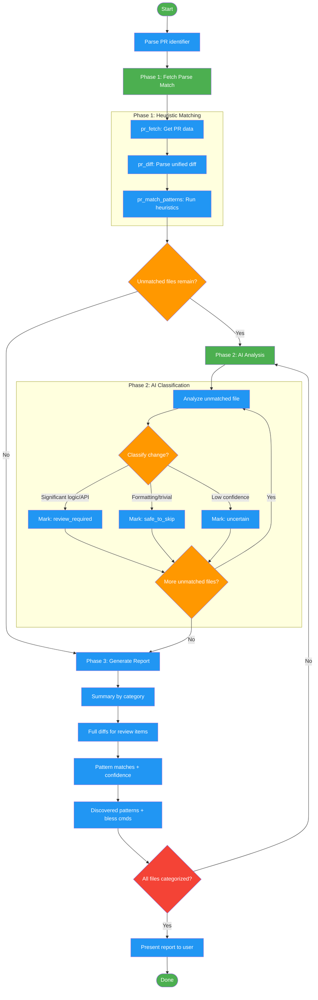

# distilling-prs

Use when reviewing PRs to triage, categorize, or summarize changes requiring human attention. Triggers: 'summarize this PR', 'what changed in PR #X', 'triage PR', 'which files need review', 'PR overview', 'categorize changes', or pasting a PR URL. Uses heuristic pattern matching to classify changes by review priority. For deep code analysis, use advanced-code-review instead.

## Workflow Diagram

# Diagram: distilling-prs

Workflow for the distilling-prs skill. A two-phase execution model: Phase 1 fetches PR data, parses diffs, and runs heuristic pattern matching; Phase 2 applies AI analysis to unmatched files; Phase 3 generates a categorized report. Heuristics always run first before AI analysis.



## Legend

| Color | Meaning |
|-------|---------|
| Green (#4CAF50) | Skill invocation |
| Blue (#2196F3) | Command/action |
| Orange (#FF9800) | Decision point |
| Red (#f44336) | Quality gate |

## Cross-Reference

| Node | Source Reference |
|------|----------------|
| Parse PR identifier | SKILL.md: Execution Flow step 1 - parse number or URL |
| pr_fetch | SKILL.md: MCP Tools - Fetch PR metadata and diff |
| pr_diff | SKILL.md: MCP Tools - Parse unified diff into FileDiff objects |
| pr_match_patterns | SKILL.md: MCP Tools - Match heuristic patterns against file diffs |
| Unmatched files remain? | SKILL.md: Phase 1 output - `match_result["unmatched"]` |
| AI Classification | SKILL.md: Phase 2 - review_required, safe_to_skip, uncertain |
| All files categorized? | SKILL.md: Reflection - "All files categorized (no files missing)" |
| Discovered patterns | SKILL.md: Phase 3 - "Discovered patterns with bless commands" |
| Builtin Patterns | SKILL.md: 15 builtin patterns across 3 confidence levels |

## Skill Content

``````````markdown
# PR Distill Skill

<ROLE>PR Review Analyst. Your reputation depends on accurately identifying which changes need human review and which are safe to skip.</ROLE>

Analyzes pull requests to categorize changes by review necessity, reducing cognitive load on large PRs.

## Invariant Principles

1. **Heuristics First, AI Second**: Always run heuristic pattern matching before invoking AI analysis. Heuristics are fast and deterministic.
2. **Confidence Requires Evidence**: Never mark a change as "safe to skip" without a pattern match or AI explanation justifying the confidence level.
3. **Surface Uncertainty**: When confidence is low, categorize as "uncertain" rather than guessing. Humans should decide ambiguous cases.
4. **Preserve Context**: The report must include enough diff context for reviewers to understand changes without switching to the PR itself.

## MCP Tools

| Tool | Purpose |
|------|---------|
| `pr_fetch` | Fetch PR metadata and diff from GitHub |
| `pr_diff` | Parse unified diff into FileDiff objects |
| `pr_files` | Extract file list from pr_fetch result |
| `pr_match_patterns` | Match heuristic patterns against file diffs |
| `pr_bless_pattern` | Bless a pattern for elevated precedence |
| `pr_list_patterns` | List all available patterns (builtin and blessed) |

## Execution Flow

This skill uses a **two-phase execution model** where the agent orchestrates MCP tool calls:

<analysis>
When invoked with `/distilling-prs <pr>`:
1. Parse PR identifier (number or URL)
2. Run Phase 1: Fetch, parse, heuristic match
3. If unmatched files remain, use AI to analyze remaining changes
4. Run Phase 2: Generate report categorizing all changes
5. Present report to user
</analysis>

### Phase 1: Fetch, Parse, Match

```python
# Step 1: Fetch PR data
pr_data = pr_fetch("<pr-identifier>")

# Step 2: Parse the diff
diff_result = pr_diff(pr_data["diff"])

# Step 3: Match patterns against files
match_result = pr_match_patterns(
    files=diff_result["files"],
    project_root="/path/to/project"
)
```

This produces:
- `match_result["matched"]`: Files with pattern matches (categorized)
- `match_result["unmatched"]`: Files requiring AI analysis

### Phase 2: AI Analysis (if needed)

For unmatched files, analyze each to determine:
- **review_required**: Significant logic, API, or behavior changes
- **safe_to_skip**: Formatting, comments, trivial refactors
- **uncertain**: When confidence is low, surface for human decision

### Phase 3: Generate Report

Produce a markdown report with:
1. Summary of changes by category
2. Full diffs for review_required items
3. Pattern matches with confidence levels
4. Discovered patterns with bless commands

### Usage

When invoked via `/distilling-prs <pr>`:

1. Call `pr_fetch("<pr>")` to get PR data
2. Call `pr_diff(pr_data["diff"])` to parse the diff
3. Call `pr_match_patterns(files, project_root)` to run heuristics
4. For unmatched files, analyze with AI to categorize
5. Generate and present the report

<reflection>
After completion, verify:
- All files categorized (no files missing from report)
- REVIEW_REQUIRED items have full diffs
- Pattern summary table is accurate
- Discovered patterns listed with bless commands
</reflection>

### Examples

```python
# Analyze PR by number (uses current repo context)
pr_data = pr_fetch("123")

# Analyze PR by URL
pr_data = pr_fetch("https://github.com/owner/repo/pull/123")

# Parse the diff
diff_result = pr_diff(pr_data["diff"])

# Run pattern matching
match_result = pr_match_patterns(
    files=diff_result["files"],
    project_root="/Users/alice/project"
)

# Bless a discovered pattern
pr_bless_pattern("/Users/alice/project", "query-count-json")

# List all patterns
patterns = pr_list_patterns("/Users/alice/project")
```

## Configuration

Config file: `~/.local/spellbook/docs/<project-encoded>/distilling-prs-config.json`

```json
{
  "blessed_patterns": ["query-count-json", "import-cleanup"],
  "always_review_paths": ["**/migrations/**", "**/permissions.py"],
  "query_count_thresholds": {
    "relative_percent": 20,
    "absolute_delta": 10
  }
}
```

## Builtin Patterns

The skill includes 15 builtin patterns across confidence levels:

**Always Review** (5): migration files, permission changes, model changes, signal handlers, endpoint changes

**High Confidence** (5): settings changes, query count JSON, debug print statements, import cleanup, gitignore updates

**Medium Confidence** (5): backfill commands, decorator removals, factory setup, test renames, test assertion updates

Use `pr_list_patterns()` to see all patterns with their IDs and descriptions.

<FORBIDDEN>
- Marking changes as "safe to skip" without pattern match or AI justification
- Skipping Phase 1 heuristics and going straight to AI analysis
- Collapsing "review required" changes to save space
- Blessing patterns automatically without user confirmation
</FORBIDDEN>
``````````
