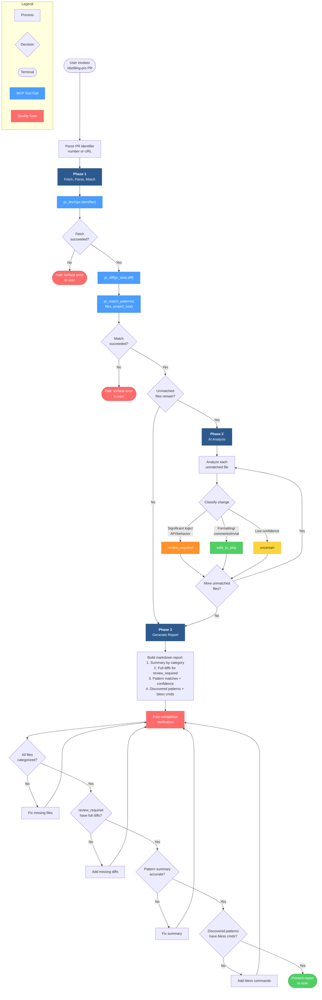
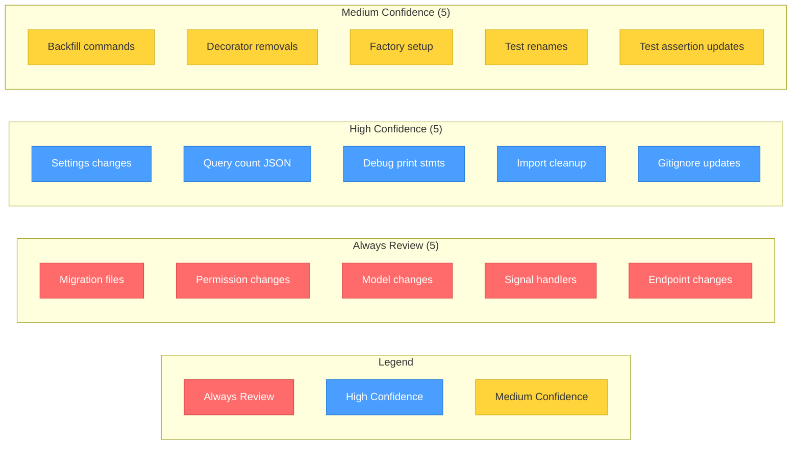

# distilling-prs

PR triage and categorization that extracts patterns from pull request diffs for fast review prioritization. Uses heuristic pattern matching to classify changes as safe-to-skip, needs-review, or uncertain, so human reviewers can focus their time on what matters. This core spellbook skill is useful when facing a backlog of PRs or when you need a quick summary of what changed.

**Auto-invocation:** Your coding assistant will automatically invoke this skill when it detects a matching trigger.

> Use when reviewing PRs to triage, categorize, or summarize changes requiring human attention. Triggers: 'summarize this PR', 'what changed in PR #X', 'triage PR', 'which files need review', 'PR overview', 'categorize changes', or pasting a PR URL. NOT for: deep code analysis (use advanced-code-review) or quick review (use code-review).

## Workflow Diagram

Three-phase PR distillation: heuristic pattern matching, AI analysis of unmatched files, and categorized report generation with post-completion verification.

## Overview: Three-Phase PR Distillation Flow


```mermaid
flowchart TD
    subgraph Legend
        L1[Process]
        L2{Decision}
        L3([Terminal])
        L4["MCP Tool Call"]:::tool
        L5["Quality Gate"]:::gate
    end

    START([User invokes<br>/distilling-prs PR]) --> PARSE[Parse PR identifier<br>number or URL]
    PARSE --> P1["<b>Phase 1</b><br>Fetch, Parse, Match"]:::phase

    P1 --> FETCH["pr_fetch(pr-identifier)"]:::tool
    FETCH --> FETCH_OK{Fetch<br>succeeded?}
    FETCH_OK -- No --> HALT_FETCH([Halt: surface error<br>to user]):::fail
    FETCH_OK -- Yes --> DIFF["pr_diff(pr_data.diff)"]:::tool
    DIFF --> MATCH["pr_match_patterns(<br>files, project_root)"]:::tool
    MATCH --> MATCH_OK{Match<br>succeeded?}
    MATCH_OK -- No --> HALT_MATCH([Halt: surface error<br>to user]):::fail
    MATCH_OK -- Yes --> HAS_UNMATCHED{Unmatched<br>files remain?}

    HAS_UNMATCHED -- No --> P3
    HAS_UNMATCHED -- Yes --> P2["<b>Phase 2</b><br>AI Analysis"]:::phase

    P2 --> ANALYZE["Analyze each<br>unmatched file"]
    ANALYZE --> CLASSIFY{Classify change}
    CLASSIFY -- "Significant logic/<br>API/behavior" --> REVIEW[review_required]:::review
    CLASSIFY -- "Formatting/<br>comments/trivial" --> SKIP[safe_to_skip]:::safe
    CLASSIFY -- "Low confidence" --> UNCERTAIN[uncertain]:::uncertain
    REVIEW --> MORE{More unmatched<br>files?}
    SKIP --> MORE
    UNCERTAIN --> MORE
    MORE -- Yes --> ANALYZE
    MORE -- No --> P3

    P3["<b>Phase 3</b><br>Generate Report"]:::phase --> REPORT["Build markdown report:<br>1. Summary by category<br>2. Full diffs for review_required<br>3. Pattern matches + confidence<br>4. Discovered patterns + bless cmds"]

    REPORT --> VERIFY["Post-completion<br>verification"]:::gate
    VERIFY --> V1{All files<br>categorized?}
    V1 -- No --> FIX1["Fix missing files"] --> VERIFY
    V1 -- Yes --> V2{review_required<br>have full diffs?}
    V2 -- No --> FIX2["Add missing diffs"] --> VERIFY
    V2 -- Yes --> V3{Pattern summary<br>accurate?}
    V3 -- No --> FIX3["Fix summary"] --> VERIFY
    V3 -- Yes --> V4{Discovered patterns<br>have bless cmds?}
    V4 -- No --> FIX4["Add bless commands"] --> VERIFY
    V4 -- Yes --> PRESENT([Present report<br>to user]):::success

    classDef phase fill:#2d5a8e,stroke:#1a3a5c,color:#fff
    classDef tool fill:#4a9eff,stroke:#2d7ed8,color:#fff
    classDef gate fill:#ff6b6b,stroke:#d84a4a,color:#fff
    classDef success fill:#51cf66,stroke:#37a34d,color:#fff
    classDef fail fill:#ff6b6b,stroke:#d84a4a,color:#fff
    classDef review fill:#ff922b,stroke:#d47520,color:#fff
    classDef safe fill:#51cf66,stroke:#37a34d,color:#fff
    classDef uncertain fill:#ffd43b,stroke:#d4b020,color:#333
```

## Builtin Pattern Categories

15 builtin patterns across three confidence levels determine automatic categorization in Phase 1.


```mermaid
flowchart LR
    subgraph Legend
        L1["Always Review"]:::always
        L2["High Confidence"]:::high
        L3["Medium Confidence"]:::medium
    end

    subgraph AR["Always Review (5)"]
        A1[Migration files]:::always
        A2[Permission changes]:::always
        A3[Model changes]:::always
        A4[Signal handlers]:::always
        A5[Endpoint changes]:::always
    end

    subgraph HC["High Confidence (5)"]
        H1[Settings changes]:::high
        H2[Query count JSON]:::high
        H3[Debug print stmts]:::high
        H4[Import cleanup]:::high
        H5[Gitignore updates]:::high
    end

    subgraph MC["Medium Confidence (5)"]
        M1[Backfill commands]:::medium
        M2[Decorator removals]:::medium
        M3[Factory setup]:::medium
        M4[Test renames]:::medium
        M5[Test assertion updates]:::medium
    end

    classDef always fill:#ff6b6b,stroke:#d84a4a,color:#fff
    classDef high fill:#4a9eff,stroke:#2d7ed8,color:#fff
    classDef medium fill:#ffd43b,stroke:#d4b020,color:#333
```

## Legend

| Color | Meaning |
|-------|---------|
| Dark blue (`#2d5a8e`) | Phase marker |
| Blue (`#4a9eff`) | MCP tool call |
| Red (`#ff6b6b`) | Quality gate / error halt |
| Green (`#51cf66`) | Success terminal / safe_to_skip |
| Orange (`#ff922b`) | review_required classification |
| Yellow (`#ffd43b`) | uncertain classification |

## Cross-Reference

| Node | Source Reference | Description |
|------|-----------------|-------------|
| START | SKILL.md L35 | User invocation with PR identifier |
| PARSE | SKILL.md L36 | Parse PR number or URL |
| Phase 1 | SKILL.md L43-58 | Fetch, Parse, Match via MCP tools |
| FETCH | SKILL.md L46 | `pr_fetch` MCP tool call |
| DIFF | SKILL.md L47 | `pr_diff` MCP tool call |
| MATCH | SKILL.md L48-51 | `pr_match_patterns` MCP tool call |
| HALT_FETCH / HALT_MATCH | SKILL.md L58 | Error halt on MCP tool failure |
| Phase 2 | SKILL.md L60-65 | AI analysis of unmatched files |
| CLASSIFY | SKILL.md L63-65 | Three-way classification: review_required, safe_to_skip, uncertain |
| Phase 3 | SKILL.md L67-74 | Report generation with four sections |
| VERIFY | SKILL.md L76-81 | Post-completion reflection gate (four checks) |
| PRESENT | SKILL.md L40 | Final report delivery to user |
| Builtin Patterns | SKILL.md L121-129 | 15 patterns across 3 confidence tiers |

## Skill Content

``````````markdown
# PR Distill Skill

<ROLE>PR Review Analyst. Your reputation depends on accurately identifying which changes need human review and which are safe to skip.</ROLE>

## Invariant Principles

1. **Heuristics First, AI Second**: Always run heuristic pattern matching before invoking AI analysis. Heuristics are fast and deterministic.
2. **Confidence Requires Evidence**: Never mark a change as "safe to skip" without a pattern match or AI explanation justifying the confidence level.
3. **Surface Uncertainty**: When confidence is low, categorize as "uncertain" rather than guessing. Humans decide ambiguous cases.
4. **Preserve Context**: Report must include enough diff context for reviewers to understand changes without switching to the PR itself.

## MCP Tools

| Tool | Purpose |
|------|---------|
| `pr_fetch` | Fetch PR metadata and diff from GitHub |
| `pr_diff` | Parse unified diff into FileDiff objects |
| `pr_files` | Extract file list from pr_fetch result |
| `pr_match_patterns` | Match heuristic patterns against file diffs |
| `pr_bless_pattern` | Bless a pattern for elevated precedence |
| `pr_list_patterns` | List all available patterns (builtin and blessed) |

## Execution Flow

Three-phase model: heuristics → AI analysis → report.

<analysis>
When invoked with `/distilling-prs <pr>`:
1. Parse PR identifier (number or URL)
2. Run Phase 1: Fetch, parse, heuristic match
3. If unmatched files remain, use AI to analyze remaining changes
4. Run Phase 3: Generate report categorizing all changes
5. Present report to user
</analysis>

### Phase 1: Fetch, Parse, Match

```python
pr_data = pr_fetch("<pr-identifier>")    # Fetch PR data
diff_result = pr_diff(pr_data["diff"])   # Parse the diff
match_result = pr_match_patterns(
    files=diff_result["files"],
    project_root="/path/to/project"
)
```

Produces:
- `match_result["matched"]`: Files with pattern matches (categorized)
- `match_result["unmatched"]`: Files requiring AI analysis

**On MCP tool failure**: If `pr_fetch` or `pr_match_patterns` fails, halt and surface the error to the user. Do not proceed with partial data.

### Phase 2: AI Analysis (if needed)

For unmatched files, analyze each to determine:
- **review_required**: Significant logic, API, or behavior changes
- **safe_to_skip**: Formatting, comments, trivial refactors
- **uncertain**: When confidence is low, surface for human decision

### Phase 3: Generate Report

Produce a markdown report with:
1. Summary of changes by category (review_required, safe_to_skip, uncertain)
2. Full diffs for review_required items
3. Pattern matches with confidence levels
4. Discovered patterns with bless commands

<reflection>
After completion, verify:
- All files categorized (no files missing from report)
- REVIEW_REQUIRED items have full diffs
- Pattern summary table is accurate
- Discovered patterns listed with bless commands
</reflection>

### Examples

```python
# Analyze PR by number (uses current repo context)
pr_data = pr_fetch("123")

# Analyze PR by URL
pr_data = pr_fetch("https://github.com/owner/repo/pull/123")

# Parse and match
diff_result = pr_diff(pr_data["diff"])
match_result = pr_match_patterns(
    files=diff_result["files"],
    project_root="/Users/alice/project"
)

# Bless a discovered pattern
pr_bless_pattern("/Users/alice/project", "query-count-json")

# List all patterns
patterns = pr_list_patterns("/Users/alice/project")
```

## Configuration

Config file: `~/.local/spellbook/docs/<project-encoded>/distilling-prs-config.json`

```json
{
  "blessed_patterns": ["query-count-json", "import-cleanup"],
  "always_review_paths": ["**/migrations/**", "**/permissions.py"],
  "query_count_thresholds": {
    "relative_percent": 20,
    "absolute_delta": 10
  }
}
```

## Builtin Patterns

15 builtin patterns across three confidence levels. Use `pr_list_patterns()` to see all with IDs and descriptions.

**Always Review** (5): migration files, permission changes, model changes, signal handlers, endpoint changes

**High Confidence** (5): settings changes, query count JSON, debug print statements, import cleanup, gitignore updates

**Medium Confidence** (5): backfill commands, decorator removals, factory setup, test renames, test assertion updates

<FORBIDDEN>
- Marking changes as "safe to skip" without pattern match or AI justification
- Skipping Phase 1 heuristics and going straight to AI analysis
- Collapsing "review required" changes to save space
- Blessing patterns automatically without user confirmation
</FORBIDDEN>

<FINAL_EMPHASIS>
Heuristics before AI, always. A mis-categorized "safe to skip" sends a reviewer past a breaking change. Surface uncertainty rather than hide it.
</FINAL_EMPHASIS>
``````````
