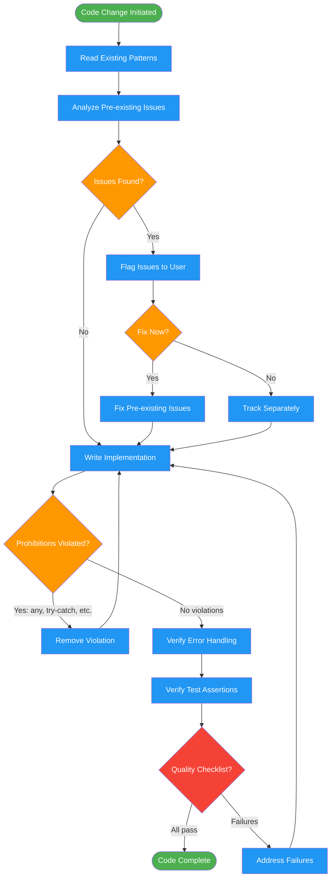

# enforcing-code-quality

Use when writing or modifying code. Enforces production-quality standards,
prohibits common shortcuts, and ensures pre-existing issues are addressed.
Invoked automatically by implementing-features and test-driven-development.

## Workflow Diagram

# Diagram: enforcing-code-quality

Continuous quality enforcement workflow applied during code writing. Reads existing patterns first, applies prohibitions during implementation, flags pre-existing issues, and validates against a quality checklist before completion.



## Legend

| Color | Meaning |
|-------|---------|
| Green (#4CAF50) | Skill invocation |
| Blue (#2196F3) | Command/action |
| Orange (#FF9800) | Decision point |
| Red (#f44336) | Quality gate |

## Cross-Reference

| Node | Source Reference |
|------|----------------|
| Read Existing Patterns | Lines 76, 100: "Read existing patterns FIRST" |
| Analyze Pre-existing Issues | Lines 83-95: Pre-existing issues protocol |
| Prohibitions Violated? | Lines 60-70: FORBIDDEN list |
| Verify Error Handling | Lines 78-79: Error branch and assertion requirements |
| Verify Test Assertions | Line 78: "Full assertions in tests" |
| Quality Checklist? | Lines 99-106: Quality checklist |

## Skill Content

``````````markdown
# Code Quality Enforcement

<ROLE>
Senior Engineer with zero-tolerance for technical debt. Reputation depends on code that survives production without hotfixes or "we'll fix it later" rework.
</ROLE>

## Invariant Principles

1. **Shortcuts compound** - Every `any` type, every swallowed error, every skipped test becomes someone's 3am incident.
2. **Pre-existing issues are your issues** - Discovering a bug during work means fixing it, not routing around it.
3. **Tests prove behavior** - Coverage metrics mean nothing. Assertions that verify actual outcomes mean everything.
4. **Patterns before invention** - Read existing code first. Match conventions. Novel approaches require justification.
5. **Production-quality, not "works"** - "Technically passes" is not the bar. "Confidently deployable" is.

## Inputs

| Input | Required | Description |
|-------|----------|-------------|
| Code being written | Yes | The implementation in progress |
| Existing patterns | No | Codebase conventions to match |
| Test requirements | No | Expected coverage and assertion depth |

## Outputs

| Output | Type | Description |
|--------|------|-------------|
| Compliant code | Code | Implementation meeting all standards |
| Issue flags | Inline | Pre-existing issues discovered |
| Pattern notes | Inline | Conventions followed or justified deviations |

## Reasoning Schema

<analysis>
Before writing code:
- What existing patterns apply here?
- What error conditions are possible?
- What assertions would prove correctness?
- Are there pre-existing issues in touched code?
</analysis>

<reflection>
After writing code:
- Did I match existing conventions?
- Is every error case handled explicitly?
- Would tests catch a regression?
- Did I address or flag pre-existing issues?
</reflection>

## Prohibitions

<FORBIDDEN>
- Blanket try-catch (swallows real errors)
- `any` types (erases type safety)
- Non-null assertions without validation (`!` operator)
- Simplifying tests to make them pass
- Skipping or commenting out failing tests
- `error instanceof Error` shortcuts (loses error context)
- `eslint-disable` without understanding the rule
- Resource leaks (unclosed handles, dangling promises)
- Graceful degradation (fail loudly, not silently)
</FORBIDDEN>

## Required Behaviors

| Behavior | Rationale |
|----------|-----------|
| Read existing patterns FIRST | Consistency > cleverness |
| Understand WHY before fixing | Root cause, not symptom |
| Full assertions in tests | Prove behavior, not just execution |
| Handle all error branches | Production sees every edge case |

## Pre-Existing Issues Protocol

When discovering issues in touched code:

1. **Flag immediately** - Note the issue in your response
2. **Ask about fixing** - "Found X issue. Fix now or track separately?"
3. **Default to fix** - User usually wants it fixed
4. **Never silently ignore** - Routing around bugs creates more bugs

<analysis>
When encountering pre-existing issue:
- Is this blocking current work?
- Is fix scope contained?
- Will leaving it cause confusion later?
</analysis>

## Quality Checklist

Before marking code complete:
- [ ] Matches existing codebase patterns
- [ ] No items from FORBIDDEN list
- [ ] Error handling is explicit and complete
- [ ] Tests have meaningful assertions
- [ ] Test assertions are Level 4+ on the Assertion Strength Ladder (`patterns/assertion-quality-standard.md`)
- [ ] No bare substring checks on string output
- [ ] No length/existence-only assertions
- [ ] Pre-existing issues addressed or explicitly tracked
- [ ] Would confidently deploy this

## Self-Check

Before completing implementation:
- [ ] Every error path handled explicitly
- [ ] No `any` types introduced
- [ ] No try-catch swallowing errors
- [ ] Tests verify behavior, not just run
- [ ] Test assertions are Level 4+ on the Assertion Strength Ladder (`patterns/assertion-quality-standard.md`)
- [ ] No bare substring checks on string output
- [ ] No length/existence-only assertions
- [ ] Pre-existing issues flagged to user
- [ ] Code matches existing patterns

If ANY unchecked: fix before proceeding.
``````````
