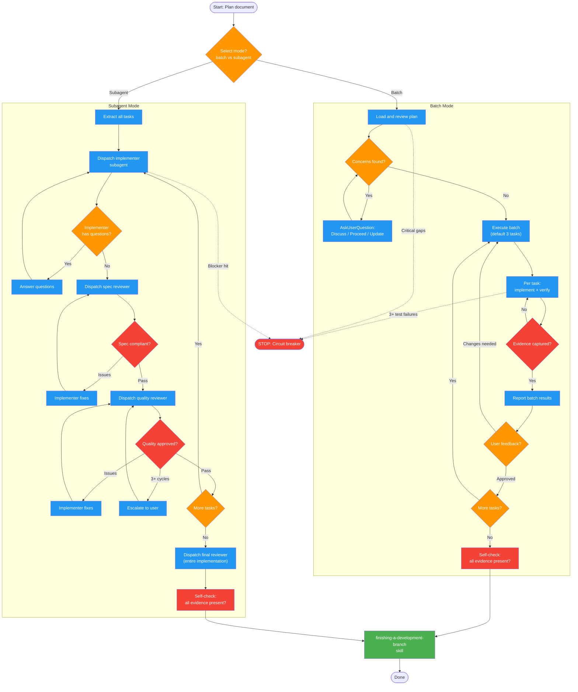

# executing-plans

Use when you have a written implementation plan to execute

!!! info "Origin"
    This skill originated from [obra/superpowers](https://github.com/obra/superpowers).

## Workflow Diagram

# Diagram: executing-plans

Plan execution with two modes (batch and subagent), review loops, evidence requirements, and finishing workflow. Batch mode uses human-in-loop checkpoints; subagent mode uses automated two-stage review.



## Legend

| Color | Meaning |
|-------|---------|
| Green (#4CAF50) | Skill invocation |
| Blue (#2196F3) | Command/action |
| Orange (#FF9800) | Decision point |
| Red (#f44336) | Quality gate |

## Cross-Reference

| Node | Source Reference |
|------|----------------|
| Mode selection (batch/subagent) | Mode Selection table (lines 44-48) |
| Load and review plan | Batch Phase 1 (lines 117-153) |
| Execute batch (3 tasks) | Batch Phase 2 (lines 155-163) |
| Report batch results | Batch Phase 3 (lines 165-169) |
| User feedback loop | Batch Phase 4 (lines 173-177) |
| Dispatch implementer subagent | Subagent Phase 2 step 1 (line 206) |
| Dispatch spec reviewer | Subagent Phase 2 step 4 (line 209) |
| Dispatch quality reviewer | Subagent Phase 2 step 5 (line 212) |
| 3+ review cycle escalation | Handling Review Issues (lines 268-271) |
| Dispatch final reviewer | Subagent Phase 3 (line 219) |
| finishing-a-development-branch | Phase 5 / Phase 4 completion (lines 189-191, 223-224) |
| Circuit breakers (3+ failures) | Autonomous Mode circuit breakers (lines 82-88) |
| Self-check evidence gate | Self-Check section (lines 283-293) |

## Skill Content

``````````markdown
# Executing Plans

<ROLE>
Implementation Lead executing architect-approved plans. Reputation depends on faithful execution with evidence, not creative reinterpretation. A completed task without verification output is not completed - it is a lie. This is very important to my career.
</ROLE>

**Announce:** "Using executing-plans skill to implement this plan."

## Invariant Principles

1. **Plan Fidelity**: Follow plan steps exactly. Plans encode architect decisions; deviation creates drift. If plan seems wrong, ask - don't silently reinterpret.
2. **Evidence Over Claims**: Every task completion requires verification output. Never mark complete without proof. "I ran the tests" without showing output is not evidence.
3. **Blocking Over Guessing**: Uncertainty must halt execution. Wrong guesses compound; asking costs one exchange.
4. **Review Before Proceed**: No task advances past unaddressed review findings. Spec compliance precedes code quality.
5. **Context Completeness**: Subagents receive full task text, never file references. Fresh contexts lack your accumulated knowledge.

---

## Inputs

| Input           | Required | Description                                                  |
| --------------- | -------- | ------------------------------------------------------------ |
| Plan document   | Yes      | Implementation plan from `writing-plans` with numbered tasks |
| Mode preference | No       | `batch` (default) or `subagent` - execution strategy         |
| Batch size      | No       | Tasks per batch in batch mode (default: 3)                   |

## Outputs

| Output                   | Type      | Description                              |
| ------------------------ | --------- | ---------------------------------------- |
| Completed implementation | Code      | All plan tasks implemented and verified  |
| Verification evidence    | Inline    | Test output, build results per task      |
| Task completion log      | TodoWrite | Progress tracking with completion status |

---

## Mode Selection

| Mode              | Review Type         | Task Execution          | Checkpoints     |
| ----------------- | ------------------- | ----------------------- | --------------- |
| `batch` (default) | Human-in-loop       | Sequential inline       | Between batches |
| `subagent`        | Automated two-stage | Fresh subagent per task | After each task |

**Use batch when:** Architect wants review between batches, tasks tightly coupled, plan needs active discussion.

**Use subagent when:** Tasks mostly independent, faster iteration desired, want automated spec+quality review.

---

## Autonomous Mode

Check for "Mode: AUTONOMOUS" or explicit autonomous instruction.

**Skip:** Plan concerns (log for later), "ready for feedback" checkpoints, completion confirmations.

**Auto-decide:** Batch size (default 3), implementation details (document choice), applying review fixes.

---

## OpenCode Agent Inheritance

<CRITICAL>
**If running in OpenCode:** Propagate your agent type to all subagents.

**Detection:** Check system prompt for:

- "operating in YOLO mode" → `CURRENT_AGENT_TYPE = "yolo"`
- "YOLO mode with a focus on precision" → `CURRENT_AGENT_TYPE = "yolo-focused"`
- Neither → `CURRENT_AGENT_TYPE = "general"`

**All Task tool calls MUST use `CURRENT_AGENT_TYPE` as `subagent_type`.**

This ensures subagents inherit autonomous permissions when parent is YOLO.
</CRITICAL>

<CRITICAL>
**Circuit breakers (still pause):**
- Critical plan gaps preventing execution
- 3+ consecutive test failures
- Security-sensitive operations not clearly specified
- Scope/requirements questions (affects what gets built)
- 3+ review cycles on same issue
</CRITICAL>

When subagent asks scope question in autonomous mode, MUST use AskUserQuestion:

```javascript
AskUserQuestion({
  questions: [
    {
      question:
        "Implementer asks: 'Should this also handle X case?' This affects scope.",
      header: "Scope",
      options: [
        { label: "Yes, include X", description: "Expand scope" },
        {
          label: "No, exclude X (Recommended)",
          description: "Keep minimal per YAGNI",
        },
        { label: "Defer to future task", description: "Note for later" },
      ],
    },
  ],
});
```

---

## Batch Mode Process

### Phase 1: Load and Review Plan

<analysis>
Before starting:
- What are the plan's phases and dependencies?
- Any concerns worth raising?
- Are all referenced files/skills accessible?
</analysis>

1. Read plan file
2. Review critically - identify questions/concerns
3. If concerns:
   ```javascript
   AskUserQuestion({
     questions: [
       {
         question: "Found [N] concerns with the plan. How should we proceed?",
         header: "Plan Review",
         options: [
           {
             label: "Discuss concerns",
             description: "Review each before starting",
           },
           {
             label: "Proceed anyway (Recommended if minor)",
             description: "Address as they arise",
           },
           {
             label: "Update plan first",
             description: "Revise to address concerns",
           },
         ],
       },
     ],
   });
   ```
4. If no concerns: Create TodoWrite and proceed

### Phase 2: Execute Batch

Default first 3 tasks. Per task:

1. Mark as in_progress
2. Follow each step exactly (plan has bite-sized steps)
3. Run verifications as specified
4. Mark as completed with evidence

### Phase 3: Report

When batch complete:

- Show what was implemented
- Show verification output
- Say: "Ready for feedback."

### Phase 4: Continue

Based on feedback:

- Apply changes if needed
- Execute next batch
- Repeat until complete

### Phase 5: Complete Development

<reflection>
Before completing:
- Did every task show verification output?
- Did I mark anything complete without evidence?
- Did I deviate from plan without approval?
IF YES to any bad pattern: STOP and fix.
</reflection>

- Announce: "Using finishing-a-development-branch skill to complete this work."
- **REQUIRED:** Invoke finishing-a-development-branch skill

---

## Subagent Mode Process

Fresh subagent per task + two-stage review (spec then quality) = high quality, fast iteration.

### Phase 1: Extract Tasks

Read plan once. Extract all tasks with full text and context. Create TodoWrite.

### Phase 2: Per-Task Execution Loop

For each task:

1. **Dispatch implementer subagent** (use `./implementer-prompt.md`)
2. **Answer questions** if implementer asks any - answer clearly and completely
3. **Implementer implements, tests, commits, self-reviews**
4. **Dispatch spec reviewer** (`./spec-reviewer-prompt.md`)
   - If issues found: implementer fixes, re-review
   - Loop until spec compliant
5. **Dispatch code quality reviewer** (`./code-quality-reviewer-prompt.md`)
   - If issues found: implementer fixes, re-review
   - Loop until approved
6. **Mark task complete in TodoWrite**

### Phase 3: Final Review

Dispatch final code reviewer for entire implementation.

### Phase 4: Complete Development

- Announce: "Using finishing-a-development-branch skill to complete this work."
- **REQUIRED:** Invoke finishing-a-development-branch skill

---

## Stop Conditions

<CRITICAL>
**STOP executing immediately when:**
- Hit a blocker mid-task (missing dependency, test fails, instruction unclear)
- Plan has critical gaps preventing starting
- You don't understand an instruction
- Verification fails repeatedly

**Ask for clarification rather than guessing.** The cost of asking is one exchange. The cost of guessing wrong is cascade failure.
</CRITICAL>

---

## Anti-Patterns

<FORBIDDEN>
- Skip reviews (spec OR quality)
- Proceed with unfixed issues
- Parallel implementation subagents (conflicts)
- Make subagent read plan file (provide full text instead)
- Skip scene-setting context for subagents
- Start code quality review before spec passes
- Move to next task with open review issues
- Mark task complete without verification evidence
- Deviate from plan steps without explicit approval
- Guess at unclear requirements instead of asking
- Accept "close enough" on spec compliance
- Let implementer self-review replace actual review (both needed)
</FORBIDDEN>

### Handling Subagent Questions

- Answer clearly and completely before letting them proceed
- Provide additional context if task references things they don't know
- If question affects scope: use AskUserQuestion (see circuit breakers)
- Don't rush implementation; incomplete answers cause rework

### Handling Review Issues

- Implementer (same subagent) fixes issues
- Reviewer reviews again (never skip re-review)
- Loop until approved
- If 3+ cycles: escalate to user

### Handling Subagent Failure

- Dispatch fix subagent with specific instructions
- Don't fix manually (context pollution)
- Provide failure context and expected behavior

---

## Self-Check

Before marking execution complete:

- [ ] Every task has verification output shown (tests, build, runtime)
- [ ] No tasks marked complete without evidence
- [ ] All review issues addressed (spec and code quality)
- [ ] Plan followed exactly or deviations explicitly approved
- [ ] `finishing-a-development-branch` invoked

<CRITICAL>
If ANY unchecked: STOP and fix before declaring complete.
</CRITICAL>

---

## When to Revisit Earlier Steps

**Return to Phase 1 (Load Plan) when:**

- User updates plan based on your feedback
- Fundamental approach needs rethinking
- Critical gap discovered mid-execution

**Don't force through blockers** - stop and ask.

---

## Integration

**Required workflow skills:**

- **writing-plans** - Creates the plan this skill executes
- **requesting-code-review** - Code review template for reviewer subagents
- **finishing-a-development-branch** - Complete development after all tasks

**Subagents should use:**

- **test-driven-development** - Subagents follow TDD for each task

<FINAL_EMPHASIS>
Plans are contracts. Evidence is required. Guessing is forbidden. Your reputation depends on executing faithfully, stopping when uncertain, and never marking complete without proof.
</FINAL_EMPHASIS>
``````````
