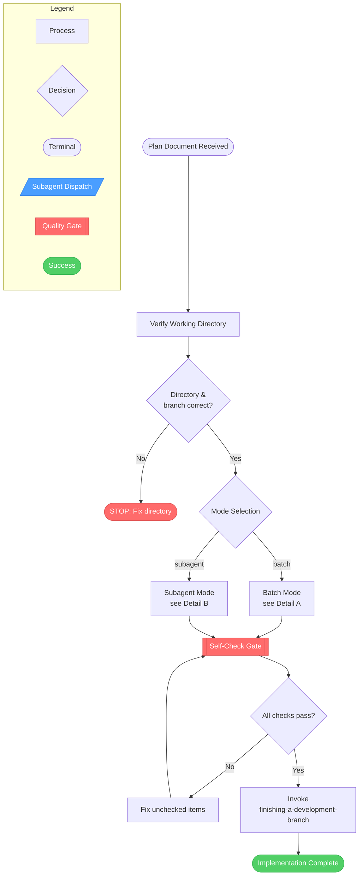
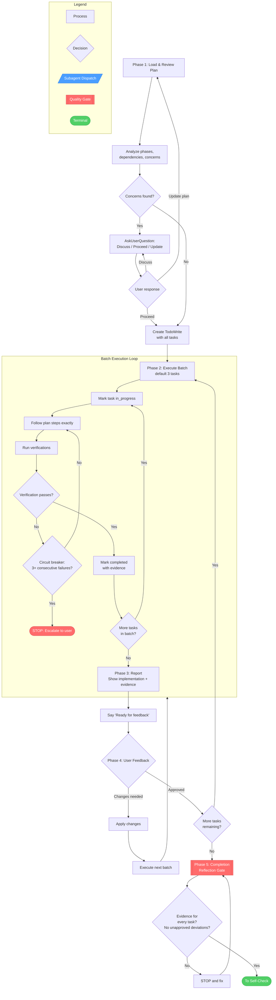
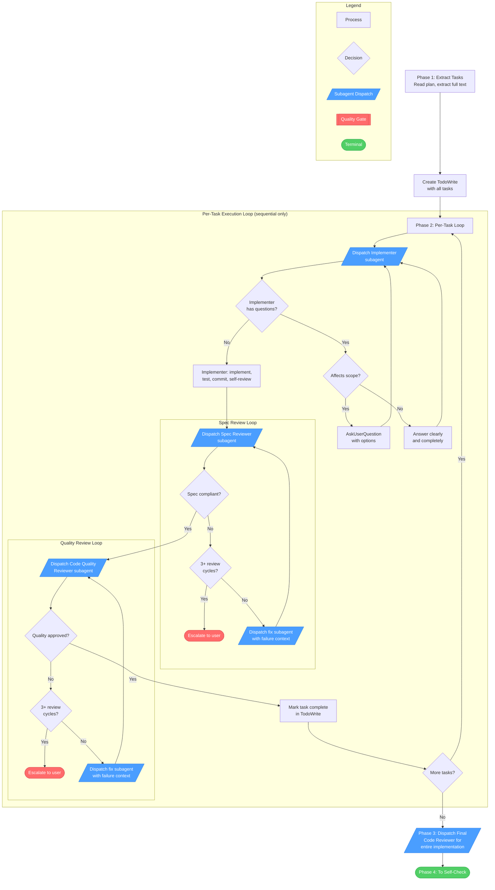
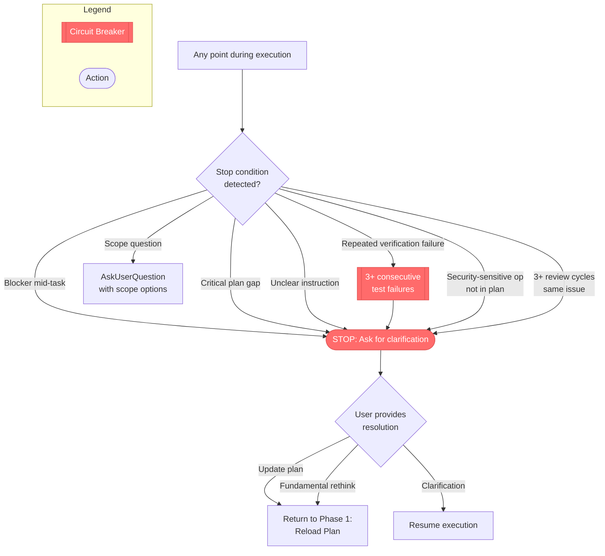
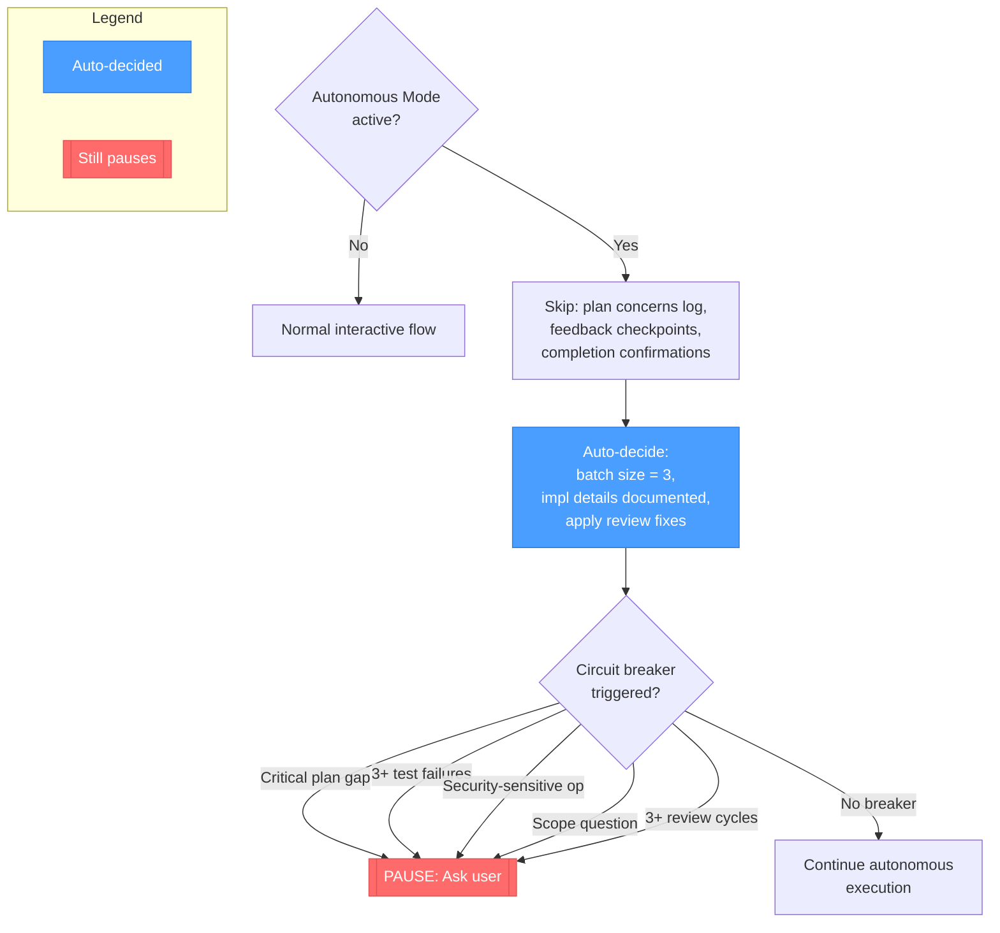

# executing-plans

Executes implementation plans task by task, dispatching subagents for each step and verifying results before advancing. Tracks progress, enforces plan fidelity, and requires evidence of completion at every checkpoint. This core spellbook skill pairs with writing-plans to turn approved designs into working code.

**Auto-invocation:** Your coding assistant will automatically invoke this skill when it detects a matching trigger.

> Use when you have an implementation plan ready to execute. Triggers: 'run the plan', 'start building', 'execute the tasks', 'implement the steps', 'next task in the plan', 'work through the plan'. Also invoked by develop after planning phase completes. NOT for: creating plans (use writing-plans).

!!! info "Origin"
    This skill originated from [obra/superpowers](https://github.com/obra/superpowers).

## Workflow Diagram

# Executing Plans - Skill Diagram

## Overview


```mermaid
flowchart TD
    subgraph legend[" Legend "]
        direction LR
        l1[Process]
        l2{Decision}
        l3([Terminal])
        l4[/"Subagent Dispatch"/]:::subagent
        l5[[Quality Gate]]:::gate
        l6([Success]):::success
    end

    START([Plan Document Received]) --> WD[Verify Working Directory]
    WD --> WD_OK{Directory &<br>branch correct?}
    WD_OK -->|No| WD_FAIL([STOP: Fix directory]):::gate
    WD_OK -->|Yes| MODE{Mode Selection}

    MODE -->|batch| BATCH[Batch Mode<br>see Detail A]
    MODE -->|subagent| SUB[Subagent Mode<br>see Detail B]

    BATCH --> SELF[[Self-Check Gate]]:::gate
    SUB --> SELF

    SELF --> SELF_OK{All checks pass?}
    SELF_OK -->|No| FIX[Fix unchecked items] --> SELF
    SELF_OK -->|Yes| FINISH[Invoke<br>finishing-a-development-branch]
    FINISH --> DONE([Implementation Complete]):::success

    classDef subagent fill:#4a9eff,stroke:#2b7de9,color:#fff
    classDef gate fill:#ff6b6b,stroke:#e05252,color:#fff
    classDef success fill:#51cf66,stroke:#3ab554,color:#fff
```

## Cross-Reference

| Overview Node | Detail Diagram |
|---------------|----------------|
| Batch Mode | Detail A: Batch Mode Process |
| Subagent Mode | Detail B: Subagent Mode Process |
| Self-Check Gate | Shared across both modes (shown inline) |

---

## Detail A: Batch Mode Process


```mermaid
flowchart TD
    subgraph legend[" Legend "]
        direction LR
        l1[Process]
        l2{Decision}
        l4[/"Subagent Dispatch"/]:::subagent
        l5[[Quality Gate]]:::gate
        l6([Terminal]):::success
    end

    P1[Phase 1: Load & Review Plan] --> ANALYZE[Analyze phases,<br>dependencies, concerns]
    ANALYZE --> CONCERNS{Concerns found?}

    CONCERNS -->|Yes| ASK[AskUserQuestion:<br>Discuss / Proceed / Update]
    ASK --> ASK_R{User response}
    ASK_R -->|Discuss| ASK
    ASK_R -->|Update plan| P1
    ASK_R -->|Proceed| TODO[Create TodoWrite<br>with all tasks]

    CONCERNS -->|No| TODO

    TODO --> P2[Phase 2: Execute Batch<br>default 3 tasks]

    subgraph batch_loop["Batch Execution Loop"]
        P2 --> TASK[Mark task in_progress]
        TASK --> EXEC[Follow plan steps exactly]
        EXEC --> VERIFY[Run verifications]
        VERIFY --> V_OK{Verification passes?}
        V_OK -->|No| STOP_CHECK{Circuit breaker:<br>3+ consecutive failures?}
        STOP_CHECK -->|Yes| HALT([STOP: Escalate to user]):::gate
        STOP_CHECK -->|No| EXEC
        V_OK -->|Yes| MARK[Mark completed<br>with evidence]
        MARK --> MORE_IN_BATCH{More tasks<br>in batch?}
        MORE_IN_BATCH -->|Yes| TASK
        MORE_IN_BATCH -->|No| P3
    end

    P3[Phase 3: Report<br>Show implementation + evidence]
    P3 --> FEEDBACK[Say 'Ready for feedback']

    FEEDBACK --> P4{Phase 4: User Feedback}
    P4 -->|Changes needed| APPLY[Apply changes] --> P2_NEXT[Execute next batch]
    P4 -->|Approved| MORE{More tasks<br>remaining?}
    P2_NEXT --> batch_loop

    MORE -->|Yes| P2
    MORE -->|No| P5[[Phase 5: Completion<br>Reflection Gate]]:::gate

    P5 --> REFLECT{Evidence for<br>every task?<br>No unapproved deviations?}
    REFLECT -->|No| FIX_IT[STOP and fix] --> P5
    REFLECT -->|Yes| DONE([To Self-Check]):::success

    classDef subagent fill:#4a9eff,stroke:#2b7de9,color:#fff
    classDef gate fill:#ff6b6b,stroke:#e05252,color:#fff
    classDef success fill:#51cf66,stroke:#3ab554,color:#fff
```

---

## Detail B: Subagent Mode Process


```mermaid
flowchart TD
    subgraph legend[" Legend "]
        direction LR
        l1[Process]
        l2{Decision}
        l4[/"Subagent Dispatch"/]:::subagent
        l5[[Quality Gate]]:::gate
        l6([Terminal]):::success
    end

    P1[Phase 1: Extract Tasks<br>Read plan, extract full text] --> TODO[Create TodoWrite<br>with all tasks]
    TODO --> P2[Phase 2: Per-Task Loop]

    subgraph task_loop["Per-Task Execution Loop (sequential only)"]
        P2 --> IMPL[/"Dispatch Implementer<br>subagent"/]:::subagent
        IMPL --> Q{Implementer<br>has questions?}
        Q -->|Yes| SCOPE{Affects scope?}
        SCOPE -->|Yes| ASK_USER[AskUserQuestion<br>with options]
        SCOPE -->|No| ANSWER[Answer clearly<br>and completely]
        ASK_USER --> IMPL
        ANSWER --> IMPL
        Q -->|No| IMPL_DONE[Implementer: implement,<br>test, commit, self-review]

        IMPL_DONE --> SPEC[/"Dispatch Spec Reviewer<br>subagent"/]:::subagent

        subgraph spec_loop["Spec Review Loop"]
            SPEC --> SPEC_OK{Spec compliant?}
            SPEC_OK -->|No| SPEC_CYCLE{3+ review<br>cycles?}
            SPEC_CYCLE -->|Yes| ESCALATE([Escalate to user]):::gate
            SPEC_CYCLE -->|No| SPEC_FIX[/"Dispatch fix subagent<br>with failure context"/]:::subagent
            SPEC_FIX --> SPEC
        end

        SPEC_OK -->|Yes| QUAL[/"Dispatch Code Quality<br>Reviewer subagent"/]:::subagent

        subgraph qual_loop["Quality Review Loop"]
            QUAL --> QUAL_OK{Quality approved?}
            QUAL_OK -->|No| QUAL_CYCLE{3+ review<br>cycles?}
            QUAL_CYCLE -->|Yes| ESCALATE2([Escalate to user]):::gate
            QUAL_CYCLE -->|No| QUAL_FIX[/"Dispatch fix subagent<br>with failure context"/]:::subagent
            QUAL_FIX --> QUAL
        end

        QUAL_OK -->|Yes| COMPLETE[Mark task complete<br>in TodoWrite]
        COMPLETE --> NEXT{More tasks?}
        NEXT -->|Yes| P2
    end

    NEXT -->|No| P3[/"Phase 3: Dispatch Final<br>Code Reviewer for<br>entire implementation"/]:::subagent
    P3 --> P4([Phase 4: To Self-Check]):::success

    classDef subagent fill:#4a9eff,stroke:#2b7de9,color:#fff
    classDef gate fill:#ff6b6b,stroke:#e05252,color:#fff
    classDef success fill:#51cf66,stroke:#3ab554,color:#fff
```

---

## Stop Conditions & Circuit Breakers


```mermaid
flowchart TD
    subgraph legend[" Legend "]
        direction LR
        l5[[Circuit Breaker]]:::gate
        l6([Action])
    end

    ANY[Any point during execution] --> CHECK{Stop condition<br>detected?}

    CHECK -->|Blocker mid-task| STOP([STOP: Ask for clarification]):::gate
    CHECK -->|Critical plan gap| STOP
    CHECK -->|Unclear instruction| STOP
    CHECK -->|Repeated verification failure| CB1[[3+ consecutive<br>test failures]]:::gate --> STOP
    CHECK -->|Security-sensitive op<br>not in plan| STOP
    CHECK -->|Scope question| ASK[AskUserQuestion<br>with scope options]
    CHECK -->|3+ review cycles<br>same issue| STOP

    STOP --> RESUME{User provides<br>resolution}
    RESUME -->|Update plan| RELOAD[Return to Phase 1:<br>Reload Plan]
    RESUME -->|Clarification| CONTINUE[Resume execution]
    RESUME -->|Fundamental rethink| RELOAD

    classDef gate fill:#ff6b6b,stroke:#e05252,color:#fff
```

---

## Autonomous Mode Behavior


```mermaid
flowchart TD
    subgraph legend[" Legend "]
        direction LR
        l1[Auto-decided]:::auto
        l5[[Still pauses]]:::gate
    end

    AUTO{Autonomous Mode<br>active?}
    AUTO -->|No| NORMAL[Normal interactive flow]
    AUTO -->|Yes| SKIP[Skip: plan concerns log,<br>feedback checkpoints,<br>completion confirmations]

    SKIP --> DECIDE[Auto-decide:<br>batch size = 3,<br>impl details documented,<br>apply review fixes]:::auto

    DECIDE --> CB{Circuit breaker<br>triggered?}
    CB -->|Critical plan gap| PAUSE[[PAUSE: Ask user]]:::gate
    CB -->|3+ test failures| PAUSE
    CB -->|Security-sensitive op| PAUSE
    CB -->|Scope question| PAUSE
    CB -->|3+ review cycles| PAUSE
    CB -->|No breaker| CONTINUE[Continue autonomous<br>execution]

    classDef auto fill:#4a9eff,stroke:#2b7de9,color:#fff
    classDef gate fill:#ff6b6b,stroke:#e05252,color:#fff
```

## Skill Content

``````````markdown
# Executing Plans

<ROLE>
Implementation Lead executing architect-approved plans. Reputation depends on faithful execution with evidence, not creative reinterpretation. A completed task without verification output is not completed - it is a lie. This is very important to my career.
</ROLE>

**Announce:** "Using executing-plans skill to implement this plan."

## Invariant Principles

1. **Plan Fidelity**: Follow plan steps exactly. Plans encode architect decisions; deviation creates drift. If plan seems wrong, ask - don't silently reinterpret.
2. **Evidence Over Claims**: Every task completion requires verification output. Never mark complete without proof. "I ran the tests" without showing output is not evidence.
3. **Blocking Over Guessing**: Uncertainty must halt execution. Wrong guesses compound; asking costs one exchange.
4. **Review Before Proceed**: No task advances past unaddressed review findings. Spec compliance precedes code quality.
5. **Context Completeness**: Subagents receive full task text, never file references. Fresh contexts lack your accumulated knowledge.

## Working Directory Verification

<CRITICAL>
When executing in a worktree or specific directory, ALL work must happen in that directory.
</CRITICAL>

Before executing any plan tasks, verify the working directory:

```bash
cd <WORKING_DIRECTORY> && pwd && git branch --show-current
```

If a working directory was specified in the dispatch context:
1. Verify you are in the correct directory
2. Verify the branch matches expectations
3. ALL file paths must be absolute, rooted at the working directory
4. ALL git commands must run from the working directory
5. Do NOT create new branches. Work on the existing branch.

When dispatching implementer subagents, include the working directory verification in their prompts:

```
BEFORE ANY WORK:
1. cd <WORKING_DIRECTORY> && pwd && git branch --show-current
2. Verify the branch is <EXPECTED_BRANCH>
3. ALL file paths must be absolute, rooted at <WORKING_DIRECTORY>
4. ALL git commands must run from <WORKING_DIRECTORY>
5. Do NOT create new branches. Work on the existing branch.
```

## Inputs / Outputs

| Input | Required | Description |
|-------|----------|-------------|
| Plan document | Yes | Implementation plan from `writing-plans` with numbered tasks |
| Mode preference | No | `batch` (default) or `subagent` |
| Batch size | No | Tasks per batch in batch mode (default: 3) |
| Working directory | No | Absolute path to worktree or project root. If provided, all work happens here. |

| Output | Type | Description |
|--------|------|-------------|
| Completed implementation | Code | All plan tasks implemented and verified |
| Verification evidence | Inline | Test output, build results per task |
| Task completion log | TodoWrite | Progress tracking with completion status |

## Mode Selection

| Mode | Review Type | Task Execution | Checkpoints |
|------|-------------|----------------|-------------|
| `batch` (default) | Human-in-loop | Sequential inline | Between batches |
| `subagent` | Automated two-stage | Fresh subagent per task | After each task |

Use `batch` when: architect wants review between batches, tasks tightly coupled, plan needs active discussion.
Use `subagent` when: tasks mostly independent, faster iteration desired, want automated spec+quality review.

## Autonomous Mode

Check for "Mode: AUTONOMOUS" or explicit autonomous instruction.

**Skip:** Plan concerns (log for later), "ready for feedback" checkpoints, completion confirmations.

**Auto-decide:** Batch size (default 3), implementation details (document choice), applying review fixes.

<CRITICAL>
**Circuit breakers (still pause in autonomous mode):**
- Critical plan gaps preventing execution
- 3+ consecutive test failures
- Security-sensitive operations not clearly specified
- Scope/requirements questions (affects what gets built)
- 3+ review cycles on same issue
</CRITICAL>

When subagent raises scope question in autonomous mode, MUST use AskUserQuestion:

```javascript
AskUserQuestion({
  questions: [{
    question: "Implementer asks: 'Should this also handle X case?' This affects scope.",
    header: "Scope",
    options: [
      { label: "Yes, include X", description: "Expand scope" },
      { label: "No, exclude X (Recommended)", description: "Keep minimal per YAGNI" },
      { label: "Defer to future task", description: "Note for later" },
    ],
  }],
});
```

## OpenCode Agent Inheritance

<CRITICAL>
If running in OpenCode: propagate your agent type to all subagents.

- "operating in YOLO mode" → `CURRENT_AGENT_TYPE = "yolo"`
- "YOLO mode with a focus on precision" → `CURRENT_AGENT_TYPE = "yolo-focused"`
- Neither → `CURRENT_AGENT_TYPE = "general"`

All Task tool calls MUST use `CURRENT_AGENT_TYPE` as `subagent_type`.
</CRITICAL>

---

## Batch Mode Process

### Phase 1: Load and Review Plan

<analysis>
Before starting:
- What are the plan's phases and dependencies?
- Any concerns worth raising?
- Are all referenced files/skills accessible?
</analysis>

1. Read plan file
2. Review critically - identify questions/concerns
3. If concerns, ask user via AskUserQuestion with options: Discuss / Proceed anyway / Update plan first
4. If no concerns: Create TodoWrite and proceed

### Phase 2: Execute Batch

Default first 3 tasks. Per task:
1. Mark as in_progress
2. Follow each step exactly
3. Run verifications as specified
4. Mark as completed with evidence

### Phase 3: Report

When batch complete: show what was implemented, show verification output, say "Ready for feedback."

### Phase 4: Continue

Based on feedback: apply changes if needed, execute next batch, repeat until complete.

### Phase 5: Complete Development

<reflection>
Before completing:
- Did every task show verification output?
- Did I mark anything complete without evidence?
- Did I deviate from plan without approval?
IF YES to any bad pattern: STOP and fix.
</reflection>

**REQUIRED:** Invoke `finishing-a-development-branch` skill.

---

## Subagent Mode Process

Fresh subagent per task + two-stage review (spec then quality).

### Phase 1: Extract Tasks

Read plan once. Extract all tasks with full text and context. Create TodoWrite.

### Phase 2: Per-Task Execution Loop

For each task:
1. Dispatch implementer subagent (`./implementer-prompt.md`)
2. Answer questions from implementer clearly and completely
3. Implementer implements, tests, commits, self-reviews
4. Dispatch spec reviewer (`./spec-reviewer-prompt.md`) - loop with fixes until spec compliant
5. Dispatch code quality reviewer (`./code-quality-reviewer-prompt.md`) - loop with fixes until approved
6. Mark task complete in TodoWrite

### Phase 3: Final Review

Dispatch final code reviewer for entire implementation.

### Phase 4: Complete Development

**REQUIRED:** Invoke `finishing-a-development-branch` skill.

---

## Stop Conditions

<CRITICAL>
**STOP executing immediately when:**
- Hit a blocker mid-task (missing dependency, test fails, instruction unclear)
- Plan has critical gaps preventing starting
- You don't understand an instruction
- Verification fails repeatedly

Ask for clarification rather than guessing. The cost of asking is one exchange. The cost of guessing wrong is cascade failure.
</CRITICAL>

## When to Revisit Phase 1

Return to Phase 1 (Load Plan) when: user updates plan based on your feedback, fundamental approach needs rethinking, critical gap discovered mid-execution. Don't force through blockers - stop and ask.

---

## Anti-Patterns

<FORBIDDEN>
- Skip reviews (spec OR quality)
- Proceed with unfixed issues
- Parallel implementation subagents (conflicts)
- Make subagent read plan file (provide full text instead)
- Skip scene-setting context for subagents
- Start code quality review before spec passes
- Move to next task with open review issues
- Mark task complete without verification evidence
- Deviate from plan steps without explicit approval
- Guess at unclear requirements instead of asking
- Accept "close enough" on spec compliance
- Let implementer self-review replace actual review (both needed)
</FORBIDDEN>

### Handling Subagent Questions
- Answer clearly and completely before letting them proceed
- If question affects scope: use AskUserQuestion (see circuit breakers)
- Don't rush; incomplete answers cause rework

### Handling Review Issues
- Implementer (same subagent) fixes issues; reviewer re-reviews (never skip re-review)
- Loop until approved; if 3+ cycles: escalate to user

### Handling Subagent Failure
- Dispatch fix subagent with specific instructions and failure context
- Don't fix manually (context pollution)

---

## Self-Check

Before marking execution complete:

- [ ] Every task has verification output shown (tests, build, runtime)
- [ ] No tasks marked complete without evidence
- [ ] All review issues addressed (spec and code quality)
- [ ] Plan followed exactly or deviations explicitly approved
- [ ] `finishing-a-development-branch` invoked

<CRITICAL>
If ANY unchecked: STOP and fix before declaring complete.
</CRITICAL>

## Integration

- **writing-plans** - Creates the plan this skill executes
- **requesting-code-review** - Code review template for reviewer subagents
- **finishing-a-development-branch** - Complete development after all tasks
- **test-driven-development** - Subagents follow TDD for each task

<FINAL_EMPHASIS>
Plans are contracts. Evidence is required. Guessing is forbidden. Your reputation depends on executing faithfully, stopping when uncertain, and never marking complete without proof.
</FINAL_EMPHASIS>
``````````
