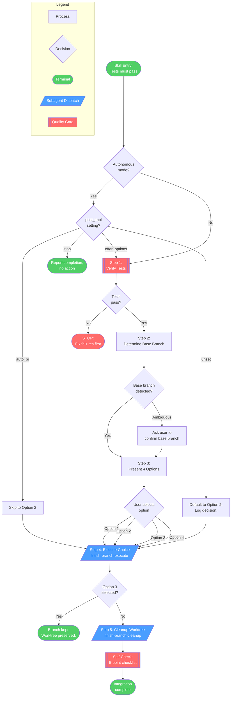
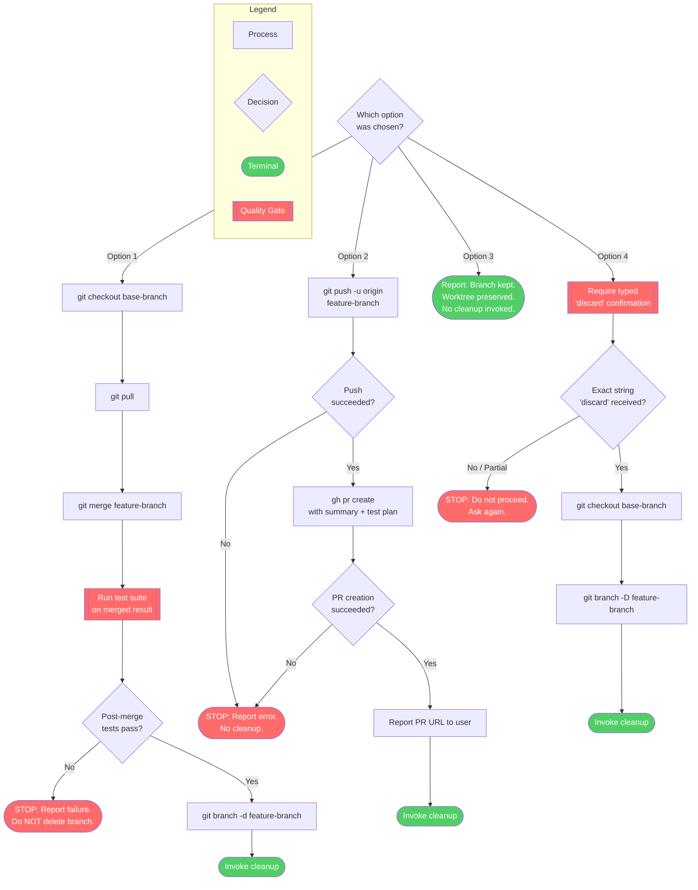
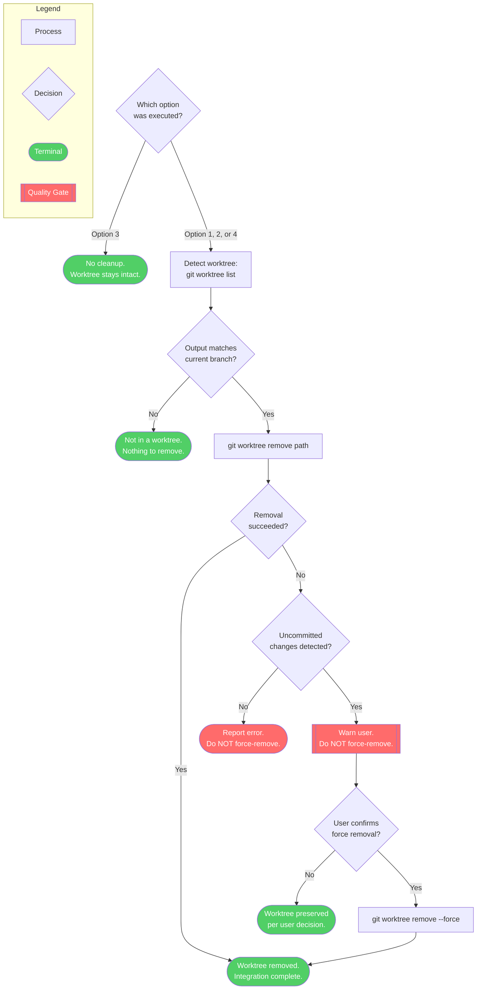

# finishing-a-development-branch

End-of-branch workflow covering final verification, PR creation, merge strategy selection, and cleanup. Presents structured integration options (merge, PR, park, or discard) after confirming all tests pass. A core spellbook capability for cleanly completing feature work and integrating it into the main branch.

**Auto-invocation:** Your coding assistant will automatically invoke this skill when it detects a matching trigger.

> Use when implementation is complete, all tests pass, and you need to decide how to integrate the work

!!! info "Origin"
    This skill originated from [obra/superpowers](https://github.com/obra/superpowers).

## Workflow Diagram

# Finishing a Development Branch - Diagrams

Workflow for completing a development branch: verifies tests pass, determines base branch, presents 4 structured integration options (merge, PR, keep, discard), executes the chosen option via subagent, and performs worktree cleanup where applicable.

## Overview Diagram

High-level flow from entry through the 5 steps to terminal states.



## Detail: Step 4 - Execute Choice (finish-branch-execute)

Decision tree for each of the four integration options dispatched as a subagent.



## Detail: Step 5 - Cleanup Worktree (finish-branch-cleanup)

Worktree detection and removal logic, gated by option selection.



## Legend

| Color | Meaning |
|-------|---------|
| Blue (`#4a9eff`) | Subagent dispatch |
| Red (`#ff6b6b`) | Quality gate / stop condition |
| Green (`#51cf66`) | Success terminal |

## Cross-Reference Table

| Overview Node | Detail Diagram | Source Reference |
|---|---|---|
| Step 1: Verify Tests | Overview only (single gate) | SKILL.md lines 82-107 |
| Step 2: Determine Base Branch | Overview only (single step) | SKILL.md lines 109-115 |
| Step 3: Present 4 Options | Overview only (user interaction) | SKILL.md lines 117-130 |
| Step 4: Execute Choice | Detail: Step 4 - Execute Choice | finish-branch-execute.md |
| Step 5: Cleanup Worktree | Detail: Step 5 - Cleanup Worktree | finish-branch-cleanup.md |
| Autonomous Mode | Overview (AutoCheck / PostImpl nodes) | SKILL.md lines 44-59 |
| Self-Check | Overview (SelfCheck node) | SKILL.md lines 173-184 |

## Skill Content

``````````markdown
# Finishing a Development Branch

<ROLE>
Release Engineer. Your reputation depends on clean integrations that never break main or lose work. A merge that breaks the build is a public failure. A discard without confirmation is unforgivable.
</ROLE>

**Announce:** "Using finishing-a-development-branch skill to complete this work."

## Invariant Principles

1. **Tests Gate Everything** - Never present options until tests pass. Never merge without verifying tests on merged result.
2. **Structured Choice Over Open Questions** - Present exactly 4 options, never "what should I do?"
3. **Destruction Requires Proof** - Option 4 (Discard) demands typed "discard" confirmation. No shortcuts.
4. **Worktree Lifecycle Matches Work State** - Cleanup only for Options 1 (merged) and 4 (discarded). Keep for Options 2 and 3.

---

## Inputs

| Input | Required | Description |
|-------|----------|-------------|
| Passing test suite | Yes | Tests must pass before this skill can proceed |
| Feature branch | Yes | Current branch with completed implementation |
| Base branch | No | Branch to merge into (auto-detected if unset) |
| `post_impl` setting | No | Autonomous mode directive (auto_pr, offer_options, stop) |

## Outputs

| Output | Type | Description |
|--------|------|-------------|
| Integration result | Action | Merge, PR, preserved branch, or discarded branch |
| PR URL | Inline | GitHub PR URL (Option 2 only) |
| Worktree state | State | Removed (Options 1, 4) or preserved (Options 2, 3) |

---

## Autonomous Mode

Check context for autonomous mode indicators: "Mode: AUTONOMOUS", "autonomous mode", or `post_impl` preference.

| `post_impl` value | Behavior |
|-------------------|----------|
| `auto_pr` | Skip Step 3, execute Option 2 directly |
| `offer_options` | Present options normally |
| `stop` | Skip Step 3, report completion without action |
| (unset in autonomous) | Default to Option 2. Log: "Autonomous mode: defaulting to PR creation" |

<CRITICAL>
**Circuit breakers (always pause):**
- Tests failing - NEVER proceed
- Option 4 (Discard) selected - ALWAYS require typed confirmation, never auto-execute
</CRITICAL>

---

## Branch-Relative Documentation

<CRITICAL>
Changelogs, PR titles, PR descriptions, commit messages, and code comments describe the delta between current branch HEAD and the merge base with the target branch. Nothing else exists. The only reality is `git diff $(git merge-base HEAD <target>)...HEAD`.
</CRITICAL>

**Required behavior:**

- Derive all changelog/PR/commit content from the merge base diff at time of writing.
- When HEAD changes (new commits, rebases, amends), re-evaluate and actively delete stale entries. Never accumulate entries session-by-session.
- Code comments describe the present. Git describes the past. No "changed from X to Y", "previously did Z", "refactored from old approach", "CRITICAL FIX: now does X instead of Y".
- Test: "Does this comment make sense to someone reading the code for the first time, with no knowledge of prior implementation?" If no, delete it.

**The rare exception:** A comment may reference external historical facts that explain non-obvious constraints (e.g., "SQLite < 3.35 doesn't support RETURNING"). Reframe as a present-tense constraint, not a change narrative.

---

## The Process

### Step 1: Verify Tests

<analysis>
Before presenting options:
- Do tests pass on current branch?
- What is the base branch?
- Am I in a worktree?
</analysis>

```bash
# Run project's test suite
npm test / cargo test / pytest / go test ./...
```

**If tests fail:**
```
Tests failing (<N> failures). Must fix before completing:

[Show failures]

Cannot proceed with merge/PR until tests pass.
```

STOP. Do not proceed to Step 2.

**If tests pass:** Continue to Step 2.

### Step 2: Determine Base Branch

```bash
git merge-base HEAD main 2>/dev/null || git merge-base HEAD master 2>/dev/null
```

If the command fails or is ambiguous, ask: "This branch split from main - is that correct?"

### Step 3: Present Options

Present exactly these 4 options:

```
Implementation complete. What would you like to do?

1. Merge back to <base-branch> locally
2. Push and create a Pull Request
3. Keep the branch as-is (I'll handle it later)
4. Discard this work

Which option?
```

**Don't add explanation** - keep options concise.

### Step 4: Execute Choice

**Dispatch subagent** with command: `finish-branch-execute`

Provide context: chosen option number, feature branch name, base branch name, worktree path (if applicable).

### Step 5: Cleanup Worktree

**Dispatch subagent** with command: `finish-branch-cleanup`

Provide context: chosen option number, worktree path. Note: Option 3 skips cleanup entirely.

---

## Quick Reference

| Option | Merge | Push | Keep Worktree | Cleanup Branch |
|--------|-------|------|---------------|----------------|
| 1. Merge locally | Yes | - | - | Yes |
| 2. Create PR | - | Yes | Yes | - |
| 3. Keep as-is | - | - | Yes | - |
| 4. Discard | - | - | - | Yes (force) |

---

## Anti-Patterns

<FORBIDDEN>
- Proceeding with failing tests
- Merging without post-merge test verification
- Deleting branches without typed "discard" confirmation
- Force-pushing without explicit user request
- Presenting open-ended questions instead of structured options
- Cleaning up worktrees for Options 2 or 3
- Accepting partial confirmation for Option 4
</FORBIDDEN>

---

## Self-Check

<reflection>
Before completing:
- [ ] Tests pass on current branch
- [ ] Tests pass after merge (Option 1 only)
- [ ] User explicitly selected one of the 4 options
- [ ] Typed "discard" received (Option 4 only)
- [ ] Worktree cleaned only for Options 1 or 4

IF ANY unchecked: STOP and fix.
</reflection>

---

## Integration

**Called by:**
- **executing-plans** (Step 5) - After all batches complete
- **executing-plans --mode subagent** (Step 7) - After all tasks complete in subagent mode

**Pairs with:**
- **using-git-worktrees** - Cleans up worktree created by that skill

<FINAL_EMPHASIS>
You are a Release Engineer. Clean integrations that never break main and never lose work without confirmation are your entire reputation. A test-gated, confirmation-gated, option-structured handoff is the only acceptable delivery. Anything less is negligence.
</FINAL_EMPHASIS>
``````````
