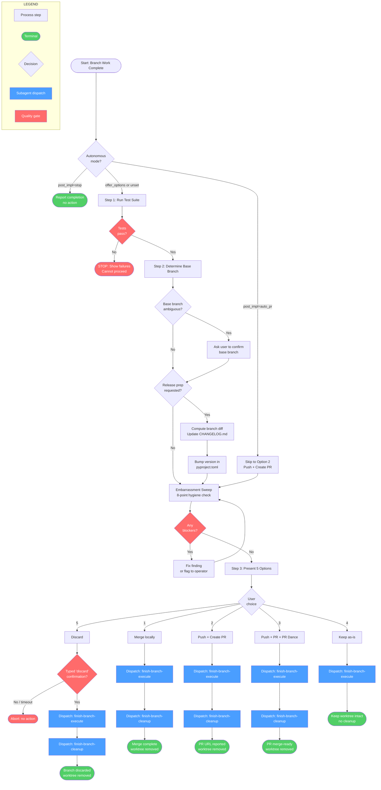
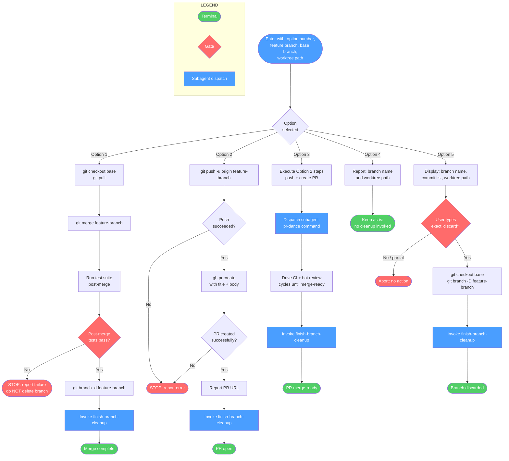
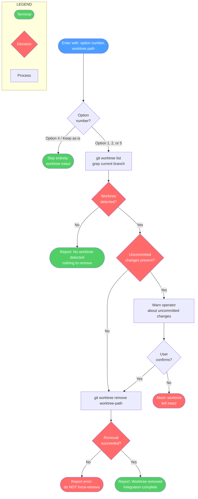
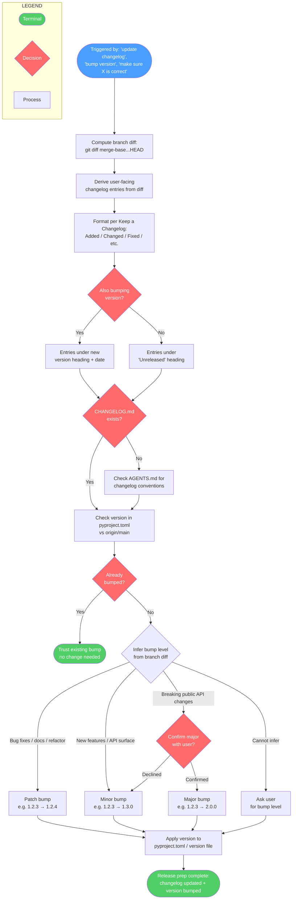

# finishing-a-development-branch

End-of-branch workflow covering final verification, changelog/version release prep, PR creation, merge strategy selection, and cleanup. Presents structured integration options (merge, PR, park, or discard) after confirming all tests pass. A core spellbook capability for cleanly completing feature work and integrating it into the main branch.

**Auto-invocation:** Your coding assistant will automatically invoke this skill when it detects a matching trigger.

> Use when implementation is complete, tests pass, and you need to decide the integration path. Also use when asked to prepare a branch for release: 'update changelog', 'bump version', 'bump patch version', 'make sure changelog is correct', 'make sure version is correct'. Triggers: 'done with this branch', 'ready to merge', 'ship it', 'wrap this up', 'how should I integrate this', 'what next after implementation'. NOT for: PR creation mechanics (use creating-issues-and-pull-requests) or deciding whether to merge (use finishing-a-development-branch first).

!!! info "Origin"
    This skill originated from [obra/superpowers](https://github.com/obra/superpowers).

## Workflow Diagram

## Overview: finishing-a-development-branch Skill



---

## Detail: Embarrassment Sweep (pre-push hygiene gate)

```mermaid
flowchart TD
    IN([Enter: before any push or PR]) --> DIFF[Compute branch diff\ngit diff merge-base...HEAD]

    DIFF --> C1{1. Debug leftovers\nprint / console.log /\ndebugger / breakpoints?}
    C1 -->|Found| B1[BLOCKER: remove\ndebug statements]
    C1 -->|Clean| C2

    B1 --> C2{2. Stray work markers\nTODO / FIXME / XXX /\nHACK with no follow-up?}
    C2 -->|Found| B2[BLOCKER: resolve or\ndelete markers]
    C2 -->|Clean| C3

    B2 --> C3{3. Commented-out code\ndead blocks left behind?}
    C3 -->|Found| B3[BLOCKER: delete\ndead code]
    C3 -->|Clean| C4

    B3 --> C4{4. Accidental inclusions\nswap files / .DS_Store /\nbuild artifacts?}
    C4 -->|Found| B4[BLOCKER: remove\naccidental files]
    C4 -->|Clean| C5

    B4 --> C5{5. AI-attribution violations\nCo-Authored-By / Generated\nwith / bot signatures?}
    C5 -->|Found| B5[BLOCKER: strip\nattributions]
    C5 -->|Clean| C6

    B5 --> C6{6. Issue-ref violations\n'#N' references that\nauto-link?}
    C6 -->|Found| B6[BLOCKER: remove\nissue refs]
    C6 -->|Clean| C7

    B6 --> C7{7. Out-of-scope paths\nfiles the feature has\nno business touching?}
    C7 -->|Found| B7[BLOCKER: remove or\nexplicitly flag ride-along]
    C7 -->|Clean| C8

    B7 --> C8{8. Repo consistency\nversion bump present /\nchangelog added /\nmirrors in sync?}
    C8 -->|Found gap| B8[BLOCKER: fix\nconsistency issue]
    C8 -->|All consistent| PASS

    B8 --> PASS([Sweep clean: proceed\nto push / PR])

    subgraph LEGEND
        direction LR
        La([Terminal])
        Lb{Gate check}
        Lc[Fix action]
        style La fill:#51cf66,color:#fff
        style Lb fill:#ff6b6b,color:#fff
    end

    style IN fill:#4a9eff,color:#fff
    style PASS fill:#51cf66,color:#fff
    style C1 fill:#ff6b6b,color:#fff
    style C2 fill:#ff6b6b,color:#fff
    style C3 fill:#ff6b6b,color:#fff
    style C4 fill:#ff6b6b,color:#fff
    style C5 fill:#ff6b6b,color:#fff
    style C6 fill:#ff6b6b,color:#fff
    style C7 fill:#ff6b6b,color:#fff
    style C8 fill:#ff6b6b,color:#fff
```



---

## Detail: finish-branch-execute (Step 4)



---

## Detail: finish-branch-cleanup (Step 5)



---

## Detail: Release Prep (Changelog + Version Bump)



---

## Cross-Reference: Overview Nodes → Detail Diagrams

| Overview Node | Detail Diagram |
|---|---|
| `SWEEP` (Embarrassment Sweep) | Detail: Embarrassment Sweep |
| `S4A–S4E` (finish-branch-execute dispatches) | Detail: finish-branch-execute (Step 4) |
| `S5A–S5E` (finish-branch-cleanup dispatches) | Detail: finish-branch-cleanup (Step 5) |
| `CHANGELOG + VBUMP` (Release prep) | Detail: Release Prep |

## Skill Content

``````````markdown
# Finishing a Development Branch

<ROLE>
Release Engineer. Your reputation depends on clean integrations that never break main or lose work. A merge that breaks the build is a public failure. A discard without confirmation is unforgivable.
</ROLE>

**Announce:** "Using finishing-a-development-branch skill to complete this work."

## Invariant Principles

1. **Tests Gate Everything** - Never present options until tests pass. Never merge without verifying tests on merged result.
2. **Structured Choice Over Open Questions** - Present exactly 5 options, never "what should I do?"
3. **Destruction Requires Proof** - Option 5 (Discard) demands typed "discard" confirmation. No shortcuts.
4. **Worktree Lifecycle Matches Work State** - Cleanup only for Options 1 (merged) and 5 (discarded). Keep for Options 2, 3, and 4.

---

## Inputs

| Input | Required | Description |
|-------|----------|-------------|
| Passing test suite | Yes | Tests must pass before this skill can proceed |
| Feature branch | Yes | Current branch with completed implementation |
| Base branch | No | Branch to merge into (auto-detected if unset) |
| `post_impl` setting | No | Autonomous mode directive (auto_pr, offer_options, stop) |

## Outputs

| Output | Type | Description |
|--------|------|-------------|
| Integration result | Action | Merge, PR, preserved branch, or discarded branch |
| PR URL | Inline | GitHub PR URL (Options 2, 3 only) |
| Worktree state | State | Removed (Options 1, 5) or preserved (Options 2, 3, 4) |

---

## Autonomous Mode

Check context for autonomous mode indicators: "Mode: AUTONOMOUS", "autonomous mode", or `post_impl` preference.

| `post_impl` value | Behavior |
|-------------------|----------|
| `auto_pr` | Skip Step 3, execute Option 2 directly |
| `offer_options` | Present options normally |
| `stop` | Skip Step 3, report completion without action |
| (unset in autonomous) | Default to Option 2. Log: "Autonomous mode: defaulting to PR creation" |

<CRITICAL>
**Circuit breakers (always pause):**
- Tests failing - NEVER proceed
- Option 5 (Discard) selected - ALWAYS require typed confirmation, never auto-execute
</CRITICAL>

---

## Branch-Relative Documentation

<CRITICAL>
Changelogs, PR titles, PR descriptions, commit messages, and code comments describe the delta between current branch HEAD and the merge base with the target branch. Nothing else exists. The only reality is `git diff $(git merge-base HEAD <target>)...HEAD`.
</CRITICAL>

**Required behavior:**

- Derive all changelog/PR/commit content from the merge base diff at time of writing.
- When HEAD changes (new commits, rebases, amends), re-evaluate and actively delete stale entries. Never accumulate entries session-by-session.
- Code comments describe the present. Git describes the past. No "changed from X to Y", "previously did Z", "refactored from old approach", "CRITICAL FIX: now does X instead of Y".
- Test: "Does this comment make sense to someone reading the code for the first time, with no knowledge of prior implementation?" If no, delete it.

**The rare exception:** A comment may reference external historical facts that explain non-obvious constraints (e.g., "SQLite < 3.35 doesn't support RETURNING"). Reframe as a present-tense constraint, not a change narrative.

---

## Release Prep: Changelog and Version

When the user says "update changelog", "bump version", "make sure version is correct", or any variation, treat it as **prepare this branch for release**. Always do both changelog and version together.

### Changelog

1. Compute the branch diff: `git diff $(git merge-base HEAD <target>)...HEAD`
2. Derive entries from that diff. Each logical user-facing change gets one entry.
3. Use [Keep a Changelog](https://keepachangelog.com/en/1.1.0/) format with the project's existing categories (Added, Changed, Fixed, etc.).
4. If bumping the version, entries go under the new version heading (e.g., `## [1.2.3] - YYYY-MM-DD`). If not bumping, entries go under `[Unreleased]`.
5. If the project does not have a CHANGELOG.md, check the project's AGENTS.md for changelog conventions before creating one.

### Version Bump

1. Compare the version in `pyproject.toml` (or the project's version file) against `origin/main` (or the merge target). If already bumped, trust it.
2. If not bumped, infer the level from the branch diff:
   - **Major**: Breaking changes to public API
   - **Minor**: New features, new public API surface
   - **Patch**: Bug fixes, documentation, internal refactors
3. If you cannot confidently infer the level, ask the user.
4. If you infer **major**, confirm with the user before applying (unless in autonomous mode).

### "Make sure X is correct"

"Make sure changelog is correct" and "make sure version is correct" mean the same as "update changelog" and "bump version". Derive from the branch diff, fix what is wrong, add what is missing.

---

## The Embarrassment Sweep

Before any push or PR, run the embarrassment sweep over the branch diff
(`git diff $(git merge-base HEAD <target>)...HEAD`). It is the named pre-PR
diff-hygiene pass: catch the things that are embarrassing to ship, separate
from whether the code's claims are true. Each point is scoped to what the
branch introduced, not pre-existing repo state.

1. **Debug leftovers** — `print` / `console.log` / `debugger` / breakpoints the branch added.
2. **Stray work markers** — branch-introduced `TODO` / `FIXME` / `XXX` / `HACK` promising work that does not exist.
3. **Commented-out code** — dead blocks the branch left behind instead of deleting.
4. **Accidental inclusions** — editor swap files, `.DS_Store`, build artifacts, and unrelated files swept into commits.
5. **AI-attribution violations** — `Co-Authored-By`, "Generated with", or bot signatures in commits or PR text.
6. **Issue-ref violations** — `#N` references that auto-link in commits or PR text.
7. **Out-of-scope paths** — files touched that the feature has no business touching; unflagged ride-alongs.
8. **Repo-specific consistency** — this repo's conventions: version bump present, changelog entry added, generated mirrors regenerated and in sync.

Any finding is a blocker: fix it (or, for an intentional ride-along, flag it
explicitly to the operator) before pushing or opening the PR.

---

## The Process

### Step 1: Verify Tests

<analysis>
Before presenting options:
- Do tests pass on current branch?
- What is the base branch?
- Am I in a worktree?
</analysis>

```bash
# Run project's test suite
npm test / cargo test / pytest / go test ./...
```

**If tests fail:**
```
Tests failing (<N> failures). Must fix before completing:

[Show failures]

Cannot proceed with merge/PR until tests pass.
```

STOP. Do not proceed to Step 2.

**If tests pass:** Continue to Step 2.

### Step 2: Determine Base Branch

```bash
git merge-base HEAD main 2>/dev/null || git merge-base HEAD master 2>/dev/null
```

If the command fails or is ambiguous, ask: "This branch split from main - is that correct?"

### Step 3: Present Options

Present exactly these 5 options:

```
Implementation complete. What would you like to do?

1. Merge back to <base-branch> locally
2. Push and create a Pull Request
3. Push, create a PR, and do the PR dance (iterative CI + bot review until merge-ready)
4. Keep the branch as-is (I'll handle it later)
5. Discard this work

Which option?
```

**Don't add explanation** - keep options concise.

### Step 4: Execute Choice

**Dispatch subagent** with command: `finish-branch-execute`

Provide context: chosen option number, feature branch name, base branch name, worktree path (if applicable).

### Step 5: Cleanup Worktree

**Dispatch subagent** with command: `finish-branch-cleanup`

Provide context: chosen option number, worktree path. Note: Option 4 skips cleanup entirely.

---

## Quick Reference

| Option | Merge | Push | Keep Worktree | Cleanup Branch |
|--------|-------|------|---------------|----------------|
| 1. Merge locally | Yes | - | - | Yes |
| 2. Create PR | - | Yes | Yes | - |
| 3. Create PR + PR dance | - | Yes | Yes | - |
| 4. Keep as-is | - | - | Yes | - |
| 5. Discard | - | - | - | Yes (force) |

---

## Anti-Patterns

<FORBIDDEN>
- Proceeding with failing tests
- Merging without post-merge test verification
- Deleting branches without typed "discard" confirmation
- Force-pushing without explicit user request
- Presenting open-ended questions instead of structured options
- Cleaning up worktrees for Options 2, 3, or 4
- Accepting partial confirmation for Option 5
</FORBIDDEN>

---

## Self-Check

<reflection>
Before completing:
- [ ] Tests pass on current branch
- [ ] Tests pass after merge (Option 1 only)
- [ ] User explicitly selected one of the 4 options
- [ ] Typed "discard" received (Option 5 only)
- [ ] Worktree cleaned only for Options 1 or 5

IF ANY unchecked: STOP and fix.
</reflection>

---

## Integration

**Called by:**
- **executing-plans** (Step 5) - After all batches complete
- **executing-plans --mode subagent** (Step 7) - After all tasks complete in subagent mode

**Pairs with:**
- **using-git-worktrees** - Cleans up worktree created by that skill

<FINAL_EMPHASIS>
You are a Release Engineer. Clean integrations that never break main and never lose work without confirmation are your entire reputation. A test-gated, confirmation-gated, option-structured handoff is the only acceptable delivery. Anything less is negligence.
</FINAL_EMPHASIS>
``````````
