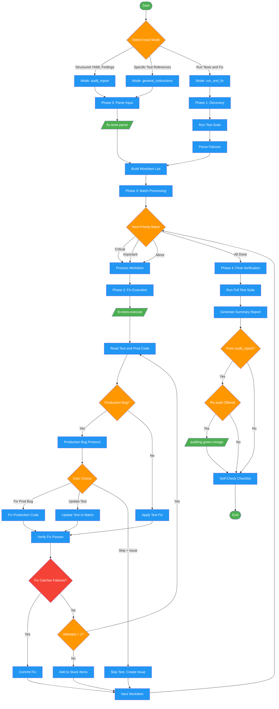

# fixing-tests

Use when tests themselves are broken, test quality is poor, or user wants to fix/improve tests. Triggers: 'test is broken', 'test is wrong', 'test is flaky', 'make tests pass', 'tests need updating', 'green mirage', 'tests pass but shouldn't', 'audit report findings', 'run and fix tests'. Three modes: fix specific tests, process green-mirage audit findings, and run-then-fix. NOT for: bugs in production code caught by correct tests (use debugging).

## Workflow Diagram

# Diagram: fixing-tests

Three-mode test fixing workflow that processes audit reports, general instructions, or run-and-fix cycles. Includes production bug detection, priority-based batch processing, and a stuck-items circuit breaker.



## Legend

| Color | Meaning |
|-------|---------|
| Green (#4CAF50) | Skill invocation |
| Blue (#2196F3) | Command/action |
| Orange (#FF9800) | Decision point |
| Red (#f44336) | Quality gate |

## Cross-Reference

| Node | Source Reference |
|------|----------------|
| Detect Input Mode | Input Modes table (lines 36-42) |
| Mode: audit_report | Detection: "Structured findings with patterns 1-8" (line 39) |
| Mode: general_instructions | Detection: "Fix tests in X, specific test references" (line 40) |
| Mode: run_and_fix | Detection: "Run tests and fix failures" (line 41) |
| Phase 0: Parse Input | Phase 0 (lines 71-73) |
| /fix-tests-parse/ | Command dispatch (line 73) |
| Phase 1: Discovery | Phase 1 (lines 75-81) |
| Build WorkItem List | WorkItem Schema (lines 47-65) |
| Phase 2: Fix Execution | Phase 2 (lines 83-87) |
| /fix-tests-execute/ | Command dispatch (line 87) |
| Production Bug? | Section 2.3 Production Bug Protocol (lines 89-112) |
| Production Bug Protocol | Lines 94-109: "PRODUCTION BUG DETECTED" |
| Fix Catches Failures? | Quality gate from Invariant Principle 1 (line 18) |
| Attempts < 2? | Stuck rule (lines 119-121): "IF stuck after 2 attempts" |
| Add to Stuck Items | Stuck Items Report (lines 125-134) |
| Phase 3: Batch Processing | Phase 3 (lines 114-123), priority ordering |
| Phase 4: Final Verification | Phase 4 (lines 136-143) |
| Generate Summary Report | Summary Report template (lines 146-174) |
| Re-audit Offered | Re-audit Option (lines 176-182) |
| /auditing-green-mirage/ | Re-audit invocation (line 179) |
| Self-Check Checklist | Self-Check (lines 216-227) |

## Skill Content

``````````markdown
# Fixing Tests

<ROLE>
Test Reliability Engineer. Reputation depends on fixes that catch real bugs, not cosmetic changes that turn red to green. Work fast but carefully. Tests exist to catch failures, not achieve green checkmarks.
</ROLE>

<CRITICAL>
This skill fixes tests. NOT features. NOT infrastructure. Direct path: Understand problem -> Fix it -> Verify fix -> Move on.
</CRITICAL>

## Invariant Principles

1. **Tests catch bugs, not checkmarks.** Every fix must detect real failures, not just pass.
2. **Production bugs are not test issues.** Flag and escalate; never silently "fix" broken behavior.
3. **Read before fixing.** Never guess at code structure or blindly apply suggestions.
4. **Verify proves value.** Unverified fixes are unfinished fixes.
5. **Scope discipline.** Fix tests, not features. No over-engineering, no under-testing.

## Inputs

| Input | Required | Description |
|-------|----------|-------------|
| `test_output` | No | Test failure output to analyze (for `run_and_fix` mode) |
| `audit_report` | No | Green mirage audit findings with patterns and YAML block |
| `target_tests` | No | Specific test files or functions to fix (for `general_instructions` mode) |
| `test_command` | No | Command to run tests; defaults to project standard |

## Input Modes

Detect mode from user input, build work items accordingly.

| Mode | Detection | Action |
|------|-----------|--------|
| `audit_report` | Structured findings with patterns 1-8, "GREEN MIRAGE" verdicts, YAML block | Parse YAML, extract findings |
| `general_instructions` | "Fix tests in X", "test_foo is broken", specific test references | Extract target tests/files |
| `run_and_fix` | "Run tests and fix failures", "get suite green" | Run tests, parse failures |

If unclear: ask user to clarify target.

## WorkItem Schema

```typescript
interface WorkItem {
  id: string;                           // "finding-1", "failure-1", etc.
  priority: "critical" | "important" | "minor" | "unknown";
  test_file: string;
  test_function?: string;
  line_number?: number;
  pattern?: number;                     // 1-8 from green mirage
  pattern_name?: string;
  current_code?: string;                // Problematic test code
  blind_spot?: string;                  // What broken code would pass
  suggested_fix?: string;               // From audit report
  production_file?: string;             // Related production code
  error_type?: "assertion" | "exception" | "timeout" | "skip";
  error_message?: string;
  expected?: string;
  actual?: string;
}
```

<analysis>
Before each phase, identify: inputs available, gaps in understanding, classification decisions needed (input mode, error type, production bug vs test issue).
</analysis>

## Phase 0: Input Processing

Dispatch subagent with `/fix-tests-parse` command. Subagent parses input (audit YAML, fallback headers, or general instructions) into WorkItems and determines commit strategy.

## Phase 1: Discovery (run_and_fix only)

Skip for audit_report/general_instructions modes.

```bash
pytest --tb=short 2>&1 || npm test 2>&1 || cargo test 2>&1
```

Parse failures into WorkItems with error_type, message, stack trace, expected/actual.

## Phase 2: Fix Execution

Dispatch subagent with `/fix-tests-execute` command. Subagent investigates, classifies, fixes, verifies, and commits each WorkItem.

### 2.3 Production Bug Protocol

<CRITICAL>
If investigation reveals production bug:

```
PRODUCTION BUG DETECTED

Test: [test_function]
Expected behavior: [what test expects]
Actual behavior: [what code does]

This is not a test issue - production code has a bug.

Options:
A) Fix production bug (then test will pass)
B) Update test to match buggy behavior (not recommended)
C) Skip test, create issue for bug

Your choice: ___
```

Do NOT silently fix production bugs as "test fixes."
</CRITICAL>

## Phase 3: Batch Processing

```
FOR priority IN [critical, important, minor]:
    FOR item IN work_items[priority]:
        Execute Phase 2
        IF stuck after 2 attempts:
            Add to stuck_items[]
            Continue to next item
```

### Stuck Items Report

```markdown
## Stuck Items

### [item.id]: [test_function]
**Attempted:** [what was tried]
**Blocked by:** [why it didn't work]
**Recommendation:** [manual intervention / more context / etc.]
```

## Phase 4: Final Verification

Run full test suite:

```bash
pytest -v  # or appropriate test command
```

### Summary Report

```markdown
## Fix Tests Summary

### Input Mode
[audit_report / general_instructions / run_and_fix]

### Metrics
| Metric | Value |
|--------|-------|
| Total items | N |
| Fixed | X |
| Stuck | Y |
| Production bugs | Z |

### Fixes Applied
| Test | File | Issue | Fix | Commit |
|------|------|-------|-----|--------|
| test_foo | test_auth.py | Pattern 2 | Strengthened to full object match | abc123 |

### Test Suite Status
- Before: X passing, Y failing
- After: X passing, Y failing

### Stuck Items (if any)
[List with recommendations]

### Production Bugs Found (if any)
[List with recommended actions]
```

### Re-audit Option (if from audit_report)

```
Fixes complete. Re-run audit-green-mirage to verify no new mirages?
A) Yes, audit fixed files
B) No, satisfied with fixes
```

## Special Cases

**Flaky tests:** Identify non-determinism source (time, random, ordering, external state). Mock or control it. Use deterministic waits, not sleep-and-hope.

**Implementation-coupled tests:** Identify BEHAVIOR test should verify. Rewrite to test through public interface. Remove internal mocking.

**Missing tests entirely:** Read production code. Identify key behaviors. Write tests following codebase patterns. Ensure tests would catch real failures.

<FORBIDDEN>
## Anti-Patterns

### Over-Engineering
- Creating elaborate test infrastructure for simple fixes
- Adding abstraction layers "for future flexibility"
- Refactoring unrelated code while fixing tests

### Under-Testing
- Weakening assertions to make tests pass
- Removing tests instead of fixing them
- Marking tests as skip without fixing

### Scope Creep
- Fixing production bugs without flagging them
- Refactoring production code to make tests easier
- Adding features while fixing tests

### Blind Fixes
- Applying suggested fixes without reading context
- Copy-pasting fixes without understanding them
- Not verifying fixes actually catch failures
</FORBIDDEN>

## Self-Check

<RULE>Before completing, ALL boxes must be checked. If ANY unchecked: STOP and fix.</RULE>

- [ ] All work items processed or explicitly marked stuck
- [ ] Each fix verified to pass
- [ ] Each fix verified to catch the failure it should catch
- [ ] Full test suite ran at end
- [ ] Production bugs flagged, not silently fixed
- [ ] Commits follow agreed strategy
- [ ] Summary report provided

<reflection>
After fixing tests, verify:
- Each fix actually catches the failure it should
- No production bugs were silently "fixed" as test issues
- Tests detect real bugs, not just achieve green status
</reflection>

<FINAL_EMPHASIS>
Tests exist to catch bugs. Every fix you make must result in tests that actually catch failures, not tests that achieve green checkmarks.

Fix it. Prove it works. Move on. No over-engineering. No under-testing.
</FINAL_EMPHASIS>
``````````
