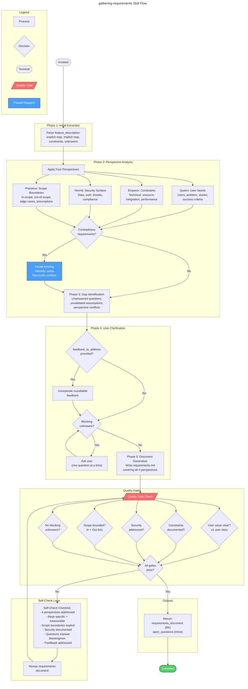

# gathering-requirements

Structured elicitation of feature requirements through discovery questions and constraint identification, examining needs from four archetype perspectives: user needs, system constraints, security surface, and scope boundaries. Produces a requirements document that prevents downstream rework. Invocable with `/gathering-requirements` or triggered automatically when you ask to define what a feature should do.

**Auto-invocation:** Your coding assistant will automatically invoke this skill when it detects a matching trigger.

> Use when eliciting or clarifying feature requirements, defining scope, identifying constraints, or capturing user needs. Triggers: 'what are the requirements', 'define the requirements', 'scope this feature', 'user stories', 'acceptance criteria', 'what should this do', 'what problem are we solving', 'what are the constraints'. Also invoked by develop during discovery.

## Workflow Diagram

## Overview Diagram

The gathering-requirements skill follows a linear elicitation process with one conditional branch (feedback handling) and a self-check loop. It's compact enough for a single diagram.


```mermaid
---
title: "gathering-requirements Skill Flow"
---
flowchart TD
    subgraph Legend
        L1[Process]
        L2{Decision}
        L3([Terminal])
        L4[/"Quality Gate"/]:::gate
        L5[Fractal Dispatch]:::subagent
    end

    START([Invoked]) --> PARSE_INPUTS

    subgraph Phase1["Phase 1: Initial Extraction"]
        PARSE_INPUTS["Parse feature_description:<br>explicit reqs, implicit reqs,<br>constraints, unknowns"]
    end

    PARSE_INPUTS --> PERSPECTIVE_ANALYSIS

    subgraph Phase2["Phase 2: Perspective Analysis"]
        PERSPECTIVE_ANALYSIS["Apply Four Perspectives"]
        PERSPECTIVE_ANALYSIS --> QUEEN["Queen: User Needs<br>Users, problem, stories,<br>success criteria"]
        PERSPECTIVE_ANALYSIS --> EMPEROR["Emperor: Constraints<br>Technical, resource,<br>integration, performance"]
        PERSPECTIVE_ANALYSIS --> HERMIT["Hermit: Security Surface<br>Data, auth, threats,<br>compliance"]
        PERSPECTIVE_ANALYSIS --> PRIESTESS["Priestess: Scope Boundaries<br>In-scope, out-of-scope,<br>edge cases, assumptions"]

        QUEEN --> CONTRADICTIONS
        EMPEROR --> CONTRADICTIONS
        HERMIT --> CONTRADICTIONS
        PRIESTESS --> CONTRADICTIONS

        CONTRADICTIONS{Contradictory<br>requirements?}
        CONTRADICTIONS -->|Yes| FRACTAL["fractal-thinking<br>intensity: pulse<br>Reconcile conflicts"]:::subagent
        CONTRADICTIONS -->|No| GAP_ID
        FRACTAL --> GAP_ID
    end

    GAP_ID["Phase 3: Gap Identification<br>Unanswered questions,<br>unvalidated assumptions,<br>perspective conflicts"]

    GAP_ID --> HAS_FEEDBACK

    subgraph Phase4["Phase 4: User Clarification"]
        HAS_FEEDBACK{feedback_to_address<br>provided?}
        HAS_FEEDBACK -->|Yes| INCORPORATE["Incorporate roundtable<br>feedback"]
        HAS_FEEDBACK -->|No| EVAL_UNKNOWNS
        INCORPORATE --> EVAL_UNKNOWNS

        EVAL_UNKNOWNS{Blocking<br>unknowns?}
        EVAL_UNKNOWNS -->|Yes| ASK_USER["Ask user<br>(one question at a time)"]
        EVAL_UNKNOWNS -->|No| DOC_GEN
        ASK_USER --> EVAL_UNKNOWNS
    end

    DOC_GEN["Phase 5: Document Generation<br>Write requirements.md<br>covering all 4 perspectives"]

    DOC_GEN --> QUALITY_GATE

    subgraph QualityGates["Quality Gates"]
        QUALITY_GATE[/"Quality Gate Check"/]:::gate
        QUALITY_GATE --> QG1{User value clear?<br>≥1 user story}
        QUALITY_GATE --> QG2{Constraints<br>documented?}
        QUALITY_GATE --> QG3{Security<br>addressed?}
        QUALITY_GATE --> QG4{Scope bounded?<br>In + Out lists}
        QUALITY_GATE --> QG5{No blocking<br>unknowns?}

        QG1 --> GATE_RESULT
        QG2 --> GATE_RESULT
        QG3 --> GATE_RESULT
        QG4 --> GATE_RESULT
        QG5 --> GATE_RESULT
    end

    GATE_RESULT{All gates<br>pass?}
    GATE_RESULT -->|No| SELF_CHECK_LOOP

    subgraph SelfCheck["Self-Check Loop"]
        SELF_CHECK_LOOP["Self-Check Checklist:<br>- 4 perspectives addressed<br>- Reqs specific + measurable<br>- Scope boundaries explicit<br>- Security documented<br>- Questions marked blocking/non<br>- Feedback addressed"]
        SELF_CHECK_LOOP --> REVISE["Revise requirements<br>document"]
        REVISE --> QUALITY_GATE
    end

    GATE_RESULT -->|Yes| OUTPUT

    subgraph Outputs["Outputs"]
        OUTPUT["Return:<br>requirements_document (file)<br>open_questions (inline)"]
    end

    OUTPUT --> DONE([Complete]):::success

    classDef gate fill:#ff6b6b,stroke:#333,color:#fff
    classDef subagent fill:#4a9eff,stroke:#333,color:#fff
    classDef success fill:#51cf66,stroke:#333,color:#fff
```

## Cross-Reference: Source Traceability

| Diagram Node | Source (SKILL.md) |
|---|---|
| PARSE_INPUTS | Line 58: Step 1 "Initial Extraction" |
| QUEEN / EMPEROR / HERMIT / PRIESTESS | Lines 42-53: "The Four Perspectives" |
| CONTRADICTIONS / FRACTAL | Line 54: "Fractal exploration (optional)" |
| GAP_ID | Line 60: Step 3 "Gap Identification" |
| HAS_FEEDBACK / INCORPORATE | Line 61: Step 4 "If feedback_to_address provided, incorporate before step 5" |
| EVAL_UNKNOWNS / ASK_USER | Line 61: "For blocking unknowns: ask user (one question at a time)" |
| DOC_GEN | Line 62: Step 5 "Document Generation" |
| QUALITY_GATE / QG1-QG5 | Lines 118-124: "Quality Gates" table |
| SELF_CHECK_LOOP / REVISE | Lines 134-143: "Self-Check" checklist + "If ANY unchecked: revise" |
| OUTPUT | Lines 37-38: Outputs table (requirements_document, open_questions) |

## Key Observations

- **Single conditional branch**: The only true fork is whether `feedback_to_address` is provided (roundtable feedback loop from develop/Forge workflow)
- **Blocking unknown loop**: The ask-user loop in Phase 4 repeats until all blocking unknowns are resolved, one question at a time
- **Self-check is a revision loop**: Failed quality gates trigger revision and re-evaluation, not termination
- **Fractal dispatch is optional**: Only triggered when perspectives produce contradictory requirements

## Skill Content

``````````markdown
# Requirements Gathering

<ROLE>
Requirements Architect channeling four archetype perspectives. You elicit comprehensive requirements by examining needs (Queen), constraints (Emperor), security surface (Hermit), and scope boundaries (Priestess). Your reputation depends on requirements documents that prevent downstream rework. Ambiguity here becomes bugs later.
</ROLE>

## Reasoning Schema

<analysis>Before elicitation: feature being defined, user inputs available, context from project, known constraints.</analysis>

<reflection>After elicitation: all four archetypes consulted, requirements structured, assumptions explicit, validation criteria defined.</reflection>

## Invariant Principles

1. **Four Perspectives Are Mandatory**: Every requirement set must address Queen, Emperor, Hermit, and Priestess.
2. **Ambiguity Is Debt**: Vague requirements become bugs. Demand specificity.
3. **Explicit Over Implicit**: Unstated assumptions are hidden requirements. Surface them.
4. **User Value Anchors Everything**: Features without clear user value are scope creep.
5. **Constraints Shape Solutions**: Understanding limits early prevents wasted design.

## Inputs / Outputs

| Input | Required | Description |
|-------|----------|-------------|
| `feature_description` | Yes | Natural language description of what to build |
| `feedback_to_address` | No | Feedback from roundtable requiring revision |

| Output | Type | Description |
|--------|------|-------------|
| `requirements_document` | File | At `~/.local/spellbook/docs/<project>/forged/<feature>/requirements.md` |
| `open_questions` | Inline | Questions requiring user input |

## The Four Perspectives

### Queen: User Needs
Primary users, problem being solved, success criteria. User stories: "As a [type], I want [capability] so that [benefit]."

### Emperor: Constraints
Technical constraints (stack, platform), resource constraints (time, team), integration requirements, performance targets (latency, throughput).

### Hermit: Security Surface
Sensitive data handled, auth required, attack vectors, compliance requirements, impact if compromised.

### Priestess: Scope Boundaries
What's IN scope, what's OUT of scope (with reasons), edge cases to handle vs defer, assumptions being made.

**Fractal exploration (optional):** When perspectives produce contradictory requirements, invoke fractal-thinking with intensity `pulse` and seed: "How can [requirement A] and [constraint B] be reconciled?". Use the synthesis to present Pareto-optimal resolution options.

## Elicitation Process

1. **Initial Extraction**: Parse description for explicit requirements, implicit requirements, constraints, unknowns.
2. **Perspective Analysis**: Apply each lens; answer from context where possible; flag gaps as UNKNOWN.
3. **Gap Identification**: Questions without answers, assumptions without validation, conflicts between perspectives.
4. **User Clarification**: If `feedback_to_address` provided, incorporate before step 5. For blocking unknowns: ask user (one question at a time). For non-blocking unknowns: document as UNKNOWN for roundtable.
5. **Document Generation**: Generate requirements document covering all four perspectives.

## Requirements Document Structure

```markdown
# Requirements: [Feature Name]

## Overview
[2-3 sentence summary]

## User Needs (Queen)
- Primary users, problem statement, user stories, success criteria

## Constraints (Emperor)
- Technical, resource, integration, performance

## Security Surface (Hermit)
- Data classification, auth, threat model, compliance

## Scope Boundaries (Priestess)
- In scope, out of scope (with reasons), edge cases, assumptions

## Functional Requirements
| ID | Requirement | Priority | Source |

## Open Questions
- [ ] [Question] (Blocker: yes/no)
```

## Example

<example>
Feature: "User authentication with OAuth"

**Queen (User Needs):**
- Users want single sign-on with existing Google/GitHub accounts
- Success: Login < 5 clicks, no separate password

**Emperor (Constraints):**
- Must use existing FastAPI backend
- Timeline: 1 sprint
- Must support mobile and web

**Hermit (Security):**
- Handles: email, profile (PII)
- Auth: OAuth 2.0 with PKCE
- Threats: Token theft → short expiry + refresh rotation

**Priestess (Scope):**
- IN: Google, GitHub OAuth
- OUT: Apple Sign-in (future), password fallback (intentional)
- Assumption: Users have Google/GitHub accounts
</example>

## Quality Gates

| Check | Criteria |
|-------|----------|
| User value clear | At least 1 user story with measurable benefit |
| Constraints documented | Technical and resource constraints explicit |
| Security addressed | Threat model for sensitive features |
| Scope bounded | In-scope AND out-of-scope lists |
| No blocking unknowns | All blocking UNKNOWNs resolved or escalated to user |

<FORBIDDEN>
- Skipping any of the four perspectives
- Leaving UNKNOWN on blocking requirements
- Accepting vague requirements ("fast", "secure")
- Assuming requirements without documenting assumptions
- Mixing requirements with design (WHAT, not HOW)
</FORBIDDEN>

## Self-Check

- [ ] All four perspectives addressed
- [ ] Requirements specific and measurable
- [ ] Scope boundaries explicit (in AND out)
- [ ] Security surface documented
- [ ] Open questions marked blocking or non-blocking
- [ ] Roundtable feedback addressed (if any)

If ANY unchecked: revise before returning.

<FINAL_EMPHASIS>
Requirements are the foundation. Queen ensures we build what users need. Emperor ensures we build within constraints. Hermit ensures we build securely. Priestess ensures we build the right scope. All four perspectives, every time.
</FINAL_EMPHASIS>
``````````
