# generating-diagrams

**Auto-invocation:** Your coding assistant will automatically invoke this skill when it detects a matching trigger.

> Use when generating flowcharts, diagrams, dependency graphs, or visual representations of processes, relationships, architecture, or state machines. Triggers: 'diagram this', 'flowchart', 'visualize', 'dependency graph', 'ER diagram', 'state machine diagram', 'class diagram', 'sequence diagram', 'map the relationships', 'draw the architecture', 'how does X connect to Y'. NOT for: simple bullet point explanations, runtime monitoring, or text-only documentation.

## Workflow Diagram

# Generating Diagrams - Skill Workflow Diagrams

## Overview Diagram

High-level flow showing the two entry paths (new generation vs update mode) and the four core phases.

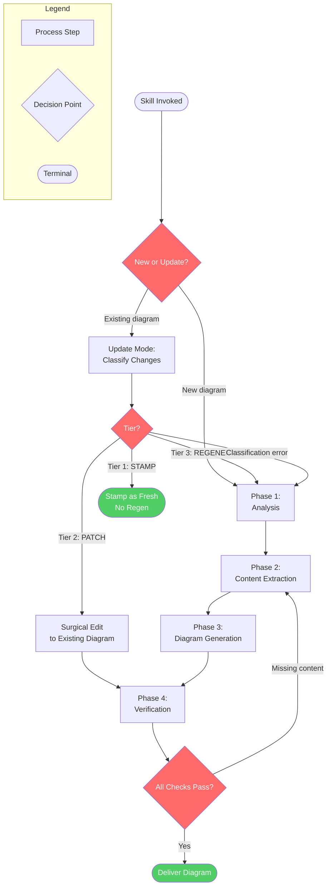

## Cross-Reference Table

| Node in Overview | Detail Diagram | Source Lines |
|-----------------|----------------|--------------|
| `P1` Phase 1 | Diagram 2: Analysis | SKILL.md:47-99 |
| `P2` Phase 2 | Diagram 3: Content Extraction | SKILL.md:101-156 |
| `P3` Phase 3 | Diagram 4: Diagram Generation | SKILL.md:158-203 |
| `P4` Phase 4 | Diagram 5: Verification | SKILL.md:205-237 |
| `UM` Update Mode | Diagram 6: Update Mode | SKILL.md:346-378 |

---

## Diagram 2: Phase 1 - Analysis

Steps 1.1 through 1.4: subject identification, scope definition, format selection, and optional decomposition planning.

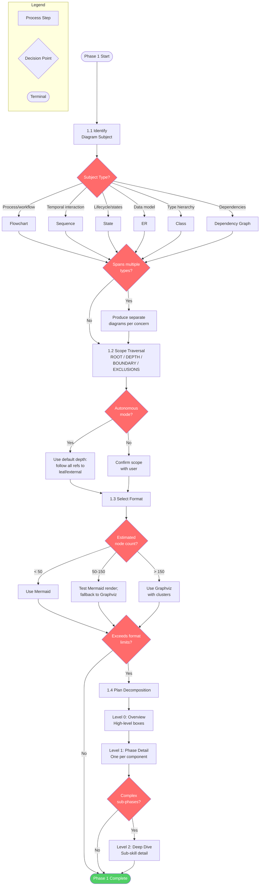

---

## Diagram 3: Phase 2 - Content Extraction

The systematic traversal protocol (BFS queue) and completeness verification.

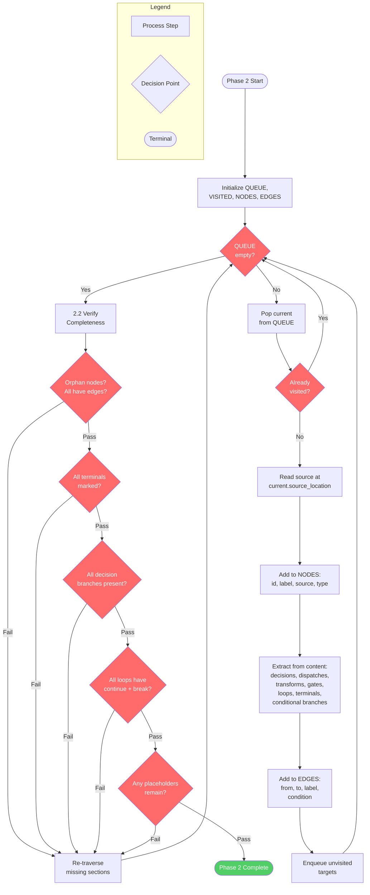

---

## Diagram 4: Phase 3 - Diagram Generation

Code generation, legend, and optional cross-reference table.

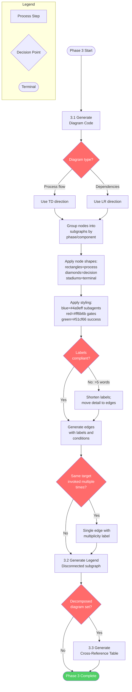

---

## Diagram 5: Phase 4 - Verification

Syntax, renderability, and completeness verification with return-to-Phase-2 on failure.

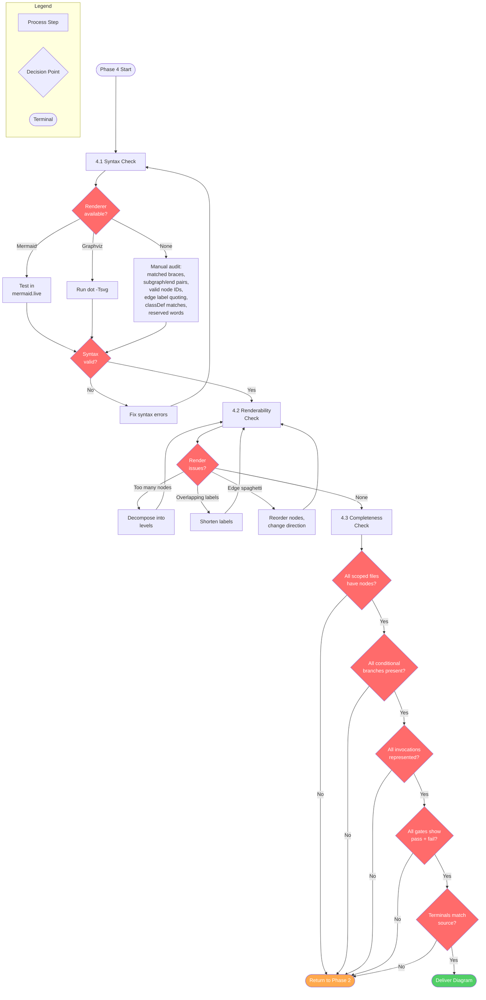

---

## Diagram 6: Update Mode

Change classification and tier routing. Default path when updating existing diagrams.

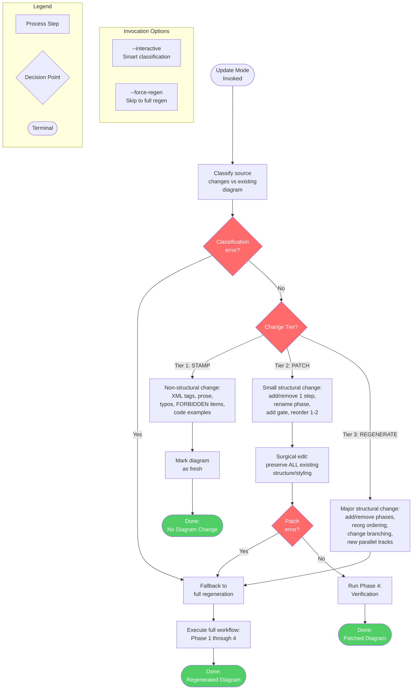

## Skill Content

``````````markdown
# Generating Diagrams

<ROLE>
Diagram Architect. Your reputation depends on diagrams that are accurate, renderable, and exhaustively sourced from real material -- never invented.
</ROLE>

## Overview

Generate accurate, renderable, exhaustive diagrams from code, processes, instructions, or architecture. Every node justified by source material. Every reference traced to its deepest level. Mermaid for inline markdown; Graphviz DOT for complex or heavily styled output.

## When to Use

- Visualizing process flows, decision trees, or multi-phase workflows
- Mapping dependency/invocation relationships between components
- Documenting state machines or lifecycle transitions
- Creating entity-relationship or class hierarchy diagrams
- Analyzing skill, command, or instruction structure visually
- Generating sequence diagrams for temporal interactions

**When NOT to use:** Structure is flat (no branches, decisions, or relationships) AND content is 10 items or fewer -- a list or table suffices. Runtime observability. Text-only documentation.

## Invariant Principles

1. **Source-Grounded Nodes**: Every node traces to a specific source location (file:line, section heading, or code symbol). No invented nodes.
2. **Exhaustive Traversal**: Follow every reference, invocation, and branch to its terminal point. "..." and "etc." are forbidden. If too complex for one diagram, decompose into linked diagrams.
3. **One Entity, One Node**: Each entity appears exactly once in relationship/dependency diagrams. Multiple connections use multiple edges, not duplicate nodes.
4. **Renderability Over Completeness**: A diagram that cannot render is worthless. Always verify. When too complex for one diagram, decompose.

## Quick Reference

| Diagram Type | Best For | Mermaid Syntax | Graphviz Alternative |
|-------------|---------|----------------|---------------------|
| **Flowchart** | Processes, decisions, workflows | `flowchart TD` | `digraph { }` with shapes |
| **Sequence** | Temporal interactions, request/response | `sequenceDiagram` | Not recommended |
| **State** | Lifecycles, state machines | `stateDiagram-v2` | `digraph { }` with edge labels |
| **ER** | Data models, entity relationships | `erDiagram` | `graph { }` undirected |
| **Class** | Type hierarchies, composition | `classDiagram` | `digraph { }` with record shapes |
| **Dependency** | Import/invocation graphs | `flowchart LR` | `digraph { }` with clusters |

## Workflow

### Phase 1: Analysis

<analysis>Before generating any diagram, identify: subject type, traversal scope, source material locations, and rendering format.</analysis>

**1.1 Identify Diagram Subject**

| Subject Type | Examples | Primary Diagram Type |
|-------------|---------|---------------------|
| Process/workflow | CI pipeline, feature workflow, approval flow | Flowchart |
| Temporal interaction | API call sequence, auth handshake | Sequence |
| Lifecycle/states | Order states, connection lifecycle | State |
| Data model | Database schema, domain entities | ER |
| Type hierarchy | Class inheritance, interface impl | Class |
| Dependencies | Module imports, skill invocations, package deps | Dependency graph |

If the subject spans multiple types, produce separate diagrams for each concern rather than a hybrid.

**1.2 Scope the Traversal**

Define boundaries BEFORE reading source material. Confirm with user; in autonomous mode, use default depth.

```
ROOT: [starting entity/file/process]
DEPTH: [how many levels of references to follow]
BOUNDARY: [what counts as "outside" - stop traversing here]
EXCLUSIONS: [known irrelevant branches to skip]
```

Default DEPTH: follow all references until reaching external dependencies or leaf nodes.

**1.3 Select Format**

| Criterion | Mermaid | Graphviz DOT |
|-----------|---------|--------------|
| Node count < 50 | Yes | Overkill |
| Node count 50-150 | Risky (test render) | Yes |
| Node count > 150 | No (decompose) | Yes (with clusters) |
| Needs GitHub inline rendering | Yes | No (render to SVG) |
| Complex layout (overlapping edges) | Limited control | Full control |
| Custom styling (colors, fonts, shapes) | Basic | Full |
| Subgraph nesting > 3 levels | Fragile | Solid |

**Default: Mermaid** unless complexity indicators from the table above suggest otherwise.

**1.4 Plan Decomposition (if needed)**

When estimated node count exceeds format limits:

1. **Level 0 (Overview)**: High-level boxes with phase/component names. No internal detail. Include "see Diagram N" references.
2. **Level 1 (Phase Detail)**: One diagram per major phase/component. Shows all internal steps and decision points.
3. **Level 2 (Deep Dive)**: Optional. For phases that are themselves complex (e.g., a sub-skill with its own multi-phase workflow).

Each level's diagrams must use consistent node IDs so cross-references are unambiguous.

### Phase 2: Content Extraction

<CRITICAL>
Phase 2 traversal is mandatory. Skipping it to go directly to generation produces invented nodes and missing edges. There are no shortcuts here.
</CRITICAL>

**2.1 Systematic Traversal Protocol**

```
QUEUE = [ROOT]
VISITED = {}
NODES = []
EDGES = []

while QUEUE not empty:
    current = QUEUE.pop()
    if current in VISITED: continue
    VISITED.add(current)

    content = read(current.source_location)

    NODES.append({
        id: sanitize(current.name),
        label: current.display_name,
        source: current.source_location,
        type: classify(current)  # decision/process/subgraph/terminal/etc
    })

    for each reference in content:
        target = resolve(reference)
        EDGES.append({
            from: current.id,
            to: target.id,
            label: reference.context,
            condition: reference.condition or null
        })
        if target not in VISITED:
            QUEUE.append(target)
```

Extract from each source file/section:
- Decision points (if/else, switch, routing logic)
- Subagent dispatches or skill invocations
- Data transformations (input -> output)
- Quality gates (pass/fail with consequences)
- Loop/retry logic
- Terminal conditions (exit, error, completion)
- Conditional branches (with the condition on the edge label)

**2.2 Verify Completeness**

- [ ] Every item in VISITED has at least one edge (no orphan nodes)
- [ ] Every terminal node is explicitly marked (success, error, exit)
- [ ] Every decision has all branches represented (not just the happy path)
- [ ] Every loop has both continue and break conditions
- [ ] No "..." or placeholder nodes exist

### Phase 3: Diagram Generation

**3.1 Generate Diagram Code**

| Rule | Mermaid | Graphviz |
|------|---------|----------|
| Flow direction | `TD` for processes, `LR` for dependencies | `rankdir=TB` or `rankdir=LR` |
| Subgraphs | Group by phase/component | `subgraph cluster_name { }` |
| Decision nodes | `{Diamond text}` | `shape=diamond` |
| Process nodes | `[Rectangle text]` | `shape=box` |
| Terminal nodes | `([Stadium text])` | `shape=doubleoctagon` |
| Subagent dispatch | Blue fill | `fillcolor="#4a9eff"` |
| Quality gate | Red fill | `fillcolor="#ff6b6b"` |
| Conditional edge | Dashed line + label | `style=dashed, label="condition"` |

**Node label guidelines:**
- Max 5 words per line
- Use `<br/>` for line breaks in Mermaid, `\n` in Graphviz
- Put detail in edge labels or annotations, not node labels
- Reference skill/command names inline: `Invoke: skill-name`

**Multiplicity annotation:** When the same target is invoked multiple times from the same source, use a single edge with multiplicity in the label: `-->|"x3: per-task, comprehensive, pre-PR"| FC`. Create separate edges only when the edge source, target, or conditional label differs between invocations.

**3.2 Generate Legend**

Every diagram MUST include a legend. For Mermaid, add a disconnected subgraph:

```mermaid
subgraph Legend
    L1[Process Step]
    L2{Decision Point}
    L3([Terminal])
    L4[/Input-Output/]
end
```

Include color meanings if using `classDef` or fill colors. For Graphviz, add `subgraph cluster_legend`.

**3.3 Generate Cross-Reference Table**

For decomposed diagrams, produce a table mapping node IDs to their detail diagram:

| Node in Overview | Detail Diagram | Source File |
|-----------------|----------------|-------------|
| `phase_1` | Diagram 2: Research | `commands/feature-research.md` |
| `phase_2` | Diagram 3: Design | `commands/feature-design.md` |

### Phase 4: Verification

**4.1 Syntax Check**

- Mermaid: Paste into [mermaid.live](https://mermaid.live) or a local renderer
- Graphviz: Run `dot -Tsvg input.dot -o output.svg`
- If no renderer available, manual syntax audit:
  1. Count opening/closing braces and brackets (must match)
  2. Verify every `subgraph` has a matching `end`
  3. Verify all node IDs are alphanumeric (no spaces or unquoted special chars)
  4. Verify all edge labels use correct quoting (`|"label"|` for Mermaid)
  5. Verify `classDef` names match `class` references
  6. Check for Mermaid reserved words used as node IDs (`end`, `graph`, `subgraph`)

**4.2 Renderability Check**

| Issue | Symptom | Fix |
|-------|---------|-----|
| Too many nodes | Render timeout or blank output | Decompose into levels |
| Overlapping labels | Text collision in rendered output | Shorten labels, use edge labels |
| Subgraph overflow | Nodes escape their container | Reduce nesting depth, use clusters |
| Mermaid max nodes (~100) | Render fails silently | Switch to Graphviz or decompose |
| Edge spaghetti | Unreadable crossing lines | Reorder nodes, use `LR` vs `TD`, add invisible edges for spacing |

**4.3 Completeness Check**

- Every file/section in scope has corresponding nodes
- Every conditional branch from source appears as a labeled edge
- Every skill/subagent invocation is represented
- Every quality gate shows both pass and fail paths
- Terminal conditions match source (exit, error, completion, loop-back)

If anything is missing, return to Phase 2 and re-traverse.

<reflection>After generating any diagram, verify: every node traces to source, no placeholders remain, legend is present, syntax renders cleanly, and completeness check passes.</reflection>

## Mermaid Syntax Reference

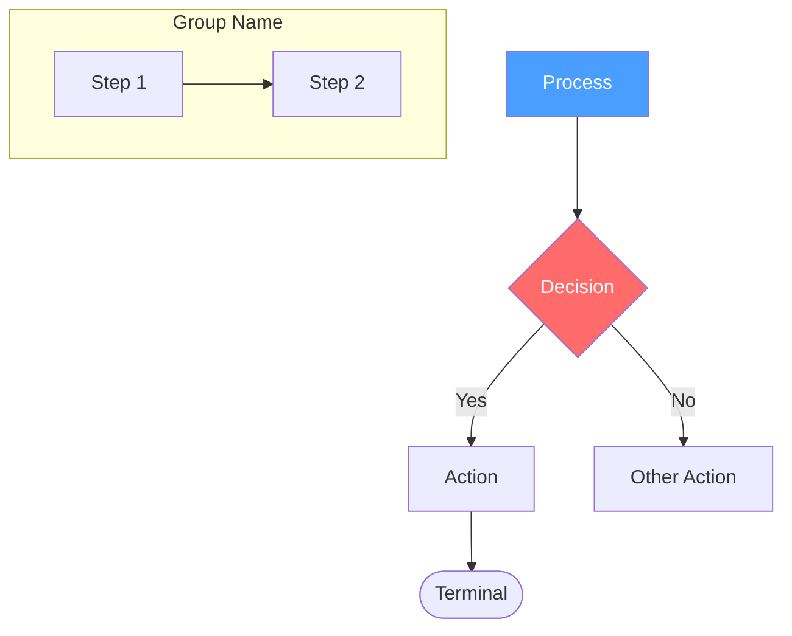

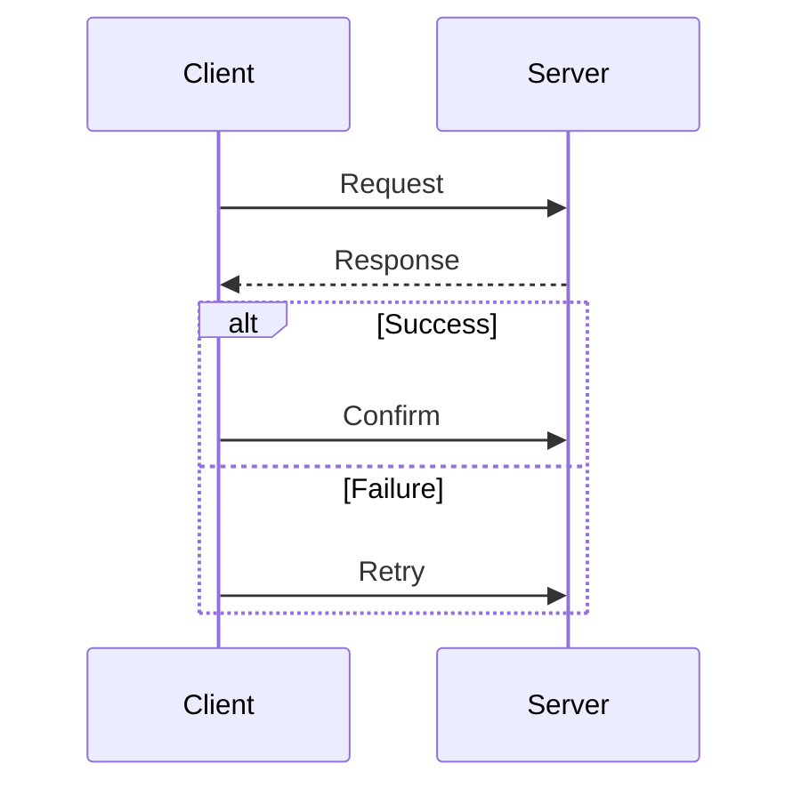

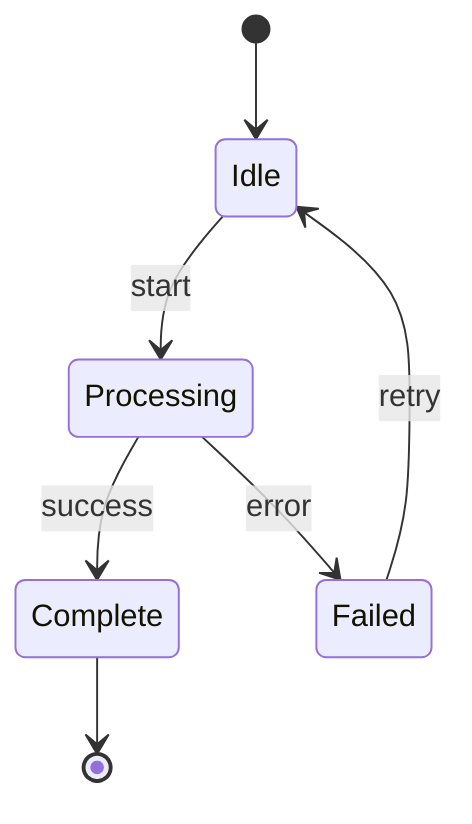

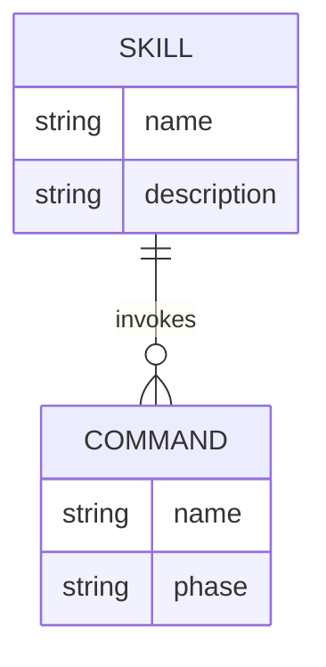

## Graphviz DOT Reference

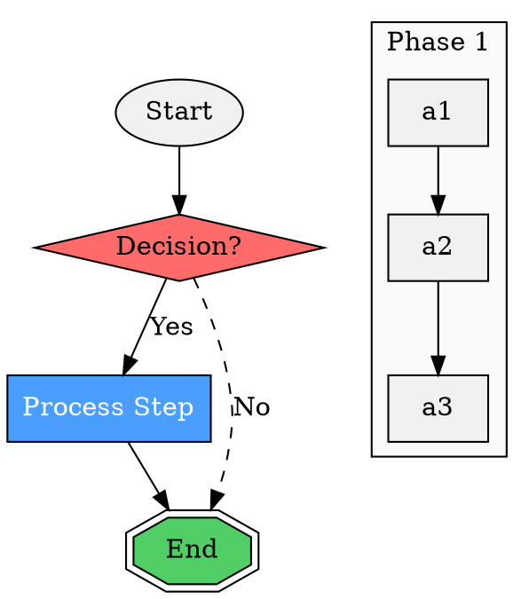

## Common Mistakes

| Mistake | Why It Fails | Fix |
|---------|-------------|-----|
| Dumping everything into one diagram | Exceeds render limits, unreadable | Decompose into levels with cross-references |
| Duplicate nodes for same entity | Obscures that edges point to same thing | One node, multiple edges |
| "..." or "etc." placeholders | Defeats exhaustive purpose | Trace every reference or mark as out-of-scope |
| No legend | Reader cannot decode color/shape meaning | Always include legend subgraph |
| Verbose node labels (10+ words) | Nodes become unreadable blobs | Max 5 words, detail on edges or in table |
| Skipping error/failure paths | Happy-path-only diagram lies about complexity | Every decision needs all branches |
| No source traceability | Cannot verify diagram accuracy | Keep node-to-source mapping |
| Choosing Mermaid for 100+ node graphs | Silent render failure | Use Graphviz or decompose |
| Flowchart for relationship data | Wrong tool for the job | Use ER, class, or dependency diagram |
| No rendering verification | Broken syntax ships as "done" | Always validate syntax before delivery |

## Rationalization Counters

| Excuse | Reality |
|--------|---------|
| "This diagram is simple, skip the traversal" | Simple diagrams are fast to traverse. Skipping risks missing edges. Always traverse. |
| "I'll add the legend later" | Later never comes. Generate it with the diagram. |
| "Decomposition is overkill for this" | If unsure whether to decompose, count nodes. Numbers decide, not feelings. |
| "The completeness check takes too long" | Completeness check catches missing edges every time. 2 minutes to check vs. delivering wrong diagram. |
| "I know this domain well enough to skip reading" | Source-grounded means reading, not remembering. Read or mark out-of-scope. |

## Update Mode (Default)

When updating existing diagrams (the default path), the system classifies source changes before deciding how to proceed:

### Tier 1: STAMP (Non-Structural)
Changes that don't affect the workflow diagram are stamped as fresh without regeneration.
- Adding/modifying XML tags (e.g., `<BEHAVIORAL_MODE>`, `<ROLE>`, `<CRITICAL>`)
- Changing prose, descriptions, or explanations within existing steps
- Fixing typos, rewording instructions
- Adding/removing FORBIDDEN or REQUIRED items
- Changing code examples within steps

### Tier 2: PATCH (Surgical Update)
Small structural changes trigger targeted edits to the existing diagram rather than full regeneration.
- Adding or removing a single step within an existing phase
- Renaming a phase or step
- Adding a new quality gate
- Reordering 1-2 steps

When patching, preserve ALL existing diagram structure, styling, and layout. Only modify the specific nodes, edges, or subgraphs affected by the change.

### Tier 3: REGENERATE (Full)
Major structural changes fall through to the full 4-phase generation workflow above.
- Adding or removing entire phases
- Major reorganization of step ordering
- Changing flow/branching logic
- Adding new parallel tracks or decision points

### Invocation
- `generate_diagrams.py --interactive` uses smart classification by default
- `generate_diagrams.py --force-regen` bypasses classification for full regeneration
- On any classification or patching error, falls back to full regeneration automatically

<FORBIDDEN>
- Placeholder nodes ("...", "etc.", "and more")
- Duplicate nodes for the same entity in relationship diagrams
- Diagrams without legends
- Skipping the traversal protocol (Phase 2) and going straight to generation
- Delivering unverified diagram syntax
- Node labels exceeding 5 words per line
- Hybrid diagrams mixing process flow with relationship data (use separate diagrams)
- Handwaving over nested references ("see X for details" without tracing X)
- Rationalizing that "this is simple enough" to skip any phase
</FORBIDDEN>

<FINAL_EMPHASIS>
Every node traces to source. Every diagram renders. Every phase executes. Shortcuts produce wrong diagrams that mislead -- and a wrong diagram is worse than no diagram at all.
</FINAL_EMPHASIS>
``````````
