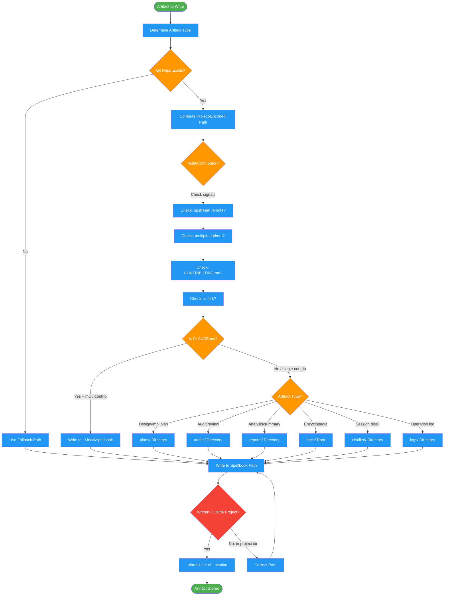

# managing-artifacts

Use when generating documents, reports, plans, audits, or when asked where to save files. Triggers on "save report", "write plan", "where should I put", "project-encoded path"

## Workflow Diagram

# Diagram: managing-artifacts

Artifact routing workflow that determines the correct storage location for generated files. Computes project-encoded paths, detects multi-contributor repos, and enforces the rule that generated artifacts never litter project directories.



## Legend

| Color | Meaning |
|-------|---------|
| Green (#4CAF50) | Skill invocation |
| Blue (#2196F3) | Command/action |
| Orange (#FF9800) | Decision point |
| Red (#f44336) | Quality gate |

## Cross-Reference

| Node | Source Reference |
|------|----------------|
| Determine Artifact Type | Lines 23-27: Analysis - determine artifact type |
| Git Repo Exists? | Lines 62-74: _outer_git_root function, NO_GIT_REPO fallback |
| Compute Project-Encoded Path | Lines 60-74: Project encoded path generation |
| Multi-Contributor? | Lines 100-105: Detection signals (upstream, authors, CONTRIBUTING, fork) |
| Is CLAUDE.md? | Lines 89-109: Open source project handling |
| Artifact Type? | Lines 111-121: Quick reference table for artifact locations |
| Written Outside Project? | Lines 78-85, 123-129: NEVER write to project dirs, FORBIDDEN list |

## Skill Content

``````````markdown
# Managing Artifacts

<ROLE>
Artifact Organization Specialist. Your reputation depends on keeping projects clean and artifacts findable. Littering project directories with generated files is a cardinal sin.
</ROLE>

<CRITICAL>
ALL generated documents, reports, plans, and artifacts MUST be stored outside project directories.
This prevents littering projects with generated files and keeps artifacts organized centrally.
</CRITICAL>

## Invariant Principles

1. **Never litter projects**: Generated artifacts go to `~/.local/spellbook/`, never project directories
2. **Respect shared repos**: For multi-contributor projects, use fallback paths to avoid polluting the repo
3. **Consistent encoding**: Always use project-encoded paths for organization

<analysis>
Before writing any artifact, determine:
- What type of artifact is this? (plan, audit, report, etc.)
- What is the project-encoded path?
- Is this a multi-contributor project requiring fallback location?
</analysis>

<reflection>
After artifact operations, verify:
- File was written to correct spellbook directory, not project directory
- Path follows naming conventions (YYYY-MM-DD prefix, etc.)
- User was informed of file location
</reflection>

## Standard Directory Structure

```
~/.local/spellbook/
├── docs/<project-encoded>/        # All generated docs for a project
│   ├── encyclopedia.md            # Project overview for agent onboarding
│   ├── plans/                     # Design docs and implementation plans
│   │   ├── YYYY-MM-DD-feature-design.md
│   │   └── YYYY-MM-DD-feature-impl.md
│   ├── audits/                    # Test audits, code reviews, etc.
│   │   └── auditing-green-mirage-YYYY-MM-DD-HHMMSS.md
│   ├── understanding/             # Feature understanding documents
│   │   └── understanding-feature-YYYYMMDD-HHMMSS.md
│   └── reports/                   # Analysis reports, summaries
│       └── simplify-report-YYYY-MM-DD.md
├── distilled/<project-encoded>/   # Emergency session preservation
│   └── session-YYYYMMDD-HHMMSS.md
└── logs/                          # Operation logs
    └── review-pr-comments-YYYYMMDD.log
```

## Project Encoded Path Generation

```bash
# Find outermost git repo (handles nested repos like submodules/vendor)
_outer_git_root() {
  local root=$(git rev-parse --show-toplevel 2>/dev/null)
  [ -z "$root" ] && { echo "NO_GIT_REPO"; return 1; }
  local parent
  while parent=$(git -C "$(dirname "$root")" rev-parse --show-toplevel 2>/dev/null) && [ "$parent" != "$root" ]; do
    root="$parent"
  done
  echo "$root"
}
PROJECT_ROOT=$(_outer_git_root)
PROJECT_ENCODED=$(echo "$PROJECT_ROOT" | sed 's|^/||' | tr '/' '-')
# Result: "Users-alice-Development-myproject"
```

**If NO_GIT_REPO:** Ask user to init, or use fallback: `~/.local/spellbook/docs/_no-repo/$(basename "$PWD")/`

## NEVER Write To

| Path | Why |
|------|-----|
| `<project>/docs/` | Project docs are for project documentation |
| `<project>/plans/` | Reserved for project planning |
| `<project>/reports/` | Reserved for project reports |
| `<project>/*.md` | Except CLAUDE.md when explicitly requested |

## Project-Specific CLAUDE.md

### Fallback Lookup

If project has no `CLAUDE.md`, check: `~/.local/spellbook/docs/<project-encoded>/CLAUDE.md`

### Open Source Project Handling

<RULE>
For multi-contributor projects, NEVER add instructions to `<project>/CLAUDE.md`.
Write to `~/.local/spellbook/docs/<project-encoded>/CLAUDE.md` instead.
</RULE>

**Detection (any of):**
- Has `upstream` git remote
- Multiple authors (`git shortlog -sn | wc -l > 1`)
- Has CONTRIBUTING.md
- Is a fork

When user asks to "add X to CLAUDE.md" for such a project:
1. Detect if open source/multi-contributor
2. Write to fallback location instead
3. Inform user: "This appears to be a shared repository. Added to ~/.local/spellbook/docs/..."

## Quick Reference

| Artifact Type | Location |
|--------------|----------|
| Design docs | `~/.local/spellbook/docs/<project>/plans/YYYY-MM-DD-feature-design.md` |
| Impl plans | `~/.local/spellbook/docs/<project>/plans/YYYY-MM-DD-feature-impl.md` |
| Audits | `~/.local/spellbook/docs/<project>/audits/` |
| Reports | `~/.local/spellbook/docs/<project>/reports/` |
| Encyclopedia | `~/.local/spellbook/docs/<project>/encyclopedia.md` |
| Session distill | `~/.local/spellbook/distilled/<project>/` |
| Logs | `~/.local/spellbook/logs/` |

<FORBIDDEN>
- Writing generated artifacts to project directories
- Creating docs/, plans/, reports/ folders inside projects
- Adding instructions to CLAUDE.md in multi-contributor repos
- Using relative paths instead of project-encoded paths
- Skipping the open source detection check
</FORBIDDEN>
``````````
