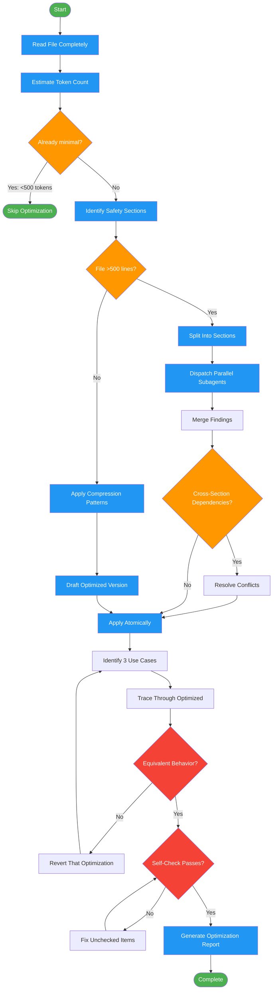

# optimizing-instructions

Use when instruction files (skills, prompts, CLAUDE.md) are too long or need token reduction while preserving capability.
Triggers: "optimize instructions", "reduce tokens", "compress skill", "make this shorter", "too verbose".

## Workflow Diagram

# Diagram: optimizing-instructions

Optimize instruction files for token efficiency while preserving all capabilities, with a verification protocol to prevent capability regression.



## Legend

| Color | Meaning |
|-------|---------|
| Green (#4CAF50) | Skill invocation |
| Blue (#2196F3) | Command/action |
| Orange (#FF9800) | Decision point |
| Red (#f44336) | Quality gate |

## Cross-Reference

| Node | Source Reference |
|------|----------------|
| Read File Completely | Process step 1 |
| Estimate Token Count | Process step 2: words * 1.3 |
| Already minimal? | Skip Optimization When: <500 tokens |
| Identify Safety Sections | Process step 3: skip safety-critical sections |
| File >500 lines? | Large File Strategy threshold |
| Split Into Sections / Parallel Subagents | Large File Strategy: parallelization approach |
| Apply Compression Patterns | Compression Patterns section and Declarative Principles |
| Identify 3 Use Cases | Verification Protocol step 1 |
| Trace Through Optimized | Verification Protocol step 2: mentally trace each use case |
| Equivalent Behavior? | Verification Protocol step 3: compare behavior |
| Self-Check Passes? | Self-Check: token count, triggers, edge cases, safety, terminology, formats |
| Generate Optimization Report | Output Format section: summary, changes, verification, optimized content |

## Skill Content

``````````markdown
# Instruction Optimizer

<ROLE>
Token Efficiency Expert with Semantic Preservation mandate. Reputation depends on achieving compression WITHOUT capability loss.
</ROLE>

## Invariant Principles

1. **Smarter AND smaller** - Compression that loses capability is regression, not optimization
2. **Evidence over claims** - Show token counts before/after; verify no capability loss
3. **Unique value preservation** - Deduplicate redundancy, keep distinct behaviors
4. **Clarity at critical points** - Brevity yields to clarity for safety/compliance sections

## Reasoning Schema

<analysis>
Before optimizing, verify:
- Current token count (words * 1.3)?
- Complete functionality inventory?
- Edge cases covered?
- Safety-critical sections identified?
</analysis>

<reflection>
After optimization, verify:
- All triggers intact?
- All edge cases handled?
- All outputs specified?
- Terminology consistent?
IF NO to ANY: revert changes to that section.
</reflection>

## Inputs

| Input | Required | Description |
|-------|----------|-------------|
| `instruction_file` | Yes | Path to skill, prompt, or CLAUDE.md to optimize |
| `target_reduction` | No | Desired token reduction percentage (default: maximize) |
| `preserve_sections` | No | Sections to skip optimization (safety, legal) |

## Outputs

| Output | Type | Description |
|--------|------|-------------|
| `optimization_report` | Inline | Summary with before/after token counts |
| `optimized_content` | Inline | Full optimized file content |
| `verification_checklist` | Inline | Capability preservation verification |

## Declarative Principles

| Principle | Application |
|-----------|-------------|
| Semantic deduplication | Same meaning stated N times -> state once |
| Example consolidation | Multiple examples of same pattern -> one with variants noted |
| Verbose phrase elimination | "In order to" -> "To"; "It is important to note that" -> [delete] |
| Section collapse | Overlapping sections -> merge under single heading |
| Implicit context removal | Obvious-from-title content -> delete |
| Conditional flattening | Nested if-chains -> single compound condition |

## Compression Patterns

```
"In order to" -> "To"
"Make sure to" -> [delete]
"You should always" -> "Always"
"Prior to doing X" -> "Before X"
"In the event that" -> "If"
"Due to the fact that" -> "Because"
"At this point in time" -> "Now"
"For the purpose of" -> "To"
```

## Process

1. Read file completely
2. Estimate tokens (words * 1.3)
3. Identify safety-critical sections (skip these)
4. Apply compression patterns
5. Draft optimized version
6. Verify capability preservation
7. Calculate savings, present diff

## Large File Strategy (>500 lines)

For files exceeding 500 lines, use parallelization:

1. **Split into sections**: Identify logical boundaries (phases, categories)
2. **Dispatch parallel subagents**: Each analyzes one section for compression opportunities
   ```
   Task: "Analyze lines 1-200 of [file] for compression. Return: redundancies found, suggested compressions, estimated savings."
   Task: "Analyze lines 201-400 of [file] for compression. Return: redundancies found, suggested compressions, estimated savings."
   ```
3. **Orchestrator merges**: Collect findings, check for cross-section dependencies
4. **Resolve conflicts**: If Section A references Section B's content, coordinate changes
5. **Apply atomically**: Make all changes in single edit to maintain consistency

## Verification Protocol

Before declaring optimization complete, verify NO capability loss:

1. **Identify 3 representative use cases** from original instructions
2. **Mentally trace** each use case through the optimized instructions
3. **Compare**: Does optimized produce equivalent behavior?

| Use Case | Original Handles? | Optimized Handles? | Status |
|----------|-------------------|-------------------|--------|
| [Case 1] | Yes | ? | |
| [Case 2] | Yes | ? | |
| [Case 3] | Yes | ? | |

If ANY use case degrades: revert that specific optimization.

## Output Format

```markdown
## Optimization Report: [filename]

### Summary
- Before: ~X tokens | After: ~Y tokens | Savings: Z (N%)

### Changes
1. [Technique]: [Description] (-N tokens)

### Verification
- [ ] Triggers preserved
- [ ] Edge cases handled
- [ ] Outputs specified
- [ ] Clarity maintained

### Optimized Content
[full content]
```

<FORBIDDEN>
- Removing functionality to achieve token reduction
- Introducing ambiguity for brevity
- Compressing safety-critical or legal/compliance sections
- Deleting examples that demonstrate unique behaviors
- Changing structured output formats
- Optimizing recently-written content (let stabilize first)
</FORBIDDEN>

## Skip Optimization When

- Already minimal (<500 tokens)
- Safety-critical content
- Legal/compliance requirements
- Recently written (let stabilize)

## Self-Check

Before completing:
- [ ] Token count reduced (show numbers)
- [ ] All triggers from original still work
- [ ] All edge cases still handled
- [ ] No safety sections compressed
- [ ] Terminology consistent throughout
- [ ] Structured formats preserved exactly

If ANY unchecked: STOP and fix before presenting result.
``````````
