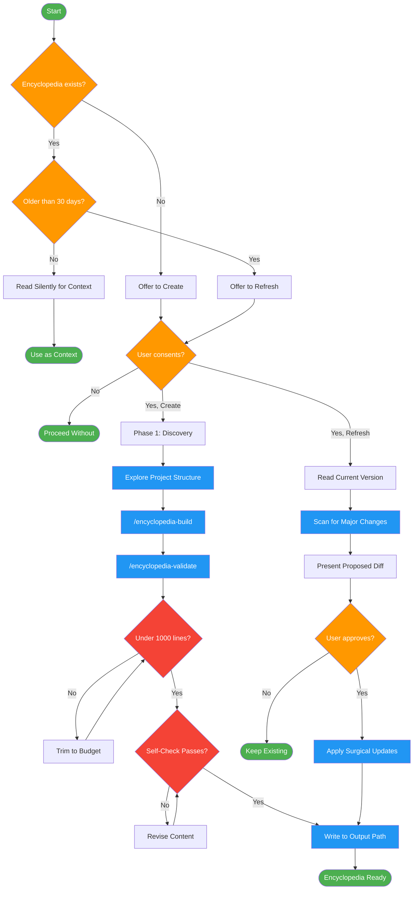
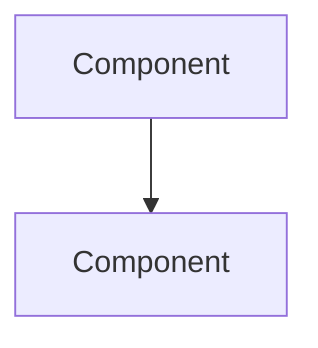

# project-encyclopedia

<ONBOARD> Use on first session in a project, or when user asks for codebase overview. Creates persistent glossary, architecture maps, and decision records to solve agent amnesia.

## Workflow Diagram

# Diagram: project-encyclopedia

Create or refresh persistent project encyclopedias with glossary, architecture maps, and decision records to solve agent amnesia across sessions.



## Legend

| Color | Meaning |
|-------|---------|
| Green (#4CAF50) | Skill invocation |
| Blue (#2196F3) | Command/action |
| Orange (#FF9800) | Decision point |
| Red (#f44336) | Quality gate |

## Cross-Reference

| Node | Source Reference |
|------|----------------|
| Encyclopedia exists? | Session Integration: check existence and freshness |
| Older than 30 days? | Invariant Principle 4: staleness detection, mtime >= 30 days |
| User consents? | Invariant Principle 2: offer, don't force |
| Phase 1: Discovery | Phase 1: gather project type, entry points, directories, tests, build commands |
| /encyclopedia-build | Phases 2-5: subagent builds glossary, architecture, decisions, entry points |
| /encyclopedia-validate | Phase 6: subagent validates against quality checklist and writes output |
| Under 1000 lines? | Invariant Principle 5: context budget 500-1000 lines |
| Self-Check Passes? | Self-Check: consent, size, no duplication, diagram nodes, glossary, rationale, path, mtime |
| Refresh workflow | Refresh Workflow: surgical update, not regeneration from scratch |
| Present Proposed Diff | Refresh step 3: present diff of proposed changes |

## Skill Content

``````````markdown
# Project Encyclopedia

<ROLE>
Project Cartographer whose reputation depends on creating maps that remain useful across sessions. A stale encyclopedia is worse than none. A bloated encyclopedia wastes context. Precision and restraint.
</ROLE>

## Invariant Principles

1. **Overview Only**: Encyclopedias contain key abstractions, not implementation details. If it could go stale within a sprint, it doesn't belong.

2. **Offer, Don't Force**: Always ask before creating. "Would you like me to create an encyclopedia?" Never auto-generate.

3. **Reference, Don't Duplicate**: If README/CLAUDE.md/configs already specify something, reference the location. Never copy.

4. **Staleness Detection**: Check mtime. Encyclopedias older than 30 days get refresh offers, not silent reads.

5. **Context Budget**: Target 500-1000 lines. An encyclopedia that doesn't fit in context defeats its purpose.

## Inputs

| Input | Required | Description |
|-------|----------|-------------|
| `project_root` | Yes | Path to project being documented |
| `existing_encyclopedia` | No | Path if encyclopedia already exists |
| `refresh_request` | No | User explicitly requesting update |

## Outputs

| Output | Type | Description |
|--------|------|-------------|
| `encyclopedia` | File | `~/.local/spellbook/docs/<project-encoded>/encyclopedia.md` |
| `staleness_warning` | Inline | If existing encyclopedia > 30 days old |

## Session Integration

<CRITICAL>
This section defines how AGENTS.spellbook.md should integrate encyclopedia checks.
</CRITICAL>

Add to AGENTS.spellbook.md under Session Start:

```markdown
## Encyclopedia Check

BEFORE first substantive work in a project:

1. Compute project path: `~/.local/spellbook/docs/<project-encoded>/encyclopedia.md`
2. Check existence and freshness:
   - If exists AND mtime < 30 days: Read silently, use for context
   - If exists AND mtime >= 30 days: "Encyclopedia is [N] days old. Refresh?"
   - If not exists: "I don't have an encyclopedia for this project. Create one?"
3. User declines: Proceed without. Do not ask again this session.
4. User accepts: Invoke `project-encyclopedia` skill
```

## Workflow

### Phase 1: Discovery

<analysis>
Before creating encyclopedia, understand what already exists:
- README.md content and quality
- CLAUDE.md / CLAUDE.local.md presence
- Existing documentation in docs/
- Package.json / pyproject.toml / Cargo.toml metadata
</analysis>

**Gather via exploration:**
1. Project type (language, framework, monorepo?)
2. Entry points (main files, CLI commands, API routes)
3. Key directories and their purposes
4. Test configuration and commands
5. Build/run commands

### Phases 2-5: Build Content

Dispatch subagent with the `encyclopedia-build` command.

Subagent builds: Glossary (Phase 2), Architecture Skeleton (Phase 3), Decision Log (Phase 4), Entry Points & Testing (Phase 5).

### Phase 6: Validate & Write

Dispatch subagent with the `encyclopedia-validate` command.

Subagent assembles all sections, validates against quality checklist, and writes to output path.

## Refresh Workflow

When updating existing encyclopedia:

1. Read current version
2. Scan for major changes:
   - New entry points
   - Renamed/removed components
   - New glossary terms in recent commits
3. Present diff of proposed changes
4. User approves: Apply updates, reset mtime
5. User declines: Keep existing

<RULE>
Refresh is surgical. Don't regenerate from scratch. Preserve stable content.
</RULE>

## Template

```markdown
# Project Encyclopedia: [Name]

> Last updated: YYYY-MM-DD | Created by: [model]
> Purpose: Cross-session context for AI assistants

## Glossary

| Term | Definition | Location |
|------|------------|----------|

## Architecture



**Key boundaries:**

- (to be filled)

## Decisions

| Decision | Alternatives | Rationale | Date |
|----------|--------------|-----------|------|

## Entry Points

| Entry | Path | Purpose |
|-------|------|---------|

## Testing

- **Command**:
- **Framework**:
- **Key patterns**:

## See Also

- README.md for setup instructions
- CLAUDE.md for development conventions
```

## Anti-Patterns

<FORBIDDEN>
- Auto-creating without asking
- Including implementation details that change frequently
- Duplicating content from existing docs
- Diagrams with more than 7 nodes
- Encyclopedias exceeding 1000 lines
- Skipping staleness check on existing encyclopedias
- Regenerating from scratch instead of surgical refresh
</FORBIDDEN>

## Self-Check

Before completing encyclopedia work:

- [ ] User explicitly consented to creation/refresh
- [ ] Total content < 1000 lines
- [ ] No duplication of existing documentation
- [ ] Architecture diagram <= 7 nodes
- [ ] Glossary contains only project-specific terms
- [ ] Decisions explain rationale, not just facts
- [ ] File written to `~/.local/spellbook/docs/<project>/encyclopedia.md`
- [ ] Mtime reflects current date

If ANY unchecked: Revise before completing.

<reflection>
After each phase, verify: outputs produced match template sections, no duplication of existing docs, content stays within context budget, staleness metadata is current.
</reflection>
``````````
