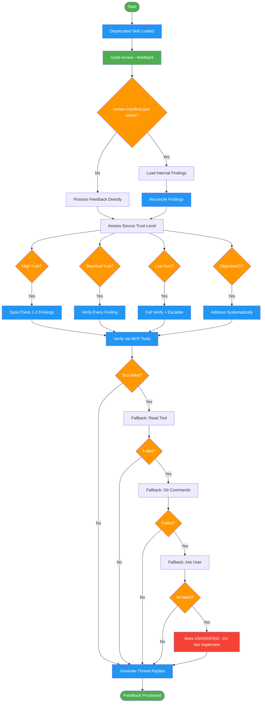

# receiving-code-review

Use when you have received code review feedback and need to process it. [DEPRECATED] Routes to code-review --feedback

!!! info "Origin"
    This skill originated from [obra/superpowers](https://github.com/obra/superpowers).

## Workflow Diagram

# Diagram: receiving-code-review

Deprecated routing skill that redirects all feedback processing to `code-review --feedback`, with fallback verification chains and trust-level-based processing.



## Legend

| Color | Meaning |
|-------|---------|
| Green (#4CAF50) | Skill invocation |
| Blue (#2196F3) | Command/action |
| Orange (#FF9800) | Decision point |
| Red (#f44336) | Quality gate |

## Cross-Reference

| Node | Source Reference |
|------|----------------|
| Deprecated Skill Loaded | Frontmatter: deprecated: true, replacement: code-review --feedback |
| /code-review --feedback | Automatic Routing: immediately invoke replacement |
| review-manifest.json exists? | Handoff from Requesting Skill: check for existing manifest |
| Reconcile Findings | Finding Reconciliation table: match, new, missing, contradictory |
| Assess Source Trust Level | Feedback Source Trust Levels table: High, Skeptical, Low, Objective |
| Spot-Check 1-2 Findings | Trust Level Actions: High Trust verification |
| Verify Every Finding | Trust Level Actions: Skeptical / Low Trust verification |
| Verify via MCP Tools | MCP Tool Failures: primary tool chain |
| Fallback chain | MCP Tool Failures: Read Tool, Git Commands, Ask User |
| Mark UNVERIFIED | Hard Stop Rule: cannot verify, do not implement |
| Generate Thread Replies | Thread Reply Protocol: FIXED, ACKNOWLEDGED, QUESTION, DISAGREE formats |

## Skill Content

``````````markdown
# Receiving Code Review (Deprecated)

<ROLE>
Routing agent. Immediately routes to the replacement skill.
</ROLE>

<CRITICAL>
This skill is deprecated. Routing to `code-review --feedback`.
</CRITICAL>

<analysis>
Deprecated skill. Routes to code-review --feedback for all functionality.
</analysis>

## Invariant Principles

1. **Route to Replacement** - Always route to `code-review --feedback`
2. **Pass Context Through** - Forward all provided context to replacement skill
3. **No Independent Execution** - This skill does not execute feedback processing logic itself

<reflection>
When this skill loads, immediately invoke the replacement. Do not attempt to execute legacy behavior.
</reflection>

## Automatic Routing

When this skill is loaded, immediately invoke:

```
/code-review --feedback
```

With any provided context passed through.

---

## Handoff from Requesting Skill

When processing external feedback after internal review:

### Context Loading
1. Check for existing `review-manifest.json`
2. Load internal findings for comparison
3. Cross-reference external findings against internal

### Finding Reconciliation

| Scenario | Action |
|----------|--------|
| External finding matches internal | Mark as confirmed, higher confidence |
| External finding not in internal | Verify carefully (we may have missed it) |
| Internal finding not raised externally | Still valid, consider addressing |
| External finding contradicts internal | Investigate thoroughly, escalate if unclear |

### Shared Context
Access via review-manifest.json:
- `reviewed_sha` - What commit was reviewed
- `files` - What files were in scope
- `complexity` - Size estimate

---

<CRITICAL>
External feedback = suggestions to evaluate, not orders to follow.

```
/code-review --feedback
```

With any provided context passed through.

## Migration Guide

| Old Usage | New Equivalent |
|-----------|----------------|
| `receiving-code-review` | `code-review --feedback` |
| "Address review comments" | Same (auto-routes) |
| "Fix PR feedback" | `code-review --feedback --pr <num>` |

## Thread Reply Protocol

### Reply Location
- ALWAYS reply in the existing thread, never as top-level comment
- Use `gh pr comment --reply-to <comment-id>` or MCP reply tools
- If thread ID unavailable, quote the original comment

### Response Formats

**FIXED** - Issue addressed with code change:
```
Fixed in [commit SHA].

[Optional: brief explanation of fix approach]
```

**ACKNOWLEDGED** - Will address, not yet fixed:
```
Acknowledged. Will address in [scope: this PR / follow-up / future iteration].

[Optional: brief plan or reason for deferral]
```

**QUESTION** - Need clarification:
```
Question: [specific question]

Context: [what you understand so far]
[Optional: what you tried or considered]
```

**DISAGREE** - Technical disagreement with evidence:
```
I see a different tradeoff here.

**Current approach:** [what code does]
**Suggested change:** [what was requested]
**My concern:** [specific technical issue with evidence]

[Optional: alternative proposal]

Happy to discuss further or defer to your judgment on [specific aspect].
```

### Forbidden Responses
- "Done" (no context, no SHA)
- "Fixed" (no SHA, can't verify)
- "Will do" (no commitment scope)
- "Thanks!" (performative, adds no information)
- "You're right" (without explaining what you learned)

## Feedback Source Trust Levels

| Source Type | Trust Level | Verification Required |
|-------------|-------------|----------------------|
| Internal code-reviewer agent | High | Spot-check (verify 1-2 findings) |
| Partner/collaborator (human) | High | Spot-check + consider context |
| External reviewer (human) | Skeptical | Full verification of each finding |
| External AI tool | Low | Full verification + partner escalation for ambiguous cases |
| CI/Linter (automated) | Objective | Trust if tool is validated; check config if unexpected |

### Trust Level Actions

**High Trust:**
- Verify 1-2 representative findings
- Proceed with implementation if spot-check passes
- Escalate only if spot-check fails

**Skeptical:**
- Verify EVERY finding against codebase
- Cross-reference with internal review if exists
- Question assumptions, request evidence for vague feedback

**Low Trust:**
- Treat as suggestions, not requirements
- Full verification mandatory
- Escalate to partner before implementing substantial changes

**Objective:**
- Tool output is factual (lint errors, type errors)
- Verify tool configuration is correct
- Address systematically, don't argue with tools

## MCP Tool Failures

When MCP tools fail during feedback verification, follow this fallback chain:

### Failure Logging
Log every failure with:
- Tool name and operation attempted
- Error message or timeout
- Context (what verification was being performed)

### Fallback Chain

1. **Primary:** MCP tools (pr_fetch, pr_diff, etc.)
2. **Fallback 1:** Direct file reading with Read tool
3. **Fallback 2:** Git commands via Bash (git show, git diff)
4. **Fallback 3:** Request manual paste from user

### Hard Stop Rule

If ALL fallbacks fail for a verification:
- Report: "Cannot verify: [finding summary]"
- Do NOT implement unverifiable suggestions
- Mark finding as UNVERIFIED in response
- Escalate to user for manual verification decision

### Never Implement Unverified

<CRITICAL>
A suggestion that cannot be verified against the codebase MUST NOT be implemented.
"Sounds reasonable" is not verification.
"Similar to existing code" is not verification.
Only traced execution through actual files counts as verification.
</CRITICAL>

## Why Deprecated?

The `code-review` skill consolidates all review functionality:
- `--self`: Pre-PR self-review
- `--feedback`: Process received feedback (this functionality)
- `--give`: Review someone else's code
- `--audit`: Comprehensive multi-pass review

See `code-review/SKILL.md` for full documentation.

<FORBIDDEN>
- Execute any feedback processing logic directly
- Ignore the replacement routing
- Maintain legacy behavior
</FORBIDDEN>
``````````
