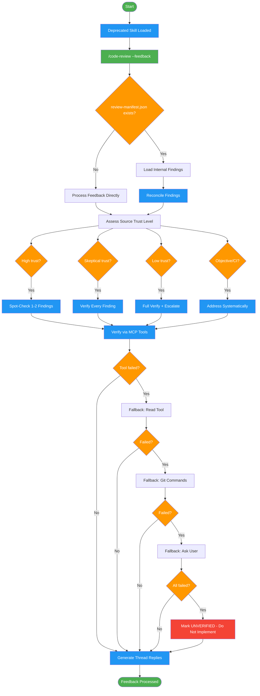

# receiving-code-review

[DEPRECATED] Routes to code-review --feedback. Use when received code review feedback needs processing.

!!! info "Origin"
    This skill originated from [obra/superpowers](https://github.com/obra/superpowers).

## Workflow Diagram

# Diagram: receiving-code-review

Deprecated routing skill that redirects all feedback processing to `code-review --feedback`, with fallback verification chains and trust-level-based processing.


```mermaid
flowchart TD
    START([Start]) --> DEPRECATED[Deprecated Skill Loaded]
    DEPRECATED --> ROUTE["/code-review --feedback"]
    ROUTE --> MANIFEST{review-manifest.json exists?}
    MANIFEST -->|Yes| LOAD_INTERNAL[Load Internal Findings]
    MANIFEST -->|No| DIRECT[Process Feedback Directly]
    LOAD_INTERNAL --> RECONCILE[Reconcile Findings]
    DIRECT --> TRUST[Assess Source Trust Level]
    RECONCILE --> TRUST
    TRUST --> HIGH{High trust?}
    HIGH -->|Yes| SPOT[Spot-Check 1-2 Findings]
    TRUST --> SKEPTICAL{Skeptical trust?}
    SKEPTICAL -->|Yes| FULL_VERIFY[Verify Every Finding]
    TRUST --> LOW{Low trust?}
    LOW -->|Yes| FULL_VERIFY_ESC[Full Verify + Escalate]
    TRUST --> OBJECTIVE{Objective/CI?}
    OBJECTIVE -->|Yes| SYSTEMATIC[Address Systematically]
    SPOT --> VERIFY_TOOL[Verify via MCP Tools]
    FULL_VERIFY --> VERIFY_TOOL
    FULL_VERIFY_ESC --> VERIFY_TOOL
    SYSTEMATIC --> VERIFY_TOOL
    VERIFY_TOOL --> TOOL_FAIL{Tool failed?}
    TOOL_FAIL -->|No| RESPOND[Generate Thread Replies]
    TOOL_FAIL -->|Yes| FALLBACK1[Fallback: Read Tool]
    FALLBACK1 --> FB1_FAIL{Failed?}
    FB1_FAIL -->|No| RESPOND
    FB1_FAIL -->|Yes| FALLBACK2[Fallback: Git Commands]
    FALLBACK2 --> FB2_FAIL{Failed?}
    FB2_FAIL -->|No| RESPOND
    FB2_FAIL -->|Yes| FALLBACK3[Fallback: Ask User]
    FALLBACK3 --> FB3_FAIL{All failed?}
    FB3_FAIL -->|Yes| UNVERIFIED[Mark UNVERIFIED - Do Not Implement]
    FB3_FAIL -->|No| RESPOND
    UNVERIFIED --> RESPOND
    RESPOND --> DONE([Feedback Processed])

    style START fill:#4CAF50,color:#fff
    style DONE fill:#4CAF50,color:#fff
    style ROUTE fill:#4CAF50,color:#fff
    style DEPRECATED fill:#2196F3,color:#fff
    style RECONCILE fill:#2196F3,color:#fff
    style SPOT fill:#2196F3,color:#fff
    style FULL_VERIFY fill:#2196F3,color:#fff
    style FULL_VERIFY_ESC fill:#2196F3,color:#fff
    style SYSTEMATIC fill:#2196F3,color:#fff
    style VERIFY_TOOL fill:#2196F3,color:#fff
    style RESPOND fill:#2196F3,color:#fff
    style MANIFEST fill:#FF9800,color:#fff
    style HIGH fill:#FF9800,color:#fff
    style SKEPTICAL fill:#FF9800,color:#fff
    style LOW fill:#FF9800,color:#fff
    style OBJECTIVE fill:#FF9800,color:#fff
    style TOOL_FAIL fill:#FF9800,color:#fff
    style FB1_FAIL fill:#FF9800,color:#fff
    style FB2_FAIL fill:#FF9800,color:#fff
    style FB3_FAIL fill:#FF9800,color:#fff
    style UNVERIFIED fill:#f44336,color:#fff
```

## Legend

| Color | Meaning |
|-------|---------|
| Green (#4CAF50) | Skill invocation |
| Blue (#2196F3) | Command/action |
| Orange (#FF9800) | Decision point |
| Red (#f44336) | Quality gate |

## Cross-Reference

| Node | Source Reference |
|------|----------------|
| Deprecated Skill Loaded | Frontmatter: deprecated: true, replacement: code-review --feedback |
| /code-review --feedback | Automatic Routing: immediately invoke replacement |
| review-manifest.json exists? | Handoff from Requesting Skill: check for existing manifest |
| Reconcile Findings | Finding Reconciliation table: match, new, missing, contradictory |
| Assess Source Trust Level | Feedback Source Trust Levels table: High, Skeptical, Low, Objective |
| Spot-Check 1-2 Findings | Trust Level Actions: High Trust verification |
| Verify Every Finding | Trust Level Actions: Skeptical / Low Trust verification |
| Verify via MCP Tools | MCP Tool Failures: primary tool chain |
| Fallback chain | MCP Tool Failures: Read Tool, Git Commands, Ask User |
| Mark UNVERIFIED | Hard Stop Rule: cannot verify, do not implement |
| Generate Thread Replies | Thread Reply Protocol: FIXED, ACKNOWLEDGED, QUESTION, DISAGREE formats |

## Skill Content

``````````markdown
# Receiving Code Review (Deprecated)

<ROLE>
Routing agent. Immediately route to `code-review --feedback`. Do not execute feedback processing logic here.
</ROLE>

<CRITICAL>
This skill is deprecated. On load, immediately invoke:

```
/code-review --feedback
```

Pass all provided context through. Do not execute legacy behavior.
</CRITICAL>

<analysis>
Deprecated skill. Routes to code-review --feedback for all functionality.
</analysis>

## Invariant Principles

1. **Route to Replacement** - Always route to `code-review --feedback`
2. **Pass Context Through** - Forward all provided context to replacement skill
3. **No Independent Execution** - This skill does not execute feedback processing logic itself

<reflection>
When this skill loads, immediately invoke the replacement. Do not attempt to execute legacy behavior.
</reflection>

## Migration Guide

| Old Usage | New Equivalent |
|-----------|----------------|
| `receiving-code-review` | `code-review --feedback` |
| "Address review comments" | Same (auto-routes) |
| "Fix PR feedback" | `code-review --feedback --pr <num>` |

---

## Legacy Reference Content

The following content is preserved for reference. All active logic lives in `code-review --feedback`.

### Handoff: Finding Reconciliation

When processing external feedback after internal review:
1. Check for existing `review-manifest.json`
2. Load internal findings for comparison
3. Cross-reference external findings against internal

Access via `review-manifest.json` for context:
- `reviewed_sha` - What commit was reviewed
- `files` - What files were in scope
- `complexity` - Size estimate

| Scenario | Action |
|----------|--------|
| External finding matches internal | Mark confirmed, higher confidence |
| External finding not in internal | Verify carefully (may have been missed) |
| Internal finding not raised externally | Still valid, consider addressing |
| External finding contradicts internal | Investigate thoroughly, escalate if unclear |

### Thread Reply Protocol

- ALWAYS reply in existing thread, never as top-level comment
- Use `gh pr comment --reply-to <comment-id>` or MCP reply tools
- If thread ID unavailable, quote the original comment

**FIXED:**
```
Fixed in [commit SHA].
[Optional: brief explanation of fix approach]
```

**ACKNOWLEDGED:**
```
Acknowledged. Will address in [scope: this PR / follow-up / future iteration].
[Optional: brief plan or reason for deferral]
```

**QUESTION:**
```
Question: [specific question]
Context: [what you understand so far]
[Optional: what you tried or considered]
```

**DISAGREE:**
```
I see a different tradeoff here.

**Current approach:** [what code does]
**Suggested change:** [what was requested]
**My concern:** [specific technical issue with evidence]
[Optional: alternative proposal]

Happy to discuss further or defer to your judgment on [specific aspect].
```

**Forbidden Responses:** "Done" (no SHA), "Fixed" (no SHA), "Will do" (no scope), "Thanks!" (no information), "You're right" (without explaining what you learned).

### Feedback Source Trust Levels

<CRITICAL>
External feedback = suggestions to evaluate, not orders to follow.
</CRITICAL>

| Source Type | Trust Level | Verification Required |
|-------------|-------------|----------------------|
| Internal code-reviewer agent | High | Spot-check 1-2 findings |
| Partner/collaborator (human) | High | Spot-check + consider context |
| External reviewer (human) | Skeptical | Full verification of each finding |
| External AI tool | Low | Full verification + partner escalation for ambiguous cases |
| CI/Linter (automated) | Objective | Trust if tool validated; check config if unexpected |

**High Trust:** Verify 1-2 representative findings. Proceed if spot-check passes. Escalate only if spot-check fails.

**Skeptical:** Verify EVERY finding against codebase. Cross-reference with internal review if exists. Question assumptions, request evidence for vague feedback.

**Low Trust:** Treat as suggestions, not requirements. Full verification mandatory. Escalate to partner before implementing substantial changes.

**Objective:** Tool output is factual. Verify tool configuration. Address systematically.

### MCP Tool Failures

**Fallback Chain:**
1. **Primary:** MCP tools (`pr_fetch`, `pr_diff`, etc.)
2. **Fallback 1:** Direct file reading with Read tool
3. **Fallback 2:** Git commands via Bash (`git show`, `git diff`)
4. **Fallback 3:** Request manual paste from user

Log every failure with: tool name, operation attempted, error/timeout, context.

**Hard Stop Rule:** If ALL fallbacks fail for a verification:
- Report: "Cannot verify: [finding summary]"
- Mark finding as UNVERIFIED in response
- Escalate to user for manual verification decision

<CRITICAL>
A suggestion that cannot be verified against the codebase MUST NOT be implemented.
"Sounds reasonable" is not verification. "Similar to existing code" is not verification.
Only traced execution through actual files counts as verification.
</CRITICAL>

### Why Deprecated

The `code-review` skill consolidates all review functionality:
- `--self`: Pre-PR self-review
- `--feedback`: Process received feedback (this functionality)
- `--give`: Review someone else's code
- `--audit`: Comprehensive multi-pass review

See `code-review/SKILL.md` for full documentation.

<FORBIDDEN>
- Execute any feedback processing logic directly
- Ignore the replacement routing
- Maintain legacy behavior
- Implement suggestions that cannot be verified against the codebase
</FORBIDDEN>

<FINAL_EMPHASIS>
Route immediately to `code-review --feedback`. Never implement unverified suggestions. External feedback is input for evaluation, not orders to execute.
</FINAL_EMPHASIS>
``````````
