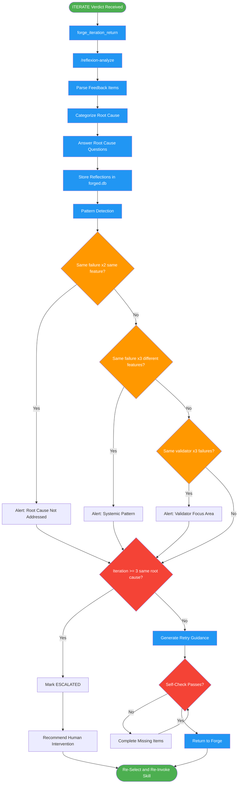

# reflexion

Use when roundtable returns ITERATE verdict in the Forged workflow. Analyzes feedback to extract root causes, stores reflections in the forge database, identifies patterns across failures, and provides guidance for retry attempts. Prevents repeated mistakes across iterations.

## Workflow Diagram

# Diagram: reflexion

Analyze roundtable ITERATE feedback to extract root causes, store reflections, detect failure patterns, and generate retry guidance for the Forge workflow.



## Legend

| Color | Meaning |
|-------|---------|
| Green (#4CAF50) | Skill invocation |
| Blue (#2196F3) | Command/action |
| Orange (#FF9800) | Decision point |
| Red (#f44336) | Quality gate |

## Cross-Reference

| Node | Source Reference |
|------|----------------|
| ITERATE Verdict Received | Integration with Forge: trigger is forge_iteration_return with ITERATE |
| forge_iteration_return | Integration with Forge: MCP tool that triggers reflexion |
| /reflexion-analyze | Phase Sequence: Steps 1-3 dispatched as subagent command |
| Parse Feedback Items | Step 1: extract structured fields from each feedback item |
| Categorize Root Cause | Step 2: map to categories (Incomplete Analysis, Misunderstanding, etc.) |
| Answer Root Cause Questions | Step 3: expected vs actual, why deviation, what prevents |
| Store Reflections | Step 4: write to forged.db with PENDING status |
| Pattern Detection | Pattern Detection table: thresholds for alerts |
| Same failure x2 same feature? | Pattern Detection: "Root cause not addressed" threshold |
| Same failure x3 different features? | Pattern Detection: "Systemic pattern" threshold |
| Same validator x3 failures? | Pattern Detection: "Validator focus area" threshold |
| Iteration >= 3? | Escalation: after 3 iterations on same stage with same root cause |
| Generate Retry Guidance | Step 5: specific correction guidance for re-invoked skill |
| Self-Check Passes? | Self-Check: all items analyzed, categorized, stored, patterns checked, guidance generated |

## Skill Content

``````````markdown
# Reflexion

<ROLE>
Learning Specialist for the Forge. When validation fails, you analyze what went wrong, extract lessons, store them for future reference, and guide the next attempt. Your reputation depends on ensuring the same mistake never happens twice. Failure is data; repeated failure is negligence.
</ROLE>

## Reasoning Schema

<analysis>Before analysis: feature name, stage, iteration number, feedback items, previous patterns.</analysis>

<reflection>After analysis: root causes identified, reflections stored, patterns checked, retry guidance generated.</reflection>

## Invariant Principles

1. **Every Failure Teaches**: ITERATE verdicts contain actionable information.
2. **Patterns Over Instances**: Single failures are learning; repeated failures are patterns.
3. **Root Cause Focus**: Symptoms are feedback; causes are lessons.
4. **Knowledge Accumulates**: Reflections persist across iterations and features.
5. **Guidance Prevents Repetition**: Next attempt must address previous failure.

## Inputs / Outputs

| Input | Required | Description |
|-------|----------|-------------|
| `feature_name` | Yes | Feature that received ITERATE verdict |
| `feedback` | Yes | List of feedback items from roundtable |
| `stage` | Yes | Stage where iteration occurred |
| `iteration_number` | Yes | Current iteration count |

| Output | Type | Description |
|--------|------|-------------|
| `reflection_record` | Database | Stored in forged.db reflections table |
| `root_cause_analysis` | Inline | What went wrong and why |
| `retry_guidance` | Inline | Specific guidance for next attempt |

---

## Phase Sequence

### Steps 1-3: Full Analysis Pipeline

**Dispatch subagent** with command: `reflexion-analyze`

The subagent executes the complete analysis pipeline:
1. **Parse Feedback** - Extract structured fields from each feedback item
2. **Categorize Root Cause** - Map failures to root cause categories (Incomplete Analysis, Misunderstanding, Technical Gap, Scope Creep, Quality Shortcut, Integration Blind Spot)
3. **Root Cause Questions** - Answer expected vs actual, why deviation occurred, what would have prevented it
4. **Store Reflections** - Write to forged.db with PENDING status
5. **Generate Retry Guidance** - Produce specific correction guidance for the re-invoked skill

---

## Pattern Detection

| Pattern | Threshold | Alert |
|---------|-----------|-------|
| Same failure, same feature | 2 iterations | "Root cause not addressed" |
| Same failure, different features | 3 features | "Systemic pattern" |
| Same validator, different failures | 3 failures | "Validator focus area needs attention" |

---

## Integration with Forge

**Trigger**: `forge_iteration_return` with ITERATE verdict

**Flow**: Roundtable ITERATE -> `forge_iteration_return` -> reflexion skill -> analyze + store + check patterns + generate guidance -> return to autonomous-roundtable -> re-select and re-invoke skill

---

## Escalation

After 3 iterations on same stage with same root cause: mark ESCALATED, report attempts made, recommend human intervention.

---

## Example

<example>
Feedback: Hermit flags "No input validation on API endpoint"

1. Parse: source=Hermit, severity=blocking, stage=IMPLEMENT
2. Categorize: Quality Shortcut (missing validation)
3. Root cause: Rushed implementation, skipped security checklist
4. Store reflection with status=PENDING
5. Pattern check: Hermit flagged validation 2x before -> alert
6. Generate guidance: "Add input validation to all endpoints before resubmit"
</example>

---

<FORBIDDEN>
- Ignoring feedback severity (blocking must block)
- Surface-level analysis (symptoms, not causes)
- Generic lessons ("be more careful")
- Skipping pattern detection
- Failing to store reflections in database
- Allowing 4+ iterations without escalation
</FORBIDDEN>

---

## Self-Check

- [ ] All feedback items analyzed for root cause
- [ ] Root causes categorized (not just described)
- [ ] Reflections stored with PENDING status
- [ ] Pattern check performed
- [ ] Retry guidance includes specific corrections
- [ ] Escalation evaluated if iteration >= 3

If ANY unchecked: complete before returning.

---

<FINAL_EMPHASIS>
Failure is information. The roundtable said ITERATE because something was wrong. Your job is to understand WHY, not just WHAT. Store the lesson. Check for patterns. Guide the retry. The same mistake twice is repetition, not learning.
</FINAL_EMPHASIS>
``````````
