# requesting-code-review

Use when implementation is done and you need a structured pre-PR review workflow. Triggers: 'ready for review', 'review my changes before PR', 'pre-merge check', 'is this ready', 'submit for review'. Orchestrates multi-phase review (planning, context assembly, dispatch, triage, fix, gate). Dispatches code-review internally. NOT the same as finishing-a-development-branch (which handles merge/PR decisions after review passes).

!!! info "Origin"
    This skill originated from [obra/superpowers](https://github.com/obra/superpowers).

## Workflow Diagram

# Diagram: requesting-code-review

Pre-PR review orchestrator with six phases: planning, context assembly, reviewer dispatch, triage, fix execution, and quality gate. Dispatches code-review internally and enforces blocking rules on Critical/High findings.

```mermaid
flowchart TD
    Start([Start]) --> AnalyzeScope[Analyze Change Scope]
    AnalyzeScope --> CheckGitState[Check Git State]
    CheckGitState --> ResumeCheck{Resuming Review?}

    %% Phases 1-2
    ResumeCheck -->|"Fresh review"| Phase12["/request-review-plan"]
    ResumeCheck -->|"Resume from phase"| Phase36

    Phase12 --> DefineRange[Define Git Range]
    DefineRange --> ListFiles[List Changed Files]
    ListFiles --> FindSpec[Identify Plan/Spec]
    FindSpec --> EstComplexity[Estimate Complexity]
    EstComplexity --> AssembleContext[Assemble Context Bundle]
    AssembleContext --> P12Gate{Phases 1-2 Gate}

    P12Gate -->|"Range + files + context ready"| Phase36["/request-review-execute"]
    P12Gate -->|Fail| Start

    %% Phase 3: Dispatch
    Phase36 --> DispatchReview[Dispatch code-review]
    DispatchReview --> ReceiveFindings[Receive Findings]

    %% Phase 4: Triage
    ReceiveFindings --> TriageFindings[Triage by Severity]
    TriageFindings --> CriticalBin[Critical Findings]
    TriageFindings --> HighBin[High Findings]
    TriageFindings --> MedLowBin[Medium/Low/Nit]

    %% Phase 5: Execute Fixes
    CriticalBin --> FixCritical[Fix Critical First]
    HighBin --> FixHigh[Fix High Next]
    FixCritical --> FixHigh
    FixHigh --> ReReviewCheck{Fix >100 Lines?}

    ReReviewCheck -->|"Yes: >100 lines or new files"| ReReview[Re-Review Required]
    ReReview --> DispatchReview
    ReReviewCheck -->|No| GateCheck

    %% Phase 6: Gate
    GateCheck{Quality Gate} --> CritUnfixed{Critical Unfixed?}
    CritUnfixed -->|Yes| Blocked([BLOCKED])
    CritUnfixed -->|No| HighUnfixed{High Unfixed >= 3?}
    HighUnfixed -->|">= 3 unfixed"| Blocked
    HighUnfixed -->|"< 3"| HighNoRationale{High Without Rationale?}
    HighNoRationale -->|"Unfixed without rationale"| Blocked
    HighNoRationale -->|"All rationalized or fixed"| MayProceed([MAY PROCEED])

    %% Artifacts
    MayProceed --> Artifacts["/request-review-artifacts"]
    Artifacts --> SaveManifest[Save Manifest + SHA]
    SaveManifest --> Done([Review Complete])

    style Start fill:#333,color:#fff
    style Done fill:#333,color:#fff
    style MayProceed fill:#4CAF50,color:#fff
    style Phase12 fill:#4CAF50,color:#fff
    style Phase36 fill:#4CAF50,color:#fff
    style Artifacts fill:#4CAF50,color:#fff
    style DispatchReview fill:#4CAF50,color:#fff
    style AnalyzeScope fill:#2196F3,color:#fff
    style CheckGitState fill:#2196F3,color:#fff
    style DefineRange fill:#2196F3,color:#fff
    style ListFiles fill:#2196F3,color:#fff
    style FindSpec fill:#2196F3,color:#fff
    style EstComplexity fill:#2196F3,color:#fff
    style AssembleContext fill:#2196F3,color:#fff
    style ReceiveFindings fill:#2196F3,color:#fff
    style TriageFindings fill:#2196F3,color:#fff
    style CriticalBin fill:#2196F3,color:#fff
    style HighBin fill:#2196F3,color:#fff
    style MedLowBin fill:#2196F3,color:#fff
    style FixCritical fill:#2196F3,color:#fff
    style FixHigh fill:#2196F3,color:#fff
    style SaveManifest fill:#2196F3,color:#fff
    style ResumeCheck fill:#FF9800,color:#fff
    style ReReviewCheck fill:#FF9800,color:#fff
    style ReReview fill:#FF9800,color:#fff
    style P12Gate fill:#f44336,color:#fff
    style GateCheck fill:#f44336,color:#fff
    style CritUnfixed fill:#f44336,color:#fff
    style HighUnfixed fill:#f44336,color:#fff
    style HighNoRationale fill:#f44336,color:#fff
    style Blocked fill:#f44336,color:#fff
```



## Legend

| Color | Meaning |
|-------|---------|
| Green (#4CAF50) | Skill invocation |
| Blue (#2196F3) | Command/action |
| Orange (#FF9800) | Decision point |
| Red (#f44336) | Quality gate |

## Cross-Reference

| Node | Source Reference |
|------|----------------|
| AnalyzeScope, CheckGitState | Analysis block (lines 13-18) |
| ResumeCheck | "What phase should we resume from" (line 17) |
| /request-review-plan | Phases 1-2: Planning + Context (lines 48-56) |
| DefineRange, ListFiles, FindSpec, EstComplexity | "Determine git range, list files, identify plan/spec, estimate complexity" (line 50) |
| AssembleContext | "Assemble reviewer context bundle" (line 50) |
| Phases 1-2 Gate | "Git range defined, file list confirmed, context bundle ready" (line 56) |
| /request-review-execute | Phases 3-6: Dispatch + Triage + Execute + Gate (lines 58-66) |
| Dispatch code-review | "Invoke code-reviewer agent" (line 60) |
| Triage by Severity | "Triage findings by severity" (line 60) |
| Fix Critical First, Fix High Next | "Execute fixes (Critical first)" (line 60) |
| Fix >100 Lines? | "Skipping re-review when fix adds >100 lines or modifies new files" (line 33) |
| Critical Unfixed? | "Any Critical unfixed = BLOCKED" (line 82) |
| High Unfixed >= 3? | ">=3 High unfixed = BLOCKED" (line 84) |
| High Without Rationale? | "Any High unfixed without rationale = BLOCKED" (line 83) |
| MAY PROCEED | "Only Medium/Low/Nit unfixed = MAY PROCEED" (line 85) |
| /request-review-artifacts | Artifact Contract (lines 68-72) |
| Save Manifest + SHA | "SHA persistence" principle (line 25), manifest schema (line 71) |

## Skill Content

``````````markdown
# Requesting Code Review

<ROLE>
Self-review orchestrator. Coordinates pre-PR code review workflow.
</ROLE>

<analysis>
Before starting review workflow, analyze:
1. What is the scope of changes? (files, lines, complexity)
2. Is there a plan/spec document to review against?
3. What is the current git state? (branch, merge base)
4. What phase should we resume from if this is a re-review?
</analysis>

## Invariant Principles

1. **Phase gates are blocking** - Never proceed to next phase without meeting exit criteria
2. **Evidence over opinion** - Every finding must cite specific code location and behavior
3. **Critical findings are non-negotiable** - No Critical finding may be deferred or ignored
4. **SHA persistence** - Always use reviewed_sha from manifest, never current HEAD
5. **Traceable artifacts** - Each phase produces artifacts for resume and audit capability

<FORBIDDEN>
- Proceeding past Phase 6 gate with unfixed Critical findings
- Making findings without specific file:line evidence
- Using current HEAD instead of reviewed_sha for inline comments
- Skipping re-review when fix adds >100 lines or modifies new files
- Deferring Critical findings for any reason
</FORBIDDEN>

<reflection>
After each phase, verify:
- Did we meet all exit criteria before proceeding?
- Are all findings backed by specific evidence?
- Did we persist the correct SHA for future reference?
- Is the artifact properly saved for traceability?
</reflection>

## Phase-Gated Workflow

Reference: `patterns/code-review-formats.md` for output schemas.

### Phases 1-2: Planning + Context

Determine git range, list files, identify plan/spec, estimate complexity, then assemble reviewer context bundle with plan excerpts, related code, and prior findings.

**Execute:** `/request-review-plan`

**Outputs:** Review scope definition, reviewer context bundle

**Self-Check:** Git range defined, file list confirmed, context bundle ready for dispatch.

### Phases 3-6: Dispatch + Triage + Execute + Gate

Invoke code-reviewer agent, triage findings by severity, execute fixes (Critical first), then apply quality gate for proceed/block decision.

**Execute:** `/request-review-execute`

**Outputs:** Review findings, triage report, fix report, gate decision

**Self-Check:** Valid findings received, triaged, blocking findings addressed, clear verdict.

### Artifact Contract

Directory structure, phase artifact table, manifest schema, and SHA persistence rule.

**Reference:** `/request-review-artifacts`

## Gate Rules

Reference: `patterns/code-review-taxonomy.md` for severity definitions.

### Blocking Rules

| Condition | Result |
|-----------|--------|
| Any Critical unfixed | BLOCKED - must fix before proceed |
| Any High unfixed without rationale | BLOCKED - fix or document deferral |
| >=3 High unfixed | BLOCKED - systemic issues |
| Only Medium/Low/Nit unfixed | MAY PROCEED |

<CRITICAL>
Always use `reviewed_sha` from manifest for inline comments.
Never query current HEAD - commits may have been pushed since review started.
</CRITICAL>
``````````
