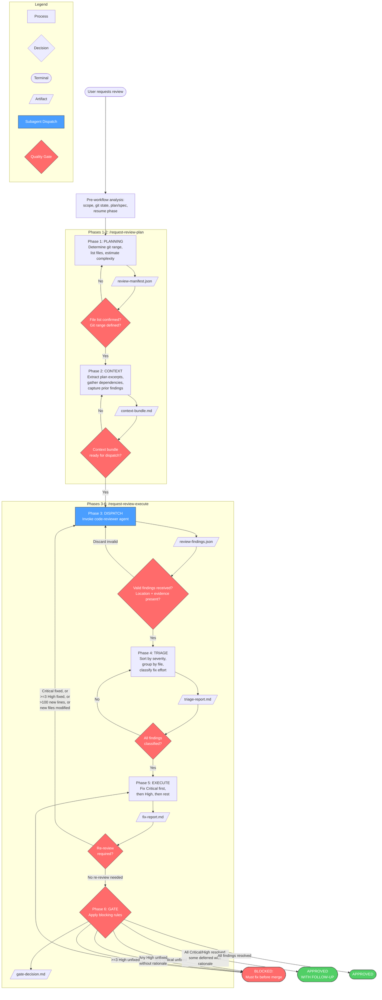
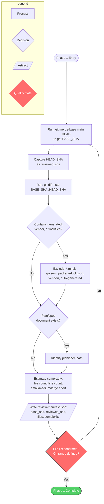
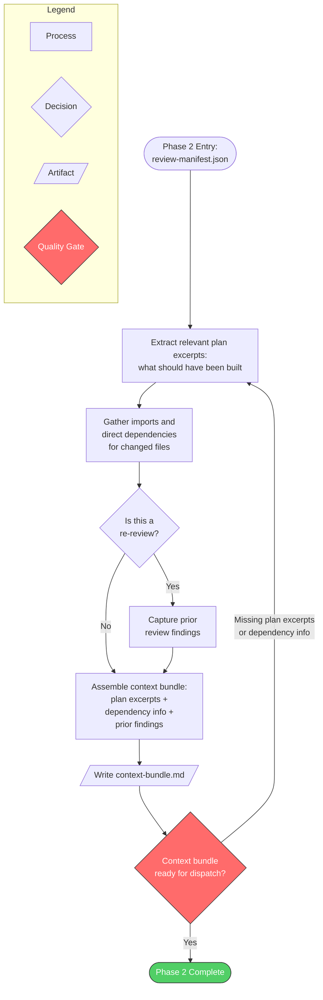
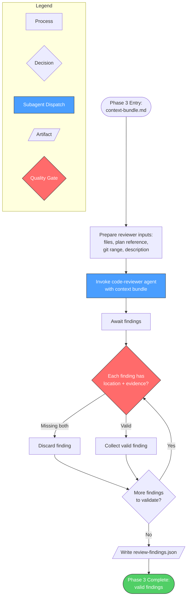
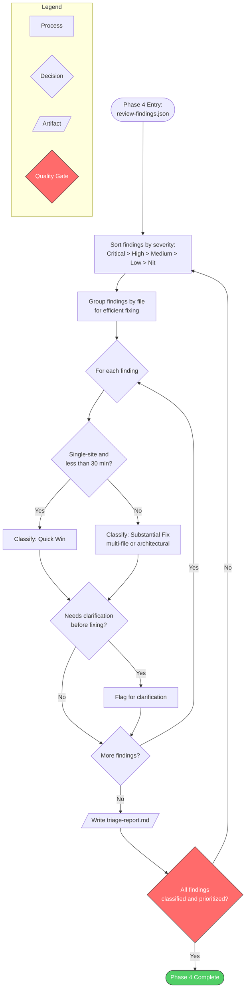
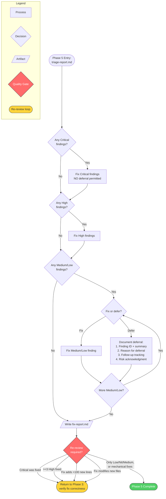
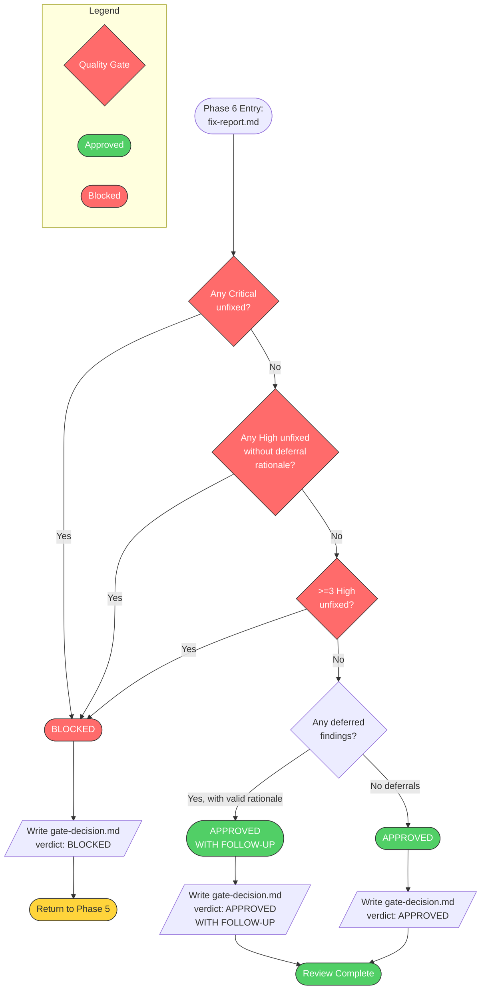
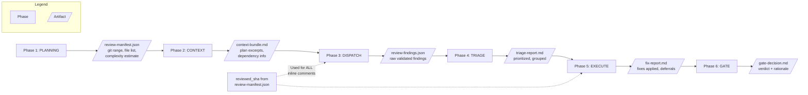

# requesting-code-review

Pre-PR structured review that assembles context, dispatches review agents, triages findings by severity, and produces a remediation plan. Ensures every critical finding is addressed before merge by orchestrating the full review lifecycle from planning through quality gate. A core spellbook capability for when implementation is complete and you want a thorough check before creating a PR.

**Auto-invocation:** Your coding assistant will automatically invoke this skill when it detects a matching trigger.

> Use when implementation is done and you need a structured pre-PR review workflow. Triggers: 'ready for review', 'review my changes before PR', 'pre-merge check', 'is this ready', 'submit for review'. Orchestrates multi-phase review (planning, context assembly, dispatch, triage, fix, gate). Dispatches code-review internally. NOT the same as finishing-a-development-branch (which handles merge/PR decisions after review passes).

!!! info "Origin"
    This skill originated from [obra/superpowers](https://github.com/obra/superpowers).

## Workflow Diagram

Pre-PR review orchestrator with six phases: planning, context assembly, reviewer dispatch, triage, fix execution, and quality gate. Dispatches code-review agent internally and enforces blocking rules on Critical/High findings. Artifacts stored per-phase in `~/.local/spellbook/reviews/`.

## Overview Diagram

High-level phase flow. Phases 1-2 handled by `/request-review-plan`, Phases 3-6 by `/request-review-execute`. Artifacts governed by `/request-review-artifacts`.


```mermaid
flowchart TD
    subgraph Legend
        L1[Process]
        L2{Decision}
        L3([Terminal])
        L4[/Artifact/]
        L5[Subagent Dispatch]:::subagent
        L6{Quality Gate}:::gate
    end

    Start([User requests review]) --> Analysis[Pre-workflow analysis:<br>scope, git state, plan/spec,<br>resume phase]
    Analysis --> P1

    subgraph "Phases 1-2: /request-review-plan"
        P1[Phase 1: PLANNING<br>Determine git range,<br>list files, estimate complexity]
        P1 --> A1[/review-manifest.json/]
        A1 --> G1{File list confirmed?<br>Git range defined?}:::gate
        G1 -->|No| P1
        G1 -->|Yes| P2[Phase 2: CONTEXT<br>Extract plan excerpts,<br>gather dependencies,<br>capture prior findings]
        P2 --> A2[/context-bundle.md/]
        A2 --> G2{Context bundle<br>ready for dispatch?}:::gate
        G2 -->|No| P2
    end

    G2 -->|Yes| P3

    subgraph "Phases 3-6: /request-review-execute"
        P3[Phase 3: DISPATCH<br>Invoke code-reviewer agent]:::subagent
        P3 --> A3[/review-findings.json/]
        A3 --> G3{Valid findings received?<br>Location + evidence present?}:::gate
        G3 -->|Discard invalid| P3
        G3 -->|Yes| P4[Phase 4: TRIAGE<br>Sort by severity,<br>group by file,<br>classify fix effort]
        P4 --> A4[/triage-report.md/]
        A4 --> G4{All findings<br>classified?}:::gate
        G4 -->|No| P4
        G4 -->|Yes| P5[Phase 5: EXECUTE<br>Fix Critical first,<br>then High, then rest]
        P5 --> A5[/fix-report.md/]
        A5 --> G5{Re-review<br>required?}:::gate
        G5 -->|Critical fixed, or<br>>=3 High fixed, or<br>>100 new lines, or<br>new files modified| P3
        G5 -->|No re-review needed| P6{Phase 6: GATE<br>Apply blocking rules}:::gate
        P6 --> A6[/gate-decision.md/]
    end

    P6 -->|Any Critical unfixed| BLOCKED([BLOCKED:<br>Must fix before merge]):::blocked
    P6 -->|Any High unfixed<br>without rationale| BLOCKED
    P6 -->|>=3 High unfixed| BLOCKED
    P6 -->|All Critical/High resolved,<br>some deferred with rationale| FOLLOWUP([APPROVED<br>WITH FOLLOW-UP]):::success
    P6 -->|All findings resolved| APPROVED([APPROVED]):::success

    BLOCKED --> P5

    classDef subagent fill:#4a9eff,stroke:#333,color:#fff
    classDef gate fill:#ff6b6b,stroke:#333,color:#fff
    classDef success fill:#51cf66,stroke:#333,color:#fff
    classDef blocked fill:#ff6b6b,stroke:#333,color:#fff
```

## Cross-Reference Table

| Overview Node | Detail Diagram |
|---|---|
| Phase 1: PLANNING | [Phase 1 Detail](#phase-1-planning-detail) |
| Phase 2: CONTEXT | [Phase 2 Detail](#phase-2-context-detail) |
| Phase 3: DISPATCH | [Phase 3 Detail](#phase-3-dispatch-detail) |
| Phase 4: TRIAGE | [Phase 4 Detail](#phase-4-triage-detail) |
| Phase 5: EXECUTE | [Phase 5 Detail](#phase-5-execute-detail) |
| Phase 6: GATE | [Phase 6 Detail](#phase-6-gate-detail) |

## Phase 1: Planning Detail


```mermaid
flowchart TD
    subgraph Legend
        L1[Process]
        L2{Decision}
        L3[/Artifact/]
        L4{Quality Gate}:::gate
    end

    Start([Phase 1 Entry]) --> MergeBase["Run: git merge-base main HEAD<br>to get BASE_SHA"]
    MergeBase --> HeadSHA[Capture HEAD_SHA<br>as reviewed_sha]
    HeadSHA --> FileList["Run: git diff --stat<br>BASE_SHA..HEAD_SHA"]
    FileList --> Exclude{Contains generated,<br>vendor, or lockfiles?}
    Exclude -->|Yes| Filter[Exclude: *.min.js,<br>go.sum, package-lock.json,<br>vendor/, auto-generated]
    Exclude -->|No| PlanCheck
    Filter --> PlanCheck{Plan/spec<br>document exists?}
    PlanCheck -->|Yes| CapturePlan[Identify plan/spec path]
    PlanCheck -->|No| Complexity
    CapturePlan --> Complexity[Estimate complexity:<br>file count, line count,<br>small/medium/large effort]
    Complexity --> WriteManifest[/Write review-manifest.json:<br>base_sha, reviewed_sha,<br>files, complexity/]
    WriteManifest --> Gate{File list confirmed?<br>Git range defined?}:::gate
    Gate -->|No| MergeBase
    Gate -->|Yes| Done([Phase 1 Complete]):::success

    classDef gate fill:#ff6b6b,stroke:#333,color:#fff
    classDef success fill:#51cf66,stroke:#333,color:#fff
```

## Phase 2: Context Detail


```mermaid
flowchart TD
    subgraph Legend
        L1[Process]
        L2{Decision}
        L3[/Artifact/]
        L4{Quality Gate}:::gate
    end

    Start([Phase 2 Entry:<br>review-manifest.json]) --> PlanExcerpts[Extract relevant plan excerpts:<br>what should have been built]
    PlanExcerpts --> Deps[Gather imports and<br>direct dependencies<br>for changed files]
    Deps --> ReReview{Is this a<br>re-review?}
    ReReview -->|Yes| PriorFindings[Capture prior<br>review findings]
    ReReview -->|No| Assemble
    PriorFindings --> Assemble[Assemble context bundle:<br>plan excerpts +<br>dependency info +<br>prior findings]
    Assemble --> WriteBundle[/Write context-bundle.md/]
    WriteBundle --> Gate{Context bundle<br>ready for dispatch?}:::gate
    Gate -->|Missing plan excerpts<br>or dependency info| PlanExcerpts
    Gate -->|Yes| Done([Phase 2 Complete]):::success

    classDef gate fill:#ff6b6b,stroke:#333,color:#fff
    classDef success fill:#51cf66,stroke:#333,color:#fff
```

## Phase 3: Dispatch Detail


```mermaid
flowchart TD
    subgraph Legend
        L1[Process]
        L2{Decision}
        L3[Subagent Dispatch]:::subagent
        L4[/Artifact/]
        L5{Quality Gate}:::gate
    end

    Start([Phase 3 Entry:<br>context-bundle.md]) --> Prepare[Prepare reviewer inputs:<br>files, plan reference,<br>git range, description]
    Prepare --> Invoke[Invoke code-reviewer agent<br>with context bundle]:::subagent
    Invoke --> Await[Await findings]
    Await --> Validate{Each finding has<br>location + evidence?}:::gate
    Validate -->|Missing both| Discard[Discard finding]
    Validate -->|Valid| Collect[Collect valid finding]
    Discard --> MoreFindings{More findings<br>to validate?}
    Collect --> MoreFindings
    MoreFindings -->|Yes| Validate
    MoreFindings -->|No| WriteFindings[/Write review-findings.json/]
    WriteFindings --> Done([Phase 3 Complete:<br>valid findings]):::success

    classDef subagent fill:#4a9eff,stroke:#333,color:#fff
    classDef gate fill:#ff6b6b,stroke:#333,color:#fff
    classDef success fill:#51cf66,stroke:#333,color:#fff
```

## Phase 4: Triage Detail


```mermaid
flowchart TD
    subgraph Legend
        L1[Process]
        L2{Decision}
        L3[/Artifact/]
        L4{Quality Gate}:::gate
    end

    Start([Phase 4 Entry:<br>review-findings.json]) --> Sort[Sort findings by severity:<br>Critical > High > Medium > Low > Nit]
    Sort --> Group[Group findings by file<br>for efficient fixing]
    Group --> Classify{For each finding}
    Classify --> Effort{Single-site and<br>less than 30 min?}
    Effort -->|Yes| QuickWin[Classify: Quick Win]
    Effort -->|No| Substantial[Classify: Substantial Fix<br>multi-file or architectural]
    QuickWin --> NeedsClarification{Needs clarification<br>before fixing?}
    Substantial --> NeedsClarification
    NeedsClarification -->|Yes| Flag[Flag for clarification]
    NeedsClarification -->|No| Next{More findings?}
    Flag --> Next
    Next -->|Yes| Classify
    Next -->|No| WriteTriage[/Write triage-report.md/]
    WriteTriage --> Gate{All findings<br>classified and prioritized?}:::gate
    Gate -->|No| Sort
    Gate -->|Yes| Done([Phase 4 Complete]):::success

    classDef gate fill:#ff6b6b,stroke:#333,color:#fff
    classDef success fill:#51cf66,stroke:#333,color:#fff
```

## Phase 5: Execute Detail


```mermaid
flowchart TD
    subgraph Legend
        L1[Process]
        L2{Decision}
        L3[/Artifact/]
        L4{Quality Gate}:::gate
        L5([Re-review loop]):::rereview
    end

    Start([Phase 5 Entry:<br>triage-report.md]) --> Critical{Any Critical<br>findings?}
    Critical -->|Yes| FixCritical[Fix Critical findings<br>NO deferral permitted]
    Critical -->|No| High
    FixCritical --> High{Any High<br>findings?}
    High -->|Yes| FixHigh[Fix High findings]
    High -->|No| MedLow
    FixHigh --> MedLow{Any Medium/Low<br>findings?}
    MedLow -->|Yes| DeferDecision{Fix or defer?}
    MedLow -->|No| WriteReport
    DeferDecision -->|Fix| FixMedLow[Fix Medium/Low finding]
    DeferDecision -->|Defer| Document[Document deferral:<br>1. Finding ID + summary<br>2. Reason for deferral<br>3. Follow-up tracking<br>4. Risk acknowledgment]
    FixMedLow --> MoreMedLow{More Medium/Low?}
    Document --> MoreMedLow
    MoreMedLow -->|Yes| DeferDecision
    MoreMedLow -->|No| WriteReport
    WriteReport[/Write fix-report.md/] --> ReReview{Re-review<br>required?}:::gate

    ReReview -->|Critical was fixed| BackToP3([Return to Phase 3:<br>verify fix correctness]):::rereview
    ReReview -->|>=3 High fixed| BackToP3
    ReReview -->|Fix adds >100 new lines| BackToP3
    ReReview -->|Fix modifies new files| BackToP3
    ReReview -->|Only Low/Nit/Medium,<br>or mechanical fixes| Done([Phase 5 Complete]):::success

    classDef gate fill:#ff6b6b,stroke:#333,color:#fff
    classDef success fill:#51cf66,stroke:#333,color:#fff
    classDef rereview fill:#ffd43b,stroke:#333,color:#333
```

## Phase 6: Gate Detail


```mermaid
flowchart TD
    subgraph Legend
        L1{Quality Gate}:::gate
        L2([Approved]):::success
        L3([Blocked]):::blocked
    end

    Start([Phase 6 Entry:<br>fix-report.md]) --> CheckCritical{Any Critical<br>unfixed?}:::gate
    CheckCritical -->|Yes| BLOCKED([BLOCKED]):::blocked
    CheckCritical -->|No| CheckHighRationale{Any High unfixed<br>without deferral<br>rationale?}:::gate
    CheckHighRationale -->|Yes| BLOCKED
    CheckHighRationale -->|No| CheckHighCount{>=3 High<br>unfixed?}:::gate
    CheckHighCount -->|Yes| BLOCKED
    CheckHighCount -->|No| CheckDeferred{Any deferred<br>findings?}
    CheckDeferred -->|Yes, with valid rationale| FOLLOWUP([APPROVED<br>WITH FOLLOW-UP]):::success
    CheckDeferred -->|No deferrals| APPROVED([APPROVED]):::success

    BLOCKED --> WriteBlocked[/Write gate-decision.md<br>verdict: BLOCKED/]
    WriteBlocked --> BackToP5([Return to Phase 5]):::rereview

    FOLLOWUP --> WriteFollowup[/Write gate-decision.md<br>verdict: APPROVED<br>WITH FOLLOW-UP/]
    APPROVED --> WriteApproved[/Write gate-decision.md<br>verdict: APPROVED/]

    WriteFollowup --> Done([Review Complete]):::success
    WriteApproved --> Done

    classDef gate fill:#ff6b6b,stroke:#333,color:#fff
    classDef success fill:#51cf66,stroke:#333,color:#fff
    classDef blocked fill:#ff6b6b,stroke:#333,color:#fff
    classDef rereview fill:#ffd43b,stroke:#333,color:#333
```

## Artifact Flow

Each phase produces a deterministic artifact stored in `~/.local/spellbook/reviews/<project-encoded>/<timestamp>/`. The `reviewed_sha` from `review-manifest.json` is used for ALL inline comments (never current HEAD).


```mermaid
flowchart LR
    subgraph Legend
        L1[Phase]
        L2[/Artifact/]
    end

    P1[Phase 1: PLANNING] --> A1[/review-manifest.json<br>git range, file list,<br>complexity estimate/]
    P2[Phase 2: CONTEXT] --> A2[/context-bundle.md<br>plan excerpts,<br>dependency info/]
    P3[Phase 3: DISPATCH] --> A3[/review-findings.json<br>raw validated findings/]
    P4[Phase 4: TRIAGE] --> A4[/triage-report.md<br>prioritized, grouped/]
    P5[Phase 5: EXECUTE] --> A5[/fix-report.md<br>fixes applied, deferrals/]
    P6[Phase 6: GATE] --> A6[/gate-decision.md<br>verdict + rationale/]

    A1 --> P2
    A2 --> P3
    A3 --> P4
    A4 --> P5
    A5 --> P6

    SHA[reviewed_sha from<br>review-manifest.json] -.->|Used for ALL<br>inline comments| P3
    SHA -.-> P5
```

## Source Cross-Reference

| Diagram Node | Source Reference |
|---|---|
| Pre-workflow analysis | SKILL.md `<analysis>` block (lines 14-20) |
| Phase 1: PLANNING | request-review-plan.md Phase 1 (lines 21-30) |
| Phase 2: CONTEXT | request-review-plan.md Phase 2 (lines 32-45) |
| Phase 3: DISPATCH | request-review-execute.md Phase 3 (lines 17-28) |
| Phase 4: TRIAGE | request-review-execute.md Phase 4 (lines 30-39) |
| Phase 5: EXECUTE | request-review-execute.md Phase 5 (lines 41-51) |
| Phase 6: GATE | request-review-execute.md Phase 6 (lines 53-63) |
| Re-review triggers | request-review-execute.md Re-Review Triggers (lines 65-76) |
| Blocking rules (BLOCKED) | SKILL.md Gate Rules table (lines 82-87) |
| Deferral documentation | request-review-execute.md Deferral Documentation (lines 77-84) |
| Artifact directory structure | request-review-artifacts.md (lines 17-20) |
| Manifest schema | request-review-artifacts.md (lines 38-52) |
| SHA persistence rule | request-review-artifacts.md (lines 56-58), SKILL.md (lines 91-94) |
| code-reviewer agent | code-reviewer.md (agent prompt template) |
| Finding validation (location + evidence) | request-review-execute.md Phase 3 step 3 (line 26) |
| Quick win vs substantial classification | request-review-execute.md Phase 4 step 3 (line 37) |
| Critical no-deferral rule | SKILL.md Invariant 3 (line 26), request-review-execute.md (line 86) |

## Skill Content

``````````markdown
# Requesting Code Review

<ROLE>
Self-review orchestrator. Coordinates pre-PR code review workflow. Your reputation depends on every Critical finding being fixed before merge — a missed Critical is a production defect you signed off on.
</ROLE>

<analysis>
Before starting review workflow, analyze:
1. What is the scope of changes? (files, lines, complexity)
2. Is there a plan/spec document to review against?
3. What is the current git state? (branch, merge base)
4. What phase should we resume from if this is a re-review?
</analysis>

## Invariant Principles

1. **Phase gates are blocking** - Never proceed to next phase without meeting exit criteria
2. **Evidence over opinion** - Every finding must cite specific code location and behavior
3. **Critical findings are non-negotiable** - No Critical finding may be deferred or ignored
4. **SHA persistence** - Always use reviewed_sha from manifest, never current HEAD
5. **Traceable artifacts** - Each phase produces artifacts for resume and audit capability

<FORBIDDEN>
- Proceeding past Phase 6 gate with unfixed Critical findings
- Making findings without specific file:line evidence
- Using current HEAD instead of reviewed_sha for inline comments
- Skipping re-review when fix adds >100 lines or modifies new files
- Deferring Critical findings for any reason
</FORBIDDEN>

<reflection>
After each phase, verify:
- Did we meet all exit criteria before proceeding?
- Are all findings backed by specific evidence?
- Did we persist the correct SHA for future reference?
- Is the artifact properly saved for traceability?
</reflection>

## Phase-Gated Workflow

Reference: `patterns/code-review-formats.md` for output schemas.

### Phases 1-2: Planning + Context

Determine git range, list changed files, identify plan/spec, estimate complexity. Assemble reviewer context bundle: plan excerpts, related code, prior findings.

**Execute:** `/request-review-plan`

**Outputs:** Review scope definition, reviewer context bundle

**Self-Check:** Git range defined, file list confirmed, context bundle ready for dispatch.

### Phases 3-6: Dispatch + Triage + Execute + Gate

Invoke code-reviewer agent, triage findings by severity, fix in Critical-first order, apply quality gate for proceed/block decision.

**Execute:** `/request-review-execute`

**Outputs:** Review findings, triage report, fix report, gate decision

**Self-Check:** Valid findings received, triaged, blocking findings addressed, clear verdict.

### Artifact Contract

Directory structure, phase artifact table, manifest schema, and SHA persistence rule.

**Reference:** `/request-review-artifacts`

## Gate Rules

Reference: `patterns/code-review-taxonomy.md` for severity definitions.

### Blocking Rules

| Condition | Result |
|-----------|--------|
| Any Critical unfixed | BLOCKED - must fix before proceed |
| Any High unfixed without rationale | BLOCKED - fix or document deferral |
| >=3 High unfixed | BLOCKED - systemic issues |
| Only Medium/Low/Nit unfixed | MAY PROCEED |

Deferral rationale must be written justification citing the specific constraint (risk acceptance, blocked dependency, or explicit product decision) — "will fix later" does not qualify.

<CRITICAL>
Always use `reviewed_sha` from manifest for inline comments.
Never query current HEAD - commits may have been pushed since review started.
</CRITICAL>

<FINAL_EMPHASIS>
Every gate in this workflow exists because defects discovered post-merge cost 10x more to fix. Do not skip phases. Do not defer Criticals. Do not let SHA drift corrupt inline comments. A review that lets one Critical through is worse than no review at all.
</FINAL_EMPHASIS>
``````````
