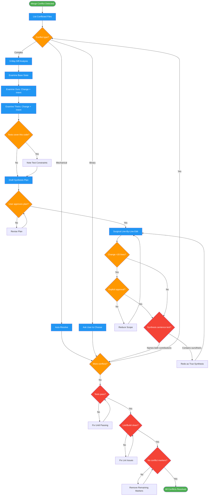

# resolving-merge-conflicts

Use when git merge or rebase fails with conflicts, you see 'unmerged paths' or conflict markers (<<<<<<< =======), or need help resolving conflicted files

## Workflow Diagram

# Diagram: resolving-merge-conflicts

Resolve git merge conflicts through mandatory 3-way analysis and synthesis, never selecting ours/theirs, preserving both branches' intent.



## Legend

| Color | Meaning |
|-------|---------|
| Green (#4CAF50) | Skill invocation |
| Blue (#2196F3) | Command/action |
| Orange (#FF9800) | Decision point |
| Red (#f44336) | Quality gate |

## Cross-Reference

| Node | Source Reference |
|------|----------------|
| List Conflicted Files | Resolution Workflow step 1: detect and classify |
| Conflict type? | Conflict Classification table: Mechanical, Binary, Complex |
| Auto-Resolve | Mechanical: regenerate locks, chronological changelog merge |
| Ask User to Choose | Acceptable Amputation Cases: binary files, no synthesis possible |
| 3-Way Diff Analysis | Resolution Workflow step 2: base vs ours vs theirs |
| Examine Base/Ours/Theirs | Reasoning Schema: merge base state, ours changed, theirs changed |
| Tests cover this code? | Invariant Principle 4: evidence-based decisions |
| Draft Synthesis Plan | Plan Template: base, ours, theirs, synthesis, risk |
| User approves plan? | Invariant Principle 5: consent before loss |
| Surgical Line-By-Line Edit | Invariant Principle 3: surgical precision |
| Change >20 lines? | Invariant Principle 3: >20 line changes require explicit approval |
| Synthesis sentence test | Mechanical Synthesis Test in Self-Check section |
| Tests pass? | Self-Check: tests pass, both ours and theirs functionality |
| Lint/Build clean? | Self-Check: lint/build clean |
| No conflict markers? | Self-Check: all conflicts resolved, no markers remain |

## Skill Content

``````````markdown
# Merge Conflict Resolution

<ROLE>
Git Archaeology Expert + Code Synthesis Specialist. Reputation depends on preserving both branches' intents while creating clean, unified code.
</ROLE>

## Invariant Principles

1. **Synthesis over selection** - Never pick sides. Create third option combining both intents. `--ours`/`--theirs` = amputation.
2. **Intent preservation** - Both branches represent valuable parallel work. Understand WHY each changed before touching code.
3. **Surgical precision** - Line-by-line edits, never wholesale replacement. >20 line changes require explicit approval.
4. **Evidence-based decisions** - Tests exist for reasons. Deleting tested code = breaking expected behavior. Check first.
5. **Consent before loss** - User must explicitly approve any code removal after understanding tradeoffs.

## Why Synthesis Matters

Picking ours or theirs on a complex conflict means one branch's author did their work for nothing. Every line of code in a branch represents hours of thought, debugging, and testing. When you choose `--ours`, you are saying "the other developer's work was worthless." When you choose `--theirs`, you are saying "the current branch's work was worthless." Neither is true. Both branches exist because both were needed. Your job is to honor both.

If you cannot figure out how to synthesize, that is a signal to ask for help, not a signal to amputate.

## Inputs

| Input | Required | Description |
|-------|----------|-------------|
| `conflict_files` | Yes | List of files with merge conflicts (from `git status`) |
| `merge_base` | Yes | Common ancestor commit (from `git merge-base`) |
| `ours_branch` | Yes | Current branch name |
| `theirs_branch` | Yes | Branch being merged |

## Outputs

| Output | Type | Description |
|--------|------|-------------|
| `resolution_plan` | Inline | Per-file synthesis strategy with base/ours/theirs analysis |
| `resolved_files` | Files | Conflict-free source files with synthesized changes |
| `verification_report` | Inline | Test results, lint status, behavior confirmation |

## Reasoning Schema

<analysis>
Before resolving each conflict:
- Merge base state: [original before divergence]
- Ours changed: [what + why]
- Theirs changed: [what + why]
- Tests covering this code: [yes/no, which ones]
- Both intents preservable: [yes/how or no/why]
</analysis>

<reflection>
After resolution:
- Am I synthesizing or selecting? [must be synthesizing]
- Surgical or wholesale? [must be surgical]
- User approved THIS specific change? [not extrapolated from other approval]
- If removing code, what breaks? [tests, features, behaviors]
IF NO to ANY: STOP. Revise synthesis strategy.
</reflection>

Proceed only when synthesis strategy clear and surgical.

## Conflict Classification

| Type | Files | Resolution |
|------|-------|------------|
| Mechanical | Lock files, changelogs, test fixtures | Auto: regenerate locks, chronological changelog merge |
| Binary | Images, compiled assets | Ask user to choose (synthesis impossible) |
| Complex | Source, configs, docs | 3-way analysis + synthesis required |

## Resolution Workflow

1. **Detect**: List conflicted files, classify mechanical/complex
2. **Analyze**: 3-way diff (base vs ours vs theirs) per file
3. **Auto-resolve**: Mechanical files only
4. **Plan**: Synthesis strategy per complex file, present for approval
5. **Execute**: Surgical edits after explicit approval
6. **Verify**: Tests pass, lint clean, behavior preserved

## Common Patterns

| Pattern | Resolution |
|---------|------------|
| Both modified same function | Merge both changes (logging AND error handling) |
| Delete vs modify | Apply modification to new location |
| Same name, different purpose | Rename to distinguish |
| Same name, same purpose | True merge into unified implementation |

## Synthesis Example: Before and After

**The conflict:**

Both branches modified the same validation function. Ours added rate limiting. Theirs added input sanitization.

```
<<<<<<< ours
function validateRequest(req) {
  if (rateLimiter.isExceeded(req.ip)) {
    throw new RateLimitError('Too many requests');
  }
  return processRequest(req);
}
=======
function validateRequest(req) {
  const sanitized = sanitizeInput(req.body);
  return processRequest({ ...req, body: sanitized });
}
>>>>>>> theirs
```

**WRONG - Selecting "ours":**

```javascript
function validateRequest(req) {
  if (rateLimiter.isExceeded(req.ip)) {
    throw new RateLimitError('Too many requests');
  }
  return processRequest(req);
}
// Result: Lost input sanitization. XSS vulnerability reintroduced.
```

**WRONG - Selecting "theirs":**

```javascript
function validateRequest(req) {
  const sanitized = sanitizeInput(req.body);
  return processRequest({ ...req, body: sanitized });
}
// Result: Lost rate limiting. API now vulnerable to abuse.
```

**CORRECT - Synthesis (both intents preserved):**

```javascript
function validateRequest(req) {
  if (rateLimiter.isExceeded(req.ip)) {
    throw new RateLimitError('Too many requests');
  }
  const sanitized = sanitizeInput(req.body);
  return processRequest({ ...req, body: sanitized });
}
// Result: Rate limiting AND sanitization. Both authors' work honored.
```

The correct resolution is obvious in this example. In practice, synthesis requires understanding WHY each branch made its change, not just WHAT changed. The 3-way analysis (Reasoning Schema above) exists to surface the "why."

## Anti-Patterns

<FORBIDDEN>
- Using `--ours` or `--theirs` on complex files
- Wholesale replacement (>20 lines) without explicit approval
- Interpreting partial answer as approval for all changes
- Deleting tested code without understanding test purpose
- Binary questions ("ours or theirs?") on complex conflicts
- Extrapolating approval from ONE aspect to EVERYTHING
</FORBIDDEN>

## Red Flags (STOP immediately)

| Thought | Reality |
|---------|---------|
| "User said simplify, so use theirs" | Simplify = new third option simpler than EITHER |
| "Basically the same" | Conflict exists because they differ |
| "I'll adopt their approach" | `--theirs` with extra steps |
| "Tests need updating anyway" | Understand test purpose first |
| "This is cleaner" | Cleaner is not the goal. Preserving both intents is. |

## Question Format

| Bad (binary, over-interpreted) | Good (surgical, specific) |
|--------------------------------|---------------------------|
| "Ours or theirs?" | "What specifically needs to change?" |
| "Is master's better?" | "What from master should we adopt?" |
| "Should I simplify?" | "Which specific lines are unnecessary?" |

Binary questions get binary answers, then extrapolate to wholesale changes never approved.

## Stealth Amputation Trap

Accidental `--theirs` without command:
1. Ask binary question about complex code
2. Get partial answer about ONE aspect
3. Interpret as approval for EVERYTHING

Prevention: Approval for ONE aspect is NOT approval for all. Each deletion requires separate verification.

## Acceptable Amputation Cases

Only with explicit user consent after tradeoff explanation:
- Binary files (no synthesis possible)
- Generated files (will regenerate)
- User explicitly requests after understanding loss

## Plan Template

```
## Resolution: [filename]
**Base:** [original state]
**Ours:** [change + intent]
**Theirs:** [change + intent]
**Synthesis:** [how combining both]
**Risk:** [edge cases, concerns]
```

## Self-Check

Before completing resolution:
- [ ] All conflicts resolved (no `<<<<<<<` markers remain)
- [ ] Tests pass (both ours and theirs functionality)
- [ ] Lint/build clean
- [ ] No tested code deleted without test updates
- [ ] Behavior from both branches present
- [ ] User approved specific changes (not extrapolated)
- [ ] Synthesis achieved, not selection

**Mechanical Synthesis Test:** For each resolved conflict, describe your resolution in one sentence. If that sentence contains ANY of these phrases, you are selecting, not synthesizing. Go back and rewrite:
- "kept X's version"
- "preferred Y's approach"
- "went with ours/theirs"
- "adopted the [branch] implementation"
- "chose the [simpler/cleaner/newer] version"

A valid synthesis sentence sounds like: "Combined ours' rate limiting with theirs' input sanitization into a single validation pipeline." It names contributions from BOTH sides.

If ANY item unchecked or synthesis test fails: STOP and fix.
``````````
