# reviewing-design-docs

Use when reviewing design documents, technical specifications, architecture docs, RFCs, ADRs, or API designs for completeness and implementability. Triggers: 'review this design', 'is this spec complete', 'can someone implement from this', 'what's missing from this design', 'review this RFC', 'is this ready for implementation', 'audit this spec'. Core question: could an implementer code against this without guessing?

## Workflow Diagram

# Diagram: reviewing-design-docs

Seven-phase design document review workflow: inventories document structure, evaluates completeness checklist, detects hand-waving and vague language, verifies interface claims against source code, simulates implementation per component, compiles scored findings, and produces a prioritized remediation plan.

```mermaid
flowchart TD
    START([Start]) --> READ_DOC[Read Design Document]

    READ_DOC --> P1[Phase 1: Document Inventory]
    P1 --> CatalogSections[Catalog Sections]
    CatalogSections --> CatalogComponents[Catalog Components]
    CatalogComponents --> CatalogDeps[Catalog Dependencies]
    CatalogDeps --> CatalogDiagrams[Catalog Diagrams]

    CatalogDiagrams --> P23[Phases 2-3: Completeness]
    P23 --> P23_CMD[/review-design-checklist/]

    P23_CMD --> CheckComplete[Evaluate Each Category]
    CheckComplete --> VerdictAssign{Verdict per Item}

    VerdictAssign -->|SPECIFIED| Specified[Sufficient to Code]
    VerdictAssign -->|VAGUE| Vague[Ambiguous Language]
    VerdictAssign -->|MISSING| Missing[Not Addressed]

    Specified --> VagueDetect[Detect Hand-Waving]
    Vague --> VagueDetect
    Missing --> VagueDetect

    VagueDetect --> VagueCheck{Many VAGUE Items?}
    VagueCheck -->|Yes| SharpenAudit[/sharpen-audit/]
    VagueCheck -->|No| P45

    SharpenAudit --> P45

    P45[Phases 4-5: Verify + Simulate] --> P45_CMD[/review-design-verify/]

    P45_CMD --> VerifyInterfaces[Verify Interface Claims]
    VerifyInterfaces --> ReadSource{Source Available?}

    ReadSource -->|Yes| CheckSource[Read Source Code]
    ReadSource -->|No| EscalateFC[Escalate to Factchecker]

    CheckSource --> ClaimMatch{Claims Match Source?}
    ClaimMatch -->|Yes| Verified[Claim Verified]
    ClaimMatch -->|No| ClaimFail[Claim Failed]

    EscalateFC --> SimImpl
    Verified --> SimImpl
    ClaimFail --> SimImpl

    SimImpl[Simulate Implementation] --> GapCheck{Gaps Found?}
    GapCheck -->|Yes| DocGaps[Document Gaps]
    GapCheck -->|No| P67

    DocGaps --> P67

    P67[Phases 6-7: Report + Plan] --> P67_CMD[/review-design-report/]

    P67_CMD --> ScoreTable[Generate Score Table]
    ScoreTable --> NumberFindings[Number All Findings]
    NumberFindings --> PrioritizeP1[P1: Block Implementation]
    PrioritizeP1 --> PrioritizeP2[P2: Required Before Merge]
    PrioritizeP2 --> PrioritizeP3[P3: Improve Quality]
    PrioritizeP3 --> FactcheckSection[Add Factcheck Items]

    FactcheckSection --> SELF_CHECK{Self-Check Gate}

    SELF_CHECK -->|All items checked| CORE_Q{Implementable Without Guessing?}
    SELF_CHECK -->|Items unchecked| FIX_CHECK[Fix Missing Checks]
    FIX_CHECK --> P1

    CORE_Q -->|Yes| APPROVE([Approved])
    CORE_Q -->|No| REVISE([Revisions Needed])

    style START fill:#333,color:#fff
    style APPROVE fill:#333,color:#fff
    style REVISE fill:#333,color:#fff
    style READ_DOC fill:#2196F3,color:#fff
    style P1 fill:#2196F3,color:#fff
    style CatalogSections fill:#2196F3,color:#fff
    style CatalogComponents fill:#2196F3,color:#fff
    style CatalogDeps fill:#2196F3,color:#fff
    style CatalogDiagrams fill:#2196F3,color:#fff
    style P23 fill:#2196F3,color:#fff
    style CheckComplete fill:#2196F3,color:#fff
    style Specified fill:#2196F3,color:#fff
    style Vague fill:#2196F3,color:#fff
    style Missing fill:#2196F3,color:#fff
    style VagueDetect fill:#2196F3,color:#fff
    style P45 fill:#2196F3,color:#fff
    style VerifyInterfaces fill:#2196F3,color:#fff
    style CheckSource fill:#2196F3,color:#fff
    style Verified fill:#2196F3,color:#fff
    style ClaimFail fill:#2196F3,color:#fff
    style SimImpl fill:#2196F3,color:#fff
    style DocGaps fill:#2196F3,color:#fff
    style P67 fill:#2196F3,color:#fff
    style ScoreTable fill:#2196F3,color:#fff
    style NumberFindings fill:#2196F3,color:#fff
    style PrioritizeP1 fill:#2196F3,color:#fff
    style PrioritizeP2 fill:#2196F3,color:#fff
    style PrioritizeP3 fill:#2196F3,color:#fff
    style FactcheckSection fill:#2196F3,color:#fff
    style FIX_CHECK fill:#2196F3,color:#fff
    style P23_CMD fill:#4CAF50,color:#fff
    style SharpenAudit fill:#4CAF50,color:#fff
    style P45_CMD fill:#4CAF50,color:#fff
    style P67_CMD fill:#4CAF50,color:#fff
    style EscalateFC fill:#4CAF50,color:#fff
    style VerdictAssign fill:#FF9800,color:#fff
    style VagueCheck fill:#FF9800,color:#fff
    style ReadSource fill:#FF9800,color:#fff
    style ClaimMatch fill:#FF9800,color:#fff
    style GapCheck fill:#FF9800,color:#fff
    style SELF_CHECK fill:#f44336,color:#fff
    style CORE_Q fill:#f44336,color:#fff
```



## Legend

| Color | Meaning |
|-------|---------|
| Green (#4CAF50) | Skill invocation |
| Blue (#2196F3) | Command/action |
| Orange (#FF9800) | Decision point |
| Red (#f44336) | Quality gate |

## Cross-Reference

| Node | Source Reference |
|------|----------------|
| Phase 1: Document Inventory | Phase 1: Document Inventory (line 51) |
| Catalog Sections | Sections: [name] - lines X-Y (line 54) |
| Catalog Components | Components: [name] - location (line 55) |
| Catalog Dependencies | Dependencies: [name] - version (line 56) |
| Catalog Diagrams | Diagrams: [type] - line X (line 57) |
| Phases 2-3: Completeness | Phases 2-3: Completeness Checklist + Hand-Waving Detection (line 62) |
| /review-design-checklist/ | Execute: /review-design-checklist (line 66) |
| Verdict per Item | SPECIFIED/VAGUE/MISSING verdicts (line 68) |
| Many VAGUE Items? | Optional deep audit for specs with many VAGUE items (line 70) |
| /sharpen-audit/ | Run /sharpen-audit on specific sections (line 70) |
| Phases 4-5: Verify + Simulate | Phases 4-5: Interface Verification + Implementation Simulation (line 74) |
| /review-design-verify/ | Execute: /review-design-verify (line 78) |
| Verify Interface Claims | Verify all interface claims against source code (line 76) |
| Source Available? | Existing code to verify interface claims against (input, line 23) |
| Escalate to Factchecker | Escalate unverifiable claims to factchecker (line 76) |
| Claims Match Source? | Method names are suggestions, not contracts (Invariant 2, line 13) |
| Simulate Implementation | Per-component implementation simulation (line 80) |
| Phases 6-7: Report + Plan | Phases 6-7: Findings Report + Remediation Plan (line 84) |
| /review-design-report/ | Execute: /review-design-report (line 88) |
| P1/P2/P3 Priorities | P1/P2/P3 remediation plan (line 90) |
| Self-Check Gate | Self-Check checklist (lines 104-113) |
| Implementable Without Guessing? | Core Question: could someone create a COMPLETE implementation plan WITHOUT guessing? (line 119) |

## Skill Content

``````````markdown
<ROLE>
Technical Specification Auditor. Reputation depends on catching gaps that would cause implementation failures, not rubber-stamping documents.
</ROLE>

## Invariant Principles

1. **Specification sufficiency determines implementation success.** Underspecified designs force implementers to guess, causing divergent implementations and rework.
2. **Method names are suggestions, not contracts.** Inferred behavior from naming is fabrication until verified against source.
3. **Vague language masks missing decisions.** "Standard approach", "as needed", "TBD" defer design work to implementation phase where it costs 10x more.
4. **Complete != comprehensive.** Document completeness means every item either specified or explicitly N/A with justification.

## Inputs

| Input | Required | Description |
|-------|----------|-------------|
| Design document | Yes | Markdown/text file containing technical specification, architecture doc, or design proposal |
| Source codebase | No | Existing code to verify interface claims against |
| Implementation context | No | Target platform, constraints, prior decisions |

## Outputs

| Output | Type | Description |
|--------|------|-------------|
| Findings report | Inline | Scored inventory with SPECIFIED/VAGUE/MISSING verdicts per category |
| Remediation plan | Inline | Prioritized P1/P2/P3 fixes with acceptance criteria |
| Factcheck escalations | Inline | Claims requiring verification before implementation |

## Reasoning Schema

```
<analysis>
[Document section under review]
[Specific claim or specification]
[What implementation decision this enables or blocks]
</analysis>

<reflection>
[Could I code against this RIGHT NOW?]
[What would I have to invent/guess?]
[Verdict: SPECIFIED | VAGUE | MISSING]
</reflection>
```

---

## Phase 1: Document Inventory

```
## Sections: [name] - lines X-Y
## Components: [name] - location
## Dependencies: [name] - version: Y/N
## Diagrams: [type] - line X
```

---

## Phases 2-3: Completeness Checklist + Hand-Waving Detection

Evaluate every category for specification completeness. Detect vague language, assumed knowledge, and magic numbers.

**Execute:** `/review-design-checklist`

**Outputs:** Completeness matrix with SPECIFIED/VAGUE/MISSING verdicts, vague language inventory, assumed knowledge list, magic number list

**Optional deep audit:** For specs with many VAGUE items, run `/sharpen-audit` on specific sections to get executor-prediction analysis (what an implementer would guess for each ambiguity).

---

## Phases 4-5: Interface Verification + Implementation Simulation

Verify all interface claims against source code. Escalate unverifiable claims to factchecker. Simulate implementation per component to surface gaps.

**Execute:** `/review-design-verify`

**Outputs:** Verification table, factchecker escalations, per-component implementation simulation

---

## Phases 6-7: Findings Report + Remediation Plan

Compile scored findings report and prioritized remediation plan.

**Execute:** `/review-design-report`

**Outputs:** Score table, numbered findings with location and remediation, P1/P2/P3 remediation plan with factcheck and additions sections

---

<FORBIDDEN>
- Approving documents with unresolved TBD/TODO markers
- Inferring interface behavior from method names without reading source
- Marking items SPECIFIED when implementation details would require guessing
- Skipping factcheck escalation for security, performance, or concurrency claims
- Accepting "standard approach" or "as needed" as specifications
</FORBIDDEN>

## Self-Check

```
[ ] Full document inventory
[ ] Every checklist item marked
[ ] All vague language flagged
[ ] Interfaces verified (source read, not assumed)
[ ] Claims escalated to factchecker
[ ] Implementation simulated per component
[ ] Every finding has location + remediation
[ ] Prioritized remediation complete
```

## Core Question

NOT "does this sound reasonable?"

**"Could someone create a COMPLETE implementation plan WITHOUT guessing design decisions?"**

For EVERY specification: "Is this precise enough to code against?"

If uncertain: under-specified. Find it. Flag it.
``````````
