# security-auditing

Use when auditing skills, commands, hooks, and MCP tools for security vulnerabilities. Triggers: 'security audit', 'scan for vulnerabilities', 'check security', 'audit skills', 'audit MCP tools'. Integrates with code-review --audit, implementing-features Phase 4, and distilling-prs for PR security review.

## Workflow Diagram

# Diagram: security-auditing

Six-phase security audit workflow: discovers audit scope, runs static analysis scanner, classifies and deduplicates findings, traces attack chains for high/critical issues, generates a structured report, and enforces a pass/warn/fail quality gate.

```mermaid
flowchart TD
    START([Start]) --> P1[Phase 1: Discover]

    %% Phase 1: Discover
    P1 --> ParseScope{Scope Type?}

    ParseScope -->|skills| ScanSkills[Catalog Skill Files]
    ParseScope -->|mcp| ScanMCP[Catalog Python Files]
    ParseScope -->|changeset| ScanDiff[Catalog Diff Lines]
    ParseScope -->|all| ScanAll[Catalog All Targets]
    ParseScope -->|specific path| ScanPath[Catalog Specific Path]

    ScanSkills --> SetMode[Set Security Mode]
    ScanMCP --> SetMode
    ScanDiff --> SetMode
    ScanAll --> SetMode
    ScanPath --> SetMode

    SetMode --> ModeChoice{Security Mode?}
    ModeChoice -->|permissive| ModeSet[CRITICAL Only]
    ModeChoice -->|standard| ModeSet2[HIGH and Above]
    ModeChoice -->|paranoid| ModeSet3[MEDIUM and Above]

    ModeSet --> P2
    ModeSet2 --> P2
    ModeSet3 --> P2

    %% Phase 2: Analyze
    P2[Phase 2: Run Scanner] --> RunSkillScan[Scan Markdown Files]
    P2 --> RunMCPScan[Scan Python Files]
    P2 --> RunDiffScan[Scan Changeset]

    RunSkillScan --> CaptureRaw[Capture Raw Findings]
    RunMCPScan --> CaptureRaw
    RunDiffScan --> CaptureRaw

    %% Phase 3: Classify
    CaptureRaw --> P3[Phase 3: Classify]
    P3 --> Dedup[Deduplicate Findings]
    Dedup --> AssessSeverity[Assess Real Severity]
    AssessSeverity --> TrustLevel{Apply Trust Level}

    TrustLevel -->|"system (5)"| TrustHigh[CRITICAL Only Matters]
    TrustLevel -->|"verified (4)"| TrustVerified[HIGH and Above]
    TrustLevel -->|"user (3)"| TrustUser[MEDIUM and Above]
    TrustLevel -->|"untrusted (2)"| TrustLow[All Findings]
    TrustLevel -->|"hostile (1)"| TrustHostile[All + Paranoid]

    TrustHigh --> ClassifyEach[Classify Each Finding]
    TrustVerified --> ClassifyEach
    TrustUser --> ClassifyEach
    TrustLow --> ClassifyEach
    TrustHostile --> ClassifyEach

    ClassifyEach --> FPCheck{False Positive?}
    FPCheck -->|Yes| DocFP[Document FP + Rationale]
    FPCheck -->|No| ActiveFindings[Active Findings List]

    DocFP --> ActiveFindings

    %% Phase 4: Trace
    ActiveFindings --> P4{HIGH/CRITICAL Found?}
    P4 -->|No| P5
    P4 -->|Yes| TraceChains[Phase 4: Trace Chains]

    TraceChains --> IdentifyEntry[Identify Entry Points]
    IdentifyEntry --> MapTrustBoundary[Map Trust Boundaries]
    MapTrustBoundary --> AssessImpact[Assess Impact]
    AssessImpact --> DocChain[Document Attack Chain]
    DocChain --> ReassessSeverity[Re-Assess Severity]

    ReassessSeverity --> P5

    %% Phase 5: Report
    P5[Phase 5: Generate Report] --> WriteHeader[Write Header + Verdict]
    WriteHeader --> WriteExecSummary[Write Executive Summary]
    WriteExecSummary --> WriteCounts[Write Finding Counts]
    WriteCounts --> WriteFindings[Write Findings by Severity]
    WriteFindings --> WriteChains[Write Attack Chains]
    WriteChains --> WriteFPs[Write False Positives]
    WriteFPs --> WriteRecs[Write Recommendations]
    WriteRecs --> SaveReport[Save Audit Report]

    %% Phase 6: Gate
    SaveReport --> P6{Phase 6: Verdict?}

    P6 -->|"Zero findings"| PASS([PASS])
    P6 -->|"Only LOW/MEDIUM"| WARN_ACK{WARN: Acknowledge?}
    P6 -->|"HIGH with no chain"| WARN_ACK
    P6 -->|"HIGH with viable chain"| FAIL([FAIL: Block])
    P6 -->|"Any CRITICAL"| FAIL

    WARN_ACK -->|Acknowledged| PROCEED([Proceed])
    WARN_ACK -->|Not acknowledged| BLOCKED[Blocked]

    FAIL --> REMEDIATE[Remediate + Re-Scan]
    REMEDIATE --> P2

    style START fill:#333,color:#fff
    style PASS fill:#333,color:#fff
    style PROCEED fill:#333,color:#fff
    style FAIL fill:#f44336,color:#fff
    style P1 fill:#2196F3,color:#fff
    style P2 fill:#2196F3,color:#fff
    style P3 fill:#2196F3,color:#fff
    style P5 fill:#2196F3,color:#fff
    style ScanSkills fill:#2196F3,color:#fff
    style ScanMCP fill:#2196F3,color:#fff
    style ScanDiff fill:#2196F3,color:#fff
    style ScanAll fill:#2196F3,color:#fff
    style ScanPath fill:#2196F3,color:#fff
    style SetMode fill:#2196F3,color:#fff
    style ModeSet fill:#2196F3,color:#fff
    style ModeSet2 fill:#2196F3,color:#fff
    style ModeSet3 fill:#2196F3,color:#fff
    style RunSkillScan fill:#4CAF50,color:#fff
    style RunMCPScan fill:#4CAF50,color:#fff
    style RunDiffScan fill:#4CAF50,color:#fff
    style CaptureRaw fill:#2196F3,color:#fff
    style Dedup fill:#2196F3,color:#fff
    style AssessSeverity fill:#2196F3,color:#fff
    style ClassifyEach fill:#2196F3,color:#fff
    style DocFP fill:#2196F3,color:#fff
    style ActiveFindings fill:#2196F3,color:#fff
    style TraceChains fill:#2196F3,color:#fff
    style IdentifyEntry fill:#2196F3,color:#fff
    style MapTrustBoundary fill:#2196F3,color:#fff
    style AssessImpact fill:#2196F3,color:#fff
    style DocChain fill:#2196F3,color:#fff
    style ReassessSeverity fill:#2196F3,color:#fff
    style WriteHeader fill:#2196F3,color:#fff
    style WriteExecSummary fill:#2196F3,color:#fff
    style WriteCounts fill:#2196F3,color:#fff
    style WriteFindings fill:#2196F3,color:#fff
    style WriteChains fill:#2196F3,color:#fff
    style WriteFPs fill:#2196F3,color:#fff
    style WriteRecs fill:#2196F3,color:#fff
    style SaveReport fill:#2196F3,color:#fff
    style REMEDIATE fill:#2196F3,color:#fff
    style BLOCKED fill:#f44336,color:#fff
    style ParseScope fill:#FF9800,color:#fff
    style ModeChoice fill:#FF9800,color:#fff
    style TrustLevel fill:#FF9800,color:#fff
    style FPCheck fill:#FF9800,color:#fff
    style P4 fill:#FF9800,color:#fff
    style P6 fill:#f44336,color:#fff
    style WARN_ACK fill:#f44336,color:#fff
    style TrustHigh fill:#2196F3,color:#fff
    style TrustVerified fill:#2196F3,color:#fff
    style TrustUser fill:#2196F3,color:#fff
    style TrustLow fill:#2196F3,color:#fff
    style TrustHostile fill:#2196F3,color:#fff
```



## Legend

| Color | Meaning |
|-------|---------|
| Green (#4CAF50) | Skill invocation |
| Blue (#2196F3) | Command/action |
| Orange (#FF9800) | Decision point |
| Red (#f44336) | Quality gate |

## Cross-Reference

| Node | Source Reference |
|------|----------------|
| Phase 1: Discover | Phase 1: DISCOVER (line 78) |
| Scope Type? | Parse scope argument: skills, mcp, changeset, all, specific path (lines 86-91) |
| Set Security Mode | Determine security mode, default to standard (line 99) |
| Security Mode? | Security Modes table: permissive, standard, paranoid (lines 70-74) |
| Phase 2: Run Scanner | Phase 2: ANALYZE (line 103) |
| Scan Markdown Files | scan_skill / scan_directory for .md files (lines 113-119) |
| Scan Python Files | scan_python_file / scan_mcp_directory for .py files (lines 121-125) |
| Scan Changeset | scan_changeset for unified diff (lines 127-133) |
| Phase 3: Classify | Phase 3: CLASSIFY (line 148) |
| Deduplicate Findings | Group identical rule triggers across files (line 153) |
| Assess Real Severity | Does context make this more or less dangerous? (lines 155-165) |
| Apply Trust Level | Trust-level context table: system through hostile (lines 166-174) |
| Classify Each Finding | Classify template: RULE_ID, file, severity, FP determination (lines 176-181) |
| False Positive? | Remove confirmed false positives, document separately (lines 183-184) |
| HIGH/CRITICAL Found? | Phase 4 entry condition: HIGH and CRITICAL survivors (line 188) |
| Phase 4: Trace Chains | Phase 4: TRACE (line 187) |
| Identify Entry Points | What is the entry point? (line 199) |
| Map Trust Boundaries | What is the trust boundary? (line 200) |
| Assess Impact | What is the impact? (line 201) |
| Document Attack Chain | Attack chain documentation fields (lines 207-214) |
| Re-Assess Severity | Re-assess based on attack chain analysis (line 216) |
| Phase 5: Generate Report | Phase 5: REPORT (line 220) |
| Save Audit Report | Output to $SPELLBOOK_CONFIG_DIR/docs/.../audits/ (line 244) |
| Phase 6: Verdict? | Phase 6: GATE verdict determination table (lines 253-260) |
| PASS | Zero findings after classification (line 256) |
| WARN: Acknowledge? | Only LOW/MEDIUM or HIGH with no chain (lines 257-258) |
| FAIL: Block | HIGH with viable chain or any CRITICAL (lines 259-260) |
| Remediate + Re-Scan | FAIL blocks until remediated and re-scan passes (line 266) |

## Skill Content

``````````markdown
# Security Auditing

<ROLE>
Security Auditor and Red Team Analyst. Your reputation depends on finding real vulnerabilities before attackers do. You scan systematically, classify honestly, and never downplay findings. False negatives are career-ending. False positives waste time. Balance both.
</ROLE>

<CRITICAL>
This skill orchestrates a full security audit of Spellbook content: skills, commands, hooks, and MCP tool implementations. It uses `spellbook_mcp.security.scanner` as its static analysis backbone and layers human-guided triage on top.

You MUST follow ALL six phases in order. You MUST NOT skip classification or trace analysis for HIGH/CRITICAL findings. Scanner results alone are insufficient; your job is to interpret, deduplicate, and contextualize.
</CRITICAL>

## Invariant Principles

1. **Scanner Is Necessary But Not Sufficient** - Static analysis catches patterns, not intent. You interpret the results.
2. **Severity Is Impact-Based** - CRITICAL = exploitable now with real damage. HIGH = exploitable with effort. MEDIUM = defense-in-depth concern. LOW = informational.
3. **Evidence Over Assertion** - Every finding needs file:line, matched rule, and explanation of why it matters in context.
4. **False Positives Are Expected** - The scanner is pattern-based. Legitimate code triggers rules. Your job is to distinguish signal from noise.
5. **Attack Chains Matter** - A MEDIUM finding that enables a CRITICAL exploit is itself CRITICAL. Trace the chain.

## Inputs

| Input | Required | Description |
|-------|----------|-------------|
| Scope | Yes | What to audit: `skills`, `mcp`, `changeset`, `all`, or specific paths |
| Security mode | No | `standard` (default), `paranoid`, or `permissive` |
| Diff text | If changeset | Unified diff for changeset scanning |

## Outputs

| Output | Type | Description |
|--------|------|-------------|
| Audit report | File | Structured findings at `$SPELLBOOK_CONFIG_DIR/docs/<project-encoded>/audits/security-audit-<timestamp>.md` |
| Verdict | Enum | PASS, WARN, or FAIL |
| Summary | Inline | Finding counts by severity and category |

## Scanner Reference

The `spellbook_mcp.security.scanner` module provides these entry points:

| Function | Target | Description |
|----------|--------|-------------|
| `scan_skill(file_path)` | Single .md file | Scans against injection, exfiltration, escalation, obfuscation rules plus invisible chars and entropy |
| `scan_directory(dir_path)` | Directory of .md files | Recursive scan of all markdown files |
| `scan_changeset(diff_text)` | Unified diff | Scans only added lines in .md files |
| `scan_python_file(file_path)` | Single .py file | Scans against MCP-specific rules (shell injection, eval, path traversal, etc.) |
| `scan_mcp_directory(dir_path)` | Directory of .py files | Recursive scan of all Python files |

All functions accept an optional `security_mode` parameter: `"standard"`, `"paranoid"`, or `"permissive"`.

### Rule Categories

| Category | Rule Prefix | Examples |
|----------|-------------|----------|
| Injection | INJ-001..010 | Instruction overrides, role reassignment, system prompt injection |
| Exfiltration | EXF-001..009 | HTTP transfer tools, credential file access, reverse shells |
| Escalation | ESC-001..008 | Permission bypass, sudo, dynamic execution, shell injection |
| Obfuscation | OBF-001..004 | Base64 payloads, hex escapes, char code obfuscation |
| MCP Tool | MCP-001..009 | Shell execution, dynamic eval, unsanitized paths, SQL injection |
| Invisible | INVIS-001 | Zero-width Unicode characters |
| Entropy | ENT-001 | High-entropy code blocks |

### Security Modes

| Mode | Minimum Severity | Use When |
|------|-----------------|----------|
| `permissive` | CRITICAL only | Quick smoke test |
| `standard` | HIGH and above | Normal audits |
| `paranoid` | MEDIUM and above | Pre-release, supply chain review |

---

## Phase 1: DISCOVER

Identify the audit scope and catalog all targets.

<!-- SUBAGENT: Dispatch explore subagent if scope is broad (e.g., "all" or full directory). For targeted audits of 1-3 files, stay in main context. -->

### Steps

1. **Parse scope argument:**
   - `skills` - all files under `skills/`
   - `mcp` - all Python files under `spellbook_mcp/`
   - `changeset` - staged or branch diff
   - `all` - both skills and mcp directories
   - Specific path(s) - targeted file or directory scan

2. **Catalog targets** in a structured inventory listing:
   - Audit Inventory header with scope and security mode
   - Skill Files section listing each .md file path
   - MCP Python Files section listing each .py file path
   - Total Targets with markdown file count and Python file count

3. **Determine security mode** from user input or default to `standard`.

---

## Phase 2: ANALYZE

Run the scanner against all cataloged targets.

<!-- SUBAGENT: Dispatch subagent to run scanner. For large scopes (20+ files), consider parallel subagents split by target type (skills vs MCP). -->

### Steps

1. **Run appropriate scanner functions based on scope:**

   For skill/command files (markdown):
   ```bash
   uv run python -m spellbook_mcp.security.scanner --skills
   ```
   Or for specific files:
   ```bash
   uv run python -m spellbook_mcp.security.scanner --mode skill <path>
   ```

   For MCP tool files (Python):
   ```bash
   uv run python -m spellbook_mcp.security.scanner --mode mcp spellbook_mcp/
   ```

   For changeset scanning:
   ```bash
   git diff --cached | uv run python -m spellbook_mcp.security.scanner --changeset
   ```
   Or branch-based:
   ```bash
   uv run python -m spellbook_mcp.security.scanner --base origin/main
   ```

2. **Capture all scanner output.** Each finding includes:
   - File path and line number
   - Severity level (LOW, MEDIUM, HIGH, CRITICAL)
   - Rule ID (e.g., INJ-001, MCP-003)
   - Message describing the pattern
   - Evidence (matched text)

3. **Record raw findings** before classification.

---

## Phase 3: CLASSIFY

Deduplicate findings, assess real severity, and identify false positives.

### Steps

1. **Deduplicate:** Group identical rule triggers across files. A rule that fires 50 times on the same pattern in different files is one finding, not 50.

2. **Assess each finding:**

   For each unique finding, determine:

   | Field | Question |
   |-------|----------|
   | Real severity | Does the context make this more or less dangerous than the rule's default? |
   | False positive? | Is this legitimate code that happens to match a security pattern? |
   | Exploitable? | Could an attacker actually leverage this in a Spellbook context? |
   | Context | What file is this in, and what is its trust level? |

3. **Apply trust-level context:**

   | Trust Level | Content | Threshold |
   |-------------|---------|-----------|
   | system (5) | Core framework code | Only CRITICAL matters |
   | verified (4) | Reviewed library skills | HIGH and above |
   | user (3) | User-installed content | MEDIUM and above |
   | untrusted (2) | Third-party skills | All findings |
   | hostile (1) | Unknown origin | All findings, paranoid mode |

4. **Classify each finding** using this template:

   - Finding: RULE_ID and message
   - File: path and line number
   - Scanner severity vs. assessed severity (upgraded, downgraded, or confirmed)
   - False positive determination with rationale

5. **Remove confirmed false positives** from the active findings list. Document them separately for transparency.

---

## Phase 4: TRACE

For HIGH and CRITICAL findings that survived classification, trace attack chains.

<analysis>
A finding in isolation tells you a pattern exists. An attack chain tells you what damage is possible. The difference between "this file contains a dynamic execution call" and "an attacker can inject arbitrary code via untrusted skill content that reaches that call through the MCP server" is the difference between awareness and actionable intelligence.
</analysis>

### Steps

1. **For each HIGH/CRITICAL finding, answer:**

   | Question | Purpose |
   |----------|---------|
   | What is the entry point? | How does attacker-controlled input reach this code? |
   | What is the trust boundary? | Does input cross from untrusted to trusted context? |
   | What is the impact? | Data loss, code execution, privilege escalation, exfiltration? |
   | What is the attack scenario? | Step-by-step exploitation narrative |
   | What prevents exploitation? | Existing mitigations, if any |

2. **Document attack chains** with these fields:

   - Attack Chain name
   - Entry: how attacker input enters the system
   - Path: entry to component to component to vulnerable code
   - Impact: what damage results from successful exploitation
   - Mitigations: existing defenses that slow or prevent exploitation
   - Exploitability: trivial, moderate, difficult, or theoretical

3. **Re-assess severity** based on attack chain analysis. A HIGH finding with a trivial exploitation path and no mitigations becomes CRITICAL. A CRITICAL finding behind multiple defense layers may remain CRITICAL but with lower exploitability.

---

## Phase 5: REPORT

Generate the structured audit report.

### Report Format

The audit report is a markdown document with these sections in order:

1. **Header:** Date, scope, security mode, verdict (PASS/WARN/FAIL)
2. **Executive Summary:** 1-3 sentences on what was audited, what was found, overall risk
3. **Finding Counts:** Table with severity rows (CRITICAL, HIGH, MEDIUM, LOW), count column, and false positives excluded column
4. **Findings by Severity:** Sections for each severity level (CRITICAL first, then HIGH, MEDIUM, LOW). Each finding includes:
   - RULE_ID and message as heading
   - File path and line number
   - Category (injection, exfiltration, escalation, obfuscation, mcp_tool)
   - Evidence (matched text)
   - Attack Chain reference (if applicable, from Phase 4)
   - Remediation (specific fix)
5. **Attack Chains:** Full Phase 4 documentation for HIGH/CRITICAL findings
6. **False Positives:** Documented exclusions with rationale
7. **Recommendations:** Prioritized remediation steps, process improvements, scanner rule adjustments

### Output Location

Save the report to `$SPELLBOOK_CONFIG_DIR/docs/<project-encoded>/audits/security-audit-<timestamp>.md`.

---

## Phase 6: GATE

Enforce the audit verdict as a quality gate.

### Verdict Determination

| Condition | Verdict | Action |
|-----------|---------|--------|
| Zero findings after classification | PASS | Proceed |
| Only LOW/MEDIUM findings | WARN | Proceed with acknowledgment |
| Any HIGH finding with no attack chain | WARN | Proceed with acknowledgment |
| Any HIGH finding with viable attack chain | FAIL | Block until remediated |
| Any CRITICAL finding (regardless of chain) | FAIL | Block until remediated |

### Gate Enforcement

- **PASS:** Report the clean audit. No action required.
- **WARN:** Present findings to user. Require explicit acknowledgment before proceeding. Log acknowledgment in report.
- **FAIL:** Present findings to user. Do NOT proceed with any further workflow steps. The audit blocks progress until findings are remediated and a re-scan passes.

---

## Integration Points

### With `code-review --audit`

When `code-review` runs in `--audit` mode, it can invoke this skill for the security pass:
1. `code-review --audit` handles correctness, performance, and maintainability passes
2. This skill handles the security pass specifically
3. Findings from both are combined in the final audit report

### With `implementing-features` Phase 4

During feature implementation quality gates:
1. `implementing-features` Phase 4 dispatches a subagent that invokes this skill
2. Scope is set to the changeset (branch diff against base)
3. FAIL verdict blocks the feature from proceeding to merge
4. WARN verdict requires the implementer to acknowledge findings

### With `distilling-prs` for PR Review

When distilling a PR for review:
1. `distilling-prs` can invoke this skill on the PR diff
2. Scope is set to changeset mode with the PR's unified diff
3. Security findings are surfaced as "review required" items in the PR distillation report

---

<FORBIDDEN>
- Skipping Phase 3 classification (raw scanner output is not an audit)
- Marking a CRITICAL finding as false positive without documented evidence
- Downgrading severity without explaining why in the rationale
- Proceeding past a FAIL gate without remediation
- Running only skill scans when MCP tools are in scope (or vice versa)
- Treating scanner output as the final word without contextual analysis
</FORBIDDEN>

<reflection>
Before finalizing, evaluate your own audit critically: Did you investigate each scanner finding in its full context, or did you rubber-stamp severity levels? Did you trace attack chains end-to-end, or stop at the first plausible-sounding explanation? Are there areas you avoided because they were complex? Honest self-assessment here prevents false confidence in the final report.
</reflection>

## Self-Check

Before completing the audit, verify:

**Completeness:**
- [ ] All targets in scope were scanned
- [ ] Both markdown and Python scanners used (if scope includes both)
- [ ] Every scanner finding has been classified (confirmed, downgraded, or marked false positive)

**Classification Quality:**
- [ ] Each finding has assessed severity with rationale
- [ ] False positives documented with evidence
- [ ] Trust levels applied to contextual assessment

**Trace Quality:**
- [ ] Every HIGH/CRITICAL finding has attack chain analysis
- [ ] Entry points identified for each chain
- [ ] Existing mitigations noted

**Report Quality:**
- [ ] Executive summary accurately reflects findings
- [ ] Finding counts match detailed listings
- [ ] Remediation steps are specific and actionable
- [ ] Report written to correct output path

**Gate:**
- [ ] Verdict matches the determination criteria
- [ ] FAIL verdicts block progress
- [ ] WARN verdicts require acknowledgment

<FINAL_EMPHASIS>
The scanner finds patterns. You find vulnerabilities. A pattern match is not a vulnerability until you understand its context, trace its attack surface, and assess its real-world exploitability. Do the work. Every phase matters.
</FINAL_EMPHASIS>
``````````
