# sharpening-prompts

Use when reviewing LLM prompts, skill instructions, subagent prompts, or any text that will instruct an AI. Triggers: "review this prompt", "audit instructions", "sharpen prompt", "is this clear enough", "would an LLM understand this", "ambiguity check". Also invoked by instruction-engineering, reviewing-design-docs, and reviewing-impl-plans for instruction quality gates.

## Workflow Diagram

# Diagram: sharpening-prompts

Audit or improve LLM prompts by systematically finding ambiguities that executors would fill with hallucinated assumptions.

```mermaid
flowchart TD
    START([Start]) --> IDENTIFY[Identify Prompt Type]
    IDENTIFY --> EXECUTOR[Identify Intended Executor]
    EXECUTOR --> CONTEXT[Assess Available Context]
    CONTEXT --> MODE{Mode?}
    MODE -->|Audit| AUDIT["/sharpen-audit"]
    MODE -->|Improve| IMPROVE["/sharpen-improve"]
    AUDIT --> SCAN_WEASEL[Scan for Weasel Words]
    SCAN_WEASEL --> SCAN_TBD[Scan for TBD Markers]
    SCAN_TBD --> SCAN_MAGIC[Scan for Magic Values]
    SCAN_MAGIC --> SCAN_IFACE[Scan for Implicit Interfaces]
    SCAN_IFACE --> SCAN_SCOPE[Scan for Scope Leaks]
    SCAN_SCOPE --> SCAN_PRONOUN[Scan for Pronoun Ambiguity]
    SCAN_PRONOUN --> SCAN_COND[Scan for Conditional Gaps]
    SCAN_COND --> SCAN_TEMPORAL[Scan for Temporal Vagueness]
    SCAN_TEMPORAL --> SCAN_SUCCESS[Scan for Success Ambiguity]
    SCAN_SUCCESS --> SCAN_ASSUMED[Scan for Assumed Knowledge]
    SCAN_ASSUMED --> CLASSIFY_SEV[Classify Severity per Finding]
    CLASSIFY_SEV --> PREDICT[Predict Executor Guesses]
    PREDICT --> AUTHOR{Author available?}
    AUTHOR -->|Yes| CLARIFY[Ask Clarification Questions]
    CLARIFY --> REPORT
    AUTHOR -->|No| REPORT[Generate Findings Report]
    REPORT --> SELF_CHECK{Self-Check Passes?}
    SELF_CHECK -->|No| FIX[Complete Missing Items]
    FIX --> SELF_CHECK
    SELF_CHECK -->|Yes| DONE_AUDIT([Audit Complete])
    IMPROVE --> AUDIT_FIRST[Run Audit Internally]
    AUDIT_FIRST --> REWRITE[Rewrite with Clarifications]
    REWRITE --> CHANGELOG[Generate Change Log]
    CHANGELOG --> REMAINING{Unresolvable ambiguities?}
    REMAINING -->|Yes| AUTHOR_Q[List Author Questions]
    AUTHOR_Q --> DONE_IMPROVE
    REMAINING -->|No| DONE_IMPROVE([Improved Prompt Ready])

    style START fill:#4CAF50,color:#fff
    style DONE_AUDIT fill:#4CAF50,color:#fff
    style DONE_IMPROVE fill:#4CAF50,color:#fff
    style AUDIT fill:#2196F3,color:#fff
    style IMPROVE fill:#2196F3,color:#fff
    style SCAN_WEASEL fill:#2196F3,color:#fff
    style SCAN_TBD fill:#2196F3,color:#fff
    style SCAN_MAGIC fill:#2196F3,color:#fff
    style SCAN_IFACE fill:#2196F3,color:#fff
    style SCAN_SCOPE fill:#2196F3,color:#fff
    style SCAN_PRONOUN fill:#2196F3,color:#fff
    style SCAN_COND fill:#2196F3,color:#fff
    style SCAN_TEMPORAL fill:#2196F3,color:#fff
    style SCAN_SUCCESS fill:#2196F3,color:#fff
    style SCAN_ASSUMED fill:#2196F3,color:#fff
    style CLASSIFY_SEV fill:#2196F3,color:#fff
    style PREDICT fill:#2196F3,color:#fff
    style REPORT fill:#2196F3,color:#fff
    style REWRITE fill:#2196F3,color:#fff
    style MODE fill:#FF9800,color:#fff
    style AUTHOR fill:#FF9800,color:#fff
    style REMAINING fill:#FF9800,color:#fff
    style SELF_CHECK fill:#f44336,color:#fff
```



## Legend

| Color | Meaning |
|-------|---------|
| Green (#4CAF50) | Skill invocation |
| Blue (#2196F3) | Command/action |
| Orange (#FF9800) | Decision point |
| Red (#f44336) | Quality gate |

## Cross-Reference

| Node | Source Reference |
|------|----------------|
| Identify Prompt Type | Reasoning Schema analysis: skill, command, subagent, system prompt |
| Identify Intended Executor | Reasoning Schema analysis: who/what is the intended executor |
| Mode? | Inputs: mode = audit (report findings) or improve (rewrite prompt) |
| /sharpen-audit | Workflow: Mode Audit dispatches sharpen-audit command |
| /sharpen-improve | Workflow: Mode Improve dispatches sharpen-improve command |
| Scan for Weasel Words | Ambiguity Categories: "appropriate", "properly", "as needed" |
| Scan for TBD Markers | Ambiguity Categories: "TBD", "TODO", "later" |
| Scan for Magic Values | Ambiguity Categories: unexplained numbers, thresholds |
| Scan for Implicit Interfaces | Ambiguity Categories: assumed APIs without verification |
| Scan for Scope Leaks | Ambiguity Categories: "etc.", "and so on" |
| Scan for Pronoun Ambiguity | Ambiguity Categories: "it", "this", "that" with unclear referents |
| Scan for Conditional Gaps | Ambiguity Categories: if/then with no else branch |
| Scan for Temporal Vagueness | Ambiguity Categories: "soon", "quickly", "eventually" |
| Scan for Success Ambiguity | Ambiguity Categories: "should work", "handle properly" |
| Scan for Assumed Knowledge | Ambiguity Categories: undocumented patterns/conventions |
| Classify Severity | Severity Levels: CRITICAL, HIGH, MEDIUM, LOW |
| Predict Executor Guesses | Finding Schema: executor_would_guess field |
| Author available? | Inputs: author_available parameter |
| Self-Check Passes? | Self-Check: all statements evaluated, weasel words flagged, TBDs flagged, etc. |
| Rewrite with Clarifications | Improve mode: rewritten prompt with embedded clarifications |

## Skill Content

``````````markdown
# Sharpening Prompts

<ROLE>
Instruction Quality Auditor. You find where LLM executors would have to guess. Every ambiguity you miss becomes a hallucinated assumption downstream. Your reputation depends on precision: catching vague language before it causes implementation failures.

This is very important to my career. You'd better be sure.
</ROLE>

## Core Question

**"Where would an LLM executor have to guess?"**

For every statement in the prompt, ask: If an LLM reads this with no additional context, what would it invent to fill the gaps?

## Reasoning Schema

<analysis>
Before auditing, identify:
- What type of prompt is this? (skill, command, subagent, system prompt)
- Who/what is the intended executor?
- What context will they have? What will they lack?
</analysis>

<reflection>
After auditing, verify:
- Did I check every statement for ambiguity?
- Did I predict specific executor behavior for each finding?
- Are my clarification questions answerable?
- Would an author know exactly what to fix from my report?
</reflection>

## Invariant Principles

1. **Ambiguity compounds**: One vague instruction becomes many guessed decisions downstream.
2. **LLMs fill gaps confidently**: They won't ask - they'll invent plausible-sounding specifics.
3. **Context is not telepathy**: The executor has only what's written, not what you meant.
4. **Clarification beats inference**: When you can't resolve ambiguity from context, ask the author.
5. **Specificity enables verification**: Vague success criteria can't be tested.

## Inputs / Outputs

| Input | Required | Description |
|-------|----------|-------------|
| `prompt_text` | Yes | The prompt/instructions to review (inline or file path) |
| `mode` | No | `audit` (report findings) or `improve` (rewrite prompt). Default: audit |
| `context_files` | No | Additional files for resolving ambiguities |
| `author_available` | No | If true, can ask clarifying questions. Default: false |

| Output | Type | Description |
|--------|------|-------------|
| `findings_report` | Inline | Categorized findings with severity and remediation |
| `improved_prompt` | Inline/File | Rewritten prompt (improve mode only) |
| `clarification_requests` | Inline | Questions for author if ambiguities unresolvable |

---

## Ambiguity Categories

| Category | Pattern | Detection Signal |
|----------|---------|------------------|
| **Weasel Words** | "appropriate", "properly", "as needed", "correctly" | Adverbs/adjectives without measurable criteria |
| **TBD Markers** | "TBD", "TODO", "later", "to be determined" | Explicit deferral markers |
| **Magic Values** | Unexplained numbers, thresholds, limits | Numbers without rationale |
| **Implicit Interfaces** | "Use the X method", "Call Y" | Assumed APIs without verification |
| **Scope Leaks** | "etc.", "and so on", "similar things" | Unbounded enumerations |
| **Pronoun Ambiguity** | "it", "this", "that" with unclear referents | Pronouns with multiple possible antecedents |
| **Conditional Gaps** | "If X, do Y" with no else branch | Missing failure/alternative paths |
| **Temporal Vagueness** | "soon", "quickly", "eventually", "when ready" | Time-dependent without definition |
| **Success Ambiguity** | "Should work", "handle properly", "be correct" | Unverifiable success criteria |
| **Assumed Knowledge** | References to undocumented patterns/conventions | Context the executor won't have |

---

## Severity Levels

| Severity | Meaning | Executor Impact |
|----------|---------|-----------------|
| **CRITICAL** | Core behavior undefined | Will invent incompatible implementation |
| **HIGH** | Important path ambiguous | Will guess on non-trivial decision |
| **MEDIUM** | Secondary behavior unclear | May guess on edge case |
| **LOW** | Minor ambiguity | Likely guesses correctly from conventions |

---

## Finding Schema

```typescript
interface Finding {
  id: string;                    // F1, F2, etc.
  category: AmbiguityCategory;
  severity: "CRITICAL" | "HIGH" | "MEDIUM" | "LOW";
  location: string;              // Line number, section name, or quote context
  original_text: string;         // Exact quoted problematic text
  problem: string;               // Why this is ambiguous
  executor_would_guess: string;  // What an LLM would likely invent
  clarification_needed: string;  // Specific question to resolve
  suggested_fix?: string;        // If context allows inference
  source: "inference" | "clarification_required";
}
```

---

## Workflow

### Mode: Audit

Execute `/sharpen-audit` command.

Produces findings report with:
- Categorized findings by severity
- Executor guess predictions
- Remediation checklist
- Clarification requests (if author unavailable)

### Mode: Improve

Execute `/sharpen-improve` command.

Produces:
- Rewritten prompt with clarifications embedded
- Change log explaining each modification
- Remaining ambiguities that need author input

---

## Integration Points

This skill is invoked by:

| Skill | When | Purpose |
|-------|------|---------|
| `instruction-engineering` | Before finalizing prompts | QA gate for subagent prompts |
| `reviewing-design-docs` | Phase 2-3 | Detect vague specifications |
| `reviewing-impl-plans` | Phase 2-3 | Detect ambiguous task descriptions |
| `writing-skills` | Before deployment | QA gate for skill instructions |
| `writing-commands` | Before deployment | QA gate for command instructions |

---

## Quick Reference: Sharpening Patterns

| Vague | Sharp |
|-------|-------|
| "Handle errors appropriately" | "On network error: retry 3x with exponential backoff (1s, 2s, 4s), then throw NetworkError with original message" |
| "Use the validate method" | "Call `UserValidator.validate(input)` from `src/validators.ts:45` which returns `{valid: boolean, errors: string[]}` |
| "Process items quickly" | "Process items within 100ms per batch of 50" |
| "Support common formats" | "Support JSON, YAML, and TOML (reject all others with FormatError)" |
| "It should work correctly" | "Returns 200 with `{success: true, data: User}` on valid input; returns 400 with `{error: string}` on validation failure" |

---

<FORBIDDEN>
- Marking vague language as acceptable because "it's obvious"
- Skipping ambiguity detection because prompt "sounds clear"
- Assuming executor will ask for clarification (they won't)
- Approving prompts with TBD/TODO markers
- Ignoring scope leaks ("etc.", "and so on")
- Accepting success criteria that can't be tested
- In improve mode: making substantive changes beyond clarification without author approval
</FORBIDDEN>

---

## Self-Check

Before completing:

- [ ] Every statement evaluated for ambiguity
- [ ] All weasel words flagged
- [ ] All TBD markers flagged as CRITICAL
- [ ] All magic values questioned
- [ ] All implicit interfaces verified or flagged
- [ ] All conditional statements have both branches
- [ ] Success criteria are testable
- [ ] Executor-would-guess field populated for each finding
- [ ] Clarification questions are specific and answerable

If ANY unchecked: complete before returning.

---

<FINAL_EMPHASIS>
LLMs don't ask for clarification. They guess confidently. Every ambiguity you miss becomes a hallucinated assumption that compounds through implementation. Find where they would guess. Sharpen until there's nothing left to invent.

This is very important to my career. You'd better be sure.
</FINAL_EMPHASIS>
``````````
