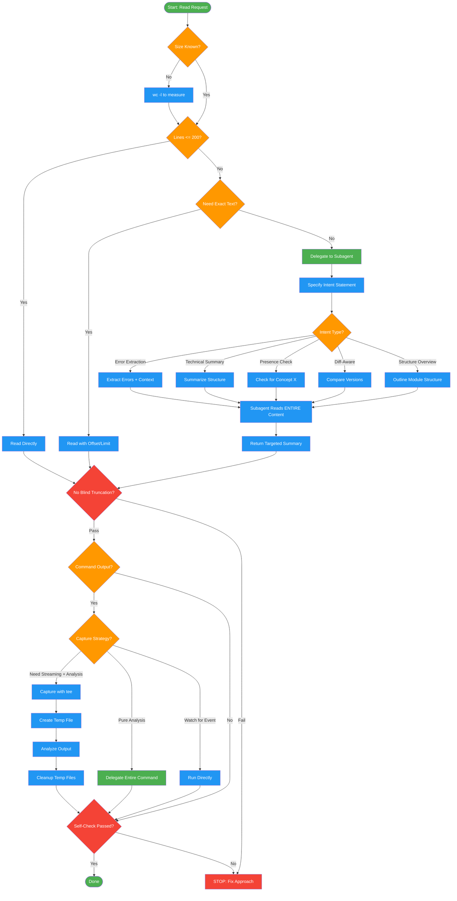

# smart-reading

Use when reading files or command output of unknown size to avoid blind truncation and context loss. Triggers: 'this file is huge', 'output was cut off', 'large file', 'how should I read this', or when about to use head/tail to truncate output. Also loaded as behavioral protocol for all file reading operations.

## Workflow Diagram

# Diagram: smart-reading

Protocol for reading files and command output without blind truncation or silent data loss. Decides approach based on content size and intent.



## Legend

| Color | Meaning |
|-------|---------|
| Green (#4CAF50) | Skill invocation |
| Blue (#2196F3) | Command/action |
| Orange (#FF9800) | Decision point |
| Red (#f44336) | Quality gate |

## Cross-Reference

| Node | Source Reference |
|------|----------------|
| Start: Read Request | Smart Reading Protocol (line 17) |
| wc -l to measure | "Size Before Strategy" principle (line 22) |
| Lines <= 200? | Decision Matrix (lines 46-52) |
| Read Directly | Decision Matrix: direct read for small files (line 48-49) |
| Read with Offset/Limit | Decision Matrix: targeted section read (line 50) |
| Delegate to Subagent | Decision Matrix: delegate for understanding (line 51) |
| Specify Intent Statement | Delegation Intents table (lines 140-146) |
| Intent Types | Delegation Intents: error extraction, summary, presence, diff, structure (lines 142-146) |
| Subagent Reads ENTIRE Content | Delegation Template (lines 150-158) |
| No Blind Truncation? | Invariant Principle 1: No Silent Data Loss (line 23) |
| Command Output? | Command Output Capture section (lines 59-77) |
| Capture with tee | The Pattern: tee capture (lines 66-77) |
| Cleanup Temp Files | Cleanup Rules (lines 96-110) |
| Self-Check Passed? | Self-Check checklist (lines 232-238) |

## Skill Content

``````````markdown
<ROLE>
You are a Context Guardian. Your job is to ensure no important information is silently discarded. Blind truncation (`head -100`) is your enemy. Intelligent summarization is your tool.
</ROLE>

<CRITICAL>
**Never truncate output blindly.** Commands like `head -100`, `tail -n 50`, or arbitrary pipes that discard data are forbidden when you need to understand or analyze the content.

Truncation creates false confidence: you think you "saw" the output, but the critical error was on line 247.
</CRITICAL>

# Smart Reading Protocol

A behavioral protocol for reading files and command output without losing critical context.

## Invariant Principles

1. **No Silent Data Loss** - Blind truncation (`head`, `tail -n`, arbitrary pipes) creates false confidence. Critical errors often appear at end of output.
2. **Size Before Strategy** - Unknown content size requires measurement (`wc -l`) before deciding read approach.
3. **Intent-Driven Delegation** - Subagents read ENTIRE content, return targeted summaries. Specify WHY you need content.
4. **Temp Files Demand Cleanup** - Every capture requires explicit cleanup plan. Use `$$` for collision-free naming.

## The Problem

Claude often pipes output through `head -100` to "save tokens." This causes:
- Silent data loss
- Missed errors (which often appear at the END)
- Wrong conclusions based on incomplete information
- Wasted debugging cycles

## The Solution

**Check size first. Then decide approach.**

```
Unknown file/output → wc -l → decision → read directly OR delegate to subagent
```

## Decision Matrix

| Line Count | Need Exact Text? | Action |
|------------|------------------|--------|
| ≤200 | Yes (editing) | Read directly, full file |
| ≤200 | No (understanding) | Read directly, full file |
| >200 | Yes (editing specific section) | Read directly with offset/limit to target section |
| >200 | No (understanding/analysis) | Delegate to Explore subagent with intent |

## Before Reading Any File

```bash
wc -l < "$FILE"  # Get line count first
```

## Command Output Capture

For commands with unpredictable output size, capture to a temp file first using `tee`.

### The Pattern

```bash
# Capture full output while still seeing it stream
command 2>&1 | tee /tmp/cmd-$$-output.txt

# Check size
wc -l < /tmp/cmd-$$-output.txt

# Apply decision matrix (read directly or delegate)
# ...

# ALWAYS cleanup
rm /tmp/cmd-$$-output.txt
```

### Temp File Naming

Use `$$` (process ID) to avoid collisions:
- `/tmp/cmd-$$-output.txt` - general command output
- `/tmp/test-$$-output.txt` - test runs
- `/tmp/build-$$-output.txt` - build logs

### When to Capture vs Delegate Entirely

| Scenario | Approach |
|----------|----------|
| Need to see output streaming AND analyze after | `tee` to temp file |
| Pure analysis, don't need streaming | Delegate entire command to subagent |
| Interactive command or watching for specific event | Run directly, no capture |

### Cleanup Rules

<CRITICAL>
Always clean up temp files. Use one of:

1. **Immediate cleanup** after analysis:
   ```bash
   rm /tmp/cmd-$$-output.txt
   ```

2. **Trap-based cleanup** for complex flows:
   ```bash
   trap 'rm -f /tmp/cmd-$$-output.txt' EXIT
   ```

3. **Delegate to subagent** - subagent handles its own cleanup
</CRITICAL>

### Capture Examples

**Test run with capture:**
```bash
pytest tests/ 2>&1 | tee /tmp/test-$$-output.txt
wc -l < /tmp/test-$$-output.txt  # Check size
# If >200: delegate analysis of /tmp/test-$$-output.txt
# If ≤200: read directly
rm /tmp/test-$$-output.txt
```

**Build with capture:**
```bash
npm run build 2>&1 | tee /tmp/build-$$-output.txt
# Analyze...
rm /tmp/build-$$-output.txt
```

**Pure delegation (no capture needed):**
```
Task(Explore): Run `pytest tests/` and extract all failures with
stack traces. Return a summary of what failed and why.
```

## Delegation Intents

When delegating to a subagent, specify WHY you need the file. The subagent reads the ENTIRE content and returns a targeted summary.

| Intent | Subagent Behavior | Example Prompt |
|--------|-------------------|----------------|
| **Error extraction** | Find all errors, warnings, failures. Return with context. | "Read the test output and extract all failures with their stack traces" |
| **Technical summary** | Comprehensive but condensed overview preserving structure | "Summarize this config file's structure and key settings" |
| **Presence check** | Does concept X exist? Where? | "Does this file implement rate limiting? If so, where and how?" |
| **Diff-aware** | What changed and why does it matter? | "Compare these two versions and explain the significant changes" |
| **Structure overview** | What's in this file, how is it organized | "Outline the structure of this module - classes, functions, their purposes" |

## Delegation Template

```
Read [file/output] in full. [INTENT STATEMENT]

Return:
- [What you need back]
- [Any specific format requirements]

Do not truncate. Read the entire content before summarizing.
```

## Anti-Patterns

<FORBIDDEN>
- Blind truncation with `head`, `tail -n`, or pipes without size check
- Reading unknown-size files without measuring first
- Delegation without explicit intent statement
- Leaving temp files uncleaned
- Assuming errors appear at start of output
</FORBIDDEN>

### Anti-Pattern Examples

**Forbidden:**
```bash
pytest tests/ 2>&1 | head -100  # WRONG: errors often at end
cat src/large_module.py         # WRONG: might be 2000 lines
```

**Required:**
```bash
wc -l < src/large_module.py  # Returns: 1847
# Now delegate to subagent for summary, or read specific section
```

```
Task(Explore): Run pytest tests/ and analyze the output. Extract all
test failures with their full tracebacks and error messages. Summarize
the failure patterns.
```

## When Direct Reading is Correct

- Files known to be small (configs, small scripts)
- You need exact text for editing (use Read with offset/limit for large files)
- File is already in context from earlier in conversation
- Quick verification of specific lines you already know about

## When Delegation is Correct

- Test output (failures cluster unpredictably)
- Build logs (errors often at end)
- Large source files when you need understanding, not exact text
- Multiple files to cross-reference
- Any output where you don't know what you're looking for

## Reasoning Schema

<analysis>
Before reading any file or command output:
1. Size known? If not: `wc -l < "$FILE"`
2. ≤200 lines? Read directly
3. >200 AND need exact text? Read with targeted offset/limit
4. >200 AND need understanding? Delegate with explicit intent
5. About to use `head`, `tail -n`, truncating pipe? STOP. Delegate instead.

Before running command with unpredictable output:
6. Capture with `tee` for post-analysis? Or delegate entire command?
7. If capturing: cleanup plan exists?
8. If delegating: intent specified clearly?
</analysis>

<reflection>
After reading:
- Did I truncate blindly? (Forbidden)
- Did I check size before deciding approach?
- For delegation: did I specify WHY I need content?
- For temp files: cleanup planned?
IF YES to first or NO to others: STOP and fix approach.
</reflection>

## Self-Check

Before completing:
- [ ] Size checked before reading unknown content
- [ ] No blind truncation used
- [ ] Delegation includes explicit intent if used
- [ ] Temp files cleaned up if created
- [ ] Critical information not lost to truncation

If ANY unchecked: STOP and fix approach.

<BEFORE_RESPONDING>
Before reading any file or command output:

1. Do I know the size? If not, check with `wc -l`
2. Is it ≤200 lines? → Read directly
3. Is it >200 lines AND I need exact text? → Read with targeted offset/limit
4. Is it >200 lines AND I need understanding? → Delegate with explicit intent
5. Am I about to use `head`, `tail -n`, or a truncating pipe? → STOP. Delegate instead.

Before running a command with unpredictable output:

6. Should I capture with `tee` to analyze after? Or delegate the entire command?
7. If capturing: Did I plan for cleanup?
8. If delegating: Did I specify the analysis intent clearly?
</BEFORE_RESPONDING>
``````````
