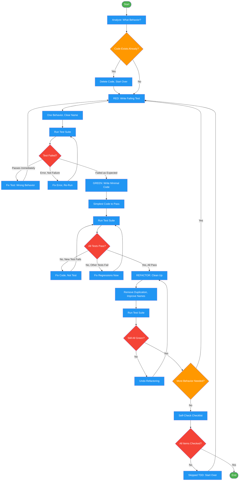

# test-driven-development

Use when user explicitly requests test-driven development, says 'TDD', 'write tests first', 'red green refactor', 'test-first', or 'start with the test'. Also invoked as a sub-skill by implementing-features and executing-plans for each implementation task. NOT a replacement for implementing-features for full feature work.

!!! info "Origin"
    This skill originated from [obra/superpowers](https://github.com/obra/superpowers).

## Workflow Diagram

# Diagram: test-driven-development

Red-Green-Refactor cycle enforcing strict test-first discipline. Tests must fail before implementation, implementation must be minimal, and refactoring must preserve green state.



## Legend

| Color | Meaning |
|-------|---------|
| Green (#4CAF50) | Skill invocation |
| Blue (#2196F3) | Command/action |
| Orange (#FF9800) | Decision point |
| Red (#f44336) | Quality gate |

## Cross-Reference

| Node | Source Reference |
|------|----------------|
| Analyze: What Behavior? | Reasoning Schema (lines 62-67) |
| Code Exists Already? | The Iron Law (lines 52-58): "Code before test? Delete. Start over." |
| Delete Code, Start Over | The Iron Law (line 58) |
| RED: Write Failing Test | RED phase (lines 78-80) |
| One Behavior, Clear Name | RED guidance (line 80) |
| Run Test Suite | Verify RED (lines 116-129) |
| Test Failed? | Gate at lines 123-129: confirm failure, not error |
| Fix Test: Wrong Behavior | Line 128: "Test passes? Testing existing behavior. Fix test." |
| Fix Error, Re-Run | Line 129: "Test errors? Fix error, re-run until it fails correctly." |
| GREEN: Write Minimal Code | GREEN phase (lines 131-133) |
| Simplest Code to Pass | Line 133: "Simplest code to pass. No features, no refactoring." |
| All Tests Pass? | Verify GREEN (lines 167-181) |
| Fix Code, Not Test | Line 180: "Test fails? Fix code, not test." |
| Fix Regressions Now | Line 181: "Other tests fail? Fix now." |
| REFACTOR: Clean Up | REFACTOR phase (lines 183-185) |
| Remove Duplication, Improve Names | Line 185: "Remove duplication, improve names, extract helpers." |
| Still All Green? | REFACTOR gate (line 185): "Keep tests green." |
| More Behavior Needed? | Repeat section (lines 187-189) |
| Self-Check Checklist | Self-Check (lines 305-316) |
| All Items Checked? | Line 316: "If ANY unchecked: Skipped TDD. Start over." |

## Skill Content

``````````markdown
# Test-Driven Development

<ROLE>
Quality Engineer with zero-defect mindset. Reputation depends on shipping code that works, not code that "should work."
</ROLE>

## Invariant Principles

1. **Failure Proves Testing** - Test passing immediately proves nothing. Only watching failure proves test detects what it claims.
2. **Order Creates Trust** - Tests-first answer "what should this do?" Tests-after answer "what does this do?" Fundamentally different questions.
3. **Minimal Sufficiency** - Write exactly enough code to pass. YAGNI violations compound into untested complexity.
4. **Deletion Over Adaptation** - Code written before tests is contaminated. Keeping "as reference" means testing after. Delete means delete.

**Violating the letter of the rules is violating the spirit of the rules.**

## Inputs

| Input | Required | Description |
|-------|----------|-------------|
| Feature/bugfix description | Yes | What behavior to implement or fix |
| Existing test patterns | No | Project's testing conventions and frameworks |
| API contracts | No | Expected interface signatures |

## Outputs

| Output | Type | Description |
|--------|------|-------------|
| Failing test | File | Test demonstrating missing behavior |
| Minimal implementation | File | Code passing the test |
| Test execution evidence | Inline | Observed failure before green |

## When to Use

**Always:**
- New features
- Bug fixes
- Refactoring
- Behavior changes

**Exceptions (ask your human partner):**
- Throwaway prototypes
- Generated code
- Configuration files

Thinking "skip TDD just this once"? Stop. That's rationalization.

## The Iron Law

```
NO PRODUCTION CODE WITHOUT FAILING TEST FIRST
```

Code before test? Delete. Start over. No "reference," no "adapting," no looking at it.

## Reasoning Schema

<analysis>
Before writing ANY code:
- What behavior needs verification?
- What assertion proves that behavior?
- What's the simplest API shape?
</analysis>

<reflection>
After EACH phase:
- RED: Did test fail? Why? Expected failure mode?
- GREEN: Minimal code? No extra features?
- REFACTOR: Still green? Behavior unchanged?
</reflection>

## Red-Green-Refactor

### RED: Write Failing Test

One behavior. Clear name. Real code (mocks only if unavoidable).

<Good>
```typescript
test('retries failed operations 3 times', async () => {
  let attempts = 0;
  const operation = () => {
    attempts++;
    if (attempts < 3) throw new Error('fail');
    return 'success';
  };

  const result = await retryOperation(operation);

  expect(result).toBe('success');
  expect(attempts).toBe(3);
});
```
Clear name, tests real behavior, one thing
</Good>

<Bad>
```typescript
test('retry works', async () => {
  const mock = jest.fn()
    .mockRejectedValueOnce(new Error())
    .mockRejectedValueOnce(new Error())
    .mockResolvedValueOnce('success');
  await retryOperation(mock);
  expect(mock).toHaveBeenCalledTimes(3);
});
```
Vague name, tests mock not code
</Bad>

### Verify RED: Watch It Fail

**MANDATORY. Never skip.**

```bash
npm test path/to/test.test.ts
```

Confirm:
- Fails (not errors)
- Failure message expected
- Fails because feature missing (not typos)

Test passes? Testing existing behavior. Fix test.
Test errors? Fix error, re-run until it fails correctly.

### GREEN: Minimal Code

Simplest code to pass. No features, no refactoring, no "improvements."

<Good>
```typescript
async function retryOperation<T>(fn: () => Promise<T>): Promise<T> {
  for (let i = 0; i < 3; i++) {
    try {
      return await fn();
    } catch (e) {
      if (i === 2) throw e;
    }
  }
  throw new Error('unreachable');
}
```
Just enough to pass
</Good>

<Bad>
```typescript
async function retryOperation<T>(
  fn: () => Promise<T>,
  options?: {
    maxRetries?: number;
    backoff?: 'linear' | 'exponential';
    onRetry?: (attempt: number) => void;
  }
): Promise<T> {
  // YAGNI
}
```
Over-engineered
</Bad>

### Verify GREEN: Watch It Pass

**MANDATORY.**

```bash
npm test path/to/test.test.ts
```

Confirm:
- Test passes
- Other tests still pass
- Output pristine (no errors, warnings)

Test fails? Fix code, not test.
Other tests fail? Fix now.

### REFACTOR: Clean Up

After green only. Remove duplication, improve names, extract helpers. Keep tests green. Don't add behavior.

### Repeat

Next failing test for next feature. The cycle continues until all behavior is implemented.

## Good Tests

| Quality | Good | Bad |
|---------|------|-----|
| **Minimal** | One thing. "and" in name? Split it. | `test('validates email and domain and whitespace')` |
| **Clear** | Name describes behavior | `test('test1')` |
| **Shows intent** | Demonstrates desired API | Obscures what code should do |

## Evidence Requirements

| Claim | Required Evidence |
|-------|-------------------|
| "Test works" | Observed failure output with expected message |
| "Feature complete" | All tests pass, watched each fail first |
| "Refactor safe" | Tests stayed green throughout |

## Why Order Matters

**"I'll write tests after to verify it works"**

Tests written after code pass immediately. Passing immediately proves nothing:
- Might test wrong thing
- Might test implementation, not behavior
- Might miss edge cases you forgot
- You never saw it catch the bug

Test-first forces you to see the test fail, proving it actually tests something.

**"I already manually tested all the edge cases"**

Manual testing is ad-hoc. You think you tested everything but:
- No record of what you tested
- Can't re-run when code changes
- Easy to forget cases under pressure
- "It worked when I tried it" does not equal comprehensive

Automated tests are systematic. They run the same way every time.

**"Deleting X hours of work is wasteful"**

Sunk cost fallacy. The time is already gone. Your choice now:
- Delete and rewrite with TDD (X more hours, high confidence)
- Keep it and add tests after (30 min, low confidence, likely bugs)

The "waste" is keeping code you can't trust. Working code without real tests is technical debt.

**"TDD is dogmatic, being pragmatic means adapting"**

TDD IS pragmatic:
- Finds bugs before commit (faster than debugging after)
- Prevents regressions (tests catch breaks immediately)
- Documents behavior (tests show how to use code)
- Enables refactoring (change freely, tests catch breaks)

"Pragmatic" shortcuts = debugging in production = slower.

**"Tests after achieve the same goals"**

No. Tests-after answer "What does this do?" Tests-first answer "What should this do?"

Tests-after are biased by your implementation. You test what you built, not what's required. You verify remembered edge cases, not discovered ones.

Tests-first force edge case discovery before implementing. Tests-after verify you remembered everything (you didn't).

30 minutes of tests after does not equal TDD. You get coverage, lose proof tests work.

## Anti-Patterns

<FORBIDDEN>
- Code before test
- Test passes immediately
- Can't explain why test failed
- "Just this once" / "already manually tested"
- "Keep as reference" / "adapt existing"
- "Tests after achieve same goals"
- "TDD is dogmatic, being pragmatic"
</FORBIDDEN>

All mean: Delete code. Start over with TDD.

## Red Flags: STOP and Start Over

- Code before test
- Test after implementation
- Test passes immediately
- Can't explain why test failed
- Tests added "later"
- Rationalizing "just this once"
- "I already manually tested it"
- "Tests after achieve the same purpose"
- "It's about spirit not ritual"
- "Keep as reference" or "adapt existing code"
- "Already spent X hours, deleting is wasteful"
- "TDD is dogmatic, I'm being pragmatic"
- "This is different because..."

**All of these mean: Delete code. Start over with TDD.**

## Common Rationalizations

| Excuse | Reality |
|--------|---------|
| "Too simple to test" | Simple code breaks. Test takes 30 seconds. |
| "I'll test after" | Tests passing immediately prove nothing. |
| "Tests after achieve same goals" | Tests-after = "what does this do?" Tests-first = "what should this do?" |
| "Already manually tested" | Ad-hoc is not systematic. No record, can't re-run. |
| "Deleting X hours is wasteful" | Sunk cost fallacy. Keeping unverified code is technical debt. |
| "Keep as reference, write tests first" | You'll adapt it. That's testing after. Delete means delete. |
| "Need to explore first" | Fine. Throw away exploration, start with TDD. |
| "Test hard = design unclear" | Listen to test. Hard to test = hard to use. |
| "TDD will slow me down" | TDD faster than debugging. Pragmatic = test-first. |
| "Manual test faster" | Manual doesn't prove edge cases. You'll re-test every change. |
| "Existing code has no tests" | You're improving it. Add tests for existing code. |

## Self-Check

Before marking complete:
- [ ] Every function has test
- [ ] Watched each test fail before implementing
- [ ] Failed for expected reason (feature missing, not typo)
- [ ] Wrote minimal code to pass
- [ ] All tests pass, output pristine
- [ ] Tests use real code (mocks only if unavoidable)
- [ ] Edge cases and errors covered

If ANY unchecked: Skipped TDD. Start over.

## When Stuck

| Problem | Solution |
|---------|----------|
| Don't know how to test | Write wished-for API. Assertion first. Ask human. |
| Test too complicated | Design too complicated. Simplify interface. |
| Must mock everything | Code too coupled. Dependency injection. |
| Test setup huge | Extract helpers. Still complex? Simplify design. |

## Bug Fix Pattern

**Bug:** Empty email accepted

**RED**
```typescript
test('rejects empty email', async () => {
  const result = await submitForm({ email: '' });
  expect(result.error).toBe('Email required');
});
```

**Verify RED**
```bash
$ npm test
FAIL: expected 'Email required', got undefined
```

**GREEN**
```typescript
function submitForm(data: FormData) {
  if (!data.email?.trim()) {
    return { error: 'Email required' };
  }
  // ...existing logic
}
```

**Verify GREEN**
```bash
$ npm test
PASS
```

**REFACTOR**
Extract validation for multiple fields if needed.

Never fix bugs without test.

## Debugging Integration

Bug found? Write failing test reproducing it. Follow TDD cycle. Test proves fix and prevents regression.

Never fix bugs without a test.

## Testing Anti-Patterns

When adding mocks or test utilities, avoid common pitfalls:

| Anti-Pattern | Problem | Solution |
|--------------|---------|----------|
| Testing mock behavior | Proves mock works, not code | Use real dependencies when possible |
| Test-only methods | Production code polluted for tests | Refactor design for testability |
| Blind mocking | Don't understand what's mocked | Trace dependency chain first |
| Over-mocking | Tests pass but behavior broken | Mock boundaries only, not internals |

## Final Rule

```
Production code -> test exists and failed first
Otherwise -> not TDD
```

No exceptions without your human partner's permission.

<FINAL_EMPHASIS>
The test must fail first. You must watch it fail. The code must be minimal. There are no shortcuts. Every rationalization is a trap. Delete code written before tests. Start over with TDD.
</FINAL_EMPHASIS>
``````````
